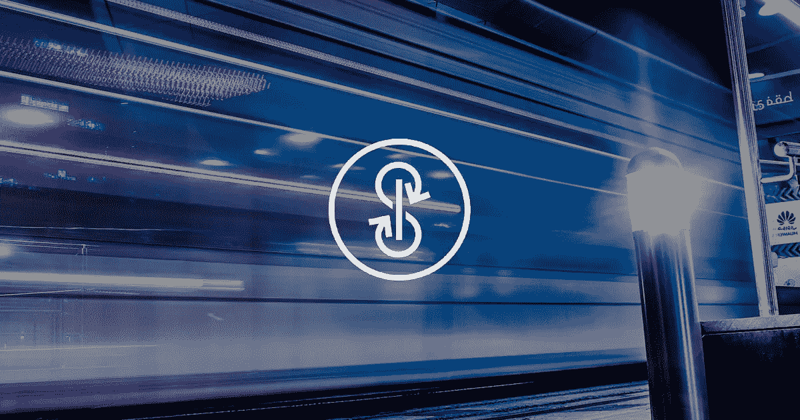
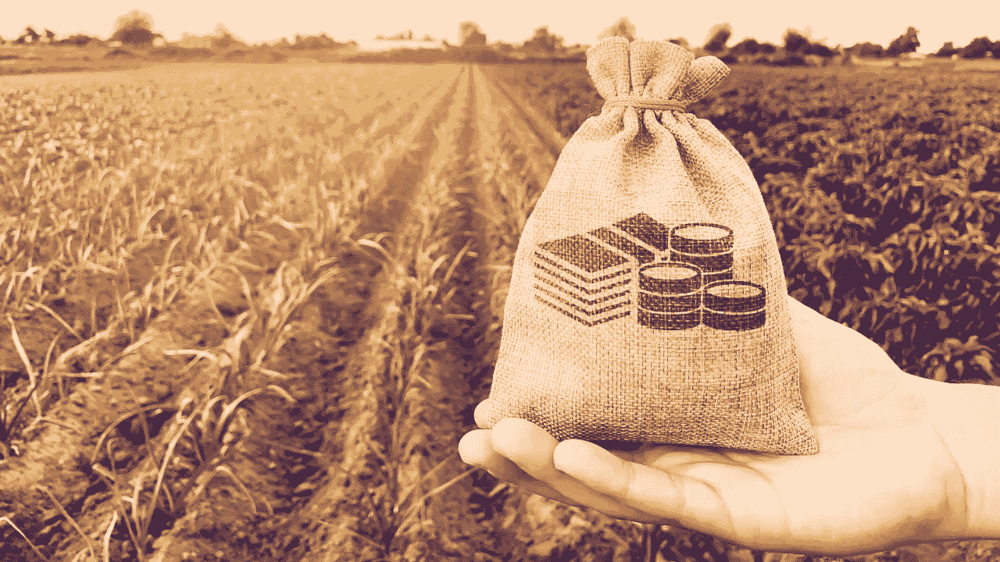
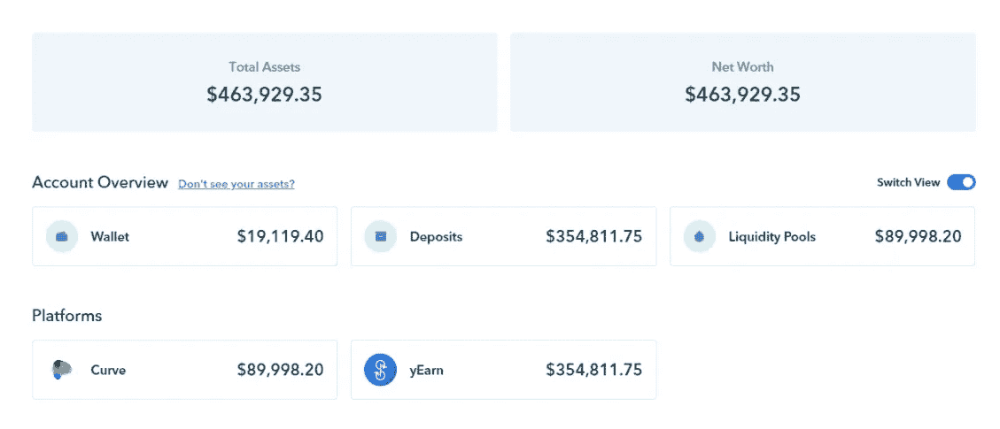
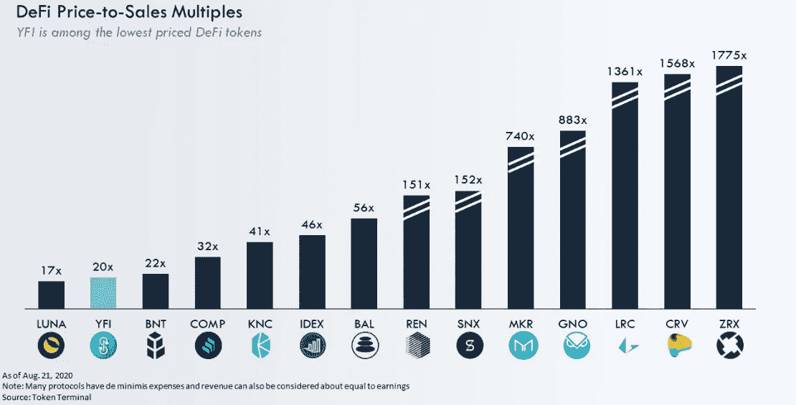
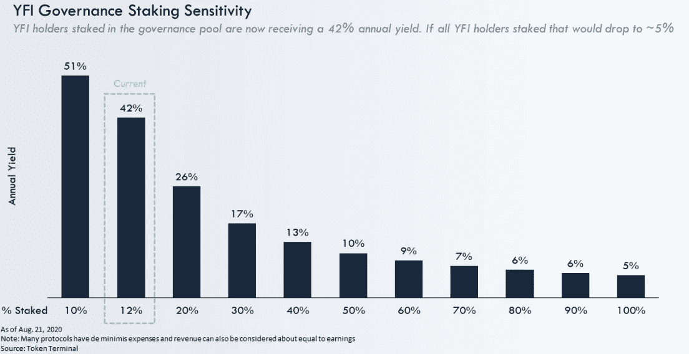
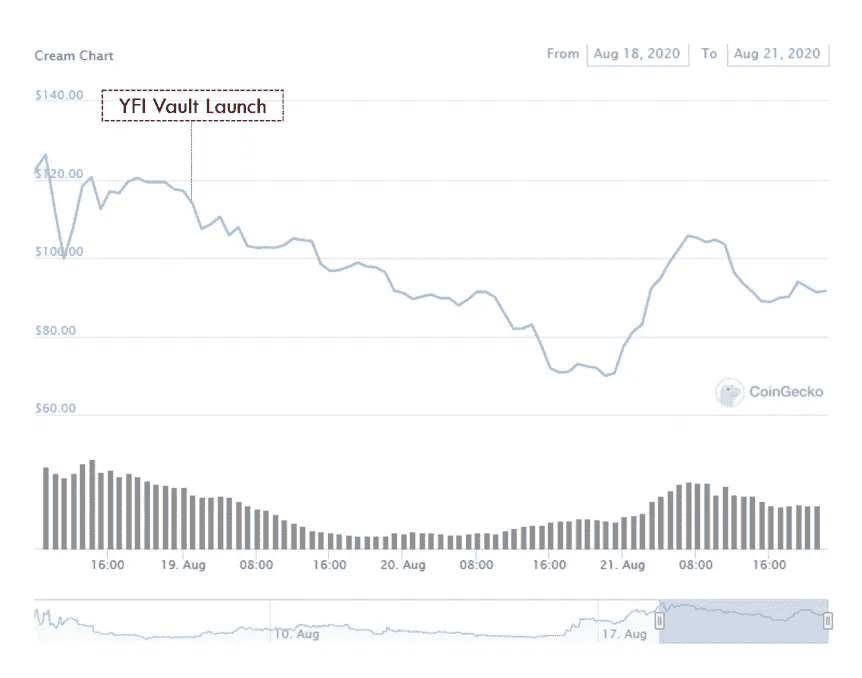
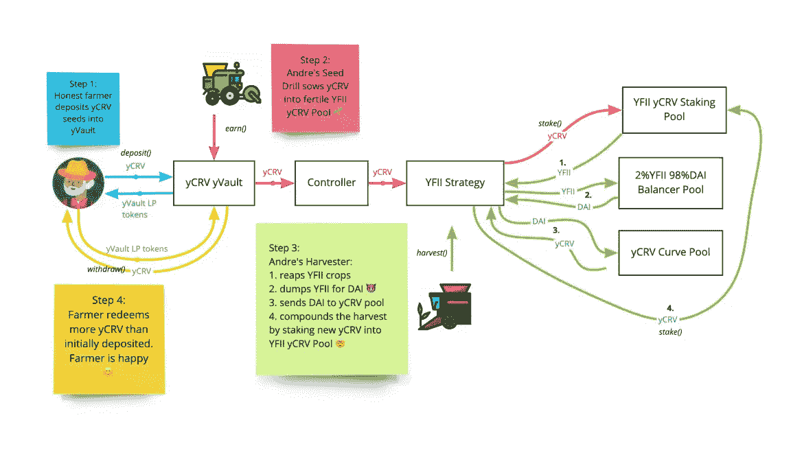
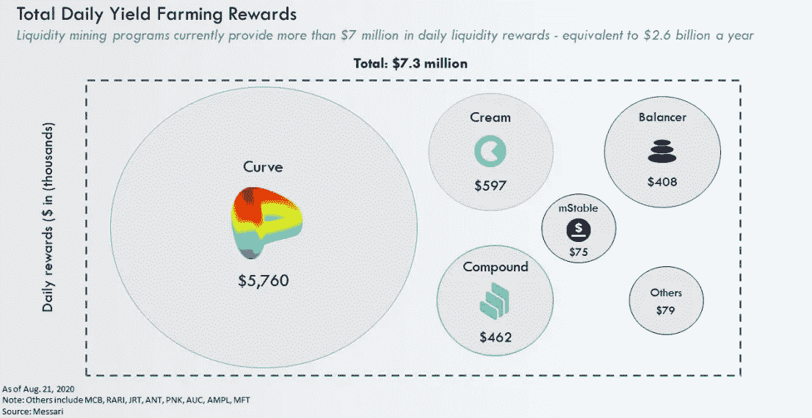

# 什么是向往金融？DeFi 项目最成功的秘密

> 原文：<https://medium.com/coinmonks/what-is-yearn-finance-the-secret-of-the-most-successful-defi-project-54ecd9347ece?source=collection_archive---------1----------------------->

Yearn.Finance aspires to be the gateway to a bevy of yield-generating products in the Ethereum ecosystem.

在不到三个月的时间里，向往金融已经从一个相对默默无闻的信贷聚合机构发展成为资本总额达 6.7 亿美元(峰值超过 10 亿美元)的 [DeFi](https://blog.coincodecap.com/the-ultimate-guide-to-defi-decentralized-finance) 市场的主要驱动力之一，并且处于当今行业最热门趋势——高产农业的核心。“渴望”如此令人信服地主宰着产量农业，以至于一些人引入了它的标志——YFI，作为产量农业指数。但随着这种异军突起，值得思考的是《向往》未来的价值、影响、风险、机遇等复杂问题。

# YFI 的诞生和崛起

直到 7 月 16 日，向往还是一个简单的 [DeFi](https://blog.coincodecap.com/the-ultimate-guide-to-defi-decentralized-finance) 信用聚合器，旨在优化用户盈利能力。它管理着 800 万美元的资产，自 1 月份推出以来，它从其流动性提供者那里获得了 10.58%的综合年收益率。但最重要的是，它没有令牌。

第二天，也就是 7 月 17 日，一切都变了。当时，yearn.finance 的创始人 Andre Cronje 发表了一篇名为“YFI”的恶名昭彰的博文。为了将对渴望金融协议的控制权转移给他的用户，Cronje 为用户开发了一个计划，通过向曲线和平衡器池提供流动性来管理 YFI。这可能是多年来第一次真正诚实的推出，当时 Cronje 没有为自己分配 YFI 代币，放弃了任何一轮融资、团队代币、奖金或类似的东西。所有的 YFI 代币都被分发给了向往金融协议的用户。

几个月后，一个所谓的“完全无用的代币”价值 6.7 亿美元，并驱动一台 7.7 亿美元的“工业规模的农业机器”(最高时接近 10 亿美元)。它每年为大约 2000 万美元的代币持有者印刷钞票。

# 高产农业产业化

很久以前，Compound 启动了其流动性挖掘项目，并开始了一项被许多人称为“DeFi 农业革命”的投机爱好。简单来说，流动性挖掘是指向用户分发令牌以使用协议的过程。流动性挖掘的目的是分散对协议的控制并鼓励其实施。该共同体引入了"高产农业"一词，因为这类似于用户将资本投入议定书的工作，以从在田地里劳作的农民那里获得代币进行收获。

在复合采矿启动后的几周内，产量农业相当简单。你把你的资本投资到几个协议中的一个，这些协议提供激励以换取流动性，并开始赚取代币。产量农业的第一阶段类似于手工农田耕作。用户在手动输入资本之前，必须定义并理解每个策略。但是，随着越来越多的协议运行流动性挖掘程序，产量耕作变得越来越复杂，这一过程对许多用户来说变得越来越耗时。此外，由于以太坊区块链的拥堵导致天然气价格大幅上涨，许多小“农民”不再从事高产农业。当 yearn.finance 推出其协议的 v2(第二版)时，一切都变了，引入了 yVaults。

考虑 yVaults 最有效的方式是呈现一个双向市场，一方面是资本提供者，另一方面是战略开发者。策略的作者分配用户的资本，而资本的提供者选择他们想要使用的策略。这些策略为用户实现了产量农业的自动化。随着 yVaults 的推出，潜在的农民现在可以简单地将资金存入 yVault，他们的资金将自动分配给现有的最佳策略。“金库”不仅降低了试图了解产量农业的不同可能性的用户所面临的风险，还通过与池中的其他资本提供者分享天然气费用，减轻了他们对天然气费用的担忧。因此，Yearn.finance 已成为业内最大的高产农业企业，过去只有经验丰富的用户才能参与其中。

# 现金流动机

YFI 是一个具有挑战性的项目。它拥有主要产品 Earn(贷款优化)和 Vaults(产量农业优化)，以及保险、外汇交易、杠杆、风险资本和清算领域的许多不同产品。此外，咨询公司 Delphi Digital 和 Gauntlet 仍在开发这种令牌模型。然而，了解 YFI 目前如何从其两个主要产品——Earn 和 Vaults 中赚钱是很重要的，因为它们可以提供其未来的想法(从经济角度来看)。

经济很简单。YFI 对其管理的资本收取 5%的天然气补贴(生产力)费，如果用户提取资本，则收取 0.5%的提取费。提款费适用于 Earn 和 vault 产品，而绩效费仅适用于 vault 产品。特别是，对于存储，每次“收获”发生时都要收取绩效费(将处理过的资产回售给基础资产)。在采用了 YIP-36 之后，该协议决定将一部分系统费用用作运营资本，100%的系统费用通过多重签名发送给其财政部。该协议规定，财政部必须保持相当于 50 万美元的缓冲资金，分配给 YFI 的所有盈余奖励都要放在管理基金中。

在实施的一个星期内，财政部已经积累了超过 463 000 美元的收入，每年仅超过 2 100 万美元。当时的市场资本为 3.9 亿美元，这意味着价格与销售额的比率约为 20 倍，这也可以被视为价格与利润的比率，因为该协议除了从其国库获得的收入外没有任何成本。

YFI 的逆价格/利润比率意味着，如果所有 YFI 持有者都持有股份，他们将获得约 5%的年回报(只有参与公司治理池的 YFI 持有者才能获得现金流)。由于目前约有 12%的 YFI 被放入资金池(很大一部分 YFI 被放入其他资金池)，YFI 参与者获得约 40%的年回报率，这意味着市盈率为 2.4 倍。最好将这些比率理解为一个范围。目前，参与管理资金池的 YFI 持有者获得约 40%的年回报，但如果每个人都入股，他们将获得约 5%的年回报。基于当前的价格和每个代币的利润，可以将 5 %视为一个限制。

市场运动

向往的产量农业策略非常成功，以至于它们已经开始严重驱动市场。重要的是要明白，渴望的金库不仅自动化用户的策略，而且协调这些策略。因此，所有 yVault 用户都做一件事，而不是一些用户在处理代币时出售代币，一些用户持有代币是因为他们更愿意保留或不支付汽油费。当这一件事是代币的系统销售时，它可以对基本发酵代币产生重大影响，因为代币资产处于管理之下。最近的例子是 CREAM，这是一种基于复合的分散式贷款协议，最近推出了一项流动性挖掘计划。自 YFI 金库成立以来，该金库系统地种植奶油并出售利润以获得额外的 YFI。从本质上来说，这一策略受益于奶油投机者，他们拍卖新收到的奶油代币，并将其重定向至 YFI。

下面的 yCRV 仓库从内部展示了这个过程。与这个存储库有一些不同，但总体逻辑是相同的。把 yCRV 换成 YFI，YFII 换成奶油，画面会很像。

随着 yVaults 的实施，只要这一趋势继续下去，该系统将从所有最有利可图的“农业机会”中收集越来越多的总利润。于是问题就来了，这是否是可持续的。

# 可持续性

“渴望”现在能产生如此高的现金流的主要原因是因为它的盈利能力非常高。收益率高是有原因的。它之所以高，是因为它受到了对流动性挖掘计划协议的投机热情的支持。“农民”之所以能获得三位数及更高百分比的“收益率”，是因为投机者不断在交易所购买新代币。简单来说，投机者为“农民”得到的“收益”买单。

尚不清楚对高产农业的热情会持续多久。它可能会持续到明年以后，也可能会在一夜之间结束。然而，一旦利息减少，代币持有者将需要寻找更多的资金来源。这可能是由于 AUM 的增加来补偿较低的“收益”,或者是额外的产品为渴望系统提供了替代的收入来源。对 YFI 代币持有者来说，同样重要的是目前的使用频率。5%的性能费意味着所有 DeFi 协议中最高的利用率。鉴于《渴望》为资本提供者提供的价值，这笔费用可能是合理的，但它不是一种保证。就连 Cronje 自己也认为，YFI 代币持有者将不能简单地从资本提供者那里获得租金。

此外，在目前的制度下，向往不支付战略作者的工作。这就好像资产管理公司不向其投资组合经理支付薪酬一样。在某种程度上，该公司充当了一个去中心化的资产管理平台(有人将其比作一个无目标/以套利为导向的自动管理平台)，它最终将不得不补偿策略开发者，导致成本上升。

# YFI 展望

可能没有一个项目比 YFI 更适合反映高产农业的发展。YFI 是短期常见的高产农业市场，目前每天提供 730 万美元的流动性奖励。这意味着每年 26 亿美元的利率和 YFI 最强的顺风。

然而，尽管 YFI 目前是高产农业的领导者，但它并不是唯一一个为“产量馅饼”而战的国家。不仅有几个(往往有问题的)YFI 福克斯出现在市场上，但新的产量农业聚合器，如 APY。Set V2 等金融和资产管理平台将增加竞争。此外，如前所述，目前产量农业的回报不会永远持续下去。投机者最终会停止购买尽可能多的新代币，这将导致更低的回报。虽然成功推出的向往计划的保险，交换，杠杆和清算产品可能会分散 YFI 的收入来源，并为 YFI 持有者提供期权价值。

目前，YFI 仍然是分权管理中最令人兴奋的实验之一。YFI 的公平推出创造了一个庞大、多样和热情的社区，他们对议定书的成功非常感兴趣。由于 Cronje 的专业精神和领导能力，向往的产品发布速度令人印象深刻。很少有协议能像《渴望》那样迅速推出新产品。然而，尽管目前在向往的事情相对顺利，挑战者正在进入市场，向往将推出许多新产品，风险远远不是零。接下来的几个月将会显示这个新生的社区是否能够延续它的魔力并使所有的利益相关者受益。

对 DeFi 感到兴奋？加入我们的公平加密乐透 Ethex.bet，赚取更多 ETH 投资 DeFi 协议！

## 另外，阅读

*   最好的[密码交易机器人](/coinmonks/crypto-trading-bot-c2ffce8acb2a)
*   [德里比特评论](/coinmonks/deribit-review-options-fees-apis-and-testnet-2ca16c4bbdb2) |选项、费用、API 和 Testnet
*   [FTX 密码交易所评论](/coinmonks/ftx-crypto-exchange-review-53664ac1198f)
*   最好的比特币[硬件钱包](/coinmonks/the-best-cryptocurrency-hardware-wallets-of-2020-e28b1c124069?source=friends_link&sk=324dd9ff8556ab578d71e7ad7658ad7c)
*   [加密复制交易平台](/coinmonks/top-10-crypto-copy-trading-platforms-for-beginners-d0c37c7d698c)
*   最好的[加密税务软件](/coinmonks/best-crypto-tax-tool-for-my-money-72d4b430816b)
*   [最佳加密交易平台](/coinmonks/the-best-crypto-trading-platforms-in-2020-the-definitive-guide-updated-c72f8b874555)
*   最佳[加密贷款平台](/coinmonks/top-5-crypto-lending-platforms-in-2020-that-you-need-to-know-a1b675cec3fa)
*   [莱杰 vs 特雷佐](/coinmonks/ledger-vs-trezor-best-hardware-wallet-to-secure-cryptocurrency-22c7a3fd391e)
*   [block fi vs Celsius](/coinmonks/blockfi-vs-celsius-vs-hodlnaut-8a1cc8c26630)vs Hodlnaut
*   [Bitsgap 评论](/coinmonks/bitsgap-review-a-crypto-trading-bot-that-makes-easy-money-a5d88a336df2)——一个轻松赚钱的加密交易机器人
*   [Quadency Review](/coinmonks/quadency-review-a-crypto-trading-automation-platform-3068eaa374e1) -专为专业人士打造的加密交易机器人
*   [PrimeXBT 审查](/coinmonks/primexbt-review-88e0815be858) |杠杆交易、费用和交易
*   [HaasOnline 评论](/coinmonks/haasonline-review-d8d1a3400419)享受九折优惠
*   Bitmex 的[保证金交易指南](/coinmonks/the-idiots-guide-to-margin-trading-on-bitmex-dbbd7742c6fc?source=friends_link&sk=7bfa99d2a181142510c8442c8ddb0786)
*   [eToro 评论](/coinmonks/etoro-review-78807ddeb33c) |交易股票、密码、交易所交易基金、差价合约和商品
*   [Bitmex 高级保证金交易指南](/coinmonks/bitmex-advanced-margin-trading-guide-2270c195ce25?source=friends_link&sk=1d986cca731f5084b9a2db4a4bc4a7ad)
*   [开发人员的最佳加密 API](/coinmonks/best-crypto-apis-for-developers-5efe3a597a9f)
*   [加密套利](/coinmonks/crypto-arbitrage-guide-how-to-make-money-as-a-beginner-62bfe5c868f6)指南:新手如何赚钱
*   顶级[比特币节点](https://blog.coincodecap.com/bitcoin-node-solutions)提供商
*   最佳[加密制图工具](/coinmonks/what-are-the-best-charting-platforms-for-cryptocurrency-trading-85aade584d80)
*   了解比特币的[最佳书籍有哪些？](/coinmonks/what-are-the-best-books-to-learn-bitcoin-409aeb9aff4b)

> [直接在您的收件箱中获得最佳软件交易](https://coincodecap.com?utm_source=coinmonks)

