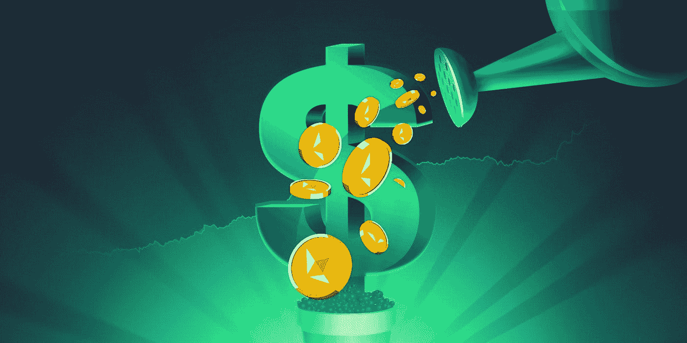

# 什么是高产农业

> 原文：<https://medium.com/coinmonks/what-is-yield-farming-43551d92859a?source=collection_archive---------10----------------------->

## 初学者快速入门

## 什么是产量农业？

收益农业涉及以利息为回报的加密货币借贷，通常以新加密货币为单位。简单来说，这是一种策略，将 crypto 暂时交给一些初创公司的应用程序处理，可以为其所有者赚取更多的加密货币。这类似于你如何从你的储蓄账户中赚取利息。如果硬币快速升值，真正的收益就会到来。收益以年百分比产量来衡量(APY)。产量农业协议的一些例子有:Uniswap、Aave、复合、曲线融资

## 它是如何工作的？

对于收益率农业，投资者的存款本质上是在 DeFi 协议(流动性池)中提供流动性(流动性提供者)，赚取的利息来自池内发生的交易费用。这些资金池是大多数 DeFi 市场的基础，用户可以借、借和交换代币。

## 风险有多大？

伴随着巨额利润而来的是难以置信的风险。大多数堆叠池由新硬币组成，这些新硬币可能会失去价值，这将导致投资者的损失。由于早期阶段的高 APY，早期投资者通常持有相当大份额的奖励代币，使用它们获利将对其价格产生负面影响。协议和赚取的硬币受到极端的波动性和阻力的影响，开发者放弃一个项目并带走投资者的资金。

## 如何入门？

一个例子是使用 pancakeswap。你可以在币安或 CoinBase 应用程序上购买$BNB，然后将它们发送到你的币安链钱包，在那里你可以兑换$蛋糕。然后，你可以把这些代币押在一个收益农场，获得被动收入。在写这篇文章的时候，APY 在 80%左右，这太好了！

## 结论

随着 crypto 在投资者中变得越来越受欢迎，产量农业将变得更加主流。这是一个简单的贷款概念，自从银行存在以来就一直存在，但现在它使用加密和区块链的力量进行了数字化。

> 加入 Coinmonks [电报频道](https://t.me/coincodecap)和 [Youtube 频道](https://www.youtube.com/c/coinmonks/videos)了解加密交易和投资

# 另外，阅读

*   [3 商业评论](/coinmonks/3commas-review-an-excellent-crypto-trading-bot-2020-1313a58bec92) | [Pionex 评论](https://coincodecap.com/pionex-review-exchange-with-crypto-trading-bot) | [Coinrule 评论](/coinmonks/coinrule-review-2021-a-beginner-friendly-crypto-trading-bot-daf0504848ba)
*   [莱杰 vs Ngrave](/coinmonks/ledger-vs-ngrave-zero-7e40f0c1d694) | [莱杰 nano s vs x](/coinmonks/ledger-nano-s-vs-x-battery-hardware-price-storage-59a6663fe3b0) | [币安评论](/coinmonks/binance-review-ee10d3bf3b6e)
*   [Bybit Exchange 评论](/coinmonks/bybit-exchange-review-dbd570019b71) | [Bityard 评论](https://coincodecap.com/bityard-reivew) | [Jet-Bot 评论](https://coincodecap.com/jet-bot-review)
*   [3 commas vs crypto hopper](/coinmonks/3commas-vs-pionex-vs-cryptohopper-best-crypto-bot-6a98d2baa203)|[赚取加密利息](/coinmonks/earn-crypto-interest-b10b810fdda3)
*   最好的比特币[硬件钱包](/coinmonks/hardware-wallets-dfa1211730c6) | [BitBox02 回顾](/coinmonks/bitbox02-review-your-swiss-bitcoin-hardware-wallet-c36c88fff29)