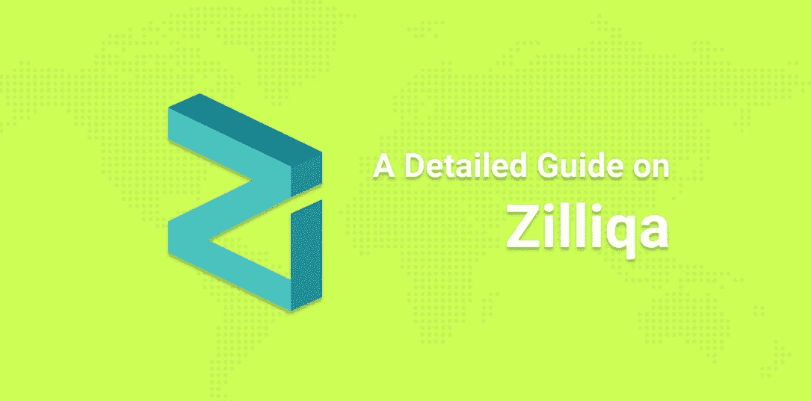
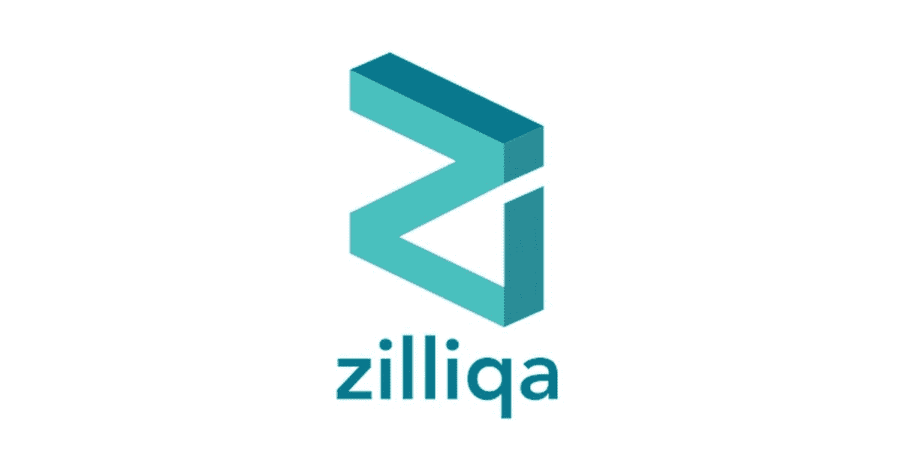

# Zilliqa 是什么？

> 原文：<https://medium.com/coinmonks/what-is-zilliqa-69a48219eb89?source=collection_archive---------0----------------------->

最初发表于 [NOWNodes 博客。](https://nownodes.io/blog/what-is-zilliqa)

Amrit Kumar，Jia，Max Kantelia 和 Prateek Saxena 在 2016 年创立了 Zilliqa，成为有史以来第一个每秒能够处理数千笔交易的高通量公共区块链。为了实现这一特性，Zilliqa 利用了分片原则:网络越扩展，交易速率就越大。

该平台有助于实现许多基于区块链的设施，包括数据驱动的分散应用程序。因为 Zilliqa 的开发是基于分片原则的，所以让我们更深入地了解一下分片区块链架构是什么。

# 什么是分片？

通常，分片是一种数据库分区技术。区块链网络经常使用它来实现可扩展性(即允许网络同时处理更多的交易)。区块链网络中较小的分区称为碎片。值得注意的是，虽然每个碎片都包含自己的数据，但它们之间并不相互依赖。

分片的主要好处是区块链只需要通过一个分片的节点来存储和处理事务信息。否则，信息会通过网络的所有节点。这会导致网络随着每个新参与者的加入而变得越来越慢。分片通过将单个链分解成多个并发链来解决这个问题。

分片架构就是创建一种可行的方法来完成数据库的水平分区。基本上，分区以行的形式工作，其中每一行都根据其服务的不同目的进行分类。例如，其中一个碎片可能被分配用于保存一些事务的记录。

让我们借助一个真实的例子来理解这一点。让我们假设区块链用于存储与租赁房地产交易相关的记录。整个事务可以分布在多个碎片中。一个碎片可以对应于客户的名字。另一个碎片可以对应于租赁者在支付租金时将收到的数字密钥。重要的是要记住，分片架构保留了分散式分类帐的原始属性。每个碎片都被设计成可以在其他碎片之间共享。

# Zilliqa 如何利用分片？

Zilliqa 是几位学者、企业家和工程师的心血结晶。这个混合团队旨在为开发人员和企业提供一个适合构建分散应用程序的可扩展的安全平台。

该团队于 2019 年 1 月推出了 mainnet。Zilliqa 成为第一个利用分片作为扩大规模解决方案的区块链平台。它有自己独特的方式使用分片来实现区块链的线性增长。

Zilliqa 的分片架构有三个基本特性:可伸缩、安全和去中心化。让我们来简单了解一下这些品质！

## #1.可量测性

众所周知，Zilliqa 将区块链网络分为多个部分。这些组中的每一个都同时处理事务。如果六个碎片(每个有 600 个节点)同时工作，每秒处理的事务总数将是 2828。

由于 Zilliqa 的运算能力比比特币或以太坊大得多，交易费用在这个系统内必然会降下来。Zilliqa 的交易成本估计为 0.000023 美元，而比特币的交易成本为 1.79 美元，以太坊的交易成本为 0.016 美元。

与分片架构一起，新引入的共识机制将使 Zilliqa 能够比其他传统区块链更快地确认交易。据估计，虽然比特币在以太坊的交易确认时间接近 1 小时 6 分钟，但 Zilliqa 可以在 40 秒至 2 分钟的区间内确认交易。

## #2.安全性

值得注意的是，提高可伸缩性并不以牺牲安全性为代价。该网络使用经过时间考验和验证的安全机制和名为 Scilla 的智能合约语言:它解决了其他智能合约语言所没有的许多挑战、弱点和漏洞。

## #3.分散

尽管基于碎片，Zilliqa 仍然是分散的。它不需要一个协调者来处理所有的事务。

Zilliqa 还为用户提供了一些其他的品质。你知道吗，Zilliqa 硬币的开采过程是环保和可持续的？每 2-3 个小时只需要一分钟就可以挖掘出这些硬币！此外，Zilliqa 与各种应用程序、钱包和 DApps 兼容。

# Zilliqa Tokenomics

Zilliqa 的本地标记是 ZIL。ZIL 代币的最大供应量是 210 亿个硬币。有趣的是，Zilliqa 硬币甚至在同名的 mainnet 推出之前就已经开始流通了；2018 年 1 月，该平台在代币生成活动中出售 ZIL 硬币作为 ERC-20 代币。在 mainnet 启动后，平台在令牌交换的帮助下将令牌转移给它。事情发生在 2020 年 2 月。

该平台已经分发了 60%的 ZIL 硬币(近 126 亿代币)。还决定通过采矿生产其余的(40%，将近 84 亿)。就资金分配而言，10%的资金给安全资本，12%分配给未来的研究，5%留给团队成员。

已经达成一致，所有的 Zilliqa 硬币将在十年内铸造。随着时间一年一年的过去，区块开采的回报会有所下降。未来的 Zilliqa 路线图是在前四年开采其近 80%的硬币。

# 未来路线图

Zilliqa 继续研究该领域，以制定最佳策略。据报道，该公司目前正在进行 14 个项目！其中有一个叫 ZIP (Zilliqa 改进建议)。ZIP-3 将由促进和调节 Zilliqa 网络内的种子节点主机(这些种子节点支持 Zilliqa 网络体系结构)的赌注机制来定义。与许多交易所运行的其他种子节点不同，Zilliqa 能够分散整个种子节点架构。

# 摘要

Zilliqa 可以被认为是一个既可扩展又分散的平台，同时又不损害区块链的完整性。它为区块链提供了一条新的途径，使其无需担心网络扩张就能扩大规模。此外，它使交易既快又便宜！

> 加入 Coinmonks [Telegram group](https://t.me/joinchat/EPmjKpNYwRMsBI4p) 并了解加密交易和投资

## 另外，阅读

*   [学习以太坊和 Web3 开发](http://blog.coincodecap.com/go/learn)
*   最好的[密码交易机器人](/coinmonks/crypto-trading-bot-c2ffce8acb2a)
*   [3 商业评论](/coinmonks/3commas-review-an-excellent-crypto-trading-bot-2020-1313a58bec92)
*   [Pionex 审查](/coinmonks/pionex-review-exchange-with-crypto-trading-bot-1e459d0191ea)
*   [AAX 交易所评论](/coinmonks/aax-exchange-review-2021-67c5ea09330c) |推荐代码、交易费用、利弊
*   [Deribit 审查](/coinmonks/deribit-review-options-fees-apis-and-testnet-2ca16c4bbdb2) |选项、费用、API 和 Testnet
*   [FTX 密码交易所评论](/coinmonks/ftx-crypto-exchange-review-53664ac1198f)
*   [n 零审核](/coinmonks/ngrave-zero-review-c465cf8307fc)
*   [Bybit 交换审查](/coinmonks/bybit-exchange-review-dbd570019b71)
*   3Commas vs Cryptohopper
*   最好的比特币[硬件钱包](/coinmonks/the-best-cryptocurrency-hardware-wallets-of-2020-e28b1c124069?source=friends_link&sk=324dd9ff8556ab578d71e7ad7658ad7c)
*   [密码本交易平台](/coinmonks/top-10-crypto-copy-trading-platforms-for-beginners-d0c37c7d698c)
*   [莱杰纳米 s vs x](https://blog.coincodecap.com/ledger-nano-s-vs-x)
*   [沃德评论](https://blog.coincodecap.com/vauld-review)
*   最好的[加密税务软件](/coinmonks/best-crypto-tax-tool-for-my-money-72d4b430816b)
*   最佳[密码借贷平台](/coinmonks/top-5-crypto-lending-platforms-in-2020-that-you-need-to-know-a1b675cec3fa)
*   [莱杰纳米 S vs 特雷佐 one vs 特雷佐 T vs 莱杰纳米 X](https://blog.coincodecap.com/ledger-nano-s-vs-trezor-one-ledger-nano-x-trezor-t)
*   [block fi vs Celsius](/coinmonks/blockfi-vs-celsius-vs-hodlnaut-8a1cc8c26630)vs Hodlnaut
*   bits gap review——一个轻松赚钱的加密交易机器人
*   为专业人士设计的加密交易机器人
*   [共同追踪审查](/coinmonks/cointracking-review-a-reliable-cryptocurrency-tax-software-5114e3eb5737)
*   [优霍德勒评论](/coinmonks/youhodler-4-easy-ways-to-make-money-98969b9689f2)
*   [埃利帕尔泰坦评论](/coinmonks/ellipal-titan-review-85e9071dd029)
*   [SecuX Stone 评论](https://blog.coincodecap.com/secux-stone-hardware-wallet-review)
*   区块链评论 |从你的密码中赚取高达 8.6%的利息
*   [Coinrule 审查](https://blog.coincodecap.com/coinrule-review-a-perfect-trading-bot)
*   l [DEX Explorer](https://explorer.bitquery.io/ethereum/dex) 和[区块链 API](https://explorer.bitquery.io/graphql)
*   [加密套利](/coinmonks/crypto-arbitrage-guide-how-to-make-money-as-a-beginner-62bfe5c868f6)指南:新手如何赚钱
*   最佳[加密制图工具](/coinmonks/what-are-the-best-charting-platforms-for-cryptocurrency-trading-85aade584d80)
*   了解比特币最好的[书籍有哪些？](/coinmonks/what-are-the-best-books-to-learn-bitcoin-409aeb9aff4b)

> [直接在您的收件箱中获得最佳软件交易](/coinmonks/newsletters/coinmonks)

