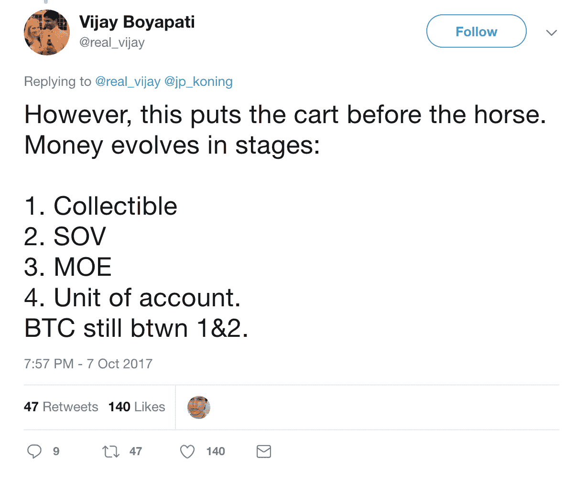

# 是什么让比特币成为价值储存手段？

> 原文：<https://medium.com/coinmonks/what-makes-bitcoin-a-store-of-value-599869e3ada6?source=collection_archive---------0----------------------->

A [recent tweet-poll](https://twitter.com/VinnyLingham/status/1041048697704919042) from Vinny Lingham reveals that, at least on Twitter, 57% of respondents will continue believing that Bitcoin is a “store of value without utility” in the face of all evidence to the contrary.

杯子放在橱柜里是没有用的，只有当你用它喝水的时候才有用。自行车不是放在车库里才有用，而是当你骑的时候才有用。我们可以说，一辆自行车或一个杯子是有用的物品，即使它们目前并没有被使用，但正是在需要的时候使用它们的能力赋予了它们这种实用性的标签。

同样，一个破杯子或一辆损坏得无法修复的自行车不再有用，成了垃圾。这是因为价值来自于效用，而不是相反。一个失去了预期功能的东西也就失去了它的价值。破碎的杯子可能仍然对艺术家有用，但破碎的物品往往会失去所有价值，通常可以免费得到…许多人甚至付钱给别人从他们那里收集他们的垃圾！

> [发现并回顾最好的比特币软件](https://coincodecap.com)

这和比特币有什么关系？萨姆森·莫夫(Samson Mow)、托尼·维斯(Tone Vays)和宋飞·阿摩斯(Seinfeld Ammous)等“比特币专家”认为，比特币最初作为去中心化支付网络的用途已经不再适用。这种思维抑制了比特币的采用，并催生了一种非常新的反支付思维，这种思维鹦鹉学舌一些常见的模因:

*   *白皮书是旧的。从那以后，事情发生了变化。牛顿的理论已经过时了，从那以后事情也发生了变化。科学突破不会随着年龄的增长而变得不那么有效。)*
*   *白皮书不是圣经。聪不是神。*(稻草人。人们引用白皮书是因为它提供了优雅的解决方案，而不是因为他们相信它的作者不会犯错或神圣。)
*   Satoshi 不知道系统会如何发展，也不知道比特币未来会变成什么样。(Satoshi 不是一个千里眼，但在他所有的著作中，他清楚地将比特币想象成一种货币和支付系统。他从来没有说过比特币是“价值储存手段”。他还指出，比特币作为一种支付网络，[可能会比 Visa](https://satoshi.nakamotoinstitute.org/emails/cryptography/2/) 的规模更大，开采自然会转移到专门的服务器农场。他显然对这个系统有长远的眼光。)
*   *我们不需要在区块链上存储每一笔咖啡付款。区块链是“结算层”，消费者将使用闪电网络进行交易。* (加密货币已经在这里；如果 BTC 不能竞争，它将被竞争对手远远甩在后面，因为竞争对手实际上无法处理咖啡付款。他们为闪电网络工作的事实证明他们认为付费是有用的和必要的。)
*   显然，比特币不应该用于支付，因为它主要是像黄金一样的价值储存手段。Visa 和 MasterCard 更适合支付，你甚至可以获得 3%的返现！(地球上 20 亿无法使用 PayPal 或信用卡的无银行用户可能会发现比特币对于支付和进入国际市场非常有用。自称“比特币最大化主义者”的人经常被发现宣传集中式信用卡公司，这一事实很可笑。)

这篇文章是关于“价值储存”的神话，以及那些宣扬它的人是如何无视他们逻辑中的漏洞的。黄金被认为是有用的价值储存手段，因为人们肯定地知道，当*真正使用它*、*例如*来出售它或交易它(或熔炼它或伪造它)，会有其他人毫不大惊小怪地购买它。黄金作为价值储存手段是有用的，因为它被普遍认为是有价值的东西。黄金有价值，可以是资产，但不是货币。

比特币不一样。它是作为一种新的货币形式被发明、描述和销售的。它唯一的功能是通过更好地将价值从一个人传递给另一个人来满足用户的需求。它过去是(现在也是)革命性的，因为它标志着人类历史上第一次人们可以在没有中介和监管机构参与的情况下，跨越任何距离或任何边界传输任何金额的价值。人类历史上第一次，一个人可以从东京向坦桑尼亚寄 50 美分，就像他们在街头音乐家的帽子里放零钱一样快捷方便。换句话说，比特币是一个 [*点对点的电子现金系统*](http://bitcoin.com/bitcoin.pdf) *。*

现金被认为是很有用的东西。它几乎可以在任何商店使用，或者交易给你日常生活中遇到的任何人。很少有人会走过地上的一张百元钞票而不停下来捡起来。现金非常有用，因为它像比特币一样，也不像以前的电子货币，可以给任何人任何金额，不需要任何监督或许可。比特币的假名发明者中本聪创造了世界上第一种电子货币形式，具有与现金完全相同的货币属性，从而弥合了现金和电子货币之间的差距。但它优于现金，因为它没有许多不利于现金的负面物理属性。它不能被撕毁、焚烧、伪造、被老鼠吃掉，也不占任何重量和空间。携带 10 万美元现金通过机场是有风险的，但有了比特币，人们可以记住一个助记短语，并在大脑中带着 10 万美元四处走动，没有人能阻止他们。

更具革命性的是，比特币还拥有许多让黄金变得有价值的属性，同时摆脱了让黄金变得不方便的属性。比特币吸取了现金和黄金的最佳属性，并将其归结为最纯粹的本质。

就像橱柜里的杯子和车库里的自行车一样，钱包里或床垫下的现金只有在一个人想用的时候确实有用时才是“有用的”。美国人持有的一万亿津巴布韦元纸币被视为新奇物品，不被视为库存现金。即使是以现金形式持有的强势外币也会被认为不如通行的当地货币有用，因为它不会被广泛接受，人们经常不得不把它带到银行或货币兑换商那里，将其转换成更有用的纸张形式。

2017 年末，比特币(BTC)网络出现故障。数字货币变得如此流行，但比特币核心(BTC)开发者拒绝扩展系统以应对新用户和需求的涌入。每笔交易的平均交易费用飙升至 50 多美元，等待确认的平均时间从 10 分钟增加到几天。在那个时候，回到传统的支付系统变得更加便宜和快捷，比如发送一个国际银行电汇，比使用 BTC 要便宜和快捷。比特币最初赖以存在的整个价值主张都被摧毁了。这也是“价值储存”神话真正开始的时候。

比特币核心开发者及其教条支持者所宣扬的“价值储存”神话认为，比特币从来就不是货币，支付只是“储存价值”主要效用的次要用例。这就像相信杯子对艺术家来说主要是有用的，用杯子喝水是次要功能，或者运输对于自行车作为废金属的价值来说是次要功能。

2017 年末，人们无法可靠地使用比特币(BTC)进行支付。对于绝大多数用例来说，费用和确认时间都过于繁琐，[比特币核心团队](https://lists.linuxfoundation.org/pipermail/bitcoin-dev/2017-December/015455.html)庆祝了这一事实。支付功能不仅被完全否决，甚至对“存储价值”也没有用，因为它不能可靠地转移到交易所，在需要时出售。让“价值储存”人群更加尴尬的是，那些以 2 万美元购买 BTC 的人(因为他们被告知这是一个“很好的价值储存”)已经看到他们的 BTC 价值从那时起暴跌了 70%以上。

我听到了反驳的声音:*费用很高，因为罗杰和韩吉在向网络发送垃圾邮件！Segwit 和批处理解决了这个问题，比特币又有用了！*这些令人恐惧的说法显然是错误的。Segwit 从未见过超过可怜的 40%的采用率(即使是 100%的采用率，它也只能提供 40%的吞吐量增长)，并且大多数事务都没有被批处理。交易批处理的主要用例是交易所同时处理许多用户的取款，这也侵蚀了隐私。如果大多数用例想使用批处理，他们就不能使用批处理……您是否每天一次同时支付早上咖啡、油箱、午餐和下班后饮料的费用？BTC 似乎再次(略微)有用的唯一原因是因为硬币的使用率急剧下降，降至 2017 年每日交易量的 50%左右。即便如此，平均交易费用仍然很高，足以排除大多数偶然的使用情况，比如低于 100 美元的支付和微交易。

BTC 唯一剩下的用处就是作为投机的玩物。如果他们使用 BTC 的唯一目的是偶尔往来于交易所，那么他们很容易接受 1 美元的交易费。但是 1 美元的交易费用意味着没有人可以用它来购买咖啡，或者在线赌博，或者在受恶性通货膨胀困扰的国家作为货币。

BTC 可能已经崩溃，但是中本聪发明的革命性的点对点电子现金系统*比特币*并没有死亡。2017 年 8 月，一群厌倦了比特币核心开发商顽固不化的长期比特币制造者接受了 BTC 人群的建议，并“分叉”了，创建了一个并行网络，继续作为有用的货币形式发挥作用:比特币现金(BCH)。

比特币的价值(以及其储存价值的能力)与其作为货币形式的有用性以及增长并被世界各地越来越多的人接受的能力密不可分。

BTC 人群认为，T4 人支付 50 美元的费用证明了它的价值，即人们会“为有价值的东西支付更多的钱”。付钱让别人运走垃圾并不意味着你重视垃圾，而是意味着你想扔掉它。支付 50 美元的费用发送比特币仅仅意味着使用剩余的钱至少值 50 美元；对于汇款人是否仍然认为比特币有价值，它没有做出任何声明。我多次支付 50 美元费用，因为我必须这样做才能获得剩余的价值。我对此不高兴。

18 个月后

另一个常见的合理解释是，货币必须分阶段发展，首先是价值储存手段，后来才在商业中有用。这完全是一派胡言，没有任何证据或严肃的经济学理论的支持。

So… were dollar bills, cheques, credit cards, and PayPal all used as collectibles and stores of value before they were used for payments?

## **同样，阅读**

*   最好的 [est 加密交易机器人](/coinmonks/crypto-trading-bot-c2ffce8acb2a)
*   最好的比特币[硬件钱包](/coinmonks/the-best-cryptocurrency-hardware-wallets-of-2020-e28b1c124069?source=friends_link&sk=324dd9ff8556ab578d71e7ad7658ad7c)
*   最好的[加密税务软件](/coinmonks/best-crypto-tax-tool-for-my-money-72d4b430816b)
*   [最佳加密交易平台](/coinmonks/the-best-crypto-trading-platforms-in-2020-the-definitive-guide-updated-c72f8b874555)
*   [unis WAP 最佳钱包](/coinmonks/best-wallets-to-use-uniswap-e91a6385d9e8)
*   [bits gap review](https://blog.coincodecap.com/bitsgap-review)——一个轻松赚钱的加密交易机器人
*   为专业人士设计的加密交易机器人
*   Bitmex 上的[保证金交易的白痴指南](/coinmonks/the-idiots-guide-to-margin-trading-on-bitmex-dbbd7742c6fc?source=friends_link&sk=7bfa99d2a181142510c8442c8ddb0786)
*   [加密摇摆交易权威指南](/coinmonks/the-definitive-guide-to-crypto-swing-trading-7e4af6496d4d?source=friends_link&sk=70448050bd9323b42f63bfc0bb1e60d1)
*   [Bitmex 高级保证金交易指南](/coinmonks/bitmex-advanced-margin-trading-guide-2270c195ce25?source=friends_link&sk=1d986cca731f5084b9a2db4a4bc4a7ad)

> [直接在您的收件箱中获得最佳软件交易](https://coincodecap.com?utm_source=coinmonks)

