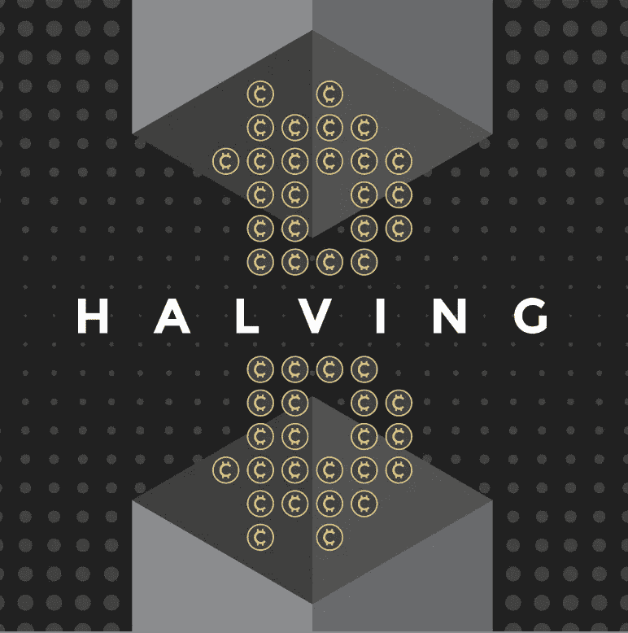

# 是什么导致谷歌搜索“比特币减半”激增？

> 原文：<https://medium.com/coinmonks/what-may-be-causing-google-searches-for-bitcoin-halving-to-surge-9b551fbac85b?source=collection_archive---------2----------------------->

由[九月](https://twitter.com/SEP_Roth)在 [MachinaTrader](https://www.machinatrader.com/)

**随着 2020 年 5 月越来越近，“半场休息”的哨声即将吹响。对于那些在密码世界中运作的人来说，“减半”是办公室的话题，人们猜测比特币的价格将飙升至什么样的新高度。对 2020 年最令人期待的秘密事件**的兴趣…