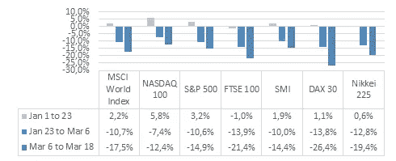
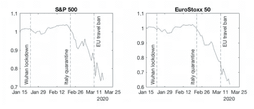
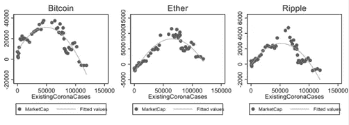
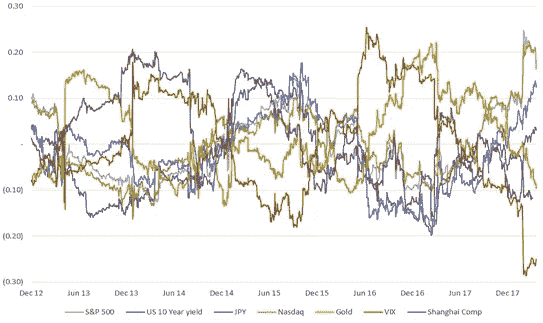
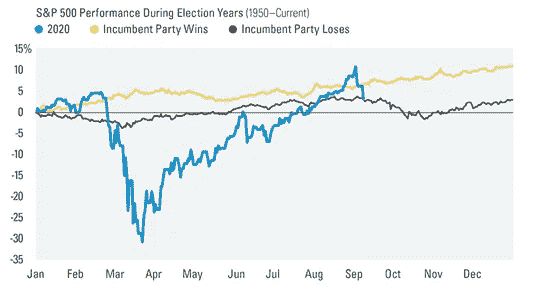

# 什么推动了市场:美国大选的作用及其对股票和密码市场的影响

> 原文：<https://medium.com/coinmonks/what-moves-the-markets-the-role-of-the-us-election-and-its-effect-on-the-stock-and-crypto-market-38ad3236ef19?source=collection_archive---------4----------------------->

众所周知，从长期来看，金融市场会遵循一个国家的经济增长等模式，但也会对新闻、政治局势、经济活动或外部影响等短期影响做出敏感反应，因为资产价格反映了投资者对未来回报的预期。本文研究了 I)此类事件的总体影响，重点是冠状病毒，ii)股票市场和加密市场之间的潜在相关性，iii)即将到来的美国选举将如何作为股票市场的催化剂，以及选举前后的影响。

在最近的全球新冠肺炎疫情期间，我们看到，除了对卫生部门和家庭的影响外，大多数行业都受到了冠状病毒爆发所施加的限制的影响，这意味着旅游业、餐饮业、制造业、零售业等。它们发挥作用的能力已经减弱，全球经济预期中的“停顿”导致了全球经济增长的减缓。

**Figure 1** — Change in value of selected indices during coronavirus worldwide, Source: Self-interpreted from Statista

图 1 表明，全球金融市场在年初取得了适度的进展，平均增长 2-3%，而冠状病毒的爆发显示出明显的价值下降趋势。在 2020 年 1 月 1 日至 3 月 31 日期间，美国和欧盟股市下跌了 30%，即 S&P500 的预期股息增长下降了 28%，欧洲斯托克 50 指数下降了 25%，以股票市值衡量，股票市值是所有未来股息支付的贴现值，见图 2:

**Figure 2 —** Cumulative return to the S&P 500 and EuroStoxx 50 Source: (1.Gormsen, N.J. and Koijen, S.J.)

与此同时，在更加分散和非政府的加密市场中也出现了一些动向，这表明在初始阶段市场资本总额和交易量是积极的，但在冠状病毒持续传播期间，这种影响是负面的，主要货币[比特币](https://blog.coincodecap.com/a-candid-explanation-of-bitcoin)的价格波动性更大，其他货币紧随其后。

**Figure 3 —** Market cap relative to corona cases, Source: (2 Jabotinsky, Hadar Yoana and Sarel).

图 2 显示了比特币、以太网和 Ripple 的市值变化与全球 corona 案件进展的关系。作为证券交易所股息的替代方案，价值以市值衡量，这表明代币的价值和 2020 年 1 月 1 日至 3 月 21 日的交易价值。该估计表明了一个 U 型反比关系，在开始时市值适度增加，随后在 2 月中旬冠状病毒和相关死亡人数继续增加时迅速下降(2 Jabotinsky，Hadar Yoana 和 Sarel)。在短期内，投资者由于对政府和银行的不信任，愿意在危机中从传统投资转向 crypto 等替代投资，但在长期内，没有一致性，这可以通过各种行为方面来解释， 例如，在 2016 年上一轮牛市期间投资的投资者缺乏耐心，或者遵循推动加密市场战略的知情投资者期望小投资者跟随他们存入资产以获得短期回报，或者随着政府在危机期间采取行动，投资者的信心增强，从而增加了金融市场复苏的可能性。

ii)股票市场和加密市场无法抵御冠状病毒等外部影响，这只是股票市场的部分预期，然而，冠状病毒的程度已经在全球范围内蔓延，几个行业和工作方法一直在不断变化(被淘汰)，而加密市场长期来看也几乎没有表现出抵抗，因为投资者的预期要么是悲观的，要么是有利于推动大规模抛售的冠状病毒以外的其他因素。问题是股票市场和加密市场之间是否存在相关性，除了冠状病毒之外，这一点很重要，但自比特币于 2013 年开始交易以来，股票市场和加密市场之间的历史有限，因为上一次金融危机发生在 2007-08 年，这也是比特币的诞生，因为对金融机构和政府的不信任增加了。最近的冠状病毒可以被视为偏离历史事件的干扰，因为疫情的规模在几个方面超过了金融危机和互联网泡沫。

**Figure 4**–180-day percentage price-change correlation between Bitcoin and traditional assets Source: BitMEX Research [https://blog.bitmex.com/bitcoin-price-correlation-record-high-against-the-sp-500/](https://blog.bitmex.com/bitcoin-price-correlation-record-high-against-the-sp-500/)

在图 3 中，我们可以观察到 2012 年至 2017 年期间，比特币与标准普尔 500、美国国债、日元、纳斯达克、黄金、标准普尔 500 波动率指数和上证综指之间相关性的每日百分比价格变化。请注意，统计显著性的证据较少，因为所有资产类别的 R 平方都非常低，因此对结果的解释仍然是推测性的(Bitmex)。比特币的相关性几乎在-0.2 到+0.2 的区间，除了纳斯达克、黄金、VIX 的几次爆发。在早些年，比特币与其他股票呈现相对负相关，但在整个生态系统的扩张过程中，比特币经历了股票之间的周期性相关，尤其是在 2016–2017 年前后。在 2013 年和 2016 年比特币价格上涨期间，比特币和黄金之间最常见的相关性被观察到，这表明它们有类似的推动价格的因素，如中国经济放缓、英国退出欧盟的选择和唐纳德·特朗普当选总统。值得注意的是，比特币在几个时期内的表现一直优于股票市场，然而，近年来，比特币与传统资产类别的相关性越来越强，导致在金融危机的情况下，其下行保护能力下降。

iii)对于计划于 2020 年 11 月 3 日举行的 2020 年美国总统选举，对股票市场的货币影响已被大量讨论，如“总统选举周期”效应(3。罗伯特·斯托瓦尔。市场波动可以在整个选举前期间确定，但也可以根据总统选举后的周期性来确定，这取决于现政府实施的政策。

选举前的指标可以在选举日前三个月的标准普尔 500 股票市场表现图中显示，这可以用作美国总统选举的预测器，自 1984 年以来已经证明了其准确性(4。德特里克，瑞安·LPL 金融首席市场策略师)。考虑到标准普尔 500 指数的三个月，这一期间的正回报标志着现任政党唐纳德·特朗普总统获胜的可能性越来越大，而三个月期间的股市下跌可能标志着反对党乔·拜登总统领先。

**Figure 5** — S&P 500 Performance during elections years Source : [https://lpl-research.com/hoc/images/full/weakness-before-the-election.png](https://lpl-research.com/hoc/images/full/weakness-before-the-election.png)

此外，总统大选可能性的增加还基于经济周期，即总统任期最后两年出现衰退增加了在任总统(在这种情况下是唐纳德·特朗普总统)的几率，同时增加了反对派的机会(4。德特里克，瑞安 LPL 金融首席市场策略师/ Marketstretch)。

对选举后指标的实证研究表明，标普 500 指数是由 1965 年至 2003 年从林登·约翰逊总统到小布什总统的四年周期定义的，其特点是总统任期前半段股价下跌，总统任期后半段股价大幅上涨，并在总统任期的第三年达到峰值，主要是为了增加第四年后连任的概率， 这对共和党政府来说意义重大(对民主党来说不重大)，这一方面意味着连任的参与政策操纵，另一方面，民主党实施的政策导致整个总统任期内股价上涨，这也是重要的(对共和党来说不重大)(5。 黄永强和迈克尔麦卡利尔)。

总之，不断增长的密码市场受到了所有行业和各种机构的分析师的保护，在机构层面也越来越被接受，这可以被视为一种新的“资产”类别。我们发现，不断增长的生态系统和市场资本对于接受度来说是积极的，但对于与其他传统资产类别的相关性来说则是消极的。应该注意的是，加密市场仍在发展，新项目(即 DeFi 和算法交易平台)扩展了加密领域，提供了更多的上升潜力，同时防止了金融市场未来的动荡。截至今天，冠状病毒的市场状况和异常情况可能会导致扭曲的结果，总统指标可能会无效，因为市场在全球范围内受到了同样的影响，市场的复苏与美国总统选举同时发生。美国市场目前的走势要么是复苏的信号，要么更有可能是科技和公用事业股票不断上涨的结果。

**关于 machine trader**

MachinaTrader 是自动化交易的瑞士军刀，它为在一个地方开发、测试和执行交易策略设定了新的标准。我们完全可扩展的平台提供了与加密和传统市场的连接，使用户能够在一个驾驶舱内管理他们的交易行为，并提供了自己的专业社交网络和市场，用于分发交易策略、信号服务等。

[加入我们的社区吧！](https://www.machinatrader.com/)

**来源**

图 1:[https://www . statista . com/statistics/1105021/冠状病毒-爆发-股票-市场-变化/](https://www.statista.com/statistics/1105021/coronavirus-outbreak-stock-market-change/)

图 2:戈姆森、尼尔斯·约阿希姆和拉尔夫·SJ·科伊金。"冠状病毒:对股票价格和增长预期的影响."芝加哥大学贝克尔弗里德曼经济研究所工作文件 2020–22(2020)。

图 3: Jabotinsky，Hadar Yoana 和 Sarel，Roee，危机如何影响 Crypto:冠状病毒作为测试案例(2020 年 3 月 22 日)。在 https://ssrn.com/abstract=3557929 的 SSRN 有售:

图 4:[https://blog . bit MEX . com/bit coin-price-correlation-record-high-against-the-sp-500/](https://blog.bitmex.com/bitcoin-price-correlation-record-high-against-the-sp-500/)

图 5:[https://LPL-research . com/hoc/images/full/weak-before-the-election . png](https://lpl-research.com/hoc/images/full/weakness-before-the-election.png)

1.戈姆森，尼尔斯约阿希姆，和拉尔夫 SJ 科伊珍。"冠状病毒:对股票价格和增长预期的影响."芝加哥大学贝克尔弗里德曼经济研究所工作文件 2020–22(2020)。

2.Jabotinsky，Hadar Yoana 和 Sarel，Roee，危机如何影响 Crypto:冠状病毒作为一个测试案例(2020 年 3 月 22 日)。在 https://ssrn.com/abstract=3557929 SSRN 有售:

3.《透过总统周期预测股票市场表现》金融分析师杂志(1992):5–8。

4.德里克·LPF:[https://LPL research . com/2020/01/17/a-近距离观察选举年/](https://lplresearch.com/2020/01/17/a-closer-look-at-election-years/)

4.1[https://lpl-research.com/hoc/elections-2020.html](https://lpl-research.com/hoc/elections-2020.html)

5.黄永强和迈克尔·麦克里尔。"描绘美国股票市场的总统选举周期."模拟中的数学和计算机 79.11(2009):3267–3277。

## 另外，阅读

*   最好的[密码交易机器人](/coinmonks/crypto-trading-bot-c2ffce8acb2a)
*   [密码本交易平台](/coinmonks/top-10-crypto-copy-trading-platforms-for-beginners-d0c37c7d698c)
*   最好的[加密税务软件](/coinmonks/best-crypto-tax-tool-for-my-money-72d4b430816b)
*   [最佳加密交易平台](/coinmonks/the-best-crypto-trading-platforms-in-2020-the-definitive-guide-updated-c72f8b874555)
*   最佳加密贷款平台
*   [最佳区块链分析工具](https://bitquery.io/blog/best-blockchain-analysis-tools-and-software)
*   [加密套利](/coinmonks/crypto-arbitrage-guide-how-to-make-money-as-a-beginner-62bfe5c868f6)指南:新手如何赚钱
*   最佳[加密制图工具](/coinmonks/what-are-the-best-charting-platforms-for-cryptocurrency-trading-85aade584d80)
*   [莱杰 vs 特雷佐](/coinmonks/ledger-vs-trezor-best-hardware-wallet-to-secure-cryptocurrency-22c7a3fd391e)
*   了解比特币的[最佳书籍有哪些？](/coinmonks/what-are-the-best-books-to-learn-bitcoin-409aeb9aff4b)
*   [3 商业评论](/coinmonks/3commas-review-an-excellent-crypto-trading-bot-2020-1313a58bec92)
*   [AAX 交易所评论](/coinmonks/aax-exchange-review-2021-67c5ea09330c) |推荐代码、交易费用、利弊
*   [Deribit 审查](/coinmonks/deribit-review-options-fees-apis-and-testnet-2ca16c4bbdb2) |选项、费用、API 和 Testnet
*   [FTX 密码交易所评论](/coinmonks/ftx-crypto-exchange-review-53664ac1198f)
*   [n 零审核](/coinmonks/ngrave-zero-review-c465cf8307fc)
*   [比特交换评论](/coinmonks/bybit-exchange-review-dbd570019b71)
*   [3Commas vs Cryptohopper](/coinmonks/cryptohopper-vs-3commas-vs-shrimpy-a2c16095b8fe)
*   最好的比特币[硬件钱包](/coinmonks/the-best-cryptocurrency-hardware-wallets-of-2020-e28b1c124069?source=friends_link&sk=324dd9ff8556ab578d71e7ad7658ad7c)
*   最佳 [monero 钱包](https://blog.coincodecap.com/best-monero-wallets)
*   [莱杰纳米 s vs x](https://blog.coincodecap.com/ledger-nano-s-vs-x)
*   [bits gap vs 3 commas vs quad ency](https://blog.coincodecap.com/bitsgap-3commas-quadency)
*   [莱杰纳米 S vs 特雷佐 one vs 特雷佐 T vs 莱杰纳米 X](https://blog.coincodecap.com/ledger-nano-s-vs-trezor-one-ledger-nano-x-trezor-t)
*   [block fi vs Celsius](/coinmonks/blockfi-vs-celsius-vs-hodlnaut-8a1cc8c26630)vs Hodlnaut
*   Bitsgap 评论——一个轻松赚钱的加密交易机器人
*   为专业人士设计的加密交易机器人
*   [PrimeXBT 审查](/coinmonks/primexbt-review-88e0815be858) |杠杆交易、费用和交易
*   [埃利帕尔泰坦评论](/coinmonks/ellipal-titan-review-85e9071dd029)
*   [SecuX Stone 点评](https://blog.coincodecap.com/secux-stone-hardware-wallet-review)
*   [BlockFi 评论](/coinmonks/blockfi-review-53096053c097) |从您的密码中赚取高达 8.6%的利息