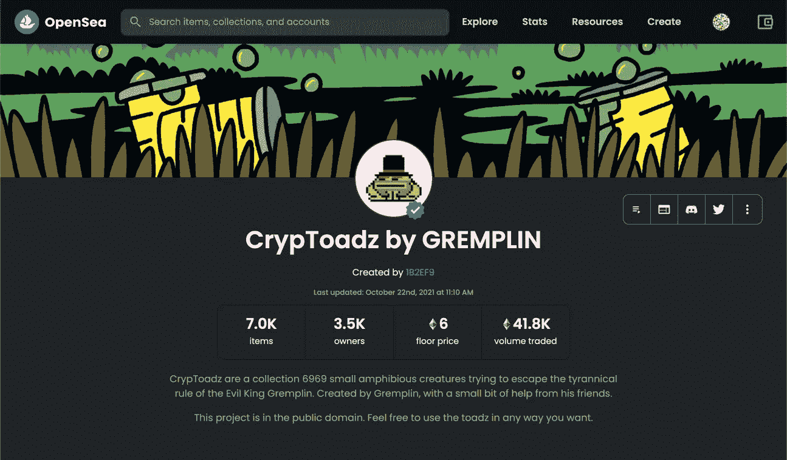
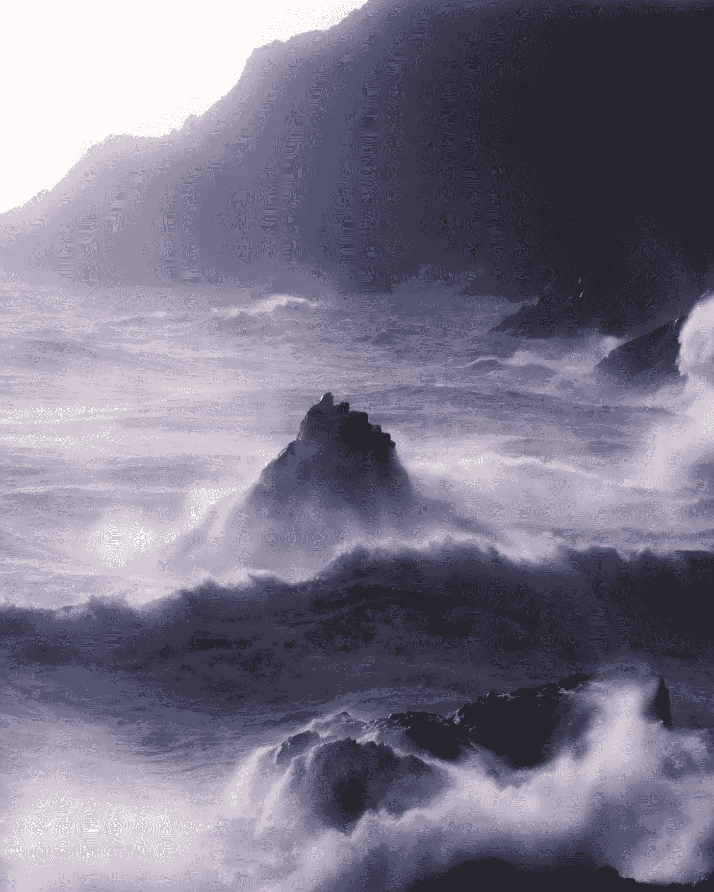
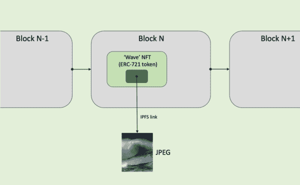
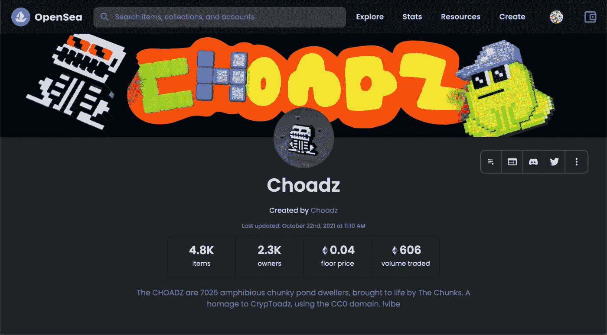

# 这个关于 Toadz 的 1 . 67 亿美元的 NFT 项目如何帮助 Noobs 理解 NFTs 的价值

> 原文：<https://medium.com/coinmonks/what-nft-noobs-dont-understand-about-nfts-a19948f2e6bd?source=collection_archive---------2----------------------->

Understanding how the [CrypToadz](https://opensea.io/collection/cryptoadz-by-gremplin) NFT project works will help you understand what NFTs are and how NFTs are valuable.

## CrypToadz 是一个公共领域的项目，其中的艺术是免费的。

## NFTs***≠JPEG***

随着 Twitter 和脸书等主要社交媒体公司即将采用 NFT，NFT 将成为主流，公众对什么是 NFT 将会有一场*海啸*？

This is CrypToadz [#2314](https://opensea.io/assets/0x1cb1a5e65610aeff2551a50f76a87a7d3fb649c6/2314) and it’s MY Toadz, one of 6969 free toad JPEGs also sold as NFTs.

最常见的误解是 JPEG 和 NFT 是一样的。

举个例子，

这里有一个我经常从不理解 NFTs 的人那里看到的这类文章的经典例子——这来自最近的一篇*Medium.com*的文章，

> *“假设埃隆·马斯克创作了一幅 JPEG 图片，并以 115 万美元的价格卖给了你。现在你拥有了 JPEG 文件。然而，数以百万计的其他人仍然可以下载 JPEG 并保存到他们的电脑上。如果你把它印出来，它会和我的那份一样值钱。*

或者更糟的是，这来自 Instagram，

> *“我右击保存了你的 NFT，所以现在它是我的了…哇！*

一句话，

***NOOOOOOO！***

不，你不拥有它们… *我也是！*

除了任何版权问题，你可能会通过复制别人的作品，然后试图把它当作原创来侵犯版权，*右键单击将图像保存到你的下载文件夹中*并不会给你任何所有权。

事实上，

一个 JPEG 文件本身毫无价值，因为它是无限可复制的**。**

*就像印无限量的钞票让它变得一文不值(*咳咳政府*)。*

*所以，让我们弄清楚一件事，*

****安* *NFT 不是 JPEG！****

*而且，*

*一个 JPEG 不是一个 NFT！*

**好吗？**

****NFT ≠ JPEG****

****JPEG ≠ NFT****

*如果你*是*一个 NFT 菜鸟，读到这里，你可能还在疑惑*但是为什么呢？**

*所以让我们开始吧。*

**

*Gratuitous use of a JPEG of a stormy sea, by [me](https://www.instagram.com/p/CVNZzyKoGlJ/) ©*

*首先显而易见的是，JPEG 只是一种用于存储数字图像的压缩文件格式标准，自 20 世纪 90 年代初就已经存在，从 NFT 的角度来看，这无疑是史前的。*

*相比之下，NFT 是一份所有权契约，与文件格式甚至数字艺术都没有关系。*

*你可以把 NFT 想象成买卖独特资产的数字包装器。*

> *“你可以把 NFT 想象成买卖独特资产的数字包装器。*

*自从以太坊区块链在 2015 年推出以来，NFT 就已经存在了——一些 NFT 考古学家说甚至在那之前，尽管 NFT 的定义随着时间的推移变得更加粗略。*

*即使是我们今天使用的主要 NFT 标准，[*【ERC-721】*](https://eips.ethereum.org/EIPS/eip-721)直到 2018 年才正式化，这就是为什么在那个时间之前的 NFT，像[*crypto 朋克*](https://larvalabs.com/cryptopunks) *【大约 2017】*需要先包裹在 *ERC-721 代码包*中，然后才能在像 OpenSea 这样的 NFT 平台上交易。*

*NFT 中“引用”的资产可能是数字资产，如 JPEG、PDF、MP3、MP4 或在线游戏项目，但也可能是实物资产，如葡萄酒、时尚服装，甚至是房地产，是的，就像你喜欢的混凝土建筑一样困难！*

*事实上，像房地产这样的实物资产，伴随着 NFT 作为所有权证书，很可能是未来非金融资产的巨大增长市场。*

*你可以把区块链想象成一个不归任何人所有的数据库，就像包装在 NFT 中的实物资产一样，有时甚至是 NFTs *数字资产*也不是“链上”的，也就是说，它们并不存储在区块链上。*

**

*A simplified view of a blockchain with an NFT showing its link to a JPEG asset via IPFS.*

*这是因为，就目前的技术而言，区块链处理巨大的图形、音频或视频文件的计算成本太高。*

*相反，NFT 包含到资源的链接(JPEG、PDF、MP3、MP4 等)。)在像 IPFS 这样的文件系统上，乐观地命名为*星际文件系统，如上图*。*

# *为什么 NFT 对创作者来说是革命性的？*

*第一次，与 JPEGs 不同，正如我们已经说过的*是**无限可复制的，NFT 允许数字资产具有真正的稀缺性，识别所有权(尽管在区块链上是假名)，以及提供一个明确的所有权链回到它们的原始创作者(出处)，就像，并且可以说*甚至比物理艺术更好***

**此外，**

**正如几个世纪以来物理艺术一直被富人用作炫耀其良好品味和财富的一种方式一样，NFT 正越来越多地被密码影响者和早期采用者用作社交媒体和元宇宙的一种数字变通方式。**

**所以，不，NFT 不是艺术。**

**JPEGs 也不是艺术。**

**正如他们所说，艺术超越了媒介。**

**JPEGs 和 NFT 都只是艺术的包装器，在 NFT 的情况下，可能还有其他东西——艺术只是 NFT 的一个用例。**

# **CrypToadz 如何演示 NFT ≠ JPEG**

**在 2021 年 9 月发布的 OpenSea 上的 Gremplin NFT 项目的 [*CrypToadz* *中，可以找到 JPEGs 与 NFT 不同的一个优秀和开创性的例子。*](https://opensea.io/collection/cryptoadz-by-gremplin)**

****

**The CrypToadz project is [CC0](https://creativecommons.org/share-your-work/public-domain/cc0/), meaning the JPEGs can be used free of copyright, but the NFTs wrapping those free Toadz JPEGs will always be valuable and tradeable as shown by the 41,800 ETH volume of trading done with them, which, as of writing is, *wait for it*, worth over $167 million dollars, !vibe**

**CrypToadz 艺术，所有 6969 个可爱的小 JPEGs 图片对社区或任何人来说都是完全免费的，事实上，在一个被称为“*无版权保留*的 [CC0](https://creativecommons.org/share-your-work/public-domain/cc0/) 知识共享许可下，他们可以随心所欲地使用。**

**如果你愿意，你可以复制 CrypToadz 的 JPEGs 并将其重新上传为一个全新的 NFT 系列——也可以将它们印在杯子、帽子和帽衫等商品上，并在网上或实体店出售。**

**一些创作者将它们用作衍生项目的灵感，就像优秀的 NFT 项目(以及其他几个项目)所做的那样，而不用担心被创作者起诉。**

**事实上，围绕 CrypToadz 构建新项目是绝对被鼓励的，只要你没有声称得到原创作者的认可。**

****

**Choadz is a 3D derivative project of CrypToadz, available on [OpenSea](https://opensea.io/collection/choadz).**

**那么，你可能会想，创作者*格雷普林*如何从这样一个开源艺术项目中获益呢？**

**好吧，如果格雷普林只是发布了 6969 张蟾蜍的图片，当然，除了作为一种慈善行为之外，对创作者来说没有什么经济利益可言？**

**但是，通过以 NFT 作品集的形式发布这个项目，*一切都变了*因为创作者获得了经济利益，不仅从最初的 NFT 销售中，而且从 NFT 二级市场的销售中自动累积未来的版税。**

**此外，每一个以 CrypToadz 为灵感的衍生项目都会提升原项目的 OG 声誉，并反馈到原 CrypToadz 在 NFT 的更多销售中。**

***甜哟？***

**试着用你从 Instagram 下载的*右击 JPEG* 来做这件事。**

***姆啊！***

# **最后**

**NFT 不是 JPEGs。**

**任何认为他们是这样的人都还没有领会到什么是 NFT 的重要性，以及他们能为创造者提供什么。**

**NFT 之于创造者，就像加密货币之于金融。**

**非传统艺术正在实时扰乱艺术市场——看看有多少传统拍卖行，比如佳士得，正在出售 NFT 的作品。**

**NFT 与艺术没有什么特别的联系——NFT 只是储存在区块链上的可证实的所有权契约，因此无法伪造。**

> **NFT 之于创造者，就像加密货币之于金融。**

**事实上，正如我们已经讨论过的，NFT 有几乎无限多的使用案例，从包装数字艺术、音乐和游戏项目，到房地产或葡萄酒所有权等现实世界的使用。**

**所以，当下一个人写或者说，**

> ***“如果我右击保存该图像，我现在拥有了该 NFT…”***

**你可以让他们去试着卖掉它，然后汇报他们得到了多少？**

**更好的是，*考虑给他们发一个这篇文章的链接*:)**

**我们不要低估 NFTs。**

**自互联网诞生以来，创作者第一次有能力为他们的数字创作获得经济回报。**

**虽然 NFT 不能阻止复制 JPEG，就像不可能阻止某人影印一幅实物画的图像一样，但它们允许艺术家定义哪些*JPEG 是官方的，并且允许收藏家拥有支持艺术家的东西，而不是用复制品来剽窃它们。***

# **现在轮到你了**

**你对 NFTs 有什么看法？**

**你对他们的可能性感到兴奋吗？**

**你知道有人还不明白吗？**

**或者，也许你出于某种原因反对 NFTs 的想法？**

**你遇到的人们对非功能性测试最有趣的误解是什么？**

**在下面的评论中分享你的想法，或者在 Twitter [@mrnewq](https://twitter.com/mrnewq)**

> **加入 Coinmonks [电报频道](https://t.me/coincodecap)和 [Youtube 频道](https://www.youtube.com/c/coinmonks/videos)了解加密交易和投资**

## **也阅读**

*   **[最佳加密交易信号电报](/coinmonks/best-crypto-signals-telegram-5785cdbc4b2b) | [MoonXBT 评论](/coinmonks/moonxbt-review-6e4ab26d037)**
*   **[Coinswitch 俱吠罗评论](/coinmonks/coinswitch-kuber-review-1a8dc5c7a739) | [电网交易机器人](https://blog.coincodecap.com/grid-trading) | [比特币基地收费](/coinmonks/coinbase-fees-831e77d4f2c5)**
*   **[Bitget 回顾](https://blog.coincodecap.com/bitget-review)|[Gemini vs block fi](https://blog.coincodecap.com/gemini-vs-blockfi)|[OKEx 期货交易](https://blog.coincodecap.com/okex-futures-trading)**
*   **[OKEx vs KuCoin](https://blog.coincodecap.com/okex-kucoin) | [摄氏替代度](https://blog.coincodecap.com/celsius-alternatives) | [如何购买 VeChain](https://blog.coincodecap.com/buy-vechain)**
*   **[币安期货交易](https://blog.coincodecap.com/binance-futures-trading)|[3 commas vs Mudrex vs eToro](https://blog.coincodecap.com/mudrex-3commas-etoro)**
*   **[在印度利用加密套利赚取被动收入](https://blog.coincodecap.com/crypto-arbitrage-in-india)**
*   **[德国最佳加密交易所](https://blog.coincodecap.com/crypto-exchanges-in-germany) | [WazirX P2P](https://blog.coincodecap.com/wazirx-p2p)**
*   **[如何购买 Monero](https://blog.coincodecap.com/buy-monero) | [IDEX 评论](https://blog.coincodecap.com/idex-review) | [BitKan 交易机器人](https://blog.coincodecap.com/bitkan-trading-bot)**
*   **[币安 vs 比特邮票](https://blog.coincodecap.com/binance-vs-bitstamp) | [比特熊猫 vs 比特币基地 vs Coinsbit](https://blog.coincodecap.com/bitpanda-coinbase-coinsbit)**
*   **[如何购买 Ripple (XRP)](https://blog.coincodecap.com/buy-ripple-india) | [非洲最好的加密交易所](https://blog.coincodecap.com/crypto-exchange-africa)**
*   **[非洲最佳加密交易所](https://blog.coincodecap.com/crypto-exchange-africa) | [胡交易所评论](https://blog.coincodecap.com/hoo-exchange-review)**
*   **[eToro vs robin hood](https://blog.coincodecap.com/etoro-robinhood)|[MoonXBT vs by bit vs Bityard](https://blog.coincodecap.com/bybit-bityard-moonxbt)**
*   **[Stormgain 回顾](https://blog.coincodecap.com/stormgain-review) | [Bexplus 回顾](https://blog.coincodecap.com/bexplus-review) | [币安 vs Bittrex](https://blog.coincodecap.com/binance-vs-bittrex)**
*   **[Bookmap 评论](https://blog.coincodecap.com/bookmap-review-2021-best-trading-software) | [美国 5 大最佳加密交易所](https://blog.coincodecap.com/crypto-exchange-usa)**
*   **[如何在 FTX 交易所交易期货](https://blog.coincodecap.com/ftx-futures-trading) | [OKEx vs 币安](https://blog.coincodecap.com/okex-vs-binance)**