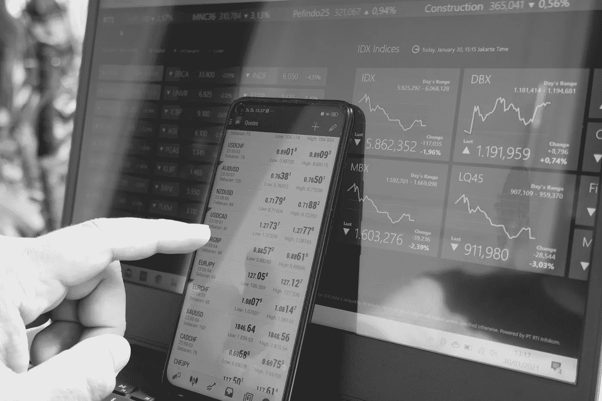
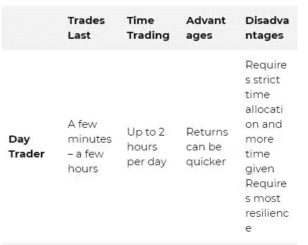
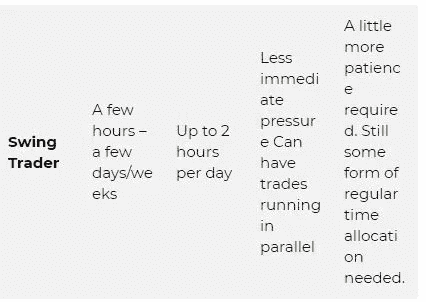
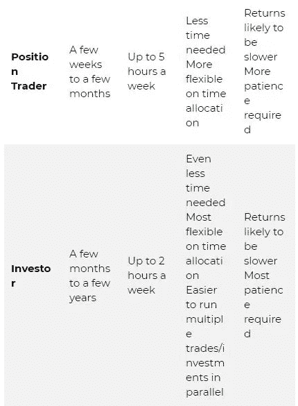

# 什么风格最适合我的外汇交易

> 原文：<https://medium.com/coinmonks/what-style-suits-me-best-for-forex-trading-by-becky-hayman-46cb926714e5?source=collection_archive---------15----------------------->

找到一种适合你的交易风格，这对交易任何市场都很重要，不仅仅是外汇市场。在交易中，如果 100%复制别人的做法，而不去了解什么样的交易风格最适合你，很少会成功。原因是交易方法和风格有很多可变因素，举几个例子:

*   在给定的一天/一周/一个月内，你有多少时间可以交易？你什么时候可以交易？
*   你有多少资本，你对风险有什么看法？
*   你的经验是什么，什么样的方法对你有意义？
*   你在什么市场交易？
*   你的目标是什么？
*   你在世界的什么地方，有什么规定？

对大多数交易者来说，这些问题的答案是不同的，因此他们的风格和方法也需要不同。如果你交易的风格适合每天有 2 小时交易时间的人，而你每天只有 30 分钟交易时间，那么这个方法可能不适合你。如果你交易的风格适合账户里有 25，000 美元以上的人，而你的账户比这少得多，那么这个方法可能不适合你。但这并不意味着其他方法对你不起作用。

交易的美妙之处在于有很多方法可以盈利。你可以以正确的方式组合对你有用的变量，并且仍然可以找到一种方法。大多数外汇交易者(以及一般的交易者)犯的错误是，他们试图把自己塑造成他们已经学会的风格，而不是找到适合他们的风格。

当我们在交易中说“风格”时，我们通常指以下几点:

*   日间交易
*   摇摆交易
*   头寸交易
*   投资

没有哪种风格比另一种更好，也没有哪种风格比另一种更“有利可图”，它们根据个人的生活方式、资本和个性为不同的人工作。简单了解不同的交易风格意味着什么会有所帮助:

不同的资产类别更适合特定的风格。外汇是世界上最大的资产类别，这使得它非常多样化，并允许我们利用从小到大的时间范围内的波动，利用几乎任何风格。它还提供了不错的杠杆，所以它更容易与小账户交易，这使得短期交易更有效(如果你正在运行一个有利可图的策略，当然！)

然而，如果你正在考虑日内外汇交易，最好记住以下几点:

*   总会有差价，这取决于经纪人，差价可大可小，而且会根据市场事件而变化。
*   这意味着如果你使用非常小的时间框架，价差可能会对你造成伤害，因为最小的波动可能会影响你的胜败。当使用更长的时间框架和更长期的风格时，这就不那么真实了。
*   每天有数十亿美元通过外汇市场流动，有许多参与者——从散户投机者到机构交易者，再到进行外汇交易的政府、企业和个人。这意味着每天都有许多买卖订单因为许多不同的原因在这些市场上流动。
*   这使得在小的动作上更难做到正确，你犯错的空间也更小。
*   外汇市场一周开放 5 天，所以几乎没有隔夜交易的风险。
*   这意味着，不像股票，你不需要在一天结束时退出，所以外汇机制中没有任何固有的东西意味着你需要日间交易。

当然，有盈利的外汇交易者进行日内交易，但以我的经验来看，这可能比有人进行交易或者投资外汇市场要难一些。

通过衡量你的可用时间，你交易的频率，你对时间分配的严格程度，你的目标是什么，你是什么样的人，这应该会引导你找到最适合你的风格。然后，你需要相应地调整你的方法，比如改变使用的时间框架、不同的风险管理规则等。

最终，交易风格本身并不决定成功的可能性，而是它和你个人和交易者的关系。追求最适合你的风格，不管是哪种风格，都是最有可能给你带来你希望看到的交易成功的风格。

请随时加入我们的˲tradewithufos 社区，我们提供全面的交易课程和交易应用程序。

您的外汇课程:
[【www.tradewithufos.com/forex-in-action】T2](https://www.tradewithufos.com/forex-in-action)

为所有人免费永久会员:

**贝基·海曼
传统团队**

> **加入 Coinmonks [电报频道](https://t.me/coincodecap)和 [Youtube 频道](https://www.youtube.com/c/coinmonks/videos)了解加密交易和投资**

# **另外，阅读**

*   **[德国最佳加密交易所](https://coincodecap.com/crypto-exchanges-in-germany) | [Arbitrum:第二层解决方案](https://coincodecap.com/arbitrum)**
*   **[币安交易机器人](/coinmonks/binance-trading-bots-d0d57bb62c4c) | [OKEx 评论](/coinmonks/okex-review-6b369304110f) | [阿塔尼评论](https://coincodecap.com/atani-review)**
*   **[最佳加密交易信号电报](/coinmonks/best-crypto-signals-telegram-5785cdbc4b2b) | [MoonXBT 评论](/coinmonks/moonxbt-review-6e4ab26d037)**
*   **[如何在 Bitbns 上购买柴犬(SHIB)币？](https://coincodecap.com/buy-shiba-bitbns) | [购买弗洛基](https://coincodecap.com/buy-floki-inu-token)**
*   **[CoinFLEX 评论](https://coincodecap.com/coinflex-review) | [AEX 交易所评论](https://coincodecap.com/aex-exchange-review) | [UPbit 评论](https://coincodecap.com/upbit-review)**
*   **[十大最佳加密货币博客](https://coincodecap.com/best-cryptocurrency-blogs) | [YouHodler 评论](https://coincodecap.com/youhodler-review)**