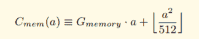

# Solidity 中的内存和存储是什么？

> 原文：<https://medium.com/coinmonks/what-the-hack-is-memory-and-storage-in-solidity-6b9e62577305?source=collection_archive---------0----------------------->

坚固性中最容易混淆的一个概念是如何有效地使用内存和存储。

本文旨在提供对内存和存储的基本理解，并通过一些例子展示它的有效用法。

> [发现并回顾最佳区块链软件](https://coincodecap.com)

如果你是 solidity 的新手，请先阅读下面的文章:

[**以太坊区块链开发入门:part-1**](http://demystifyblockchain.com/2018/06/29/getting-started-with-ethereum-blockchain-development-part-1/)

[**以太坊区块链开发入门:第二部分**](http://demystifyblockchain.com/2018/06/28/getting-started-with-ethereum-blockchain-development/)

在我们继续之前，让我们了解一下 solidity 拥有的不同类型的存储:

**存储:**每个账户拥有的永久内存称为**存储**。存储是一个键值存储，其中键和值都是 32 字节。

**内存:**内存是一个字节- **数组**，它保存其中的数据，直到函数执行。内存从零大小开始，可以通过简单地访问或存储索引大于其当前大小的内存来扩展为 32 字节块。为了节省汽油，建议尽可能缩小它的尺寸。

**栈**:用来存放小的局部变量。它的成本与内存相同，但只能保存有限的值。

# **消耗空间的同时消耗气体**

文章的这一部分假设读者对以太坊的气体消耗有一个基本的了解，如果没有参考下面的链接。👇

[***以太坊里的气是什么？***](https://ethereum.stackexchange.com/questions/3/what-is-meant-by-the-term-gas)

你在以太坊区块链做的每一件事都会耗费一些汽油。让我们试着比较一下存储和内存的气体消耗。

**储气消耗:**储气成本很好理解:

*   当一个值从零设置为非零时，它花费 20，000 汽油
*   写入现有存储或将值设置为零时，会消耗 5,000 gas。
*   非零值设置为零时，5000 气  退款。

包装储存节省气体仍然是可能的，例如将 2 个 [uint128](http://solidity.readthedocs.io/en/v0.4.21/types.html#integers) 值放在一个键中，而不是使用 2 个键。

**内存气体消耗:**内存扩展的气体消耗在[黄皮书](http://yellowpaper.io/)中定义如下:

Gas consumption in memory expansion

**G_memory** 为 3， **a** 为分配的 256 位块字数量。

对于 a = **512 个组块**，气体消耗量将为(3 * 512 + (512 * 512)/512) = **2560 单位**

***注意:与存储相比，内存使用的成本并不显著。总是使用内存来执行中间计算并将结果存储在存储器中是一个好习惯。***

# **变量**存储在**的什么地方？**

对于每种类型的变量，都有默认的存储位置:

*   状态变量总是存储在存储器中。
*   函数参数总是在内存中。
*   默认情况下，结构、数组或映射类型引用的局部变量存储在存储中。
*   值类型(uint、int 等)的局部变量存储在堆栈中。

让我们更深入地了解这一点，并理解与内存和存储相关的另一个重要概念！！！

**合同描述:**

*   **契约变量**:映射将键值对存储为用户 Id 和用户类型。
    *映射(uint = > User)用户；*
*   **方法:**以下是合同中的方法:

I. **addUser** :以 uint id，uint balance 为参数，添加一个用户到映射中。

二。**update balance**:**以 uint id，uint balance 为参数，更新用户的余额。**

**三。 **getBalance** :以 uint id 为参数，返回用户的余额。**

*   ****调用合同方法**:您可以在[在线混音 IDE](http://remix.ethereum.org/#optimize=false&version=soljson-v0.4.24+commit.e67f0147.js) 中运行上述合同**

**I .通过调用带有参数的 **addUser** 方法创建一个用户(id = 1，balance = 10)**

**二。通过使用参数(id = 1 且 balance = 20)调用 **updateBalance** 方法来更新用户的余额**

*   ****预期输出**:通过带参数(id = 1)调用 **getBalance** 方法得到用户的余额。你认为期望值是多少？猜猜看？是 2 **0 还是 10** 为什么？🤔**

# **输出是 10 而不是 20。😯**

****

****解释:**在 solidity 中，当存储类型变量被赋值给内存类型时，它会创建一个新的数据副本。如果对拷贝的数据进行了任何更新，它将不会反映在原始拷贝中。**

**你现在能猜出，你需要对 **updateBalance** 方法做什么改变才能使它工作吗？🤔**

**更改合同中的第 17 行。将存储位置从内存更改到存储不会创建新的数据副本，而是会创建一个指向存储的指针。因此，用户对象的任何变化都会反映在存储本身中。**

***用户* ***存储*** *用户=用户【id】；***

**答对了。！！你现在已经很好地理解了固态中的记忆和存储🙌**

**在接下来的几篇文章中。我将解释 EVM 内部和默克尔 Pertrica 树。**

**快乐编码😇**

**[linkedin.com/in/jainsarvesh](https://www.linkedin.com/in/jainsarvesh/)T14[medium.com/@sarvesh.sgsits](/@sarvesh.sgsits)**

> **加入 Coinmonks [电报频道](https://t.me/coincodecap)和 [Youtube 频道](https://www.youtube.com/c/coinmonks/videos)获取每日[加密新闻](http://coincodecap.com/)**

## **另外，阅读**

*   **[复制交易](/coinmonks/top-10-crypto-copy-trading-platforms-for-beginners-d0c37c7d698c) | [加密税务软件](/coinmonks/crypto-tax-software-ed4b4810e338)**
*   **[网格交易](https://coincodecap.com/grid-trading) | [加密硬件钱包](/coinmonks/the-best-cryptocurrency-hardware-wallets-of-2020-e28b1c124069)**
*   **[密码电报信号](http://Top 4 Telegram Channels for Crypto Traders) | [密码交易机器人](/coinmonks/crypto-trading-bot-c2ffce8acb2a)**
*   **[Bookmap 评论](https://coincodecap.com/bookmap-review-2021-best-trading-software) | [美国 5 大最佳加密交易所](https://coincodecap.com/crypto-exchange-usa)**
*   **[如何在 FTX 交易所交易期货](https://coincodecap.com/ftx-futures-trading) | [OKEx vs 币安](https://coincodecap.com/okex-vs-binance)**
*   **[CoinLoan 评论](https://coincodecap.com/coinloan-review) | [YouHodler 评论](/coinmonks/youhodler-4-easy-ways-to-make-money-98969b9689f2) | [BlockFi 评论](https://coincodecap.com/blockfi-review)**
*   **[XT.COM 评论](https://coincodecap.com/profittradingapp-for-binance) | [币安评论](https://coincodecap.com/xt-com-review)**
*   **[SmithBot 评论](https://coincodecap.com/smithbot-review) | [4 款最佳免费开源交易机器人](https://coincodecap.com/free-open-source-trading-bots)**
*   **[最佳加密交易所](/coinmonks/crypto-exchange-dd2f9d6f3769) | [印度最佳加密交易所](/coinmonks/bitcoin-exchange-in-india-7f1fe79715c9)**
*   **[开发人员的最佳加密 API](/coinmonks/best-crypto-apis-for-developers-5efe3a597a9f)**
*   **最佳[密码借贷平台](/coinmonks/top-5-crypto-lending-platforms-in-2020-that-you-need-to-know-a1b675cec3fa)**
*   **杠杆代币的终极指南**