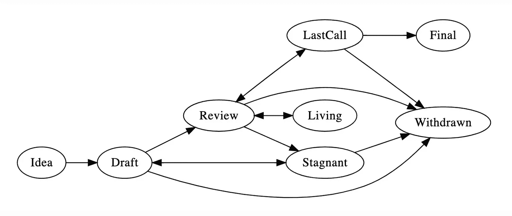

# 什么是 EIP，我如何才能创建一个？以太坊标准 EIP ERC 常见问题

> 原文：<https://medium.com/coinmonks/what-the-heck-is-eip-and-how-can-i-create-one-ethereum-standards-eip-erc-faqs-2fd1194eebe0?source=collection_archive---------0----------------------->

Photo by [Deva Darshan](https://unsplash.com/@darshan394?utm_source=medium&utm_medium=referral) on [Unsplash](https://unsplash.com?utm_source=medium&utm_medium=referral)

## 回答关于 EIP 和 ERC 的最常见问题

以太坊中的 EIPs 和 ERC 标准是一个巨大的兔子洞，人们正迷失在其中。尽管以太坊标准 EIP 和 ERC 已经广为人知，但人们仍然会问为什么我们会有它们并使用它们。在这篇文章中，我将尝试分解所有你应该知道的关于标准的事情，以及如何自己创建一个标准。

> 标准是网络技术的定义，定义了系统工作的原则。

# 什么是标准？

标准是促进设计过程的统一文件，其结果代表共识、公平、公共责任和质量。在以太坊生态系统中，标准正在统一代码的功能，定义代码操作。在 Web2 生态系统中，标准通常由 W3C 及其成员创建。

在 Web3 生态系统中，**标准(EIP 和 ERC)由社区创建，允许任何人创建和提交他们自己的标准。**这些标准正在经历接受或拒绝 EIP 的正式过程。

# 我们为什么要使用标准？

制定标准是为了使设计功能的实现更容易。我们使用标准来统一信息。在以太坊上，我们使用类似的工具，这些工具具有由标准定义的基本功能。例如 ERC20 令牌标准，[EIP 的完整列表在此](https://eips.ethereum.org/all)。

# 为什么要关心标准？

我们正在设计新的金融工具，每天有数百万人在使用。**我们需要坚持一些基本规则来定义运营方式、标准化命名、标准化令牌转移、令牌转移方式，并围绕这些原则设计规则。**否则每个项目都将构建自己的方式，项目之间不会有太多的互操作性。

# 什么是 EIP，为什么它是以太坊标准？

EIP 代表以太坊改进提案，向以太坊社区提供环境的设计或信息、新功能及其流程。EIP 应该是提议以太坊新特性的主要机制，从社区收集关于某个问题的技术输入，并在以太坊中记录设计决策。

EIP 是一种跟踪以太坊设计变更进度的合适方法。如今它们被用来定义以太坊的设计功能。

EIP 分为几类:核心、接口、网络、元、信息和 ERC。

# 什么是 ERC？

**ERC 代表以太坊请求(for)注释，它概述了开发人员为了实现新功能必须遵循的一组规则和建议。ERC 是链上应用层相关的 EIP**。

EIP 和 ERC 之间的主要区别在于，EIP 主要定义以太坊核心功能，而 ERC 定义分散的应用层功能和设计。ERC 只是众多生态工业园中的一个，但生态工业园是使用最多的，这也是它们如此受欢迎和经常被讨论的原因。

# 谁决定什么是标准？

以太坊是一个开放的生态系统，任何人都可以派生、贡献和添加新功能。开发人员正在提出新的标准，这些标准正在通过一个正式的流程，在这个流程中，来自所有核心开发人员、以太坊猫牧人、EIP 编辑的一组人决定 EIP 是否得到实施。该流程需要更广泛的社区反馈，这些反馈将在 [**以太坊/eips GitHub repo**](https://github.com/ethereum/EIPs) **和** [**以太坊魔术师论坛**](https://ethereum-magicians.org/) **上发布。**该过程在 [EIP-1](https://eips.ethereum.org/EIPS/eip-1) 中概述。

Process through which EIPs are being finalised or withdrawn.

# 我怎样才能创建一个 EIP，这个过程是怎样的？

**任何人都可以创建 EIP 或 ERC，您应该阅读**[**EIP-1**](https://eips.ethereum.org/EIPS/eip-1)**它概述了 EIP 进程、什么是 EIP、EIP 的类型、EIP 文档应该包含什么、EIP 格式和模板、EIP 编辑器列表以及所有您需要了解的关于 EIP 的信息。在你下定决心创作 EIP 之前，请务必阅读这本书。你的新 EIP 应该定义一个新的特性，它并不复杂，但也不是超级小众，并且可以在生态系统中使用。最难的部分是促进，作为作者，你需要促进你的 EIP 周围的人，收集反馈，写文章描述你的 EIP 解决的问题，并与项目合作实施它。**

**成功的 EIP 或 ERC 不需要为了成功而处于“最后”阶段。**项目需要使用 EIP 才能被认为是成功的** —该规则仅适用于 ERC，而非为保持网络健康而实施的核心 EIP。**

# **最流行的以太坊标准**

**ERC20 令牌标准是最流行的 ERC，由[维塔利克·布特林](https://twitter.com/VitalikButerin)和[法比安·沃格斯泰勒](https://twitter.com/feindura)创建。**该标准在 2017 年掀起了 ICO 热潮，如今正被用于在以太坊上创建代币。**以太坊上存在的 70%以上的代币都在使用 ERC20 代币合约。[使用 ERC20 标准的所有令牌的完整列表](https://etherscan.io/tokens)**

**如果你想了解更多关于 ERC 的信息，我在以太坊猫牧人主办的 EIP Peep 展会上做了一个关于 ERC 和应用层标准的演讲。[幻灯片](https://www.canva.com/design/DAEeK7iqHOM/I9a0JrJl4B__LblUw6kO-A/view?utm_content=DAEeK7iqHOM&utm_campaign=designshare&utm_medium=link&utm_source=sharebutton) | [录制](https://youtu.be/9BhOCmf0v0s)。**

**我正在为 [NFT 标准相关 ERCs Wiki](https://www.nftstandards.wtf/) 构建文档，其中包含不可替换令牌 ERC 的相关链接。**

## **链接:**

**📑 [NFT 标准维基](https://www.nftstandards.wtf/NFT+Standards+Wiki+-+READ.me)**

**📩[通过 Twitter 联系我](https://twitter.com/AnettRolikova)**

***感谢*[*Pooja ran Jan*](https://medium.com/u/b5c7dc4d0b02?source=post_page-----2fd1194eebe0--------------------------------)*查看本文的早期版本。***