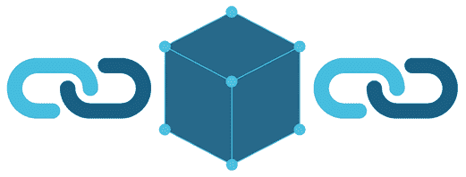

# 区块链到底是什么东西，怎么运作的？(简体)

> 原文：<https://medium.com/coinmonks/what-the-hell-is-blockchain-and-how-does-it-works-simplified-b9372ecc26ef?source=collection_archive---------0----------------------->

***“在互联网上，没人知道你是一只狗”——***彼得·斯坦纳

除非你一直生活在岩石下，否则你可能听说过最近被抛出的词**、【区块链】**。这似乎是今年的流行语之一。但是很多人似乎知道区块链是什么或者它是如何工作的。

假设你和你的朋友正在从一个账户向另一个账户交易/转账。你会先去银行，让他们把钱转到你朋友的账户上。

Image by: Exchange IQ

当把钱从你的账户转到你朋友的账户时，银行会在交易登记簿上做一个记录。该条目需要在接收者和发送者两个帐户上更新。但是有一个问题:

# **可篡改**。交易的条目可以很容易地被操纵或改变。

因为这个问题，知道银行系统如何运作的人都在试图避开它们。**这就是区块链的用武之地。**

# **什么是区块链？**

让我们以 Google 电子表格或 MS Excel (Windows)为例。这个电子表格在不同的计算机网络之间共享，每个人都有一份副本。该电子表格包含关于由真实的人提交的交易的信息。

任何人都可以访问该电子表格，但没有人可以编辑它。

> [每天发现和回顾区块链产品。](https://coincodecap.com)

## 这就是区块链。

它处理块，而电子表格处理“行”和“列”。

区块链中的块是数据的集合。通过将数据与按时间顺序排列的其他数据块连接起来，创建一个链接在一起的数据块链，从而将数据添加到区块链的数据块中。区块链的第一个区块叫创世纪区块。

区块链是一个*分布式账本*，简单来说就是一个账本在网络中的所有对等体中遍布，每个对等体持有一份完整账本的副本。

区块链的一些关键属性证明了区块链优于传统的分类账信息保存系统:

1.  对等网络:没有中央权力机构来控制或操纵它。所有参与者彼此直接对话。这允许在第三方参与的情况下直接进行数据交换。
2.  **分布式**:账本分散在整个网络中，使得篡改不那么容易。
3.  **加密保护:**加密技术被用于安全服务，以防止总账被篡改。
4.  **仅添加:**数据只能按时间顺序添加到区块链中。这一特性意味着，一旦数据被添加到区块链中，就几乎不可能更改该数据，并且可以认为该数据实际上是不可变的。我们可以说它有:
    *被遗忘的权利*或*被抹去的权利*这里定义的。
5.  共识:这是最关键的属性。这使得区块链有能力通过共识来更新分类账。这就是赋予它权力下放的原因。没有中央机构控制分类帐的更新。相反，对区块链的任何更新都是对照由区块链协议定义的严格标准来验证的，并且只有在网络上所有参与的对等体/节点之间达成共识之后才被添加到区块链。

现在，下一个:

# 它是如何工作的？

1.  节点通过首先创建事务，然后用其私钥(通过加密创建)对其进行数字签名来启动事务。一个事务可以代表区块链中的各种操作。最常见的是，这是一种数据结构，表示区块链网络上用户之间的价值转移。交易数据结构通常由一些价值转移逻辑、相关规则、源地址和目的地址以及其他验证信息组成。
2.  通过使用称为 Gossip 协议的洪泛协议，将事务传播(洪泛)到基于预设标准验证事务的对等方。通常，需要不止一个节点来验证事务。
3.  一旦事务被验证，它就被包含在一个块中，然后被传播到网络上。此时，交易被视为已确认。
4.  新创建的块现在成为分类帐的一部分，下一个块以加密方式将自身链接回该块。这个链接是一个散列指针。在这个阶段，事务得到第二次确认，块得到第一次确认。
5.  然后，每次创建新块时，都会重新确认交易。通常，网络中需要六次确认才能认为交易是最终的。

然后，每次创建新块时，都会重新确认交易。通常，比特币网络中需要六次确认才能认为交易是最终的。

> 加入 Coinmonks [电报频道](https://t.me/coincodecap)和 [Youtube 频道](https://www.youtube.com/c/coinmonks/videos)获取每日[加密新闻](http://coincodecap.com/)

## 另外，阅读

*   [密码电报信号](http://Top 4 Telegram Channels for Crypto Traders) | [密码交易机器人](/coinmonks/crypto-trading-bot-c2ffce8acb2a)
*   [复制交易](/coinmonks/top-10-crypto-copy-trading-platforms-for-beginners-d0c37c7d698c) | [加密税务软件](/coinmonks/crypto-tax-software-ed4b4810e338)
*   [网格交易](https://coincodecap.com/grid-trading) | [加密硬件钱包](/coinmonks/the-best-cryptocurrency-hardware-wallets-of-2020-e28b1c124069)
*   [加密交换](/coinmonks/crypto-exchange-dd2f9d6f3769) | [印度的加密应用](/coinmonks/buy-bitcoin-in-india-feb50ddfef94)