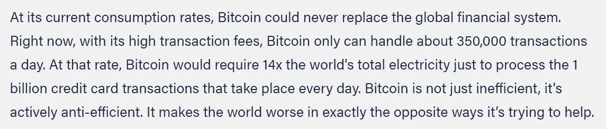

# 媒体对比特币能耗的误解是什么

> 原文：<https://medium.com/coinmonks/what-the-media-get-very-wrong-about-bitcoins-energy-consumption-98f2fbb8ad17?source=collection_archive---------1----------------------->

## *比特币交易次数与能耗无关*

Photo by [Evgeny Tchebotarev](https://www.pexels.com/@evgeny-tchebotarev-1058775?utm_content=attributionCopyText&utm_medium=referral&utm_source=pexels) from [Pexels](https://www.pexels.com/photo/white-lantern-lot-2541310/?utm_content=attributionCopyText&utm_medium=referral&utm_source=pexels)

每隔四年，当比特币重新进入牛市时，就会有一群没受过教育的媒体专家、气候记者、经济学教授和其他批评者盲目地指出比特币的过度能源消耗是地球面临的最大威胁。当你花不到 5 分钟时间阅读彭博或英国《金融时报》上研究不充分的观点文章，并认为这是最大的真理时，难怪这是你的观点。然后，你有许多其他的“记者”，他们复述这些“事实”,充当真理的仲裁者。这可能是因为它能让标题吸引人，他们知道这会带来大量的点击，最终，对他们大多数人来说，这才是最重要的。

就拿美国银行的上述“研究”来说吧，它谈论的是转移话题，并试图把竞争描绘成一个坏的方面。将 10 亿美元的比特币购买量与 1270 万桶石油消费量相提并论有什么意义呢？如果有人决定在一次交易中以不到 20 美元的价格转移 10 亿美元的比特币，那么这一次交易每年消耗的能源是否仍与 632 千户家庭相同？像 Eric Holthaus 这样无知的“记者”然后引用上述“研究”,声称他们的观点得到了有效来源的支持，并通过将比特币的能耗与交易次数联系起来，利用这一点来传播对[比特币](https://blog.coincodecap.com/a-candid-explanation-of-bitcoin)的完全失实陈述。

Eric Holthhaus on Twitter from [**Nic Carters article**](https://www.coindesk.com/frustrating-maddening-all-consuming-bitcoin-energy-debate)

你得有多愚蠢或虚伪才会相信埃里克的上述说法。对他来说，两者可能都有一点，一是它有助于提高参与度，二是通过引用比特币竞争产生的垃圾来源，你可以声称“我已经做了研究”，然后继续前进。尽管这是一个完全无知的观点，缺乏对比特币网络动态的任何了解，但据我们所知，他们可能认为比特币背后也有一位首席执行官。Nic Carter 和 Lyn Alden 对这个幼稚的论点进行了精彩的反驳，你应该阅读这里的**和这里的**，以便充分理解为什么这是超越愚蠢的。****

> ****比特币网络的交易数量与能源消耗完全无关****

****对于一般前提，我将在这里总结一下，比特币网络上的交易数量与能源消耗完全无关。这是因为采矿的价格最终取决于矿工的盈利能力，而盈利能力又取决于网络难度和区块补贴。越多的矿工加入网络“赚钱”,开采就越困难，这反过来降低了盈利能力，迫使无利可图的矿工退出，从而降低了总能耗。这种难度调节的自动调节系统确保平均每 10 分钟生产一个积木。****

****当美国银行和 Digiconomist 等其他“研究人员”计算每笔交易的网络能耗时，无非是试图妖魔化比特币，并将其贴上赌徒和堕落者完全浪费的标签。当你在开始之前已经有了一个议程时，很容易把一堆不相关的数字放在一起，以便提出一些任意的观点。****

****能源的“良好”使用是非常主观的，正如我在我之前的 [**中提到的，比特币与其他能源浪费的比较**](/coinmonks/is-bitcoin-really-a-climate-emergency-1f85e51687ab) 有许多其他的能源使用，有些人会认为比比特币更浪费。这一点尤其正确，因为它确保了超过 1 万亿美元的世界价值，而且考虑到每年 10%或更高的通货膨胀率导致 8 亿多人日益贫困，这一点更是如此。我敢肯定，埃里克在暗示比特币将他们的生命置于危险之中时，没有询问那些脆弱的 8 亿人的意见，事实上，我认为他从来没有和他的回音室以外的人说过话。****

********

****论点中的另一个谬误是，比特币主要不是一个支付网络，而是用于最终结算。处理低价值甚至频繁的微交易的工作位于比特币之上，如闪电网络，最终余额随后在比特币上结算，正如我上文提到的，这已经可以处理世界上所有的交易，几乎不需要任何能源。****

****换句话说，将结算层上的交易数量(可以是来自更高层的任何实际交易数量的倍数)除以总能耗是非常错误的，并且导致每笔交易的能源数字被夸大。更不用说，这些能量还用于保护网络本身的整体价值，处理结算交易只是其中的一小部分。尽管如果这些“研究人员”把这个加到他们的计算中，它不会很好地符合他们的议程。****

****如果有一样东西可以拿走的话，那就是媒体不是在讲真话，而是在卖订阅和广告。如果到现在还不明显，你需要使用不同偏见的多个来源进行自己的研究，以获得任何主题的清晰性，指出一篇基于观点的文章作为你整个观点的基础只是懒惰的研究。****

****如果你喜欢这个，请关注我的 [**Medium**](https://lukabankovic.medium.com/) 和 [**Twitter**](https://twitter.com/bitcoinluka) 以获取更多比特币和技术信息。****