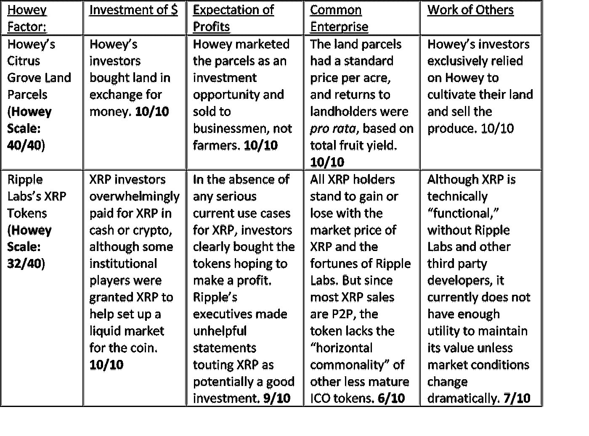

# Ripple 投诉告诉我们关于 ICO 令牌的什么

> 原文：<https://medium.com/coinmonks/what-the-ripple-complaint-tells-us-about-ico-tokens-afe3c36f100f?source=collection_archive---------6----------------------->

**TL；DR:** 我解释了如何将*豪威*测试应用于 XRP，该测试决定一项资产是否有资格成为证券。然后我给 XRP 在每一项测试中的表现打分(剧透一下:*不太好*)。今后，我将每周对不同的 altcoin 进行相同的分析，从恒星流明和近地天体气体开始。

这是我分析低价竞标被 SEC 视为证券的可能性系列文章中的第一篇。

首先，我解释了确定一项资产是否有资格成为证券的豪威测试如何适用于 XRP。

然后，我给 XRP 在每一项测试中的表现打分，这决定了它的最终 *Howey Scale* 分数，这是我制定的一个分数尺度，我将对照它分析所有的低价竞标。

(如果你只是对 XRP 分析感兴趣，可以跳到底部)

## **2020 年 12 月的 Ripple 投诉及其对 ico 的一般影响**

12 月 22 日，SEC 对 Ripple Labs 提起诉讼，声称 Ripple 的加密货币 XRP 符合作为证券的法律定义，因此不经过艰苦的注册过程就不能在公开市场上交易。美国证券交易委员会在该诉讼中的最初文件(“诉状”)表明，根据美国最高法院 1946 年的裁决, *SEC 诉 W.J. Howey Co.* 《美国最高法院判例汇编》第 328 卷第 293 页(1946 年), XRP 有资格成为证券，该裁决被称为“ *Howey* 测试”下面，我将快速解释一下什么是 *Howey* 测试，以及它对其他 ICO 令牌的潜在意义——特别是那些在 2017-2018 年 ICO 热潮中发行的令牌。

## **豪伊案概要**

20 世纪 40 年代，一位名叫威廉·豪伊的商人想在佛罗里达州投资一大片柑橘林。Howey 缺乏资金来全面开发和维护这块土地，所以他想出了一个由三部分组成的计划来为他的 citrus grove 风险投资筹集资金:首先，他将土地分成两半，一半留给自己，另一半分给投资者。接下来，他创建了一家名为“Howey-in-the-Hills”的运营公司，代表购买他出售的土地的投资者管理柑橘林地块。最后，他向他的投资者推销一揽子交易，他们可以以每英亩统一的价格购买某块土地，然后将该土地租回给 Howey-in-the-Hills，由 Howey-in-the-Hills 代表投资者收获和销售柑橘。

基于这一安排，SEC 起诉了 Howey，声称他出售 citrus grove 房地产构成了未注册证券发行，因为这些交易在功能上与出售其 citrus grove 运营公司的股票相同。1946 年，最高法院站在 SEC 一边，裁定房地产合同事实上是证券，并规定了一个四部分测试，以确定任何特定的金融交易是否构成“投资合同”。

## ***豪威*测试**

最高法院认为，在下列情况下，特定的金融交易构成证券销售:

**(1)** **它是一种“金钱的投资”在豪威的案例中，房地产合同是一种金钱投资，因为豪威的投资者支付金钱以换取地块的所有权。**

**(2)** **金钱的投入是在“预期利润”中完成的。在 Howey 案中，最高法院认为投资者从 Howey 手中购买土地是期望获得利润，因为 Howey 向投资者承诺了可观的利润作为其推销的一部分，并且因为 Howey 的大多数投资者是居住在佛罗里达州以外的商人，没有农业背景(或个人使用他们土地上种植的所有水果，超过投机价值)。换句话说，豪威的投资者购买土地并不是为了“使用”它(*例如*在土地上建造房屋)或“消费”在那块土地上种植的果实(这是服务合同所禁止的)——相反，豪威的投资者购买土地的唯一合理的原因是试图实现利润。**

**(3)** **投资在一个“共同企业”最高法院发现豪威公司的投资者投资于一个共同的企业，因为他们共享员工和设备来共同收获、储存、营销和出售他们各自地块上的柑橘类水果，并且因为他们都从豪威公司的盈利中按比例受益。因此，豪威公司的投资者的命运是同涨同跌的，这是基于豪威公司的水果在任何一年的供应量和市场价格。**

**(4)基于发起人或某些第三方的努力，投资是盈利的。如上所述，豪威的投资者不是农民或水果批发商，他们是商人。这些投资者从他们的房地产投资中获利的唯一方法是基于 Howey 和他的雇员们的工作，他们照料、收获和出售柑橘类水果。由于这个原因，最高法院认为投资者实际上是在投资豪伊的公司，而不是土地本身。**

## **加密货币的应用:**

那么*豪威*测试和加密货币有什么关系呢？信不信由你，这个发生在 1946 年的案件仍然是最重要的法律检验，证明资产的出售是否构成证券，因此是否受 SEC 的管辖。对于一个代币在被认为是证券之前需要满足四个*豪威*因素中的多少个没有任何严格的测试，但是作为一般规则，满足的因素越多，SEC 就越有可能认为代币是证券。Ripple 案很好地说明了政府将如何应用四个因素来确定数字资产令牌是否是一种证券。因此，让我们以 XRP 为例，一步步了解这四个因素:

**(1)****金钱投资:显然，任何人从 Ripple Labs 或使用法定货币或其他数字资产的交易所购买 XRP 代币，都是在代币上“投资金钱”，所以这个因素很容易满足。**

***在我想象的“豪威等级”上，我会给这个打 10/10 分***

****(2)** **利润预期**:在 Ripple 的诉状中，SEC 花费大量篇幅记录了 Ripple 内部人士——包括布拉德·加林豪斯(Brad garling house)——多次吹捧 XRP 是令牌持有者的潜在获利者。**

**在这些不幸的声明和 XRP 除了作为投资工具之外并没有真正实质性“用途”的事实之间，可以相当有把握地说，投资者购买 XRP 是期望从代币中获利，因此第二个因素也得到满足。**

**在豪威量表上，我也将它评为 9/10，根据 Ripple Labs 至少*声称* XRP 最终会有非投机性的用例(即使那仅仅是渴望)这一事实扣除一分。**

****(3)** **普通企业**:证交会声称，XRP 代币持有者投资的是一家“普通企业”，因为就像豪威的 citrus grove 投资者一样，所有 XRP 投资者的财富根据 XRP 当前的市场涨跌相等。这个市场在很大程度上受到 Ripple 及其员工控制范围内的因素的影响，比如 Ripple 维护的 XRP 托管，Ripple 将新的 XRP 代币引入市场以实现价值最大化的方式，Ripple 吸引 XRP 机构兴趣的营销努力，以及 Ripple 及其关联公司能够为 XRP 代币开发的技术“用例”。**

**另一方面，由于 XRP 的大部分实际销售是点对点的，而不是 Ripple 直接销售的结果，因此有一个合理的论点，即 XRP 投资者缺乏“横向共同性”，这是法院在决定是否存在共同企业时考虑的一个因素，因为他们是彼此的交易对手，他们相互销售的收益没有以平等受益的方式汇集在一起。**

**因此，在豪威等级的这一部分，我给 XRP 打 6/10 分。**

****(4)** **其他人的努力**:最后，美国证券交易委员会认为，XRP 的出售也满足了最后的 *Howey* 因素，因为代币持有者在 XRP 的投资盈利能力取决于其他人(特别是 Ripple Labs)在管理 XRP 的总供应、开发代币的其他技术用例，以及向可能使用代币进行银行间转账的机构投资者推广这些用例方面的努力。就像 Howey 的 citrus grove 投资者依靠 Howey 的公司从他们的土地投资中获利一样，XRP 的投资者依靠 Ripple Labs 从他们购买的 XRP 代币中获利。另一方面，Ripple 可能会辩称，即使 Ripple Labs 明天消失，所有必要的技术目前都已到位，可以让 XRP 变得可用。然而，这种说法有点牵强，因为 XRP 独立有用并因此有价值的市场条件尚未到位，XRP 生态系统的分布远不如比特币和以太等可比令牌。**

**根据这些论点，我将在这一点上给 XRP 一个 7/10 的豪威评分。**

****

**Howey Scale Chart**

**总结一下分数，我给 XRP 的评分是 32/40，超过 30 意味着监管机构发现有问题的数字资产是一种证券的严重风险。**

**因此，我认为美国证券交易委员会很可能会打赢这场针对 Ripple Labs 的官司。联邦法官会以不同的方式看待事情，并裁定上述因素实际上不符合，XRP 不是一个投资合同吗？当然，一切皆有可能。但希望你能从我上面的分析中明白，为什么 Ripple Labs 在声称 XRP 销售不符合豪威测试中提出的安全定义时面临一场艰苦的战斗。**

**相反，你可以看到为什么从证券法的角度来看，比特币等更完全去中心化的加密货币是更安全的押注，因为它们不依赖于任何特定公司的支持来实现价值。但在一个有成千上万种加密货币的世界里，去中心化的比特币和依赖公司的 XRP 之间肯定会有一些困难的情况。每周，我将使用四部分测试来检查这些替代硬币中的一个，并给出我对 SEC 采取有问题的代币构成证券的立场的可能性的看法。敬请关注更多内容！**

*****应大众要求，我接下来的分析是。。。XLM。敬请期待！*****

## ****关于我们****

**Howey Feeling 是一只热爱比特币的互联网狗，由一个专门研究区块链法律的纽约前 Biglaw 律师团队提供支持。所有帖子仅供娱乐和参考，不应被视为任何主题的法律建议。如果你有任何问题或者想雇佣我们，请发邮件到 howeyfeeling@gmail.com 给我们。**

**如果您喜欢我们的内容并希望支持我们的工作，我们将很乐意接受 BTC 的贡献**