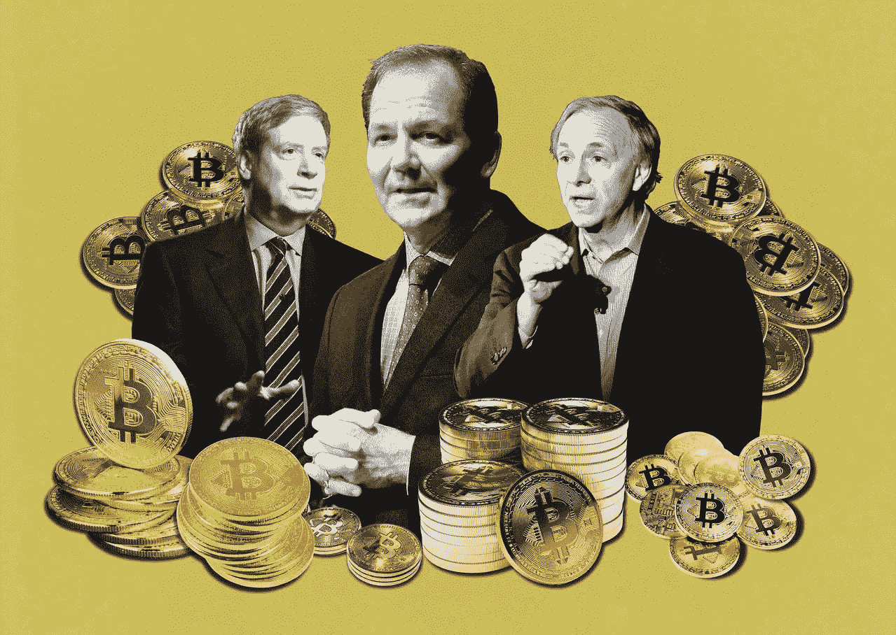
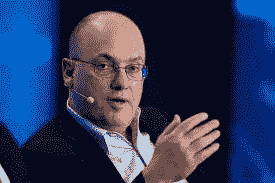
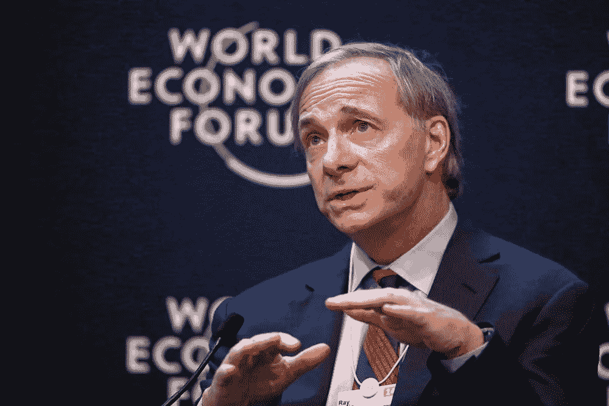
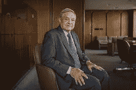
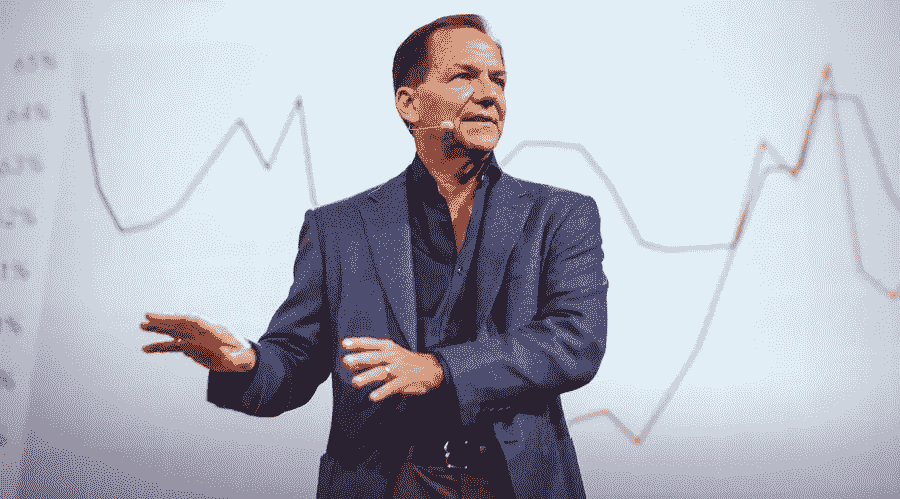
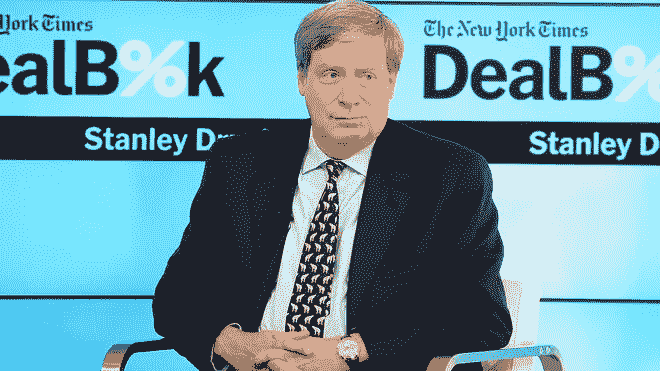

# 顶级对冲基金经理对加密热潮有什么看法？

> 原文：<https://medium.com/coinmonks/what-the-top-hedge-fund-managers-have-to-say-about-the-crypto-boom-12db5e4a02c2?source=collection_archive---------4----------------------->

加密货币行业正以前所未有的速度蓬勃发展；年轻的空间对投资者来说有很多机会。人们开始意识到持有法定货币的危险。很大一部分投资者仍然对这场革命持怀疑态度。如果你感到困惑，最好参考一下有史以来杰出的思想家和基金经理。在这篇博客中，我们强调了顶级对冲基金经理对加密货币潜力的看法。

## 史蒂夫·科恩

这位华尔街人士以经营最成功、最隐秘的对冲基金之一而闻名。用自己的资金创办了自己的公司，现在公司管理着 140 亿美元的资产。拥有经济学学位，这位亿万富翁对冲基金经理和商人保持着在大多数对冲基金资金短缺的科技泡沫破裂时获得 70%回报的记录。他在 2014 年推出了 Point72 资产管理公司，这意味着对投资者来说是一种高风险、高回报的策略。这位传奇交易员还持有美国职业棒球大联盟纽约大都会队的多数股权。

谈到加密，该公司表示，他们正在围绕该空间的颠覆性能力探索机会，不想忽视彭博报道的超过 2 万亿美元的市场。该声明强调了从前景看好的行业获取回报的坚定态度。

## **雷伊·达里奥**

他是世界上最大的对冲基金经理，管理着 1500 亿美元的资产，个人净资产为 200 亿美元。这位投资者是《纽约时报》畅销书《生活与工作原则》一书的作者。如果要给投资界的史蒂夫乔布斯(Steve job)一个头衔，戴利奥将是最合适的人选。这位传奇人物通过开创风险平价、货币叠加、全球通胀指数债券管理等改变了投资方式。自 Bridgewater associates 成立以来，该基金为投资者带来了 585 亿美元的收益；他被认为是有史以来最伟大的资金管理者。

“相比债券，我更喜欢比特币”这是这位全球最大对冲基金的前联合创始人最近发表的最有力的言论。他进一步将比特币称为类似黄金的财产和有吸引力的储蓄工具，透露他持有一些比特币。

## **乔治·索罗斯**

当听到关于他的消息时，我首先想到的是那个击垮英格兰银行的人。他在一天之内做空英镑，获得了 10 亿美元的巨额收益。这个著名的事件在投资界被称为黑色星期三。作为有史以来最成功的基金经理之一，索罗斯于 1969 年创建了量子基金，当时被称为双鹰基金，从 1970 年到 2000 年实现了 30%的平均年回报率。

今年年初，索罗斯对数字货币持怀疑态度，但现在他让团队在这个有前途的领域寻找机会。据《彭博》最近报道，索罗斯基金经理之一亚当·费舍尔(Adam Fisher)转移了 260 亿美元进行数字货币交易和投资。另一方面，索罗斯投资基金的首席投资官表示，比特币正处于“拐点”。

## **保罗·都铎·琼斯**

因在 1987 年成功预测黑色星期一而使他的钱翻了三倍而出名。1990 年，都铎通过做空日本股票市场获得了 87.4%的回报。这是这位对冲基金传奇人物、都铎投资公司创始人的一些成就。目前，他拥有 70 亿美元的净资产。

这位著名的交易员称比特币是最大的通胀对冲工具，并预计比特币的反弹将是这几局的开始。他强调，投资比特币就像投资苹果和谷歌这样的大型科技公司，因为比特币聚集了非常聪明和老练的人，他们有着伟大的愿景。

## **斯坦利·德鲁肯米勒**

乔治索罗斯(George Soros)聘请他管理自己的量子基金(quantum fund)，两人联手打破了英镑汇率；他就是这么传奇。Druckenmiller 在 1981 年创立了 Duquesne Capital Management，并为投资者创造了 30%的平均年回报率，直到 2010 年他关闭了该基金，并返还了所有投资者的资金。现在他在管理自己的资金，拥有 56 亿美元的净资产。

根据 2020 年 11 月发布的报告，他拥有一些比特币。德鲁肯米勒说，在过去的 13 年里，比特币作为一个品牌保持稳定，并且每天都在扩大。他预计比特币比黄金更有效；然而，根据福布斯的报道，他在黄金上的赌注比比特币更大。

## **下一步是什么？**

看看 crypto 的未来会是什么样子将会很有趣。大型机构和对冲基金开始分一杯羹，为该工具带来更多流动性和稳定性。年轻部门可能会看到比特币和顶级替代币的更多资本注入。

大型机构的参与可能会给传统投资者带来他们正在寻找的道德支持和信任。更多的新项目将获得筹集资金的机会，而且进度似乎加快了。如果你一直对加密空间持怀疑态度，我希望这篇文章能够改变你的想法，并对你产生积极的影响。

## **来源**

[“point 72 正在探索区块链、加密领域](https://www.bloomberg.com/news/articles/2021-05-13/steve-cohen-s-point72-is-exploring-blockchain-crypto-sector)”

[“雷伊·达里奥:‘我有一些比特币’](https://www.coindesk.com/consensus-ray-dalio-i-have-some-bitcoin)”

[“索罗斯采取措施投资加密货币](https://www.sharecast.com/promoted/news-and-announcements--/soros-and-rockefellers-take-first-steps-to-invest-in-cryptocurrency.html)”

[《比特币上的保罗·都铎·琼斯](https://www.cnbc.com/2020/10/22/-paul-tudor-jones-says-he-likes-bitcoin-even-more-now-rally-still-in-the-first-inning.html)

[“德鲁肯米勒称比特币优于黄金](https://www.forbes.com/sites/billybambrough/2020/11/12/a-legendary-hedge-fund-billionaire-just-flipped-to-bitcoin-calling-it-better-than-gold/?sh=2cfb0b03222f)”