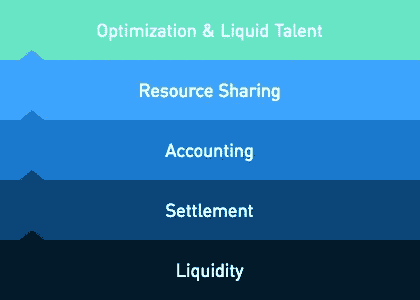

# 世界经济能从食品生产商身上学到什么

> 原文：<https://medium.com/coinmonks/what-the-world-economy-can-learn-from-a-food-producer-8dbd6d34283d?source=collection_archive---------5----------------------->

在有效的区块链经济中进行交易

嘉吉公司以提供食品而闻名。他们买卖商品，在竞争激烈的环境中赚取丰厚的利润。他们的主要竞争优势:簿记。

记账？嗯，是的！

他们的主要优势是内部分类账，记录彼此交易的实体之间的财务活动。

听起来很无聊？也许吧。但是回报很大！

这意味着嘉吉实体不必支付货币兑换和其他与跨境汇款相关的费用。在某些情况下，货币兑换的价格很高。

> 把越南盾换成美元可以花 12%。

嘉吉所做的只是在他们的内部账本上记下贷方和借方。不需要昂贵的现金转账。他们只需偶尔结算总账，将利润转移给相关实体。当然，他们优化这些现金支付，以实现最低限度的货币转换。

在高度国际化的会计环境中处理数字是有回报的。其实最多 20%。

这意味着，竞争对手的效率必须比嘉吉高 20%，才能在同一水平上与嘉吉竞争！

但这与区块链和世界经济有什么关系呢？

**结算支付的全球“内部”分类账**

我们的想法是将嘉吉系统推向全球。它不是连接嘉吉家族的实体，而是连接全球的所有公司。

那么，一个不使用金钱，只转移利润就能实现支付的系统应该是什么样的呢？

该系统应该是一个基于区块链的解决方案，因为这些系统是为“中间”设计的，并在需要值得信赖的共享分类账时提供最佳解决方案。

该系统至少应涵盖以下内容:

在不泄露不必要的敏感数据的情况下，为所有相关方提供共享的单点事实

包括完整的 KYC/反洗钱

完全符合各自的法律

充当会计单位

一种快速、低成本的交易媒介

提供可靠稳定的价值储存

提供全部追索权和赔偿

很难偷

坏消息是:除了大量的艰苦工作之外，这一解决方案还涉及大量的监管许可，因为该平台必须至少拥有国际转账的许可。

好消息是:这样一个系统即将迎来黄金时代。

**Sweetbridge 和解协议**

作为 Sweetbridge [协议栈](https://sweetbridge.com/protocols)的一部分，Sweetbridge 结算协议提供了上述所有功能。Sweetbridge 流动性协议对其进行了补充。这两个协议一起实现了即时结算

无应收款

无应付款

没有营运资金

结果是:

资产负债表上增加的现金

将所需营运资本降至零

利润增加

提高供应链的透明度

完整的 Sweetbridge 协议栈增加了“会计协议”、“资源共享协议”和“优化和流动人才”协议。

流动性和结算协议的软件开发将很快完成。针对大型国际客户的首次概念验证的目标是 2018 年第三季度，具体取决于监管机构的批准。

请参考 [Sweetbridge 网站](https://sweetbridge.com/protocols)和我在[发表的关于 Sweetbridge](/@pmonien/sweetbridge-crowdsale-money-for-nothing-extended-version-8a68c00d3aef) 的媒体文章，了解有关协议、稳定令牌 Bridgecoin (BRC)和 Sweetbridge Economy 及其折扣令牌 Sweetcoin (SWC)的更多详细信息。

**这对全球经济意味着什么？**

所有不是在现场挖出的和在现场创造的东西都是通过供应链带给我们的。全球 54 万亿美元的 GDP 中，约有三分之二是由供应链产生的。全世界八分之七的人在这里工作。

平均而言，供应链流程中的每一步，另一方都需要等待 54 天才能收到付款。32 万亿美元随时被捆绑在这个过程中。根据世界经济论坛的一项估计，减少供应链贸易壁垒可以使全球国内生产总值(GDP)增加近 5%,全球贸易增加 15%。

结算支付的全球分类账将提高供应链的效率，从而对全球经济产生重大推动作用。

这对一家公司来说意味着什么？

Sweetbridge 与一家大型医药医疗设备公司签订了概念验证(PoC)协议。客户估计对他们的影响是:

资产负债表增加 10 亿美元

减少 27 天的营运资金

运营费用减少 2% (=利润率增加 2%)

对发展中国家环境中的小企业来说，效果会好得多。当你在谈论国际大米贸易时，消费者的价格可能会降低 10%，而大米供应链中的每个人从大米中赚的钱会增加一倍甚至两倍。

一个值得期待的未来！

如果你喜欢这个故事，请鼓掌 1、2、3 …或 50 次。

**来源**

看完整个 52 分钟。Sweetbridge 首席执行官 Scott Nelson 的演讲。上面提到的经济数据和公司层面的数据都是从这个视频中抽取的。

[https://youtu.be/91j6cZhFZtQ](https://youtu.be/91j6cZhFZtQ)