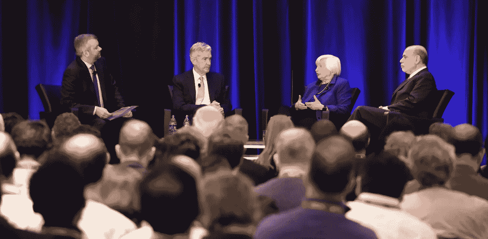
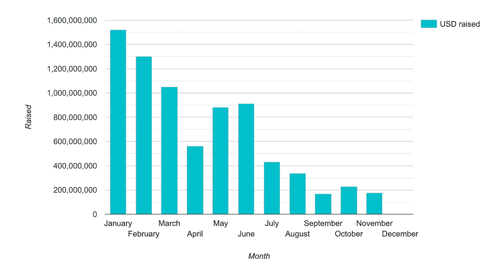
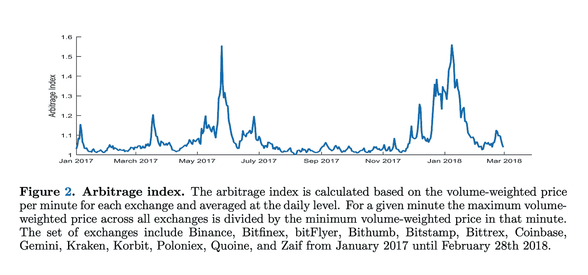

# 世界顶尖经济学家对区块链的看法

> 原文：<https://medium.com/coinmonks/what-the-worlds-leading-economists-think-of-blockchain-70af5dbda0d5?source=collection_archive---------0----------------------->

每年一月，世界顶级经济学家聚集一堂，讨论对这个职业最重要的问题。虽然很容易将努里埃尔·鲁比尼(又名末日博士)好战的敌意误认为是该行业的症状，但会议描绘了一幅截然不同的画面。在这篇文章中，我想概述一下经济学家如何看待区块链——至少是通过 2019 年 AEA 会议的镜头来看。

Panel of Fed Chairpersons at the AEA 2019 meeting. [Source](https://www.aeaweb.org/content/file?id=8657).

美国经济协会(AEA)每年大约在这个时候组织年会，召开他们的旗舰会议。除了最高级别的小组讨论和(或多或少)坐满了听最新研究的经济学家的匿名会议室之外，会议是该行业的一个焦点，因为大多数大学用它来招聘新的教职员工。今年，会议在亚特兰大举行，如果你对完整的日程感兴趣，你可以在这里找到。在会议上发表论文是很有声望的，只有大约 10-15%的论文被接受发表。

> [发现并回顾最佳区块链软件](https://coincodecap.com)

## 经济学家如何看待区块链

对于这篇文章，我专注于论文会议，并省略了，例如，关于*“区块链:神话与现实”*的[小组](https://www.aeaweb.org/conference/2019/preliminary/995?q=eNqrVipOLS7OzM8LqSxIVbKqhnGVrJQMlWp1lBKLi_OTgRwlHaWS1KJcXCArKVwnPzk7OSMxMw8olpJYCZXMzE2FsMoyU8tBBhUVFFwwBUwNlGprAZBcIh9m)或各种优秀的[海报会议](https://www.aeaweb.org/conference/2019/preliminary/1069?q=eNqrVipOLS7OzM8LqSxIVbKqhnGVrJQMlWp1lBKLi_OTgRwlHaWS1KJcXCArKVwnPzk7OSMxMw8olpJYCZXMzE2FsMoyU8tBBhUVFFwwBUwNlGprAZBcIh9m)。

有七场会议或多或少与区块链有直接关系，这已经很多了(但绝不是把区块链放在今年经济学家议程的首位)。这七个环节是:

1.  [技术变革和社会供给](https://www.aeaweb.org/conference/2019/preliminary/621?q=eNqrVipOLS7OzM8LqSxIVbKqhnGVrJQMlWp1lBKLi_OTgRwlHaWS1KJcXCArKVwnPzk7OSMxMw8olpJYCZXMzE2FsMoyU8tBBhUVFFwwBUwNlGprAZBcIh9m)
2.  [区块链经济和加密货币市场](https://www.aeaweb.org/conference/2019/preliminary/621?q=eNqrVipOLS7OzM8LqSxIVbKqhnGVrJQMlWp1lBKLi_OTgRwlHaWS1KJcXCArKVwnPzk7OSMxMw8olpJYCZXMzE2FsMoyU8tBBhUVFFwwBUwNlGprAZBcIh9m)
3.  [区块链和令牌组学](https://www.aeaweb.org/conference/2019/preliminary/712?q=eNqrVipOLS7OzM8LqSxIVbKqhnGVrJQMlWp1lBKLi_OTgRwlHaWS1KJcXCArKVwnPzk7OSMxMw8olpJYCZXMzE2FsMoyU8tBBhUVFFwwBUwNlGprAZBcIh9m)
4.  [区块链和加密货币](https://www.aeaweb.org/conference/2019/preliminary/973?q=eNqrVipOLS7OzM8LqSxIVbKqhnGVrJQMlWp1lBKLi_OTgRwlHaWS1KJcXCArKVwnPzk7OSMxMw8olpJYCZXMzE2FsMoyU8tBBhUVFFwwBUwNlGprAZBcIh9m)
5.  [金融科技经济学](https://www.aeaweb.org/conference/2019/preliminary/908?q=eNqrVipOLS7OzM8LqSxIVbKqhnGVrJQMlWp1lBKLi_OTgRwlHaWS1KJcXCArKVwnPzk7OSMxMw8olpJYCZXMzE2FsMoyU8tBBhUVFFwwBUwNlGprAZBcIh9m)
6.  [比特币时代虚拟货币的数字议程:监管、匿名和网络犯罪](https://www.aeaweb.org/conference/2019/preliminary/825?q=eNqrVipOLS7OzM8LqSxIVbKqhnGVrJQMlWp1lBKLi_OTgRwlHaWS1KJcXCArKVwnPzk7OSMxMw8olpJYCZXMzE2FsMoyU8tBBhUVFFwwBUwNlGprAZBcIh9m)
7.  [加密货币市场](http://Crypto-currency Markets)

我根据他们对区块链经济学的观点对会议进行了分类。会议 1 是一个非常广泛的关于技术变革的会议，由其中一个分协会组织，区块链只出现在其中一篇论文中，所以我不会详细介绍。第 2-4 次会议主要关注区块链的经济影响，而第 5 次会议则有点混杂，第 6 次和第 7 次会议主要关注加密资产的市场。

UCT launched a course on Financial Regulation in Emerging Markets and the Rise of Fintech Companies. Check it out if you are interested in blockchain economics.

## 首次发行硬币的经济学

经济学家对 ico 着迷，尤其是因为有大量关于它们的数据。ico 很有意思，因为有一段时间它们一直在扼杀风投资金。由于金融科技初创公司基本上没有有形资产，而且银行往往只提供有形抵押品的贷款，因此初创公司非常依赖风险投资。但是风险投资行业有其特殊的摩擦，多年来，创业公司一直在抱怨这个行业。

Lyandres 和 Chod (2018) [发展了](https://www.aeaweb.org/conference/2019/preliminary/paper/fkzFZBiY)ico 理论，并指出为什么企业家发行 ico 的一个重要方面*“出售代币，代表对企业未来收入的主张，允许企业家将一些风险转移给多样化的投资者，而不会稀释她的控制权。”不稀释控制权听起来是件好事，但正如我之前[所说](https://app.slidebean.com/p/h9yZAbKHBb/Financial-Innovation-and-Regulatory-Arbitrage)，分离所有权和管理权是不完全契约的一个基本教训。因此，Lyandres 和 Chod 表明*“当[…]企业家和 ICO 投资者之间的信息不对称程度不太大时，ICO 可以主导传统的风险资本(VC)融资。”但这正是症结所在。在我能想到的几乎所有案例中，企业家和 ICO 投资者之间都存在巨大的信息不对称。这就是为什么我认为我们应该监管 ico，保护散户投资者。**

李和曼恩(2018)在他们关于初始硬币发行和平台建设的论文[中研究了 ICO 的另一个积极方面，并认为*“通过在平台运营开始前透明地分发令牌，ICO 克服了平台运营期间由交易对手之间的跨边网络效应引起的后期协调失败。”*因此，李和曼恩认为，ICOs 可以有效地作为一种协调机制来解决双边网络中的战略互补性。他们还认为，ico 解决了用户采用的临界质量问题，这与 ico 可以通过产生关于平台未来需求的信号来提供价值的论点是一致的。](https://papers.ssrn.com/sol3/papers.cfm?abstract_id=3088726])

最后，丛、李和王(2018) [提供了](https://papers.ssrn.com/sol3/papers.cfm?abstract_id=3153860)一个加密货币和代币的动态模型，这些货币和代币在(区块链)平台用户中充当支付手段。采用中的互补性也是他们模型的核心，他们认为*“引入代币可以利用未来的增长，因为预期的技术进步和平台的普及使代币成为一种有吸引力的价值储存手段，从而诱导进一步的采用。”*

我在这篇文献中发现令人惊讶的是缺乏对 ICOs 的负面影响的研究。就像 ico 作为解决协调问题的协调机制一样，它们也在投资者之间引入了战略互补性，就像经典的 Diamond 和 Dybvig (1983) [模型](https://www.jstor.org/stable/pdf/1837095.pdf?casa_token=kgQ6EzaTcmMAAAAA:UWuoGofyW8fJwSSHXD5YbQPzVwzimDWDO4kRAfY5EIIUSSNHFNCGyI3QzVE37QTb2LfbN0vYBC3_n7YURUNnn8DySxs4h_oZKokA9rADAqbdixLpd-bw)中的昂贵清算在储户之间所做的一样。我很想看到一篇更详细地研究这些负外部性的论文，因为它可以帮助我们理解加密泡沫如何在 2018 年初破裂(丛和何在他们即将发表的关于智能合约的 RFS [论文](https://papers.ssrn.com/sol3/papers.cfm?abstract_id=2985764)中提供了一些线索，认为智能合约可以*促成*合谋)。

The ICO market is collapsing. [Source](https://www.icodata.io/stats/2018).

## 区块链经济学

许多论文研究区块链本身的经济学，最常见的是采用区块链的动机。这是著名的“我需要一个区块链吗？”的经济学人版本流程图。

Biais、Bisiere、Bouvard 和 Casamatta 写了一篇关于 forks 的简短但非常及时的[论文](https://www.aeaweb.org/conference/2019/preliminary/paper/NaK6EZ43)(想想 BCH [fork](https://cointelegraph.com/news/bitcoin-cash-hard-fork-battle-who-is-winning-the-hash-war) 精神错乱)。加密货币的支持者经常辩称，硬币的总供应量是固定的，这种算法承诺可以比不可信的央行(原文如此)更好地控制通胀。撇开最大化主义者忽略了蒙代尔在 1961 年已经强调的最优货币区的一些非常基本的教训不谈，他们也忽略了分叉的风险，这是通货膨胀的秘密世界等价物(只是有更多的戏剧和更好的现场直播)。

Biais 等人认为,*“《区块链议定书》[……]是一个协调游戏，有多种均衡。存在分叉的平衡，导致孤立的块和链之间的持续分歧。”*并展示了信息延迟和软件升级如何产生分叉。他们还指出了加密采矿行业的一个大问题:产能过剩:*“我们发现负外部性意味着对计算能力的均衡投资是过剩的。”*

在他们的论文中，Abadi 和 Brunnermeier 研究了中介机构不足以保护分类账完整性的问题。他们认为*“区块链/DLT 也依赖于矿商的竞争，因为矿商的自由进入排除了任何通过特许权价值的动态激励，而特许权价值是传统集中式中介安排所依赖的核心机制。”*他们还强调了区块链的一个关键缺点，即在现实世界中强制执行数字区块链记录，写道*“虽然区块链可以跟踪所有权的转移，但仍然需要正确执行占有权，除非是(法定)加密货币。”*

## 比特币和去中心化经济学

第三大块论文研究比特币的经济激励和对去中心化的追求。

胡伯尔曼、莱什诺和莫勒米(2018) [进行](https://www.aeaweb.org/conference/2019/preliminary/paper/zbeNDbQE) *“比特币支付系统的经济分析”*。他们推导出比特币费用和等待时间的封闭形式公式，并研究它们的性质；比较比特币支付系统(BPS)和由利润最大化公司运营的传统支付系统的经济性；并建议修改协议设计以提高平台的效率。目前还不清楚为什么比特币——或任何加密货币——是一种优越的支付系统。到目前为止，我所看到的唯一真正的论点是，人们不信任央行(央行最常操作国家支付系统)，或者国际支付贵得离谱，这是 Visa、Mastercard 和 SWIFT 的功劳。但就国内支付而言，很难证明比特币优于联邦基金、TARGET2 或 CHAPS。因此，将比特币理解为一种支付系统有助于我们理解它何时是可行的替代方案，何时不是。

在他的[论文](https://www.aeaweb.org/conference/2019/preliminary/paper/ESfbQzYt)中，帕尼奥塔(2018)提出了类似的问题，并且*“描述了网络技术和参与者、用户和矿工如何影响均衡的数量和动态稳定性。”*虽然许多加密支持者声称不关心价格，但该行业的成功关键取决于市场价格，因为许多初创公司不会将他们在 ICOs 中筹集的资金转化为菲亚特( [Vinny Lingham](https://twitter.com/VinnyLingham) 在他的 twitter [feed](https://twitter.com/VinnyLingham/status/967231579855532038) 中就这个话题提出了一些启发性的想法)。事实上，我认为目前市场价格的关键驱动因素之一是企业家之间的战略互补性，他们仍然持有大量的加密股份，因为他们努力将它们转化为菲亚特。

抛开这一点，帕尼奥塔继续说道*“我们发现比特币价格和供给增长率之间的关系不是单调的:相同的价格与不同的利率是一致的。该模型的结果证明了内在的价格安全反馈效应如何放大或缓和需求冲击的价格波动效应。”*重要的是，帕尼奥塔发现*“价格动量和崩溃的合理模式，以及大小随机泡沫可以存在于一般均衡中，并显示破裂的概率如何随着比特币价格的降低而降低。”*

我们在理解加密资产市场的价格动态方面才刚刚起步。但是这些价格动态很重要，不仅对于在泡沫中损失惨重的散户投资者来说，而且对于企业家和最终的监管者来说。最后一组论文走得更远，对这些市场进行了实证研究。鉴于数据的广泛可用性，我相信我们将在不久的将来看到许多对这些市场的事后分析。

## 什么推动了加密资产市场的价格？

许多论文根据经验研究首次发行硬币，通常使用令人印象深刻的数据集。其他人使用资产定价理论的工具研究加密资产的市场。这是一个重要的贡献，因为这些市场充斥着异常现象，理解它们将大大有助于将加密资产作为一种投资工具规范化。只要加密资产市场没有公平的竞争环境，像美国证券交易委员会这样的监管机构就不太可能看好它们。这项研究对任何(仍然)持有加密技术的人来说都是好消息，因为它可以帮助剔除不受欢迎的人，正如约翰·m·格里芬和阿明·沙姆斯关于*的[研究](https://papers.ssrn.com/sol3/papers.cfm?abstract_id=3195066)“比特币真的没有束缚吗？”*显示。

在 AEA 的演讲中，胡、帕洛和拉詹(2018) [发现](https://www.aeaweb.org/conference/2019/preliminary/paper/6QsR2rAQ)*“所有其他货币的二级市场回报与比特币回报强烈相关”*，这对于任何观察每天都是红色或绿色的加密市场的人来说都不会感到惊讶。目前还不太清楚的是——美国经济研究协会的论文中没有一篇真正涉及这一点——为什么市场如此高度相关。

Howell、Niessner 和 Yermack (2018)在他们令人印象深刻的对 453 个 ico 的研究[中得出结论*“当发行人提供自愿披露、可信地致力于项目和信号质量时，流动性和交易量更高。”*这是一个重要的观点，但不会让任何活跃在加密投资领域的人感到惊讶。这篇论文与许多行业和社区方法的不同之处在于研究的严谨性。除了私下流传的轶事，现在我们有了一些可靠的数据。唯一的缺点是 ico 市场已经基本结束，所以这更像是事后分析。](https://www.aeaweb.org/conference/2019/preliminary/paper/EnGi5fK9)

The arbitrage index shown in Schoar and Makarov (2018). [Source](https://www.aeaweb.org/conference/2019/preliminary/paper/82zRNKsA).

最后，Schoar 和 Makarov (2018) [记录了](https://www.aeaweb.org/conference/2019/preliminary/paper/82zRNKsA) *“在交易所之间，加密货币价格相对于法定货币的巨大、经常性套利机会，通常会持续数周。”*然后*“国家之间的价格差异要比国家内部大得多，而加密货币之间的价格差异要小得多。”*同样，这是一个你可以在 telegram 或 discord 频道中读到很多的现象，但严格记录加密市场中的套利机会并研究它们来自哪里是很重要的。这篇论文的结论是，资本管制是持续套利机会背后可能的摩擦，这很有趣，因为它告诉我们一些关于使用加密资产规避现有监管的事情。

## 结论

看到经济学家能在多大程度上增强我们对秘密市场的理解是令人惊讶的。当然，密码最大化主义者不会总是喜欢他们阅读的东西，并把其中一些工作视为*菲亚特经济学*，但从长远来看，经济基本面总是会胜出。让我们看看明年圣地亚哥的 AEA 是否会有类似的区块链研究的强劲表现，或者到那时炒作是否会基本结束。**

> **[直接在您的收件箱中获得最佳软件交易](https://coincodecap.com/?utm_source=coinmonks)**

********