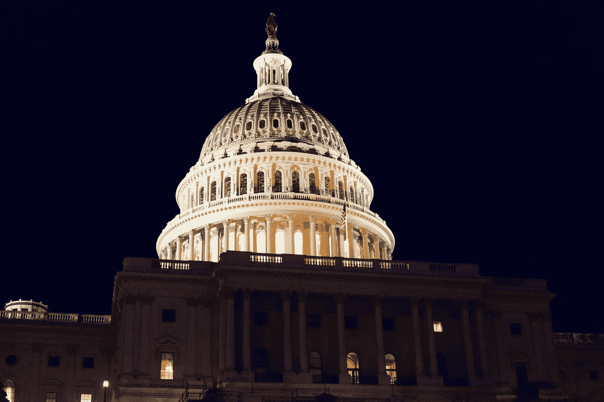
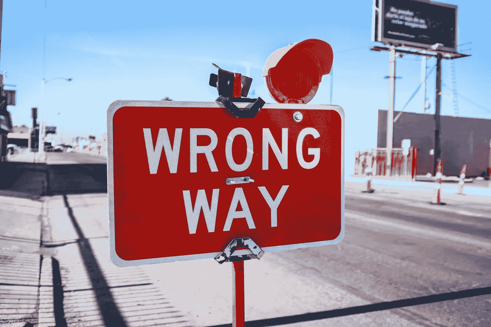

# 他们没有告诉你的关于瑞波的事(XRP)

> 原文：<https://medium.com/coinmonks/what-they-are-not-telling-you-about-ripple-xrp-9d38e016fb54?source=collection_archive---------0----------------------->

## 美国证券交易委员会拒绝遵守规则，可能会被新法案烧伤

Senate Addresses Crypto — Image sourced from [Unsplash](https://unsplash.com/)

# 证券交易委员会诉 XRP 案的背景

你们中的许多人，特别是那些生活在美国的人，正在密切关注最近美国证券交易委员会诉 XRP 案中的诉讼。这在一定程度上是因为美国从未出现过如此大规模的采用加密技术的案例，同时也是为了不要错过 SEC 获得的许多“通行证”。

正如我在之前的文章“XRP 将粉碎加密战争的 5 个理由”中所谈到的，负责对此案做出裁决的法官 Sarah Netburn 法官面临着一个具有长期和深远影响的巨大决定。

我想花点时间强调一下最近的一些案例活动，并尝试提供一个可能的解释，说明在 SEC 标准操作的幕后可能会发生什么。

为了做到这一点，让我先把你带回到四月，Ripple 议程上最重要的事情是为公平通知辩护。对于那些可能不熟悉公平通知辩护的人来说，它本质上是一种辩护，声称被起诉的一方没有正式的法律通知，他们所做的是错误的。

如果 Ripple 知道他们在出售证券，他们就需要在 SEC 注册。这个过程通常是一个漫长的过程，并且总是包括这四个项目。

*   对财产和商业目的的描述
*   对所提供证券的描述
*   关于领导力的信息
*   所有经认证的财务报表

因为 Ripple 没有将 XRP 注册为证券交易委员会的证券，他们正在追查 Ripple 的首席执行官**布拉德·加林豪斯**，认为他应对**出售非法证券**负责。

Ripple 的杰出律师团队打算全力以赴打这场官司，并已开始对 SEC 提起反诉，以追回正在进行的诉讼造成的损失。Ripple 解决或赢得此案的最大机会在于他们的公平通知辩护。Ripple 知道 SEC 必须证明 XRP 是安全的。

的确，即使在今天，SEC 委员们也无法就加密货币是否应该被视为非法证券、合法证券或者根本不是证券达成一致。根据美国证券交易委员会确定证券分类的古老的豪威模型，涟漪标志 XRP 符合标准，或者至少有点无知和无知。

事实是，加密不仅仅是一种安全措施。让我们在豪威测试的上下文中分解它。

A Closer Look — Image sourced from [Unsplash](https://unsplash.com/)

# 什么是豪威测试？

> “豪威 **测试**是由最高法院创立的一项测试，用于确定某些交易是否符合“投资合同”的条件。如果是这样的话，那么根据 1933 年的证券法和 1934 年的证券交易法，这些交易被认为是证券，因此需要遵守一定的披露和登记要求

豪威测试由 4 个问题组成。如果所有 4 个问题的答案都为“真”,则该交易被称为投资合同，并因此受到相应的管辖和征税。

## **豪威测试-问题 1**

> 是钱的投资吗？

**我的回答**

是的。许多 XRP 的早期采用者最初购买它的意图是，在以后的某个时间点，他们将从这项投资中获得收益。他们有一种远视思维，认为随着网络的建成和 XRP 在支付领域解决更多问题，代币的价值将会增加。散户投资者了解快速、低成本和高效支付方式的增值潜力。

那么…问题一— **正确**

## **豪威测试-问题 2**

> 投资有利润预期吗？

## **我的回答**

是的。许多早期投资者买入代币，将其加入高度投机的数字资产组合，期望在某个时候看到投资回报。随着时间的推移和网络的建立，个人和机构开始购买 XRP，以使用 Ripple 团队设计的方式，作为支付和结算的手段。快进到今天，网络上的大部分交易量来自使用 RippleNet 的企业和相互汇款的个人。

你可以把它想象成人们在互联网出现的时候购买域名。有人明白这一点。com 域名可能有一天会大受欢迎，因为它们在一个尚未完全开发的网络上为用户提供了价值。这些投资者没有办法知道哪些名字有价值，或者是否有价值。com 将是最受欢迎的域名扩展之一。同样，在加密领域，我们有许多个人购买大量不同的硬币，然后在没有任何盈利承诺的情况下出售。在这种情况下，我会将这些交易归类为风险投资合同。

话虽如此，但现在的现实是，许多 XRP 持有者都在积极利用货币提供的效用。确实不可能确定一个人是否投机性地持有 XRP，或者他们在某个时候计划利用它的效用。

所以…问题 2 — **错**

## 豪威测试-问题 3

> 是投资到一个普通的企业？

**我的回答**

在我看来，这是四个问题中最微不足道的一个，因为法院对它有不同的解释。本质上，它是在问资金是否被分配到一个中央资金池，并期望每个人都能获利。

这是 XRP 真正反击的地方。

根据美国证券交易委员会的说法，散户投资者与一家普通企业签订了投资合同，期望该企业的行为会给其投资者带来收益或损失。他们支持他们的主张，指出大量的 XRP 目前正被用来资助涟漪的运作。

这是律师约翰·迪顿打算扭转局面的地方。他说，

> “XRP 的开源特性允许世界各地的用户使用令牌来支付商品和服务，而无需与 Ripple 建立任何联系或依赖它。根据 Cryptwerk 的数据，目前有超过 1300 家公司接受 XRP 支付，涵盖从商业服务到旅游和旅行的各个行业。

我同意 XRP 有巨大的效用和力量来彻底改变支付和结算行业。我相信它在 DEFI 和 NFT 领域也有未来。现在低估 XRP 代币提供的效用还为时过早，我认为过早给 XRP 和类似证券贴上标签是一种暴行。

所以…问题 3 — **假**

## 豪威测试-问题 4

> 利润是来自于一个推广者的努力还是第三方的努力？

**我的回答**

这个问题似乎与前一个问题相似，但不同之处在于资产的原始融资方式和销售方式。

美国证券交易委员会声称，布拉德·加林豪斯和 Ripple 的其他成员在区块链竣工前出售代币，这样做违反了 1934 年的证券交易法。

虽然众所周知，Ripple 的创始人对 XRP 的创立负有责任，但他们声称，两者彼此独立运作，因此 XRP 的持有人在 Ripple 公司中没有所有权或股权。此外，他们强调了与 XRP 提供的效用相关的价值，他们指出这不是它与传统证券共有的特征。

Ripple 在 XRP 和瑞普明显分开之前就向公众出售了这两家公司。

所以…问题 4 — **正确**

# 豪威试验裁决

Cryptos Are Not Securities — Image sourced from [Unsplash](https://unsplash.com/)

正如你可以清楚地看到，使用豪威测试来确定加密货币的地位是徒劳的。它没有完全考虑到所有使数字货币资产与任何其他先前标记的证券明显不同的因素。

我认为，XRP 最大的问题是，自加密货币诞生以来，监管缺乏透明度。SEC 官员发表了许多声明，承认在加密货币的地位上没有达成共识。令人欣慰的是，Ripple 成功地从美国证券交易委员会公司金融部前主任威廉·辛曼(William Hinman)那里获得了处置权。

欣曼先生在 2018 年申报了以太坊和比特币证券。这次处置的文字记录还没有向公众公开，但是将来可能会有一份完整的简报。

这次取证对 Ripple 来说是一次奇迹般的胜利。他们希望能够向法院说明监管的明确性到底有多混乱。Ripple 还要求美国证券交易委员会提供文件，但他们拒绝放弃。美国证券交易委员会不断推迟这一案件，使他们处于违反“诚信”的危险之中。

美国证券交易委员会必须小心，不要越界。最近，参议员们也加入了这场讨论，他们甚至表示，美国证券交易委员会(SEC)在围绕加密货币建立监管方面可能没有一席之地。

政府害怕加密货币，这一点你可以在伊丽莎白·沃伦参议员的信中清楚地看到。

> 具体而言，《多德-弗兰克华尔街改革和消费者保护法》第 120 条赋予 FSOC“通过向主要金融监管机构提出建议，对金融活动进行更严格监管”的能力，当“此类活动或实践的行为、范围、性质、规模、集中程度或相互关联性可能造成或增加在银行控股公司和非银行金融公司、美国金融市场或低收入、少数族裔或服务水平低下的社区中传播的重大流动性、信贷或其他问题的风险时。”

美国证券交易委员会(SEC)可能会得到如何从更高层面着手的指导。也许有些建议是拖延这个案子，进行长期艰苦的斗争。也许他们被告知解决，从而暂时搁置这个问题。谁知道呢？

有一件事是肯定的，那就是有些可疑的事情正在发生！

# 他们没告诉你什么？

My Conspiracy Theory — Image sourced from [Unsplash](https://unsplash.com/)

这下一部分纯属猜测，好好玩。我对这个话题的想法不应被视为财务建议。

为了充分理解我的假设，我鼓励你阅读我的文章，“[山姆大叔的性感 CBDC](/geekculture/sexy-cbdcs-for-uncle-sam-97d8c94d0814)”，在这篇文章中，我谈到了美国政府如何已经在制定自己的中央银行数字货币的细节。

我认为，我们比想象中更接近法定货币 CBDC。政府可能正在与美国证券交易委员会合作，就此案达成裁决，这将导致 XRP 被贴上非法证券的标签。这将为 SEC 追踪几乎所有加密货币开创先例。

这种对“危险”加密货币的政治迫害将伴随着美国 CBDC 的发行，他们将出来说，支付商品和服务的唯一方式是通过他们的货币或指定的稳定硬币。他们会为自己的决定辩护，称这是国家安全问题。

这种货币将由目前统治世界的腐败金融机构集中管理。他们将结束争取自由银行和金融自由的斗争。

如果说我在这个星球上的 24 年学到了什么，那就是政府总是会拿走不属于他们的东西，我们说什么或做什么都不能阻止他们做任何事情。

# 地平线上的希望

Hope for New Crypto Regulation — Image sourced from [Unsplash](https://unsplash.com/photos/55NtMvzOsFQ)

今天提出了一项法案，概述了证券、数字证券和数字资产之间的区别。该法案简单地以两种方式之一来定义加密。

1.  一个**数字资产证券**为持有者提供股权、收益权和投票权。
2.  完成后发行的**数字资产**，不用于为运营提供资金

当然，要让这项法案获得通过，还有很多工作要做。如果通过成为法律，对加密的监管将不是由 SEC 而是由 CTC 来处理。

如果该法律获得通过，它可能会追溯适用于证券交易委员会诉 XRP 案，最终关闭所有的论点。

*一如既往，我希望你喜欢这篇文章，感谢你的阅读！请鼓掌并在评论中回应。我很乐意和你合作。请留意这个案件之后的更多文章。*

如果你喜欢这篇文章，并且想阅读我的其他故事，请点击下面的链接。

[区块链域翻转](/coinmonks/blockchain-domain-flipping-b3a060f927e2)

[重大事件为大规模采用加密技术铺平了道路](/coinmonks/blockchain-domain-flipping-b3a060f927e2)

[山姆大叔的性感 CBDC](/geekculture/sexy-cbdcs-for-uncle-sam-97d8c94d0814)

[5 XRP 将粉碎密码战的原因](/geekculture/5-reasons-why-xrp-will-crush-the-crypto-war-67e75c7a60d2)

## 也阅读

 [## 加密交易机器人——最佳免费加密交易机器人

### 2021 年币安、比特币基地、库币和其他密码交易所的最佳密码交易机器人。四进制，位间隙…

medium.com](/coinmonks/crypto-trading-bot-c2ffce8acb2a)  [## 2021 年 9 大最佳加密借贷平台

### 当谈到加密货币贷款时，大量因素等同于良好的收入状况。此外，借款的一部分…

blog.coincodecap.com](https://blog.coincodecap.com/crypto-lending)