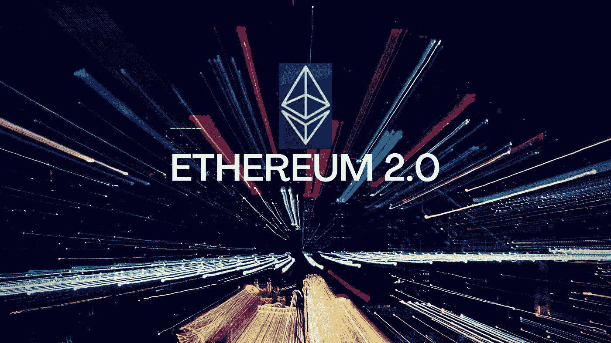
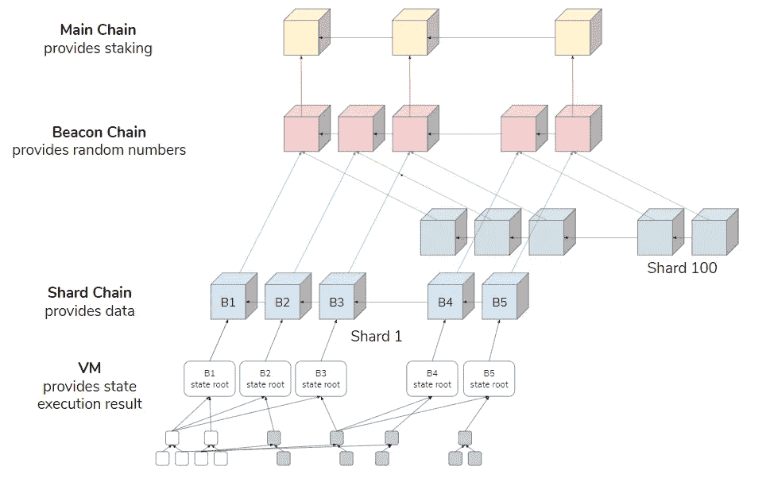

# 以太坊 2.0 有什么值得期待的

> 原文：<https://medium.com/coinmonks/what-to-expect-in-ethereum-2-0-779dfe970642?source=collection_archive---------2----------------------->

**简介**

以太坊是市值排名第二的加密货币平台。这是一个基于区块链的开源分散软件平台，提供了许多有吸引力的功能，如智能合同的开发和部署。比特币不支持的去中心化应用(Dapps)等。它也是许多不同加密货币的基础平台，如 Compound、MakerDao、金恩等。

像任何其他技术一样，以太坊也在开发和计划进行一系列网络升级，以改进当前以太坊网络的特性、功能和性能。

以太坊 2.0 也被称为 Eth2 或“宁静”，是以太坊区块链的下一个主要网络升级。这一升级将分多个阶段推出:第 0 阶段、第 1 阶段和第 2 阶段，第 0 阶段计划于 2020 年推出。Rest 阶段将在未来几年发布。

注意，网络升级不会导致以太坊 1.0 链的数据历史、交易记录等发生任何变化。以太坊 1.0 链有望成为以太坊 2.0 上的第一个碎片链。在此之前，以太坊 1.0 链将继续按照现在运行的方式运行。但预计会进行一定的改进，将其作为以太坊 2.0 碎片嵌入。

推出以太坊 2.0 背后的主要口号是增强以太坊网络的**安全性、可伸缩性、简单性和吞吐量**。

**设计目标**

以太坊研究员 Danny Ryan 提到了以太坊 2.0 的 5 个重要设计目标:

**去中心化:**普通人如果只有一台台式机或一台笔记本电脑拥有 O(C)资源，就能够处理/验证 O(1)碎片。

**弹性:**网络将足够灵活，能够从任何主要网络分区中恢复，或者在大部分节点离线的情况下恢复。

**安全性:**验证者在总体上和单位时间内的大量参与不应该影响网络的整体安全性。

**简单性:**网络复杂性将会降低，如果需要，甚至会以效率损失为代价。

**寿命:**选择所有组件，使得它们或者是量子安全的，或者可以容易地替换为量子安全的对应物。

**以太坊 2.0 路线图**

Ethereum 2.0 overall architecture

萧原图[来源](https://docs.google.com/presentation/d/1G5UZdEL71XAkU5B2v-TC3lmGaRIu2P6QSeF8m3wg6MU/edit#slide=id.g3c326bb661_0_58)

PoW 主链就是目前正在运行的以太坊 Mainnet。以太坊 2.0 的不同开发阶段如下:

**阶段 0——信标链**

信标链的开发目前正在进行中，计划于 2020 年发射。信标链将为自己和所有碎片链管理 Casper Proof 协议。这是升级过程中交付的第一个组件。

在此阶段，Eth1 链将照常工作。阶段 0 完成后，将有两条活跃的以太坊链:Eth1 链(当前，PoW 主链)和 Eth2 链(新信标链)。

**阶段 1 —碎片链**

碎片链将在第 1 阶段实现。碎片链将允许并行事务吞吐量，由于这一特性，它们被视为网络可伸缩性的解决方案。在第一阶段，将部署 64 个碎片链。

第一阶段完成后，Eth1 和 Eth2 链将并行运行。

**第二阶段——国家执行**

第二阶段将整合前几个阶段实施的所有设计变更。将在阶段 1 中实现的碎片链概念将遵循该阶段中的结构化链状态，智能契约的概念将在这里重新引入。每个碎片将管理一个基于 eWASM 的虚拟机。这个 VM 层将负责合同和事务的执行。

资源: [ethhub](https://docs.ethhub.io/ethereum-roadmap/ethereum-2.0/eth-2.0-phases/#introduction)

> [*在您的收件箱中直接获得最佳软件交易*](https://coincodecap.com/?utm_source=coinmonks)

