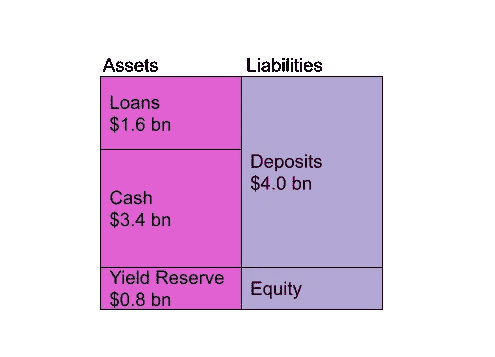

# 投资 Anchor Protocol 之前需要了解什么

> 原文：<https://medium.com/coinmonks/what-to-know-before-you-invest-in-anchor-ad945a9806fe?source=collection_archive---------2----------------------->

*Source: Unsplash*

## 主播能持续提供 20%的 APY 吗？

Anchor 是建立在 Terra 区块链生态系统中的一个协议，它使用 Terra stablecoins 提供借贷服务。在撰写本文时，该项目向贷款人提供了近 20%的 APY，甚至向借款人提供了回报。我们用传统银行做类比，来理解这种协议是如何创造出如此不寻常的收益率的。

锚协议建立在 Terra [0]上。贷款抵押品目前的收益率为 5%-10%，其中一个获得批准的抵押品令牌是 Luna 令牌，参见[1]。我们现在从银行的角度来解释该协议，对于银行，股票对应于 ANC 令牌[4]。

# **比喻**

**Figure 1: Balance Sheet.** The liability side contains deposits. Some of the deposits are used to extend loans, shown here at $1.6 billion. The remainder is depicted as cash on the asset side of the balance sheet. There is also a yield reserve which makes up the book value of equity shown on the liability side.

“锚定银行”提供贷款和存款，是一家上市公司。

*图 1* 帮助你快速掌握银行事务，尤其是如果你熟悉资产负债表的话。我们可以看到，在资产方面，银行持有贷款组合、现金和收益准备金。负债方只包括存款。账面权益价值是资产和负债的差额。

作为客户，您可以

*   👵🏻…将您的存款存入银行并赚取利息。银行将存款贷给借款人
*   👷…如果你向银行提供一种经批准的抵押品作为担保，就可以获得贷款(以防你无力偿还贷款)。抵押品的价值必须是贷款额的两倍

银行向借款人收取高额费用👷:22%的年化利率。没有多少贷款人会支付如此高的贷款利率，并放弃两倍于抵押品的收益率。因此，银行通过向贷款人支付银行股份来降低实际支付的利率——比 22%的费用多的股份，因此借款人实际上从贷款中获利。

锚为贷款提供资金👷有存款👵🏻。该协议可以支付储户👵🏻借款人的高收益👷抵押品收益率和他们支付的贷款利率。我们也有一些备用费用分配给我们“银行”的股东，并维持收益率储备。

## 股价估值

我们已经看到，权益的账面价值与收益准备金相对应。然而，银行通常以高于账面价值的价格交易。那么我们如何对我们的“锚定银行”的股价进行估值呢？股权估价的一种常见方法是贴现现金流法，例如参见[【7】](https://en.wikipedia.org/wiki/Valuation_using_discounted_cash_flows)。在这种方法中，股票价格的价值是每股已发行股票的未来银行收益的现值。未来的银行收益由抵押品收益和贷款利率的收入组成，减去银行支付的存款利率。

## 关键点

自然，为借款人提供正回报👷我们需要能够支付比借款人价值更高的股票👷支付贷款。所有的收入都来自借款人👷贷款支付的利息及其抵押品的收益率。

*   如果资产负债表是静态的，即资产负债表上的金额没有变化，以贴现的未来现金流衡量的权益价值相当于贷款金额乘以借款利率加上抵押品收益率。我们必须从中减去支付给协议或储户的金额。因此，由于所有的收入都来自当前的借款人👷和他们的抵押品，很容易看出我们不能支付借款人任何东西。
*   只有当我们预期资产负债表增长时，贴现现金流减去负债的价值才能超过借款人今天支付的金额

在本文的附录中，我们详细介绍了锚定协议的数字，这些数字显示了不同的参与者如何获得报酬，以及 20%的 APY 目前如何实现。

## **长期观点**

从长期来看，我们应该预计利率将回到“市场利率”。基本原理如下。

1.  高附带收益(5%-10%)源于 Luna token 收益，其中一半可能是因为空投，所以一旦空投干了，很大一部分收益就会消失。
2.  锚令牌赚取协议费用，因此其值应该是“未来协议费用的现值”/“令牌供应”。每一美元贷款的未来协议费用可能超过今天的贷款利率，因为还有清算费用、存款人费用和资产负债表的增长。因此，如果我们用锚定令牌补贴借款人，如果协议量仍有望增长，借款人可以长期获利。如果协议量减少，每 1 美元贷款的未来收益将低于贷款费用，借款人不能再获得未来收益的补贴。政府必须将利率调整回“市场借贷利率”(8%？)把借款人留在系统里。存款人将少于或等于资产方支付的金额(因此少于估计的 8%的市场利率)。

1920 photo of [Charles Ponzi](https://en.wikipedia.org/wiki/Charles_Ponzi), *Source: Wikipedia*

## 有待时间去证明

今年 8 月，该体系向储户(贷款人)支付了 20%，向借款人支付了 24%。截至去年 12 月，该体系向借款人支付 1%的利息，向储户支付约 20%的利息。回想一下，借款人存入一个高收益的代币，因此借款人放弃了 5%-10%的收益，从而有效地支付了贷款。

# 结论

为了让 Anchor 保持如此高的收益率，我们需要代币的价值超过总资产减去负债。只要代币持有者预期未来收益会成倍增长，这一目标就能实现。不仅如此，还必须有足够的代币可以分发，这样才能支付给借款人。如果没有，Anchor 可以决定发行新股，如果代币持有人预计资产负债表的增长将大于所造成的稀释，借款人仍然可以得到补贴。

# 参考

[0][https://www.terra.money/](https://www.terra.money/)

[1]https://www.stakingrewards.com/earn/terra

[2]【https://app.anchorprotocol.com/ ->存款总额/借款总额

[3][https://app.anchorprotocol.com/borrow/](https://app.anchorprotocol.com/borrow/)

[https://docs.anchorprotocol.com/protocol/anchor-token-anc](https://docs.anchorprotocol.com/protocol/anchor-token-anc)

[https://app.anchorprotocol.com/earn](https://app.anchorprotocol.com/earn)

[6][https://docs . anchor protocol . com/protocol/money-market/deposit-rate-substitution #借方-ANC-激励](https://docs.anchorprotocol.com/protocol/money-market/deposit-rate-subsidization#borrower-anc-incentives)

[7][https://en . Wikipedia . org/wiki/evaluation _ using _ discounted _ cash _ flow](https://en.wikipedia.org/wiki/Valuation_using_discounted_cash_flows)。

# 附录:贷款人如何收取约 20%的详细数字计算？

我在八月份收集了下面的数字。有趣的是，随着时间的推移，这种情况发生了变化。

1.  贷款人赚取由借款人支付的高额费用

*   借款人支付 UST 贷款金额 22%的贷款费用
*   借款人用价值 2 倍的 Luna 作为贷款抵押。Luna 有 5%-10%的“红利”[1]——来自 LUNA 协议，这可能还包括空投
*   假设 Luna 的回报率为 8%，UST 贷款的借款人支付(贷方收到)的总费用为:22%+2*8% = 38%
*   目前，持有的 UST 债券是借入的 UST 债券的两倍，见[2]，因此 38%的债券被两倍持有的 UST 债券分割，因此贷方得到大约 38%/2 = 19%。19%大约相当于存款人获得的利率，见[5]

2)为什么借款人要支付 22%的贷款费用和 8%的放弃月神奖励？[3]

*   该协议有自己的令牌，ANC 令牌[4]。代币赚取协议费和清算罚款
*   锚协议将 ANC 令牌[6]分发给它们的借用者
*   在我第一次评估时(8 月 15 日), 1 UST 贷款的利率是 46% APY。我们从中减去 22%和 8%的放弃回报，因此借款人获得了 24%的回报，放弃了 8%的回报。
*   然而，截至 2021 年 12 月，借款人支付约 18.8%，获得 19.9%。因此，他们支付约 1%的净利率，但放弃了回报。

> 加入 Coinmonks [电报频道](https://t.me/coincodecap)和 [Youtube 频道](https://www.youtube.com/c/coinmonks/videos)了解加密交易和投资

## 也阅读

 [## 杠杆代币[多头代币]终极指南

### 杠杆化令牌是具有杠杆化风险敞口的 ERC20 令牌，不考虑保证金、要求、管理…

medium.com](/coinmonks/leveraged-token-3f5257808b22)  [## 最佳加密交易所| 2021 年十大加密货币交易所

### 加密货币交易所的加密交易需要了解市场，这可以帮助你获得利润。之前…

blog.coincodecap.com](https://blog.coincodecap.com/crypto-exchange)  [## 2021 年最佳加密交换平台| CoinCodeCap

### 如果我们看看今天的场景，许多加密货币交换平台提供了广泛的功能和深度…

blog.coincodecap.com](https://blog.coincodecap.com/best-swap-platforms)  [## 2021 年最佳加密借贷平台| 6 大比特币借贷平台

### 获得比特币和其他加密货币的最佳贷款利率

medium.com](/coinmonks/top-5-crypto-lending-platforms-in-2020-that-you-need-to-know-a1b675cec3fa)  [## 2021 年 6 大最佳硬件钱包|顶级加密硬件钱包[更新]

### 最好的加密货币硬件钱包是绝对必要的。我们将在 NGRAVE、Ledger Nano X 和…

medium.com](/coinmonks/the-best-cryptocurrency-hardware-wallets-of-2020-e28b1c124069)  [## 2021 年最佳免费加密交易机器人

### 2021 年币安、比特币基地、库币和其他密码交易所的最佳密码交易机器人。四进制，位间隙…

medium.com](/coinmonks/crypto-trading-bot-c2ffce8acb2a)  [## 最佳 4 个加密交易信号电报通道

### 这是乏味的找到正确的加密交易信号提供商。因此，在本文中，我们将讨论最好的…

medium.com](/coinmonks/best-crypto-signals-telegram-5785cdbc4b2b)