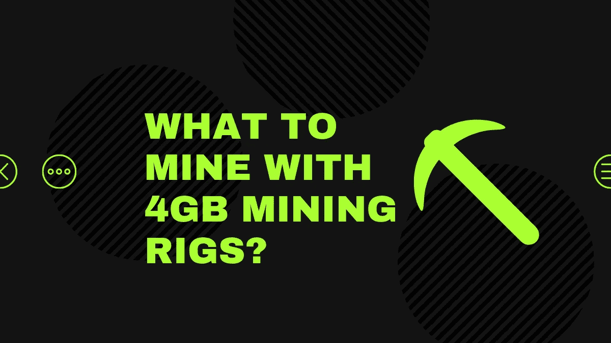
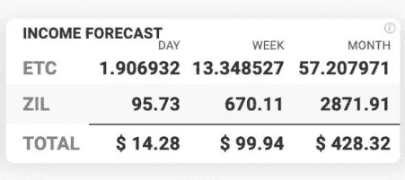

# 用 4GB 的采矿钻机开采什么？

> 原文：<https://medium.com/coinmonks/what-to-mine-with-4gb-mining-rigs-a90e3d0301d4?source=collection_archive---------2----------------------->

对于矿商来说，这是令人疲惫的一年，今年早些时候，比特币的回报减半，独立矿商最喜欢的以太坊终于推出了其[信标链](https://blog.coincodecap.com/ethereum-beacon-chain)，使其踏上了通往赌注证明(PoS)以太坊 2.0 的乐土。

这是老派矿工的问题。目前市场上大约有 150 万到 300 万个 4GB GPUs 在开采 ETH，这些 GPU 很快就会在以太坊链上失去效用，可能会留下数百万个堆积在仓库中的钻机积灰。

但是如果有其他方法可以利用 4GB 的采矿设备呢？

12 月 24 日，以太坊的 DAG 文件将达到 4GB 标记，导致区块链的 4GB 采矿钻机以降低的效率采矿。

2021 年 3 月后，他们的生产力将显著下降，使他们不适合 ETH 采矿。瑞士联邦理工学院的矿工不用关掉钻机，他们可以重新利用它们来开采新的硬币。此外，他们可以将散列能力卖给代理服务，进行双重挖掘，或者转向通用计算。

以太坊是最有利可图的硬币之一。与[比特币](https://blog.coincodecap.com/a-candid-explanation-of-bitcoin)不同，ETH 矿工可以通过 GPU 轻松获得利润。不幸的是，网络呈指数级增长，导致低内存 GPU 过时。此外，以太坊已经开始了从工作证明(PoW)到利益证明(T7)(PoS)[区块链](https://blog.coincodecap.com/what-is-blockchain-a-simple-guide-for-dummies)的转变。

## 以太坊、DAG 和对 GPU 能力不断增长的需求

这都是关于一种分布式分类帐的扩展，有向无环图(DAG)。使用 Ethash 散列函数在 PoW 区块链的根中烘焙 DAG。值得注意的是，该功能抵制使用 ASICs 进行挖掘，因此，在 ETH 供电的网络上盛行 GPU。

DAG 是一个包含数据的文件，有助于发现新数据块和验证协议上的事务。然而，随着协议的发展，DAG 也在发展。据估计，每 30，000 个区块或 100 个采矿小时后，就会出现增长。

每个 DAG 增量称为一个时期。值得注意的是，该文件必须加载到 GPU 的内存中，以促进与区块链的主动交互。除了采矿，采矿钻机处理文件的最佳方式可以提高或降低其采矿速度。

因此，当 DAG 文件大小超过 GPU 装备的内存容量时，装备要么变得缓慢，要么无法挖掘 ETH。在以太坊上，数据集预计将达到 4GB，数据块为 11，520，000。

预计这将在 2020 年 12 月 23 日或 24 日发生。当这种情况发生时，它将逐步淘汰以太坊区块链的 4GB 采矿设备。4GB GPU 卡的例子有 AMD 的 RX470/480/560/580 和 Nvidia 的 GTX1650/1650 Super 和 GTX1050Ti。

由于这些采矿设备占以太坊上所有采矿设备的 26%，它可能会看到大多数这些设备堆在后院。幸运的是，4GB 的采矿设备仍然有希望在以太坊平台上使用。

## 如何在以太坊上使用 4GB 的采矿钻机？

通过从 Windows 切换到基于 Linux 的操作系统，您可以继续最大化您的 4GB 采矿钻机。Windows 操作系统的问题是，它将钻机上第一个 GPU (GPU0)的多达 600MB 分配给虚拟 RAM (VRAM)。

Linux 操作系统只为 VRAM 留出 120MB，为 DAG 文件留出更多空间。请注意，只有 DAG 文件适合 GPU 时，这才会起作用。

不过更靠谱的做法是把 GPU0 卡换成内存更大的比如 6/8GB。这为加载 DAG 文件和利用其他 4GB 卡进行处理提供了足够的空间。

幸运的是，即使 4GB GPUs 在 12 月 24 日过时，矿工仍然可以再使用三个月，但效率会降低。

例如，在 12 月 29 日，这种卡在 Linux 和 Windows 上的运行效率预计分别为 55%和 35%。不幸的是，在 2021 年 3 月 8 日，Linux 和 Windows 操作系统的速度将分别下降到 22%和 14%。

尽管如此，考虑到以太坊正在缓慢但肯定地转向 PoS(以太坊 2.0)挖掘机制，这些都是临时的解决方案。然而，当它发生时，我们仍然可以重新利用 4GB 的采矿钻机。

## 用 4G 矿用钻机还能开采什么？

当 ETH 最终拒绝 4GB 采矿钻机时，是时候寻找替代硬币了。与 ASICs 相比，由于 GPU 的通用性质，钻机可以很容易地切换到其他硬币。

## 光束(光束)

BEAM 是一种基于 Mimblewimble 的加密货币，由于其可行性，开发人员非常活跃。硬币不使用 DAG 文件，因为它使用 BeamHashIII 哈希算法。不幸的是，要充分利用这个平台，您必须优化 miner。

## 以太坊经典(等)

尽管 ETC 是 ETH 的一个分支，但它的 DAG 文件大小仍然略高于 2.5GB，预计在 2022 年 8 月达到 3GB，在 2025 年 9 月达到 4GB。这使得使用 4GB GPU 钻机的矿工有大约五年的时间继续在 ETC 区块链舒适地采矿。另一方面，ETC 矿业的利润比 ETH 矿业低 2-3 倍。

## 拉文科恩

RavenCoin 网络使用 Kawpow 算法，该算法与 GPU 卡兼容。RVN 目前是排名前 150 的加密货币之一，并在币安等知名加密交易平台上市。然而，它在 GPU 上很重，也相当耗电。

## 齐利卡(ZIL)

ZIL 使用 Ethash 哈希算法。目前，它的 DAG 大小为 1.24GB，非常适合使用 4GB 的采矿设备进行开采。

硬币的 DAG 预计将分别在 2025 年 12 月、2032 年 8 月和 2039 年 3 月达到 2GB、3GB 和 4GB。虽然这给了 4GB 钻机矿工更多的时间来使用他们被 ETH 拒绝的钻机，但硬币并没有提供令人垂涎的利润。

## 埃齐尔

首先， [EZIL](https://blog.coincodecap.com/go/ezil) 不是硬币。相反，这是一个采矿方法，最大限度地挖掘 ETC 和 ZIL 硬币。这种方法的工作原理是将你的 4GB 采矿钻机散列功率连接到一个池，该池自动在两个硬币之间切换采矿。

相比在 ZIL 和 ETH 之间切换，ETC-ZIL 组合带来的回报更多。例如，预计利润可以在 30 天内达到大约 428 美元，这是 4GB GPUs 中利润最高的挖掘方案。

更多使用 ETH-rejected 4GB 采矿钻机的方法除了直接开采其他硬币，钻机还可以有多种用途。

## 佣金

不要使用钻机直接开采 ZIL、BEAM 或任何其他基于 GPU 的数字货币，你可以与经纪服务连接，如 [NiceHash](https://blog.coincodecap.com/go/nicehash) 和 geBrokeraget。

请注意，对于这种类型的操作，您只需为自己贡献的哈希能力付费。然后，经纪服务将这种能力出售给其他用户，让他们根据自己的喜好开采不同的硬币。

## 通用计算

通用计算将您的 4GB 采矿设备从加密采矿转移到其他处理密集型任务。例如，你可以租用你的钻机的哈希功能来渲染像假人这样的网络，像 Vectordash 这样的远程游戏平台，或者像 VastaAI 这样的人工智能平台。

## 双重开采

双重开采包括使用同一台钻机同时开采两枚硬币。它的优点是可以用在你选择的任意两个硬币上，前提是支持 GPU 挖矿。

比如你可以挖掘 ETC 和 Verge (XVG)。在这样的设置中，您可以将 4GB 的采矿设备连接到 Nanopool 来采矿等，同时连接到 ZPool 来采矿 XVG。

## 结论

4GB 的采矿设备在以太坊区块链还有 60 天的时间。当这段时间过去后，矿工仍然可以改用 BEAM、RVN 和其他抗 ASIC 的加密货币。然而，在此之前，你需要检查每枚硬币的利润率。

一个显而易见的选择是采用双重或类似于 T1 的采矿方法来提高你的投资回报。请注意， [EZIL](https://blog.coincodecap.com/go/ezil) 方法与双重挖掘略有不同，因为有了 [EZIL](https://blog.coincodecap.com/go/ezil) ，一个池会自动在两种加密货币之间切换。在双重开采的情况下，钻机不断地连接到两个不同的池。

在直接采矿不可行的情况下，你仍然可以将你的钻机能力出售给经纪服务，如 [NiceHash](https://blog.coincodecap.com/go/nicehash) 或转向人工智能、渲染、游戏和其他通用计算服务。不管走什么路线，4GB 的矿用钻机在未来还是有一席之地的。

## 另外，阅读

*   [了解以太坊和网络 3](https://blog.coincodecap.com/go/learn)
*   [密码交易机器人](/coinmonks/crypto-trading-bot-c2ffce8acb2a)
*   [3 商业评论](/coinmonks/3commas-review-an-excellent-crypto-trading-bot-2020-1313a58bec92)
*   [AAX 交易所评论](/coinmonks/aax-exchange-review-2021-67c5ea09330c) |推荐代码、交易费用、利弊
*   [Deribit 审查](/coinmonks/deribit-review-options-fees-apis-and-testnet-2ca16c4bbdb2) |选项、费用、API 和 Testnet
*   [FTX 密码交易所评论](/coinmonks/ftx-crypto-exchange-review-53664ac1198f)
*   [零审核](/coinmonks/ngrave-zero-review-c465cf8307fc)
*   [Bybit 交换审查](/coinmonks/bybit-exchange-review-dbd570019b71)
*   [3Commas vs Cryptohopper](/coinmonks/cryptohopper-vs-3commas-vs-shrimpy-a2c16095b8fe)
*   最好的比特币[硬件钱包](/coinmonks/the-best-cryptocurrency-hardware-wallets-of-2020-e28b1c124069?source=friends_link&sk=324dd9ff8556ab578d71e7ad7658ad7c)
*   [密码本交易平台](/coinmonks/top-10-crypto-copy-trading-platforms-for-beginners-d0c37c7d698c)
*   最佳 [monero 钱包](https://blog.coincodecap.com/best-monero-wallets)
*   [莱杰 nano s vs x](https://blog.coincodecap.com/ledger-nano-s-vs-x)
*   [bits gap vs 3 commas vs quad ency](https://blog.coincodecap.com/bitsgap-3commas-quadency)
*   最好的[加密税务软件](/coinmonks/best-crypto-tax-tool-for-my-money-72d4b430816b)
*   [最佳加密交易平台](/coinmonks/the-best-crypto-trading-platforms-in-2020-the-definitive-guide-updated-c72f8b874555)
*   最佳[密码借贷平台](/coinmonks/top-5-crypto-lending-platforms-in-2020-that-you-need-to-know-a1b675cec3fa)
*   [莱杰 Nano S vs 特雷佐 one vs 特雷佐 T vs 莱杰 Nano X](https://blog.coincodecap.com/ledger-nano-s-vs-trezor-one-ledger-nano-x-trezor-t)
*   [block fi vs Celsius](/coinmonks/blockfi-vs-celsius-vs-hodlnaut-8a1cc8c26630)vs Hodlnaut
*   [bits gap review](/coinmonks/bitsgap-review-a-crypto-trading-bot-that-makes-easy-money-a5d88a336df2)——一个轻松赚钱的加密交易机器人
*   为专业人士设计的加密交易机器人
*   [PrimeXBT 审查](/coinmonks/primexbt-review-88e0815be858) |杠杆交易、费用和交易
*   [其他准备审核](https://blog.coincodecap.com/altrady-reivew)
*   [埃利帕尔泰坦评论](/coinmonks/ellipal-titan-review-85e9071dd029)
*   [赛克斯·斯通评论](https://blog.coincodecap.com/secux-stone-hardware-wallet-review)
*   [BlockFi 评论](/coinmonks/blockfi-review-53096053c097) |赚取高达 8.6%的加密利息
*   [Coinrule 审查](https://blog.coincodecap.com/coinrule-review-a-perfect-trading-bot)
*   [最佳区块链分析工具](https://bitquery.io/blog/best-blockchain-analysis-tools-and-software)
*   [加密套利](/coinmonks/crypto-arbitrage-guide-how-to-make-money-as-a-beginner-62bfe5c868f6)指南:新手如何赚钱
*   最佳[加密制图工具](/coinmonks/what-are-the-best-charting-platforms-for-cryptocurrency-trading-85aade584d80)
*   了解比特币最好的[书籍有哪些？](/coinmonks/what-are-the-best-books-to-learn-bitcoin-409aeb9aff4b)

> [直接在您的收件箱中获得最佳软件交易](/coinmonks/newsletters/coinmonks)

*原载于 2020 年 12 月 25 日*[*【https://blog.coincodecap.com】*](https://blog.coincodecap.com/4gb-mining-rigs)*。*