# 我们能从失败的加密货币中学到什么

> 原文：<https://medium.com/coinmonks/what-we-can-learn-from-failed-cryptocurrencies-5b7803b08ad7?source=collection_archive---------7----------------------->

## 我只把一小部分内容放在媒体上。如果你想获得所有加密实用主义新闻更新、投资公告和 altcoin 报告的全部信息，请在此免费注册简讯。

看看 2017 年底的前 200 种加密货币，这是一个与今天完全不同的景观。虽然前十名仍然生机勃勃(尽管有些人的价格已经随便下跌)，但 2017 年许多最大的密码现在已经变得相对默默无闻。

在 2017 年 12 月 17 日的前 200 名中，只有 43 名留在了那里。更有趣的是，看看当天排名前 50 的密码:

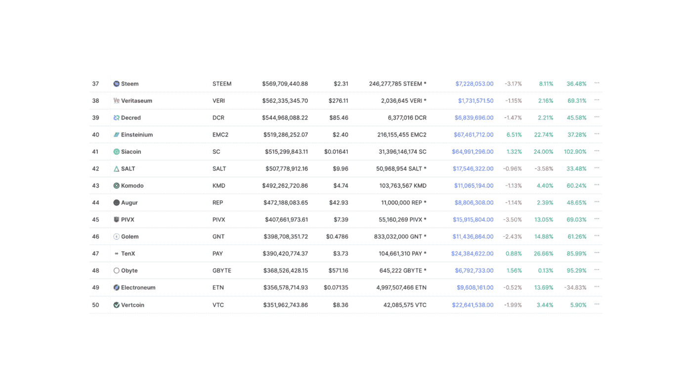

科莫多？预兆？PIVX？TenX？这么多辅音！用例很少。你在列表中越往下走，crypto 就越有可能从列表中掉出(尽管较小 crypto 的平均回报继续呈上升趋势)。

请看下图，它向我们展示了较小的密码更有可能从地图上消失(这并不奇怪):

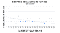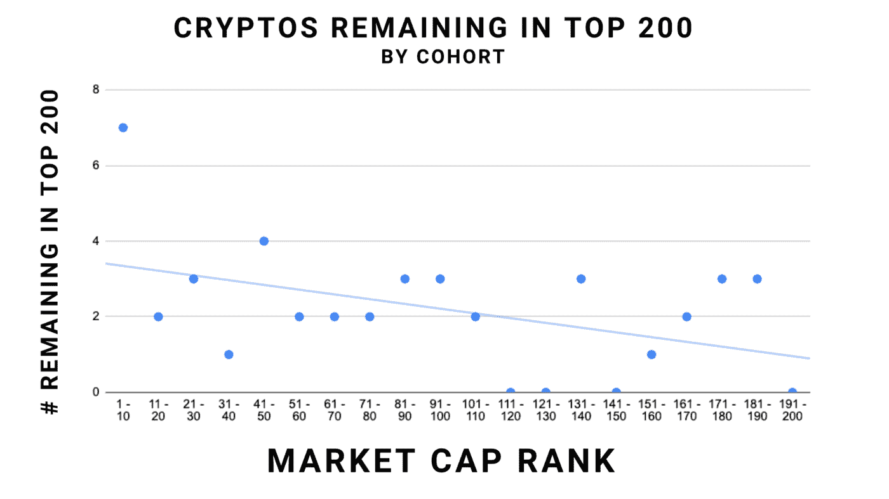

如果我们深入了解 2017 年的前 200 名，我们可以发现五大类密码:

1.  继续繁荣的古老密码(BTC，瑞士联邦理工学院)
2.  “坚持”的旧密码(DASH、NANO)
3.  迅速崛起的新密码公司(索尔、阿瓦克斯、CRV)
4.  尚未抢占市场份额的新密码(大多数小型股)
5.  完全从地图上消失的旧密码

今天，我们来看最后一个类别，密码已经崩溃、消失、消失或演变成其他东西。这些将包含我们试图避免的噩梦场景的教训。

我确实想说，长期持有 cryptos 指数(例如，前 200 名)不一定是一个糟糕的投资决定。一般来说，赢家增长惊人，抵消了你的损失。尽管如此，我们还是想避免无用的东西。让我们看看能否从下面学到一些经验:

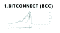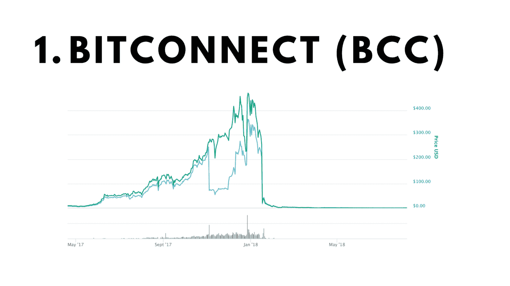

**承诺:** Bitconnect 可能是有史以来最大的地毯拉力。以 463 美元/枚的峰值价格，加密转化的 meme 承诺他们的交易机器人程序具有荒谬的无风险收益率(每日 1%)，该程序接受比特币，而不是 Bitconnect。2017 年 12 月创下历史新高，到 2019 年 3 月 11 日最终从交易所退市时，跌至约 0.40 美元。

**警告信号:**对于这种模糊的加密货币，警告信号比比皆是:没有白皮书，没有公共代码库，注册即可获得每日奖励，还有一个提供持续 40%无风险回报的“自动交易机器人”。它也主要在自己的平台上交易——你不能像真正的 cryptos 那样在其他交易所交易或购买它。

**结果:** Bitconnect 现在一文不值，被多个国家和州起诉。该团队的几名成员正在坐牢。

**教训:**理解合法(风险)加密资产和虚假庞氏骗局/计划之间的区别，相信我，它们仍然存在。对我来说，Bitconnect 的一些特征(尤其是它频繁受到州/国家政府的诉讼)似乎与 Tether(USDT)有共同点。或许也应该避免。

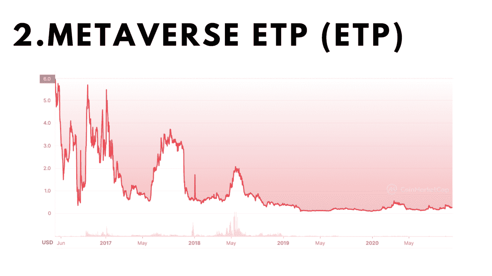

**承诺:**如今，创办一家元宇宙(你知道，数字虚拟现实世界)初创公司可以让你获得 1000 万美元的种子期前估值，以及世界上一些最大的风投公司的兴趣。那么外面的第一个发生了什么？

元宇宙·ETP 证明了这样一个事实:你可以想出一个好主意，但最终还是一无所获。该加密理解需要创建基础设施，将迎来一个新的时代的数字身份和协作，但最终在一个野鹅追逐。

**警告信号:**下图直接摘自元宇宙的白皮书:

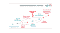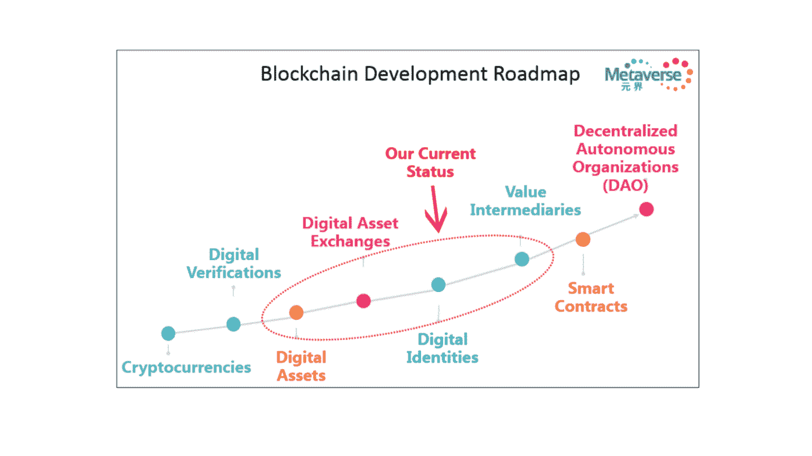

元宇宙认为通往数字世界的道路是线性的，需要连续的步骤才能突破到另一边。因此，他们把大部分鸡蛋放在“数字身份”篮子里，希望创造一个区块链式的化身系统——可验证的简历、信用记录、匿名身份验证。

但结果是，我们跳过了大部分。元宇宙销售的产品并不真的需要直接进入一个分散项目和化名创始人的组织的世界。最重要的是，他们来早了。当然，匿名工作和 Dao 也存在一些问题，但这些初创公司刚刚开始筹集种子资金。他们的产品是在 Dao 被采用之后才被需要的，而不是在此之前。

**结果:**迄今为止，元宇宙·ETP 的股价下跌了令人不安的 96.01%，这对投资者或创始人来说都不是什么好事。该团队仍然活跃，尽管他们的路线图自 2017 年以来一直没有更新或推进。他们仍然发布月度报告，并有一个活跃的 Twitter。这不是一个幽灵项目，只是一个几乎半途而废的项目。

**教训:**超前的想法可能比迟到的、在市场上有发展势头的想法更糟糕。把你所有的鸡蛋放在一个不需要解决的问题的篮子里是一种灾难。

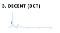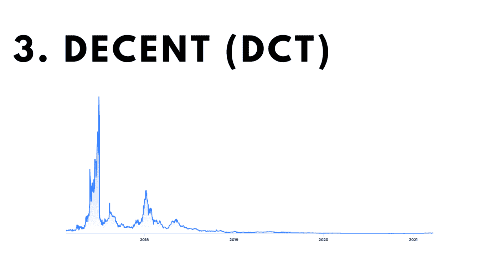

**承诺:**正派是一家捷克斯洛伐克的区块链公司，很早就进入了这个领域，早在 2015 年就推出了他们的 token。前提？想办法让内容创作民主化。由于中间商通常收取艺人收入的 50%到 70%作为发行费，这是他们的主要产品，DCORE 试图用某种方式解决这个问题。

主要问题？自 2017 年以来，我们在内容分发领域看到了大量的颠覆，尽管在加密领域很少。Substack、Youtube、Patreon 自 2015 年以来都倒闭了，每一家都没有区块链的帮助。

**警告信号:**一种叫做“体面”的加密货币至少他们没有言过其实。说真的，这是一个很好的案例研究，说明加密货币并不能为所有企业提供最好的服务。目前，密码对于促进分散的数字资产转移非常有用，仅此而已。它们不是为与主流支付系统、当前知识产权法或与现实世界互动而构建的。不是所有东西都需要加密，至少现在不需要。

**结果:**最高时，体面的交易价格约为 9 美元，而现在，这种象征已经完全消失了。最后已知的价格是 0.00779 美元，这意味着它从 ATH 到最终消亡总共下跌了 99.8%。该公司似乎已经转变为一家区块链咨询公司，或多或少，毫无疑问，这得益于以(一次性)5 亿美元的估值充实了他们的金库。

**教训:**你能创建一家秘密公司，并不意味着你应该创建一家秘密公司。

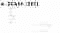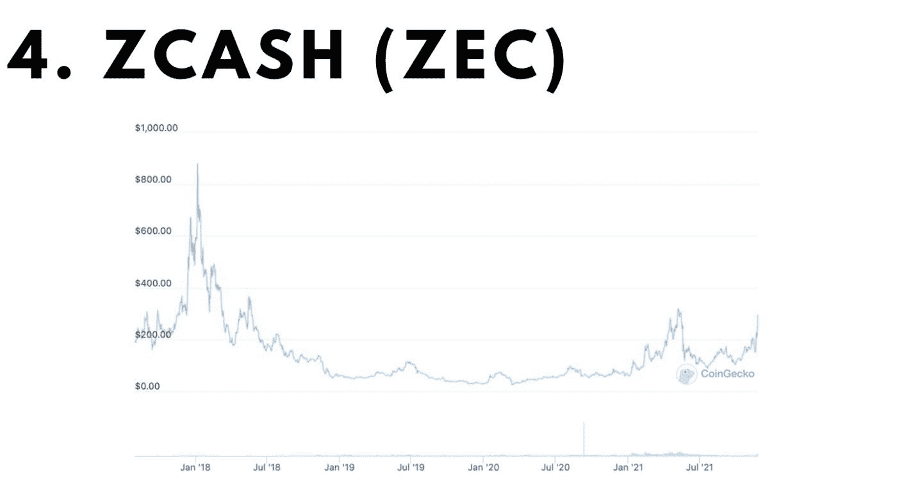

**承诺:**等等，ZCash 在过去的几个月里不是价格暴涨了吗？嗯，是的。专注于隐私的加密货币$ZEC 在过去两个月里上涨了近 3 倍，通过继续在一个充满泡沫的市场中注入资金，显示出非凡的下行阻力。

但是再放大一点，你会看到几年前它的交易价格低于 20 美元。这比荒谬的历史最高价 3191 美元有所下降。对于单个代币持有者来说，这意味着负 99.4%的回报率。这个令牌就是为什么人们更喜欢比加密更稳定的资产的定义。

**警告信号:**自比特币诞生以来，对工作证明的担忧就一直存在，但一个可能使 ZCash 的“固定”供应变成无限供应的错误才是导致崩溃的真正原因。价格得到了修正，但从未真正恢复。因此，是糟糕的代码，而不是糟糕的概念或想法让 ZCash 陷入困境。

**结果:**虽然 ZCash 停滞了多年，但随着它宣布转向股权证明、由分散的基金会管理，并开始经历新的开发活动，人们最近对该项目重新产生了兴趣。

**教训:**仅仅因为一个密码在价格上被摧毁并不意味着它没有希望。Cryptos 经历了多次下跌后再次上涨，这种情况还会发生。这仍然不意味着你应该购买每一个微型盖。

**我们能学到什么**

在研究这些失败的密码后，有趣的是看到它们的下降幅度有多大。显而易见的骗局是一回事，但一个为时过早的想法上市？这在当时看起来可能是下一个最伟大的事情。最重要的是，在新兴趣的刺激下，我们有起死回生的密码。

如果不与团队直接交流，就很难完全了解哪里出了问题。你可以从这些区块链的失败中得出自己的结论，但我认为最重要的教训是，每一种加密货币都有自己独特的方式。

这看起来像是一种逃避，但根据我的经验，这是真的。想象一下，试图用比特币的成功来衡量 DeFi token，或者以太坊的成功来衡量它能够服务多少没有银行账户的人(汽油费确保这是不可能的)。每个密码都在攻击新的和不同的市场或问题，最大和最好的密码通常从零开始创造新的市场。

我的最终意见？所有这些都表明，加密资产亟待研究。在投资之前，理解加密货币背后的概念、网络效应和财务状况是非常重要的。

没有一个宽泛的想法或观点经得起深入的数据支持的分析。你所关注的每一项投资都需要高度的严谨和调查，以确定其中的机会和上升空间。FOMO 不是一个可行的投资策略。

换句话说，确保你做了你的研究，否则你可能会下降 99.993%。

[**点击这里**](https://cryptopragmatist.com/sign-up-medium/) **每周从 Crypto Pragmatist 获取内容，绝对免费。**

> 加入 Coinmonks [电报频道](https://t.me/coincodecap)和 [Youtube 频道](https://www.youtube.com/c/coinmonks/videos)了解加密交易和投资

## 也阅读

 [## 杠杆代币[多头代币]终极指南

### 杠杆化令牌是具有杠杆化风险敞口的 ERC20 令牌，不考虑保证金、要求、管理…

medium.com](/coinmonks/leveraged-token-3f5257808b22)  [## 最佳加密交易所| 2021 年十大加密货币交易所

### 编辑描述

blog.coincodecap.com](https://blog.coincodecap.com/crypto-exchange)  [## 2021 年最佳加密借贷平台| 6 大比特币借贷平台

### 获得比特币和其他加密货币的最佳贷款利率

medium.com](/coinmonks/top-5-crypto-lending-platforms-in-2020-that-you-need-to-know-a1b675cec3fa)  [## 2021 年最佳免费加密交易机器人

### 2021 年币安、比特币基地、库币和其他密码交易所的最佳密码交易机器人。四进制，位间隙…

medium.com](/coinmonks/crypto-trading-bot-c2ffce8acb2a)  [## 最佳 4 个加密交易信号电报通道

### 这是乏味的找到正确的加密交易信号提供商。因此，在本文中，我们将讨论最好的…

medium.com](/coinmonks/best-crypto-signals-telegram-5785cdbc4b2b)  [## 5 个最佳社交交易平台[2021] | CoinCodeCap

### 编辑描述

blog.coincodecap.com](https://blog.coincodecap.com/best-social-trading-platforms)  [## BlockFi 评论 2021:利弊和利率| CoinCodeCap

### 编辑描述

blog.coincodecap.com](https://blog.coincodecap.com/blockfi-review)  [## 如何在印度购买比特币？2021 年购买比特币的 7 款最佳应用[手机版]

### 如何使用移动应用程序购买比特币印度

medium.com](/coinmonks/buy-bitcoin-in-india-feb50ddfef94)  [## 加密税务软件——五大最佳比特币税务计算器[2021]

### 不管你是刚接触加密还是已经在这个领域呆了一段时间，你都需要交税。

medium.com](/coinmonks/best-crypto-tax-tool-for-my-money-72d4b430816b)  [## 存储比特币的最佳加密硬件钱包[2021] | CoinCodeCap

### 编辑描述

blog.coincodecap.com](https://blog.coincodecap.com/best-hardware-wallet-bitcoin)  [## Pionex 评论 2021 |免费加密交易机器人和交换

### Pionex 是为交易自动化提供工具的后起之秀。Pionex 上提供了 9 个加密交易机器人…

medium.com](/coinmonks/pionex-review-exchange-with-crypto-trading-bot-1e459d0191ea)