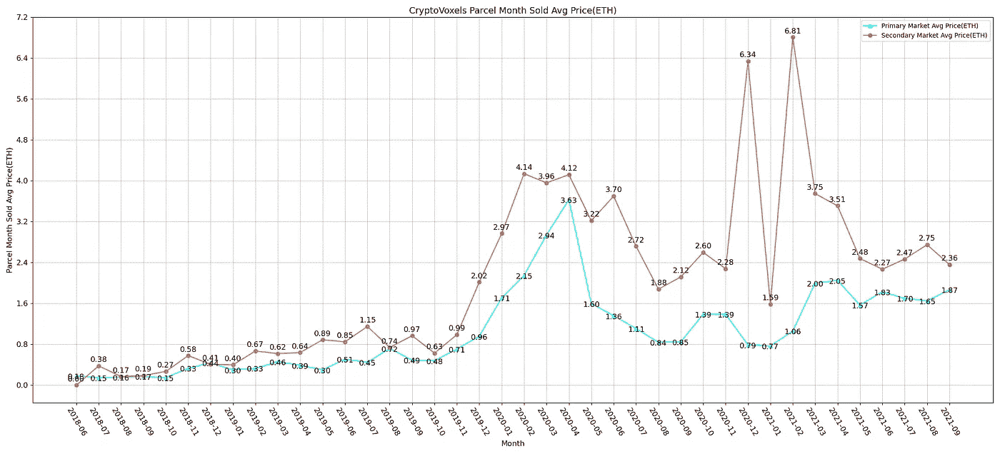
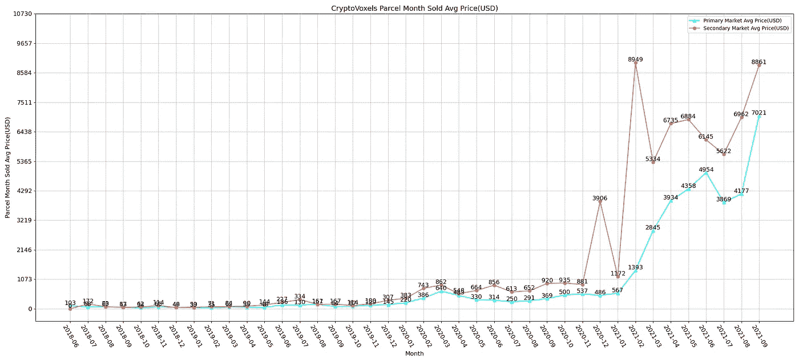
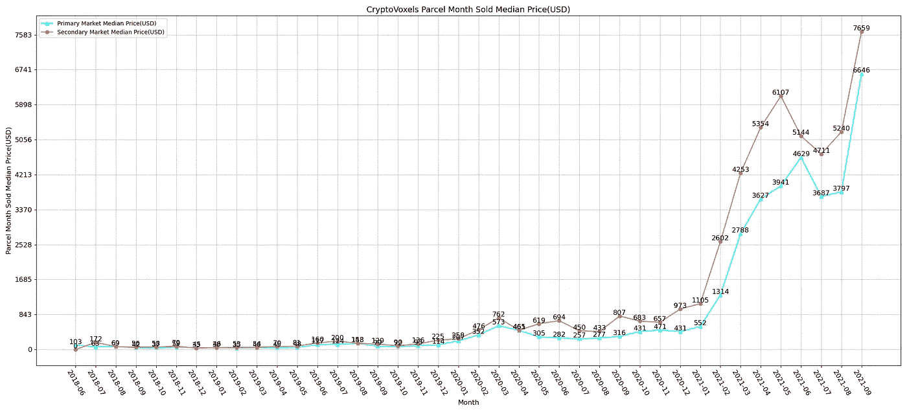
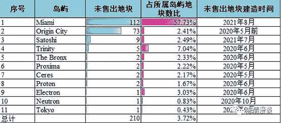
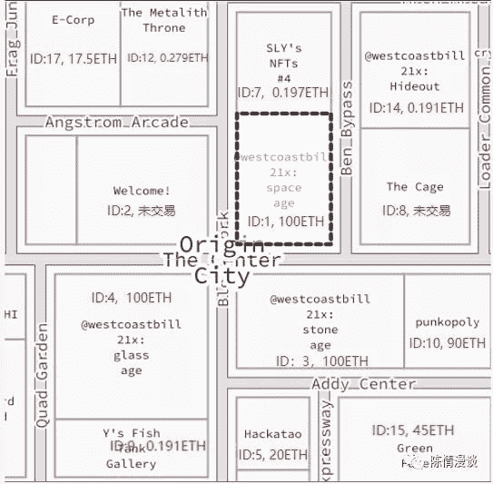
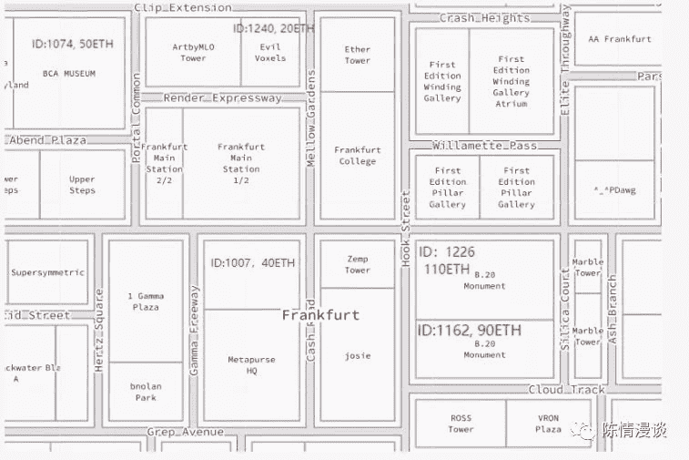
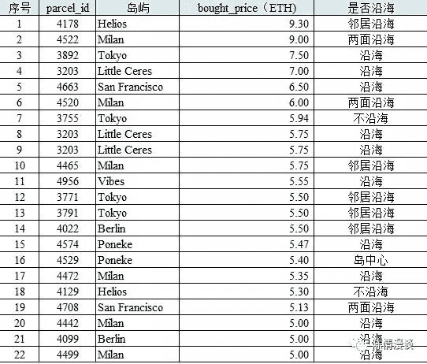

# 我们对隐体素包裹价格的了解有多少？

> 原文：<https://medium.com/coinmonks/what-we-know-about-parcel-prices-in-cryptovoxels-fb93dc22896d?source=collection_archive---------3----------------------->

作者:DawnXue( [@dawnx666](https://twitter.com/dawnx666) )

翻译:秦九月([@秦九月](https://twitter.com/C_Chyn))

# 概述

1.平均销售价格

2.中等销售价格

3.不同岛屿的销售汇总

4.不同岛屿的平均销售价格

5.影响包裹销售价格的因素

**本文从以上五个方面来分析 CV 上的包裹销售价格。**

# 平均销售价格

以 ETH 或 USD 表示的所有 CryptoVoxels 包裹销售的平均价格如下图所示:

图 1:所有包裹销售的月平均价格

图 2:所有包裹销售的月平均价格(美元),以 CryptoVoxels 表示

Figure 1

Figure 2

【2018 年 6 月至 2019 年 11 月，月平均价格波动不大。然而，在同一个月或下个月，当平均价格达到 1ETH 时，它会翻倍至 2ETH — **这发生在 2019 年底的二级市场和 2020 年初的一级市场。**

从 2019 年 12 月到 2020 年 8 月，ETH 的月平均价格先升后降。然而，就美元而言，它相对稳定。

2020 年 12 月，月平均价格跃升至 6.34ETH，因为 B20 分别在主岛的 110ETH 和 90ETH 购买了 1226 和 1162 号地块。我参观了隐体素的包裹。他们彼此相邻，身高惊人——分别为 32 和 35。

2021 年 2 月，月平均价格跃升至 6.81ETH，因为主岛的 2034 号地块在二级市场以 1800ETH 的价格**售出。**

自 2021 年 3 月以来，ETH 的月平均价格在过去 18 个月中波动很小，涨幅不大。**然而，就美元而言，价格已经大幅上涨——这部分是由于 ETH 以美元计价的升值，部分是由于 2021 年游客流量的大幅增加，尤其是自 4 月份以来。**

# 中等销售价格

自 2020 年 5 月以来，每月中等销售价格相对稳定— **在一级市场 0.70ETH 至 1.96ETH 和二级市场 1.25ETH 至 2.99ETH 之间波动**。由于与平均价格相同的原因，中等价格自 2021 年以来大幅上涨。

图 ETH 中所有包裹销售的月平均价格

Figure 3

# 不同岛屿的销售汇总

**从 2018 年 6 月到 2020 年 4 月，所有的包裹销售都发生在主岛 Origin City。其他岛屿的交易始于 2020 年 5 月，因为在此之前，主岛以外没有或很少有地块可用。**

截至 2021 年 8 月，官方公布的 CV 中有 20 个岛屿。然而，**主岛上的所有宗地都是在 2020 年 4 月之前铸造的，除了中心的 1、3、4 号宗地是在 2021 年 2 月铸造的。另外八个岛屿在 2020 年 4 月**之前铸造，但是八个岛屿中的七个只有一个地块，第八个有两个地块。自 2020 年 5 月以来，隐体素专注于主岛以外的发展中岛屿。

【2021 年 1 月至 6 月铸造的新包裹在所有岛屿售罄。主岛外的包裹在这段时间很受欢迎。

2021 年 8 月底，有 11 个岛屿上的 210 个地块在售。详情请见表 1。

图 4:2021 年 8 月底出售的包裹

Figure 4

**2021 年制造的岛屿更受买家欢迎。**除迈阿密和 Satoshi 在 2021 年 7 月至 8 月铸造外，所有未出售地块的岛屿都在 2020 年铸造。

未售出包裹最多的岛屿是最近新建的迈阿密岛，可能是因为价格高。主岛 Origin City 拥有第二大未售地块。所有其他岛屿都有大部分(如果不是全部)地块售出。所以我们得出结论**小岛更受欢迎。**

# 不同岛屿的平均销售价格

下图分别显示了 20 个岛屿的月平均价格趋势。

图 5:各岛屿的月平均价格

Figure 5

以下是我们的一些结论和分析:

1.**主岛——图中带方形标记的蓝线——原产地市的平均价格领先，但自 2021 年 4 月以来，它正在被其他岛屿超越。我们之前提到的一些天价发生在 Origin City，带来了那几个月平均价格的大幅上涨。**

2.**小谷神星，图中带有十字标记的蓝线，看到了异常的价格波动，这似乎与其他岛屿的价格运动无关**。这个岛，只有一个包裹，就在谷神星岛旁边。这一单宗地在 2020 年 5 月以 7ETH 交易，然后在 2021 年 2 月以 5.75ETH 交易，2021 年 6 月以同样的价格交易。第一次和第三次，价格都高于主岛的平均水平。

3.**东京，图中的橙色线，也有一些意想不到的价格变动——先是上涨，然后下跌，最后稳定下来。**在此过程中的几个月里，除主岛外，东京在所有岛屿中均价最高:2020 年 10 月和 12 月为 2.5ETH。2021 年 4 月和 5 月，东京的房价最高，甚至高于主岛，分别为 4.5ETH 和 3.88ETH。

4.所有其他岛屿在价格变动方面表现相似。从图中你可以看到它们的线条几乎融合在一起。

5.【2021 年 8 月，18 个岛屿有包裹销售(小谷神星和布朗克斯除外)。**主岛起源城以 4.38ETH 领先，米兰和赫利俄斯分别以 3.82ETH 和 3.18ETH** 屈居第二第三。遥远的远方紧随其后。六个岛屿位于 2+ETH 波段:东京位于 2.95ETH，旧金山位于 2.92ETH，Vibes 位于 2.77ETH，Electron 位于 2.53ETH，Trinity 位于 2.25ETH，Neutron 位于 2.00ETH。

# 影响包裹销售价格的因素

根据数据，位置是价格背后的一个重要因素。

1.主岛 Origin City 的两个社区的房价高于全岛平均水平:市中心和 Frunkfurt。

**下图是中心**地块的最新销售价格。除了未售出的地块 2 之外，四个最中心的地块都以 100ETH 售出。就在这四个地区之外，地块的价格仍然特别高:一些在 90ETH，20ETH，17.5 ETH，明显高于全岛平均水平；其他人看起来价格更低，但这些销售发生在 2018 年 6 月。高价的中央地块并不局限于图中所示的几个街区。

图 6:原产地城市核心区成交价格

Figure 6

**Frunkfurt 街区**从 200ETH 的 1226 号和 1162 号地块出售给 B.20(现在著名的 Beeple 艺术品的所有者)中获益。例如，BCA 博物馆(1074 号地块)最后一次在 50ETH 售出。1240 号包裹在 20 街。两者都大大高于岛上的平均水平。只显示了部分价格，因为自 2019 年以来，许多宗地都没有进行交易。

图 Frunkfurt 地区的部分交易价格

Figure 7

2.**主岛上的沿海地块比岛屿平均价格稍贵，但仍比岛屿中心低很多。**

3.其他岛屿上的沿海地块更受欢迎，因为它们的价格更高。在主岛之外价格高于 5ETH 的 22 个地块中，14 个面向海洋，其中 3 个在两侧，5 个与海洋仅一排之隔。

图 8:海岛上方排名前 22 的地块(成交价 5ETH)

Figure 8

我们并不是说位置是影响价格的唯一因素。但是我们的分析到目前为止还没有发现其他因素。我们将来一定会分享任何新的见解。

希望你喜欢这篇文章。如有任何问题，请在 Twitter([**@ dawnx 666**](https://twitter.com/dawnx666)**)上联系。**

> 加入 Coinmonks [电报频道](https://t.me/coincodecap)和 [Youtube 频道](https://www.youtube.com/c/coinmonks/videos)了解加密交易和投资

*   [折叠 App 回顾](https://blog.coincodecap.com/fold-app-review) | [本地比特币回顾](/coinmonks/localbitcoins-review-6cc001c6ed56) | [Bybit vs 币安](https://blog.coincodecap.com/bybit-binance-moonxbt)
*   [加密保证金交易交易所](/coinmonks/crypto-margin-trading-exchanges-428b1f7ad108) | [赚取比特币](/coinmonks/earn-bitcoin-6e8bd3c592d9) | [Mudrex 投资](https://blog.coincodecap.com/mudrex-invest-review-the-best-way-to-invest-in-crypto)
*   [WazirX vs CoinDCX vs bit bns](/coinmonks/wazirx-vs-coindcx-vs-bitbns-149f4f19a2f1)|[block fi vs coin loan vs Nexo](/coinmonks/blockfi-vs-coinloan-vs-nexo-cb624635230d)
*   [杠杆令牌](/coinmonks/leveraged-token-3f5257808b22) | [最佳密码交易所](/coinmonks/crypto-exchange-dd2f9d6f3769) | [Paxful 点评](/coinmonks/paxful-review-4daf2354ab70)
*   [加密套利](/coinmonks/crypto-arbitrage-guide-how-to-make-money-as-a-beginner-62bfe5c868f6)指南| [如何做空比特币](/coinmonks/how-to-short-bitcoin-568a2d0b4ae5) | [1xBit 回顾](https://blog.coincodecap.com/1xbit-review)
*   [如何在印度购买以太坊？](https://blog.coincodecap.com/buy-ethereum-in-india) | [如何在币安购买比特币](https://blog.coincodecap.com/buy-bitcoin-binance)
*   [在美国如何使用 BitMEX？](https://blog.coincodecap.com/use-bitmex-in-usa) | [BitMEX 评论](https://blog.coincodecap.com/bitmex-review) | [买入索拉纳](https://blog.coincodecap.com/buy-solana)
*   [德国最佳加密交易所](https://blog.coincodecap.com/crypto-exchanges-in-germany) | [Arbitrum:第二层解决方案](https://blog.coincodecap.com/arbitrum)
*   [支持卡审核](https://blog.coincodecap.com/uphold-card-review) | [信任钱包 vs 元掩码](https://blog.coincodecap.com/trust-wallet-vs-metamask)
*   [Exness 回顾](https://blog.coincodecap.com/exness-review)|[moon xbt Vs bit get Vs Bingbon](https://blog.coincodecap.com/bingbon-vs-bitget-vs-moonxbt)
*   [如何开始通过加密贷款赚取被动收入](https://blog.coincodecap.com/passive-income-crypto-lending)
*   [Coldcard 评论](https://blog.coincodecap.com/coldcard-review) | [BOXtradEX 评论](https://blog.coincodecap.com/boxtradex-review)|[uni swap 指南](https://blog.coincodecap.com/uniswap)