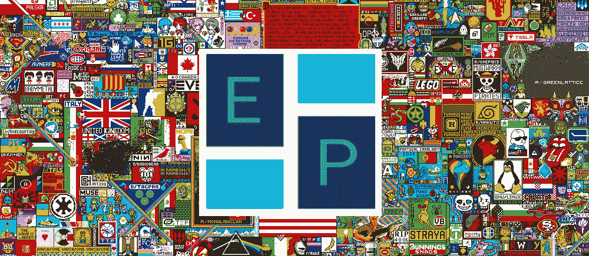
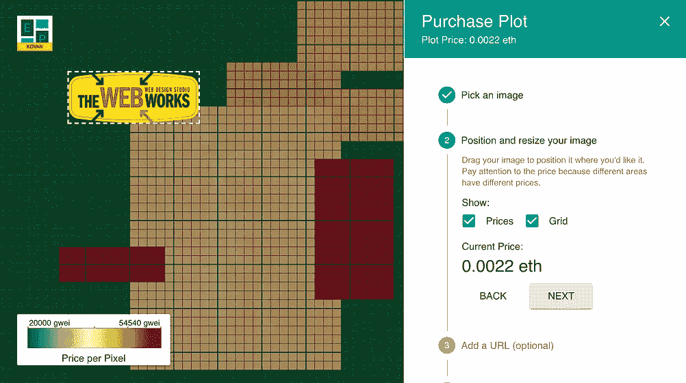
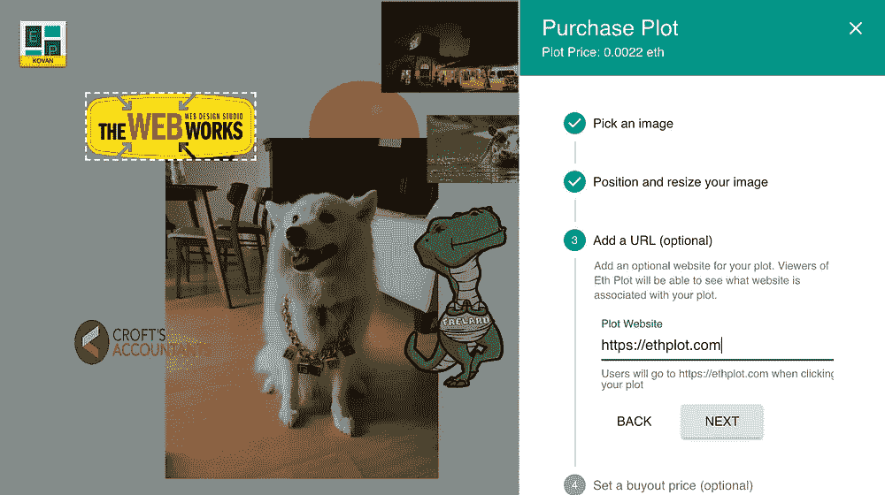
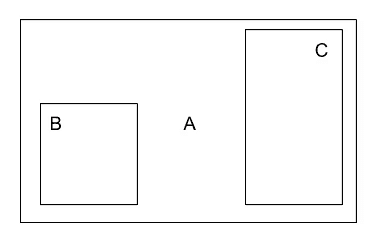
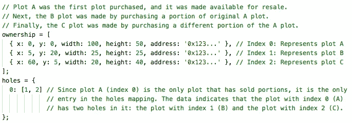

# 我们从建造第一个以太坊 Dapp 中学到了什么

> 原文：<https://medium.com/coinmonks/what-we-learned-building-our-first-dapp-28b01f9fc244?source=collection_archive---------3----------------------->

**更新**:如果你喜欢这篇文章——看看我们在 [Nodesmith](https://nodesmith.io) 正在建造什么。我们为开发者提供所有的核心基础设施，让他们更容易构建基于区块链的应用程序，从而打造完美的可扩展应用程序。

## 介绍

几个月前，我和我的同事 Samm 认为我们已经过了学习以太坊和 Solidity 开发的时候了。自从以太坊推出以来，我们一直被动地跟随它，我们决定建立一个以太坊 Dapp 作为辅助项目，帮助我们更好地理解底层技术。

对于我们想要构建的 Dapp，我们心中有几个目标:

1.  Dapp 的范围必须很小，但要涵盖以太坊和坚固性的所有有意义的特征。
2.  Dapp 必须在我们不需要自己管理任何云服务的情况下运行，这意味着我们将只编写客户端代码和以太坊智能合约。
3.  我们会开源我们写的任何代码，分享我们学到的东西。

> [发现并评估最佳区块链 api 和节点产品](https://coincodecap.com/category/blockchain-node-and-api)

我们最终构建的是一个名为 [Eth Plot](https://ethplot.com) 的小游戏！Eth 剧情灵感来源于 Reddit 著名的 [r/place](https://www.reddit.com/r/place/) 愚人节玩笑和[百万美元主页](http://www.milliondollarhomepage.com/)。它允许你在网格上购买数字空间的“地图”。在您购买的地块中，您可以放置一张图片和一个链接到您选择的网站。你也可以在任何时候转售你的土地。

App screenshots showing a user purchasing a new plot

请随意查看 Dapp [这里](https://ethplot.com)！它运行在 mainnet 以及 Ropsten、Rinkeby 和 Kovan 上。我们希望一些人使用该应用程序，但我们这个项目的主要目标是我们自己的教育。我们学到了很多，在这篇文章中，我们将与你分享我们在这一努力中学到的东西。

*警告*:这有点读长了！想直接跳到代码？这里是主[智能合约](https://github.com/space-dust-blockchain/eth-plot/blob/master/contracts/EthPlot.sol)，这里是构成 UI 的 [React/Redux 应用](https://github.com/space-dust-blockchain/eth-plot)。我们希望示例代码对那些开始构建他们的第一个 Dapp 的人有所帮助。

本文的目标读者是熟悉以太坊的开发人员，但他们可能还没有编写第一个 Dapp，希望对它的内容有一个概述，并附带一些我们在这个过程中获得的技巧和诀窍。我们并不自称是专家，也不打算写另一篇关于 Dapp 开发的深入教程。以下是我们将在本文中涉及的内容:

*   对我们的技术堆栈的高度概述——我们用于构建 Eth Plot 的所有技术。
*   Eth Plot 智能合同的细节——以高效的方式实现该应用程序所需的功能异常复杂。
*   提示和技巧——这是我们在开发 Eth Plot 时学到的一系列有用的小知识。

## 我们的技术堆栈

对于这个项目，我们使用了以下堆栈:

*   Solidity Smart Contracts —一个[主合同](https://github.com/space-dust-blockchain/eth-plot/blob/master/contracts/EthPlot.sol)和一个[助手](https://github.com/space-dust-blockchain/eth-plot/blob/master/contracts/Geometry.sol)
*   [IPFS](https://ipfs.io/) ，用于通过[信息存储器](https://infura.io/)存储图像数据
*   [Truffle](http://truffleframework.com/) 和 [Ganache](http://truffleframework.com/ganache/) 用于我们的开发和测试框架
*   react/Redux/Material UI/type chain 用于我们的前端开发
*   [生产中我们的 web3 提供商的元掩码](https://metamask.io/)

*智能合约*

Eth Plot 的核心功能(以分散方式买卖地块的能力)只有通过以太坊的智能合约功能才成为可能。我们还经常使用事件，这提供了一种更便宜的存储形式，并允许我们的 web 应用程序做出响应。因为支持 Eth Plot 的主要智能合同是项目最有趣的方面，所以我们在本文的部分专门讨论它。

*IPFS*

试图在链上存储图像数据是极其昂贵的。现在相当标准的做法是，我们把图像上传到 IPFS T21，在这个过程中接收图像文件的散列。这个散列是我们存储在链上的。这使得 Eth Plot 保持完全分散，尽管没有在以太坊上存储所有数据。

为了避免与我们自己托管和管理 IPFS 节点相关的麻烦，我们使用了 Infura 的 IPFS 服务。

*松露/加纳切*

[Truffle](http://truffleframework.com/) 是一套有用的工具，让测试以太坊合约变得更加容易。我们使用 Truffle 来编译和部署我们的智能合同到本地以太坊节点。Ganache 是我们使用的本地以太坊节点，这是一个基于 JavaScript 的轻量级以太坊客户端。我们还使用 Truffle 作为测试框架来测试我们的智能合约。

*反应/还原/材质 UI/类型链*

对于我们的前端，我们选择使用 [React](https://reactjs.org/) ，以及 [Redux](https://redux.js.org/) 进行状态管理。这是一个非常标准的 web 开发堆栈，所以我们不会在这里花费任何时间，但可以随时查看[源代码](https://github.com/space-dust-blockchain/eth-plot)以获取详细信息。

我们还利用了来自[材质 UI 项目](https://material-ui.com/)的组件。Material UI 是一组 React 组件，实现了 Google 的材质设计规范。这是一个写得非常好的库，有很好的文档，提供了一堆好看的组件。

我们喜欢用 TypeScript 编写基于 web 的项目，所以我们利用了一个名为 [TypeChain](https://github.com/Neufund/TypeChain) 的有用项目，它为 Solidity 契约提供了 TypeScript 绑定。

*MetaMask*

按照标准，我们要求用户安装[元掩码](https://metamask.io/)来与 Eth 图交互。使用元掩码非常简单，只有几个例外:

1.  由于缓存量不可预测，元掩码对于本地测试并不理想。即使使用 MetaMask 的“重置帐户”特性，有时事务状态也可以被缓存，这使得开发变得困难。相反，我们在本地开发时直接使用了来自 ganache 的 web3 提供者。
2.  处理元掩码[状态的用户账户变化不理想](https://github.com/MetaMask/faq/blob/master/DEVELOPERS.md#ear-listening-for-selected-account-changes)。推荐的方法是运行一个重复检查当前帐户的时间间隔。

也就是说，MetaMask 是一个非常棒的项目，如果没有 MetaMask，Dapp 空间将不会像今天这样。

## 智能合同深入探讨

支持情节的主要 smart 合同是该项目的最具挑战性和独特的方面之一。这主要是因为在合同中存储数据和执行大量计算是多么昂贵。

首先，我们列出了合同的要求:

1.  定义约束尺寸至少为 250x250 的栅格系统。
2.  网格中的每个坐标代表一个 1x1 地块，该地块具有所有者、买断价格、网站以及与之相关联的可视数据。
3.  绘图可以大于 1x1，以创建带有图像的连续区域
4.  为了允许用户购买他们想要的任何地块，而不是被迫购买整个现有地块，可以出售地块的部分区域，并且一个地块可以与另一个地块重叠。

*天真的方法*

解决这个问题的一个简单方法是与大型 2D 阵列签订合同。数组中的每个条目都代表整个网格的一个坐标，并包含该坐标的相应信息。当购买一个地块时，买方将发送一个交易，其中指明他们想要购买的所有坐标和要关联的数据。

不幸的是，看看存储数据的[汽油价格](https://docs.google.com/spreadsheets/d/1n6mRqkBz3iWcOlRem_mO09GtSKEKrAsfO7Frgx18pNU/edit#gid=0)(s store 操作)存储一个 32 字节的字要花费 20，000 汽油。对于我们的阵列，我们需要存储至少 62，500 个字(250x250)，这将花费 1，250，000，000 gas。按照 5 gwei 的天然气价格，这将花费大约 6.25 ETH(在撰写本文时大约为 3750 美元！)在交易成本上。这也比单个区块允许的最大天然气量(在撰写本文时[为 800 万](https://ethstats.net/))高出约 300 倍。即使我们可以部署这种契约，与它交互的交易成本也会太高，以至于看不到任何应用。

*我们的方法——合同存储*

最终，我们想出了一种方法，可以有效利用有限的可用资源，并使 Eth Plot 按预期运行。

首先，让我们看看如何存储合同的状态。首先，我们存储了绘图的摘要:它们的起始坐标(x & y)和尺寸(高度和宽度)，而不是代表单个坐标的 2D 数组。这样做的好处是，大地块的存储成本不会比小地块高。合同按照购买的顺序存储这些地块的数组，数组中后面的地块出现在前面的地块之后。这在契约中被称为`ownership`数组。该`ownership`数组包含每个图的一个条目，包括其几何图形(x，y，w，h)和所属地址。因为几何图形的范围是 0-250，我们可以将这四个值分别存储在一个三字节的`uint24`变量中。拥有者的`address`是 20 个字节，也就是说数组中每个条目占用 20 + (4 * 3) = 32 个字节。这是 [EVM](https://github.com/ethereum/wiki/wiki/Design-Rationale#virtual-machine) 中的精确字长，使得存储更加高效。

使用这种数据表示，您可能想知道我们如何支持销售地块的子部分。我们通过`holes`映射来实现这一点，它跟踪关于哪些地块相互重叠的信息，这意味着后面的地块购买了前面地块的一部分。下面是一个示例，展示了`ownership`和`holes`数组之间的关系。

添加这个重叠逻辑是至关重要的，因为它允许我们有效地验证某人试图购买的地块是有效的。通过保持`holes`映射最新，我们可以在验证新购买时在内存中保留更少的状态——防止我们超出天真方法中看到的气体限制。

接下来，我们将特定地块的图像上传到 IPFS，然后在合同中存储该图像的 IPFS 散列，而不是直接将图像数据存储在区块链中。除了图像哈希，我们还存储了与情节相关的网站。这些信息存储在独立于`ownership`对象的自己的映射中，因此我们在计算新的购买时不需要将它读入内存，从而降低了购买交易的成本。该信息存储在`data`映射中。

最后，我们将特定地块的当前买断价格存储在一个名为`plotIdToPrice`的独立映射中。所有权用户可以随时更新地块的买断价格。就像`data`映射一样，该信息与`ownership`数据分开存储，因为我们很少访问它(只有在计算支出时)。

*我们的方法——购买地块*

现在我们已经了解了数据存储，让我们来看一下购买地块时会发生什么。你调用的购买新地块的函数叫做`purchaseAreaWithData`。数据以某种独特的格式指定，以便尽可能高效地执行合同。

在我们最初的版本中，调用者简单地传入他们想要购买的矩形，契约试图计算需要购买的所有子地块。这在小情况下有效，但我们很快就突破了 EVM 的极限，遇到了交易成本膨胀和加载到内存中的数据量导致的堆栈过深错误。相反，方法的调用者(在我们的例子中是 web 应用程序)预先做了所有的计算，契约只是验证这些数据并转移资金。为此，调用者发送一组子图，这些子图形成了所购买区域的完整平铺。这些子地块代表将要购买的现有地块的部分。除了子图之外，这些子图所在的索引也被传递到函数中。

[合同](https://github.com/space-dust-blockchain/eth-plot/blob/master/contracts/EthPlot.sol)本身被大量评论，值得一看，但这里是购买功能的高级概述:

*   验证和限制检查输入参数。
*   检查传入的子地块是否形成了所购买地块的完整平铺。
*   检查以确保所有被购买的子地块都是待售的，并且仍然归调用者所说的他们正在购买的地块所有(这里使用了`holes`结构)。
*   用交易中发送的资金支付所有子地块的所有者，并发出转账事件。
*   存储新的绘图、新的数据、买断价格，用所有新的购买更新所有的`holes`数组，并发出一个购买事件。

*其他功能*

契约的剩余部分包含一些不太有趣的琐碎功能。这包括所有者可访问的功能，用于更改地块的买断价格和更改地块的数据，以及管理功能，用于将内容标记为非法并收回合同中收集的资金。最后，有一些*视图*函数，通过从各种不同的数据结构中聚集信息，使得读取合同数据更加有效。

*为什么不用 ERC-721？*

当我们在进行设计时，我们遇到了 [ERC-721 规格](https://github.com/ethereum/EIPs/blob/master/EIPS/eip-721.md)，它看起来很有希望，但最终不符合我们的要求。我们无法解决的 ERC-721 的最大问题是如何细分地块，以允许只出售地块的一部分。我们看到的 ERC-721 的另一个问题是，一旦令牌被细分，就没有办法将它们重新组合成更大的地块。

## 提示和技巧

我们从这个项目中得到了一些有趣的收获，我们想和大家分享一下。

**很难确定交易成本，所以编写一些测试，然后猜测并检查** —对我们来说最有用的优化技术之一是[编写一些单元测试](https://github.com/space-dust-blockchain/eth-plot/blob/master/truffle-tests/PlotsToPurchase.ts)，这些测试贯穿了我们认为是我们合同的一组代表性交易。通过计算这次测试的汽油成本，我们可以尝试重构契约，看看这对汽油成本有什么影响。使用这种技术，我们能够将合同效率提高**到**40%。

**离线计算，在线验证—** 您可以从合同中移除的任何计算都是值得的。如果您发现自己正在编写复杂的契约代码，看看是否可以计算更多的非链上的东西，并让契约验证这些数据。例如，我们没有在合同本身中完成所有的购买计算，而是将大部分工作推给了客户端——这里的代码示例[。](https://github.com/space-dust-blockchain/eth-plot/blob/master/src/data/ComputePurchaseInfo.ts#L20)

**注意存储是如何构建的，映射可能比数组更好** —我们的优化练习中得出的一个有趣的观察结果是，将我们的相关数据分成多个对象会产生多大的差异。由于 EVM 必须一次将完整的单词加载到内存中，因此仅将地块几何图形和所有者存储在所有权数组中可以防止加载关于图像、买断价格等不需要的数据。此外，对于那些其他数据结构，使用映射而不是并行数组要便宜得多，因为我们不需要更新数组的长度值(这涉及到昂贵的 SSTORE 操作)。

**truffle 调试器非常有用，当它工作时****——**使用 truffle 框架非常有用，因为它允许我们部署本地测试网、编写单元测试和调试合同。truffle 调试器(`truffle debug`命令)对于调试在手动测试中失败的事务非常有用。不幸的是，由于 truffle 单元测试的设置方式，调试器不允许您调试源自单元测试的事务。

**truffle 默认情况下不启用优化**——在撰写本文时，我们意识到`truffle compile`默认情况下不启用契约优化。在我们的测试中，打开它又节省了大约 20%的汽油。你可以通过[松露配置文件](http://truffleframework.com/docs/advanced/configuration#solc)来启用它。

## 结论

感谢您的阅读！我们在这个项目中学到了很多，并计划在未来做更多的以太坊开发。

再次检查 [Eth 图应用](https://ethplot.com)的运行情况！我们不希望赚取任何虚假的互联网积分，但我们很乐意与您合作，所以请在这里或在 [GitHub repo](https://github.com/space-dust-blockchain/eth-plot) 上留下任何评论或问题。所有的东西都是开源的，所以如果你正在为你的第一个(或下一个)Dapp 的开发寻找一些起始代码，看看吧。

## 更新:2018 年 8 月

在 mainnet 上有了这个之后，我们学到了一些别的东西！如果你最近在 mainnet 上试用过这个应用程序，你会注意到它在开始时加载速度非常慢。对于那些好奇的人来说，这样做的原因是为了价格，我们将我们的应用程序数据存储在事件日志中。缺点是搜索日志非常耗时，尤其是在 mainnet 上。由于尺寸原因，我们在本地和测试网上测试时没有注意到这个缺陷。

为了解决这个问题，我们需要添加一个专用的缓存层。我们可能不会花时间将它添加到 EthPlot，因为我们目前正在进行其他一些项目，但记住这一点是有帮助的。我可以预见未来的 Infura(或 Infura 竞争对手！)制作一个专题来帮助解决这个问题。

## 更新:2018 年 11 月

EthPlot 是促使我们开始 [Nodesmith.io](https://nodesmith.io) 的激励因素之一。我们希望构建一个服务，为您提供构建去中心化应用程序所需的一切，而不会觉得它的可用性受到底层区块链基础设施的阻碍。通过 Nodesmith，我们不仅为您提供了访问底层区块链基础设施(如发送事务和读取网络状态)的 API，还为您提供了增强应用程序的服务，使其更加用户友好。例如，我们正在添加智能合同事件缓存，以便快速读取事件日志。我们还增加了一个 webhooks API，这样你就不用经常轮询网络了。

如果你想了解更多信息，请在[推特](https://twitter.com/nodesmith)或[媒体](https://medium.com/nodesmith-blog)上查看该项目！

