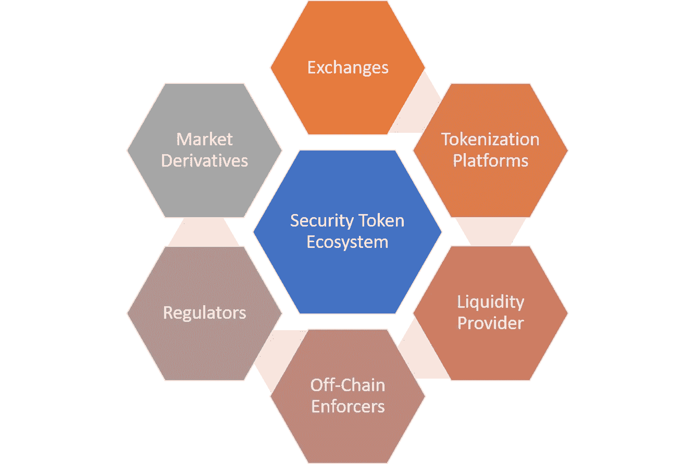

# 我们需要什么来实现安全令牌理论

> 原文：<https://medium.com/coinmonks/what-we-need-to-enable-the-security-token-thesis-2eade6ee96f2?source=collection_archive---------5----------------------->

安全令牌被称为是未来几年加密货币最热门的趋势之一。如果你在这个领域工作，感觉就像比特币的早期，当时数字货币基础设施的主要组件刚刚被构思出来，似乎没有人有所有正确的答案。在某种意义上，我们正处于安全令牌市场的那个阶段。将成为安全令牌平台的元素只是在想象中，安全令牌的市场理论正在构建中，第一代平台和产品刚刚推出。从这个角度来看，现在是加入安全令牌生态系统的最佳时机。

最近，俄勒冈大学的 Stephen McKeon 教授写了一篇名为《安全令牌论文》的精彩文章，其中他解释了一些将指导安全令牌市场的公理原则。McKeon 教授列出了促进安全令牌广泛采用所需的八个主要特性:

1)全天候市场

2)部分所有权

3)快速结算

4)直接成本的降低

5)增加流动性和市场深度

6)自动化合规

7)资产互操作性

8)扩大安全合同的设计空间

为了实现上述功能，安全令牌生态系统将需要彼此互操作的技术构建块，以便构建有凝聚力的经济动态。虽然该领域的第一波创新刚刚开始，但我认为已经有一系列组件是安全令牌生态系统成功的基础。以下是我最喜欢的一些:

a)交流

b)令牌化平台

c)安全令牌标准

d)流动性提供者

e)链外执行者

f)监管机构

g)市场衍生品

# 交换

安全令牌交换即将到来！安全令牌交换是在正确的监管框架下实现令牌化资产可交易性的重要因素。虽然不缺乏用于上市和交易公用令牌的选项，但是迄今为止用于安全令牌的选项还不存在。像 [OpenFinance](https://www.openfinance.io/) 和著名的 [tZero](https://www.tzero.com/) 这样的平台正在应对这一挑战。

# 令牌化平台

通向安全令牌的道路从创建它们开始😊很多时候，安全令牌是通过对现实世界中的现有金融资产进行令牌化来生成的。产生金融资产的符号化表示的过程是第一代符号化平台的作用。像博学者(T0)或 T2 证券公司(T3)这样的产品正在填补这个空白。

# 安全令牌标准

为了让安全令牌成为主流，我们将需要指导和规范其行为的标准。如果您认为世界上的每一个替代资产都可以有符号化的表示，那么想象一下如果这些表示遵循不同的标准，并且在这些标准之间没有互操作性，将会发生什么。幸运的是，像[、Harbor R-Token](https://harbor.com/rtokenwhitepaper.pdf) 和 [Polymath 的 ST-20](https://polymath.network/st20.html) 这样的倡议正在试图解决这一挑战。

# 流动性提供者

像任何新生的金融市场一样，证券代币将会表现得非常低效，违背尤金·法玛(Eugene Fama)在 1965 年提出的有效市场假说的一些原则。证券代币交易所的早期阶段和相对较少的投资者参与该领域引起了人们对证券代币产品流动性的一些担忧。为了解决这一问题，安全令牌平台应该通过与 [Bancor](https://www.bancor.network/discover) 或[bnktothefourt](https://bnktothefuture.com/)等平台整合，为其生态系统建立流动性。

# 链外执行者

安全令牌的许多生命周期都发生在区块链之外。从法律上确认金融资产、审计和证明其价值、确认合格投资者、分配红利、改变资产所有权都是需要在现实世界中执行的过程。为了实现这一点，安全令牌平台应该发展链外合作伙伴网络，如律师事务所、信托公司、KYC 反洗钱提供商、审计师和其他许多实施安全令牌正确生命周期的各方。

# 监管者

一种特殊类型的链外执行者是不同金融市场的监管部门。为了让安全令牌成为主流，为生态系统提供动力的平台应该与美国证券交易委员会和 CFTC 等监管机构合作，以加强生态系统的合规性。

# 市场衍生品

衍生产品在公用令牌领域并不特别成功，但可能会在安全令牌生态系统中扮演重要角色。考虑到证券代币与其基础资产之间的联系，我们很快就会看到模仿金融市场工具的衍生产品，如交易所交易基金(ETF)、资产支持证券、期权、期货和其他一些产品，这是唯一合乎逻辑的。虽然还没有涉足安全代币市场，但来自 Firmo 的家伙们。网络在这方面有一些非常有趣的技术。