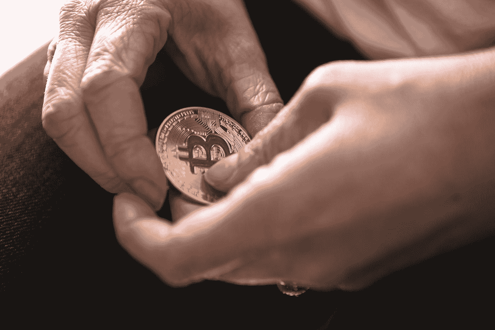

# 2021 年加密货币会怎么样？

> 原文：<https://medium.com/coinmonks/what-will-happen-to-cryptocurrencies-in-2021-d7bed87e7746?source=collection_archive---------3----------------------->

2021 年以加密货币的巨大繁荣开始。尽管如此，今年会发生什么仍然不清楚。[下一个比特币泡沫是否即将破灭？](/coinmonks/is-the-next-bitcoin-bubble-about-to-burst-6b5639d3258b)

Photo by [André François McKenzie](https://unsplash.com/@silverhousehd?utm_source=medium&utm_medium=referral) on [Unsplash](https://unsplash.com?utm_source=medium&utm_medium=referral)

比特币及其公司会再创新高吗？没有人能回答这种问题。尽管如此，我还是试着收集了一些指标。

# 机构利益