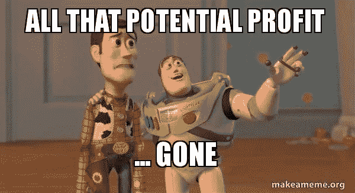
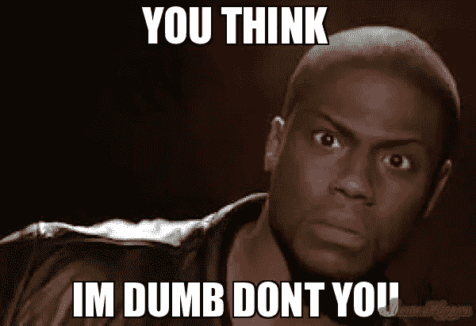
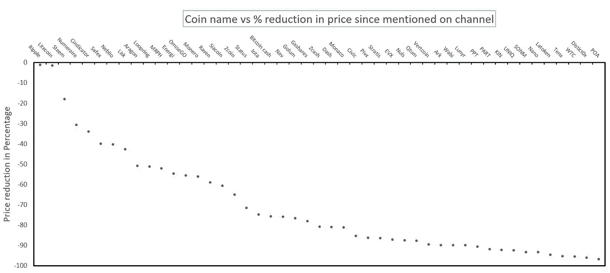
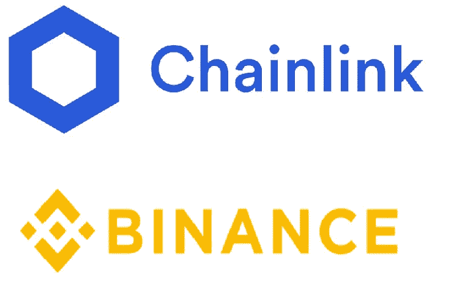

# 盲目追随 YouTube-ers 投资加密货币？

> 原文：<https://medium.com/coinmonks/what-would-have-happened-if-i-followed-a-youtubers-advice-for-investment-in-cryptocurrency-ac122b036142?source=collection_archive---------6----------------------->

## 不要扔掉你的钱

## 关于盲目投资比特币和其他加密货币的案例研究——基于流行社交媒体 cryptocurrency influence-r 的评论

Photo by [Jehyun Sung](https://unsplash.com/@jaysung?utm_source=medium&utm_medium=referral) on [Unsplash](https://unsplash.com?utm_source=medium&utm_medium=referral)

本文是给加密货币新老投资者的一条建议。这条建议是，永远不要因为一种加密货币在社交媒体上被提及就急于购买它，即使它是最好、最受信任的社交媒体加密货币账户。这可能对你们中的许多人来说是基本的，但我相信大部分新的和年轻的投资者仍然在许多项目中 FOMO。

> 永远不要去 FOMO(害怕错过)

像你我这样的投资者在购买加密货币硬币或代币之前会采取哪些合理的步骤？也许我们会查看价格，查看官方网站，书呆子可能会阅读白皮书，厚脸皮的人会查看团队，以及每个团队成员的 LinkedIn 个人资料，我们中的一些人可能会跳转到他们的官方社交媒体频道，查看讨论。

做这件事有捷径吗？也许只需要在 YouTube 上搜索一个关于硬币/代币的评论，然后根据其他人的评论做出我们的决定，据说他们已经做了所有这些事情。

这不是一个关于某个特定的优步的帖子。有一天我只是在想，如果我仅仅依靠别人对加密货币项目的研究来帮助我做出购买决定，那么结果会是什么样子？所以我想我会通过做一个案例研究来找到这个问题的答案。我选择 **DataDash** 是因为他有一个最好的、最受关注的加密货币 YouTube 频道。

本文的目的不是批评 DataDash 选择加密货币作为长期持有的选择，或他选择的项目，他认为这些项目具有良好的基本面，然后这些项目就夭折了。也不是为了宣传他那些以梦幻登月结束的优秀作品。目的是向人们强调盲目追随某人的后果，即使这个人可能是加密货币影响者中最聪明和最诚实的研究人员之一。

> DataDash 一直说，他的选择不是财务建议，总是向 DYOR 推荐(自己做研究)，甚至为长期投资组合添加你的选择。

> 但问题是，一旦你通过阅读白皮书、查看网站、与团队交谈等方式完成了尽职调查(所有这些以及更多 DataDash 在他的频道上提供的信息)，你最终损失资金的可能性有多大？

Photo by [bady abbas](https://unsplash.com/@bady?utm_source=medium&utm_medium=referral) on [Unsplash](https://unsplash.com?utm_source=medium&utm_medium=referral)

这就是我所做的。

每当在他的频道上第一次提到加密货币时，我都会列一个清单。我查看了当天这些加密货币的价格，并将其与当前价格进行了比较。总体而言，DataDash 在他的频道上提到了大约 80 个项目，包括比特币、以太坊、Dash 和 Monero。对于几乎所有的项目，他都向他的观众展示了一个很好的深入的基本面分析，涵盖了我上面提到的内容，有时甚至伴随着对与该项目相关的关键人物的采访。

这是结果。

***在他提到的那 80 个项目中，至少有 14 个项目是在他的频道上审核过的，完全死了。*** 我说的死，是指项目不再在任何地方交易，或者交易量甚至少于 2000 美元。这些包括神秘，底层，耐心，第一滴血，Regalcoin，和许多其他的。即使经过广泛的研究，这也是大约 18%的死亡率。

Source: [https://makeameme.org/meme/all-that-potential](https://makeameme.org/meme/all-that-potential)

在剩余的项目中，至少有 50 个项目的价格低于在他的渠道上提及当天的价格。

现在我知道不是每个人都会进入交易所，在市场上购买提到的硬币。但是必须有某种比较矩阵，我选择了那天的价格作为标准。

Source: [https://memeshappen.com/meme/kevin-hart-the-hell/you-think-im-dumb-dont-you-119418](https://memeshappen.com/meme/kevin-hart-the-hell/you-think-im-dumb-dont-you-119418)

这意味着，在过去的 2 年半时间里，如果你基于基本面、团队、白皮书、采访和其他通常构成良好研究的东西对加密货币进行长期投资，你会在 80%的情况下损失一部分资本。或者你可以说五分之四的投资会导致亏损。这种损失在 55%-90%之间。资本平均会损失 70%。

这些币有的提到 2017 年，有的提到 2018 年，有的提到 2019 年。你可能会说，过去几年市场一直是熊市，但如果一项长期投资连 2 年都撑不过，更别说 10 年了，那它还有什么意义呢？基本上，在加密货币的世界里，很难称一个东西为“长期投资”。

These coins are still alive and well. Some people dream that they will return to their ATH all time highs. Best of luck to all you dreamers out there.

这就给我们留下了 15 个项目，它们自被提及之日起，价格就一直在上涨。他们包括任、、本体论、Unibright、凯博网络、Icon、Cardano 等许多知名的名字。收益在 20%到 85%之间，平均利润为 56%。

这 15 种中的 13 种会给你带来 20%-100%的利润。只有两个项目做得非常好。自从在频道上提到这些以来，Chainlink 的价格上涨了 14 倍，而币安硬币(BNB)的价格上涨了 12 倍。

然而，仅仅因为一个项目在过去做得很好，就投资这个项目，真的要谨慎。

Projects that stood out

这是总结。假设每次 DataDash 在他的频道上提到一个加密货币硬币或代币，你就出去买了价值 100 美元的。他的频道上提到了大约 80 个项目，所以你的投资应该是 8000 美元。

> 考虑到所有的损失和失败的项目，你还有大约 7418 美元，净亏损只有 7.2%。

是好是坏？你可以自己决定。但也要问问自己盲目跟风的风险有多大。

最后，总结一下我的想法，以下是我的一些建议:

1.  不要购买加密货币作为长期投资。这适用于 99%的项目。
2.  列出购买任何硬币/代币的最低要求。某个可信的人的评论应该只是列表中的一个复选框。
3.  基本面分析只会告诉你哪种加密货币比其他的好。不要一发现人们谈论的话题就买。技术分析告诉你什么时候买入。
4.  学习技术分析的一般概念，均线，MACD，至少一些你完全理解的指标。如果你对技术分析一无所知，你会冒很大的风险。只需点击其中一个指标，就可以在短短一秒钟内让你摆脱损失的痛苦。
5.  使用美元成本平均法(DCA)。
6.  止损是必须的。即使你把慷慨的止损放在 30%，损失 30%也比损失 100%的资本好。
7.  从来没有 FOMO。
8.  增长见识，能学多少学多少。
9.  如果你发现了你认为可疑的最小的东西，远离那种加密货币
10.  爱你的钱。把交易当成自己的事业。

祝你好运！请在评论中告诉我你对这篇文章的看法，或者你是否希望我查看其他社交媒体账户。

声明:分享的信息仅供娱乐。它不能作为投资建议、财务建议、交易建议或跟随任何人做出投资决策的建议。在做出任何投资决定之前，请进行尽职调查。

> [在您的收件箱中直接获得最佳软件交易](https://coincodecap.com/?utm_source=coinmonks)

