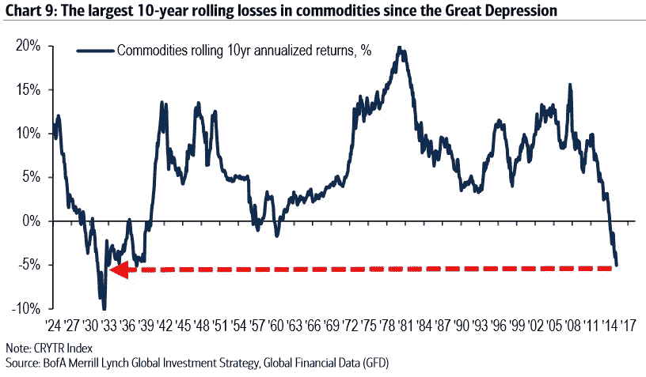
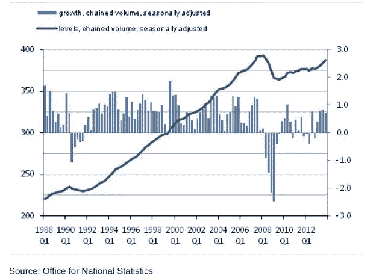

# 哈耶克会对 2019 年的经济说些什么

> 原文：<https://medium.com/coinmonks/what-would-hayek-say-about-2019-world-economy-823b851dbdfd?source=collection_archive---------1----------------------->

经济有其自然周期。惊人的相似之处经常可以在历史的不同部分找到。

20 世纪 20 年代英国大萧条后，哈耶克认为私人投资，而不是政府支出，将促进可持续增长。哈耶克从来都不是政府赤字支出理论的信徒，这一理论几个世纪以来一直由凯恩斯派统治着西方政府决策学术界。

在凯恩斯的赤字支出理论中，市场流通中更多的钱会刺激经济——没有人会对这种说法提出异议。经济是在任何给定的市场中人类之间发生的交易链的总和。人们用金钱或信用来交换商品、服务或金融资产。支出推动经济的方式是——一个人的支出是另一个人的收入。一个人每花一美元，另一个人就赚一美元。一个人挣的每一美元，都被其他人花掉了。当一个人的收入上升时，会发生两件事——1)他愿意花更多的钱；2)他成为合格的借款人，有资格借更多的钱。“收入——借贷——支出——生产率——收入”是数十亿个微观经济循环中的一个，这个循环不断自我强化，最终导致宏观经济循环——通货膨胀或衰退。

1931 年，在 F.A .哈耶克首次在伦敦经济学院巡回演讲期间，他首次提出了一个前所未有的观点——就业和总支出之间没有直接和积极的关系，也就是说，如果一个人决定用政府发放的信贷购买一件昂贵的外套，这不仅没有帮助，反而会恶化就业率。他批评央行发行无根据的纸币扰乱了市场秩序和生产力，从长远来看扰乱了社会资源配置，从而恶化了就业。哈耶克坚持认为，健康经济循环的决定性因素是对银行储蓄的管理，而不是有助于可持续增长的支出。不应该鼓励无根据的消费。货币政策保持中立。工业和商业产品之间的相对定价不应受到资本力量的干扰。

在《通论》中，凯恩斯声称总需求和就业之间可能存在直接关系。总需求决定就业水平。失业的存在表明总需求不足。随着时间的推移和经济的恶化，学者们开始质疑权威。

根据哈耶克的观点，失业通常集中在某个部门、行业或生产阶段，必须由企业家自愿决定将额外的支出和开支分配到处于危机中的特定部门。“如果政府支出在不同于劳动力分布的行业和职业之间分配，仅仅增加资本不会增加就业。”

市场是一台复杂的机器，时间在其中的作用是生产结构的一个关键部分。当需求上升时，供给不会立即以平行、同步的方式增加。没有银行储蓄，总会有时间的流逝和供给的短缺，从相对长期来看，会产生通货膨胀。他主张尽可能降低利率，以鼓励私人投资，同时尽可能减少政府干预。私人投资，而不是政府支出，将促进可持续增长。

在 21 世纪的今天，在许多行业部门蓬勃发展之后，2019 年似乎是他们形容“像一个醉汉在头天晚上之后呕吐的早晨”的一年。注射更多的吗啡不会阻止不可避免的痛苦。正如哈耶克所强调的，不可持续的繁荣不可能无痛复苏。归根结底，防止下滑痛苦的唯一方法是从一开始就避免繁荣。

> [在您的收件箱中直接获得最佳软件交易](https://coincodecap.com/?utm_source=coinmonks)

