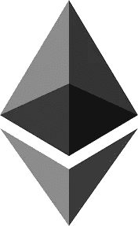
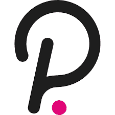
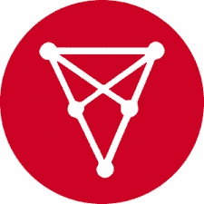
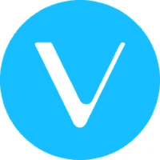
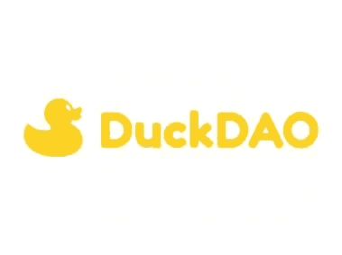

# 当熊来找你的时候你会怎么做？

> 原文：<https://medium.com/coinmonks/what-you-going-to-do-when-the-bears-come-for-you-59e74e5aa587?source=collection_archive---------10----------------------->

尽管我仍然非常乐观，但很明显，这波牛市将会结束，很可能在未来 6 个月内结束。知道这个世界末日事件的确切日期是不可能的，即使是最老练的秘密头脑也对此一无所知。然而，我开始计划的一件事是，在熊市深处买什么，为下一轮牛市做准备。

下面我将讨论一些我将在下一轮牛市中长期持有的硬币。

**以太坊**

如果你在寻找一枚硬币的可靠风险回报比，以太坊是首选。毫无疑问，随着加密市场的增长，以太坊也将随之强劲增长，很明显，它将长期存在。

许多人认为，随着 Solana 和 Polygon 等更便宜的网络选项开始出现，以太坊网络上当前的高油价将在长期内消失。然而，我完全相信，随着 ETH 2.0 在明年某个时候问世，它有望大幅降低以太坊天然气价格，以太坊将保持其智能合约平台之王的地位。

即使你可能不指望以太坊在下一轮牛市中为你提供 1000 X，但你可以期待的是一枚始终表现稳健的硬币，如果你愿意 HODL，它将为你提供长期利润。

**波尔卡多**

除了拥有密码领域最伟大的开发人员之一(Gavin Wood)站在他们工作的最前沿之外，Polkadot 还拥有巨大的发展潜力。

Polkadot Parachains 于今年早些时候推出，尽管 Polkadot 的价格自推出以来没有上涨，但现在希望在 Polkadot 上推出的项目数量完全令人着迷。Polkadot 生态系统中目前有 79 个加密项目(2021 年 12 月),这个数字将呈指数级增长。“以太坊杀手”这个词经常被提起，我个人认为没有什么能获得这样的荣誉，但 Polkadot 肯定会成为以太坊在这个领域的主要竞争对手，这也是为什么我会在下一个熊市时买入 dot 的主要原因。

DOT 的上升潜力比 ETH 更大，但更大的回报也带来更大的风险，所以如果你想为下一轮大牛市做好准备，请记住这一点。

**奇里兹**

我坚信，在未来，Fan tokens 将成为加密领域的主要玩家。体育俱乐部的粉丝在俱乐部决策中拥有发言权，同时获得免费门票等会员特权的能力肯定会越来越受欢迎。

Chiliz 是迄今为止最大的粉丝代币交易平台，每天都会发布越来越多的粉丝代币。目前，粉丝令牌是加密市场的一个利基部分，但我认为随着时间的推移，这个领域将成为更主流的领域，因此我们将看到这个领域的价值大幅上升。

如果这种情况成为事实，Chiliz 无疑会看到其整体价值大幅上升，我认为它目前的价格只是令牌可能会在未来几年爆炸的开始。

**Vechain**

当寻找一个具有良好基础的令牌时，Vechain 是最好的。其主要目的是加强供应链管理和业务流程。关于 Vechain 如何做到这一点的细节非常深入，需要自己写一篇文章。

Vechain 已经与 DHL 和宝马等大公司建立了合作伙伴关系，这表明了这一令牌的潜力。它也是对抗气候变化的主要密码。随着这个问题变得越来越重要，毫无疑问，许多人将寻求投资加密货币，为他们的商业模式提供更可持续的方法。

如果以上还不够，Vechain 提供了一个非常慷慨的赌注计划，根据该计划，您可以将您的 VET 令牌作为赌注，作为交换，您可以获得一枚 VTHO 的新硬币，该硬币与 Vechain 生态系统相关联。许多交易所提供不同的利率，所以货比三家，找到最高的 APY。

**鸭刀**

Dao 无疑在加密领域获得了更多的关注，有点像最近的元宇宙热潮，我认为我们看到 Dao 令牌的某种发展只是时间问题。有一个刀令牌是我已经花了很长时间大量投资的，那就是鸭刀。

拥有 Duck Dao 代币的主要好处是，你有机会以低于代币发行价的价格投资一个新的密码。最近几周，鸭道在 Bloktopia 获得了一席之地，其利润约为 40000%。是的，你没听错，400 倍！！！当然，并不是所有的初创企业都像 Bloktopia 一样表现出色，但你所需要的只是做对一家，而这种收获是令人垂涎的。

鸭道实行等级制度，等级越高，获得的奖励就越多(个人上限越大，保证进入硬币，等等)。在熊市期间，我会努力积累，并从我目前所在的位置进入下一层。鸭道一角硬币(鸭道的本土代币)目前的市值排名为 823(2021 年 12 月)，因此在未来几个月和几年中有很大的增长空间。

**结论**

俗话说，百万富翁是在熊市中诞生的，当你想到这一点时，你会发现这是符合逻辑的。不幸的是，许多人会在下一次大崩溃后离开 crypto，因为他们认为这是一个“庞氏骗局”或对他们来说风险太大的东西。每个人当然都有权发表自己的意见，但我完全相信这个领域将继续繁荣，并成为自 20 世纪 90 年代末 web 2.0 以来对技术的最大破坏。这是一生的投资机会，当熊市到来时，我将为另一次颠簸的太空之旅装载我的月球袋。

尽管我看上去是一个金融天才(感谢各位，这意味着很多)，但我肯定没有资格给出金融建议，也永远不会寻求这样做。当寻求投资时，请 DYOR，并确保投资是正确的。

> 加入 Coinmonks [电报频道](https://t.me/coincodecap)和 [Youtube 频道](https://www.youtube.com/c/coinmonks/videos)了解加密交易和投资

# 另外，阅读

*   [5 款最佳加密交易终端](https://coincodecap.com/crypto-trading-terminals) | [最佳 DeFi 应用](https://coincodecap.com/best-defi-apps)
*   [比特币基地 vs 瓦济克斯](https://coincodecap.com/coinbase-vs-wazirx) | [比特鲁点评](https://coincodecap.com/bitrue-review) | [波洛涅克斯 vs 比特鲁](https://coincodecap.com/poloniex-vs-bittrex)
*   [德国最佳加密交易所](https://coincodecap.com/crypto-exchanges-in-germany) | [Arbitrum:第二层解决方案](https://coincodecap.com/arbitrum)
*   [币安交易机器人](/coinmonks/binance-trading-bots-d0d57bb62c4c) | [OKEx 评论](/coinmonks/okex-review-6b369304110f) | [阿塔尼评论](https://coincodecap.com/atani-review)
*   [最佳加密交易信号电报](/coinmonks/best-crypto-signals-telegram-5785cdbc4b2b) | [MoonXBT 评论](/coinmonks/moonxbt-review-6e4ab26d037)
*   如何在 Bitbns 上购买柴犬(SHIB)币？ | [买弗洛基](https://coincodecap.com/buy-floki-inu-token)