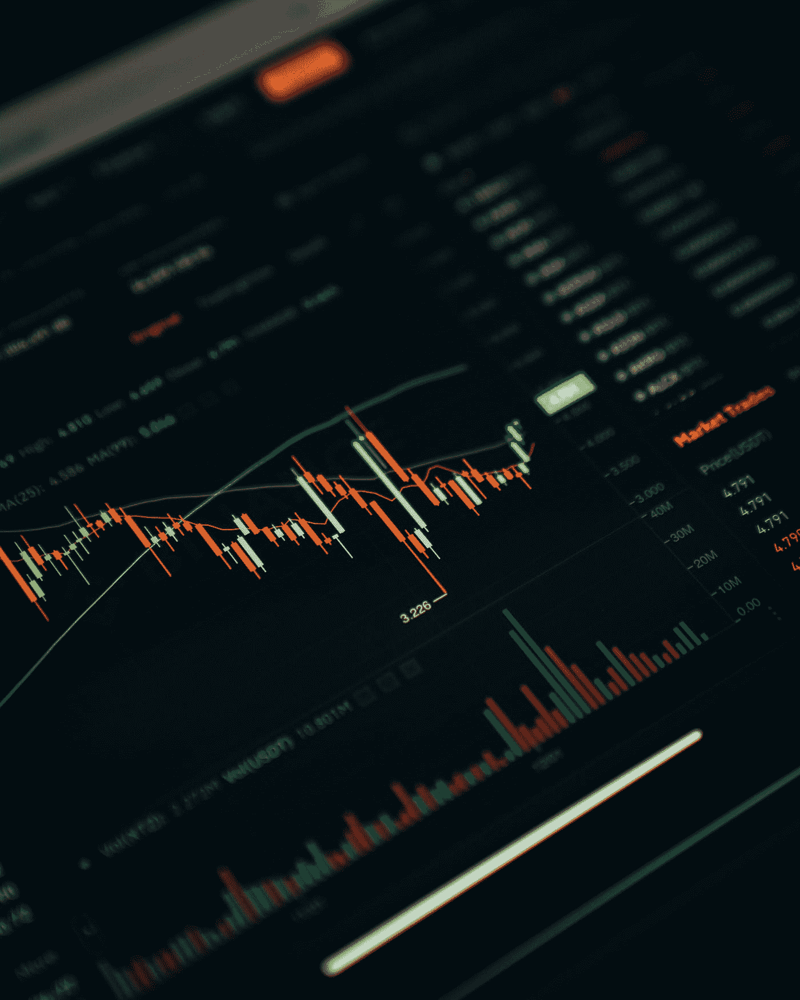

# 投资加密货币之前你必须知道的事情

> 原文：<https://medium.com/coinmonks/what-you-must-know-before-investing-in-cryptocurrency-8d8427c19d37?source=collection_archive---------12----------------------->

Photo by [Dylan Calluy](https://unsplash.com/@dylancalluy?utm_source=medium&utm_medium=referral) on [Unsplash](https://unsplash.com?utm_source=medium&utm_medium=referral)

谈到加密货币，投资者面临的最大挑战之一是不要被炒作所困。数字货币在许多散户和机构投资者的投资组合中占据了越来越重要的位置。与此同时，分析师继续警告投资者注意其波动性和不可预测性。

如果你已经决定像其他投资一样投资加密货币市场，在交出任何资金之前做好研究是很重要的。下面，我们将探讨投资前你需要知道的事情。

# 关键要点:

*   谈到加密货币，投资者面临的最大挑战之一是不要被炒作所困。
*   除了研究区块链技术，花时间了解不同的货币。
*   有许多关于区块链技术的初级读本可供外行人理解。
*   当你考虑一项投资时，花点时间阅读该项目的白皮书。

# 考虑一下你为什么投资加密货币

或许在进行加密货币投资之前，你应该问自己的最根本的问题是，你为什么要这样做。目前有无数投资工具可供选择(其中许多比数字货币更稳定、风险更低)。

你感兴趣仅仅是因为加密货币热潮趋势吗？还是有更有说服力的理由投资一个或多个特定的数字代币？当然，不同的投资者有不同的个人投资目标，探索加密货币空间对一些人来说可能比其他人更有意义。

# 感受一下这个行业

尤其是对于不熟悉数字货币的投资者来说，他们在投资前了解数字货币世界的运作方式是至关重要的。花点时间了解不同的货币。有数百种不同的硬币和代币可用，重要的是要超越比特币、以太和 Ripple 等大牌。

此外，为了理解加密世界的这一方面是如何工作的，探索区块链技术是很重要的。

如果你没有计算机科学或编码背景，区块链技术的某些方面对你来说可能是一个挑战。有许多关于区块链技术的初级读本可供外行人理解。

一旦你确定了要投资的一种(或几种)加密货币，看看这些代币是如何使用区块链技术的，以及它们是否有任何创新，使它们有别于该行业的其他货币。通过更好地了解加密货币和区块链技术，你将更充分地准备确定一个潜在的投资机会是否值得。

# 加入加密货币爱好者的在线社区

因为数字货币空间是一个非常时髦的领域，所以发展非常迅速。这是因为有一个强大而非常活跃的数字货币投资者和爱好者社区，他们 24 小时相互沟通。

加入这个社区，了解加密货币领域正在进行的讨论。Reddit 已经成为数字货币爱好者的中心，但也有许多其他在线社区一直在进行积极的讨论。

# 阅读加密货币白皮书

然而，比口碑更重要的是一种数字货币的独特性。当你考虑一项投资时，花时间研究该项目的白皮书。每个加密货币项目都应该有一个，并且应该容易访问(如果不是，就把它当作一个危险信号)。

仔细阅读白皮书；它应该告诉你关于项目开发人员在他们的工作中想要什么的一切，包括截止日期、项目概述和规范。如果白皮书没有包括项目的数据和具体细节，它通常被视为负面的。白皮书为开发团队提供了一个机会来决定谁、什么、什么时候和为什么进行他们的项目。如果白皮书中的某些内容看起来不完整或令人困惑，它可以谈论项目的基本问题。

# 时机是关键

经过勤奋的研究，你对加密货币行业产生了一种感觉，你可能已经确定了一个或多个投资项目。下一步是你投资的时机。数字货币的世界发展迅速，而且众所周知非常不稳定。

一方面，在热门新货币的人气和价值爆炸之前买入，可以促使投资者同样快速地行动。然而，在现实中，如果你在采取任何行动之前监控这个行业，你更有可能看到成功。加密货币遵循特定的价格模式。比特币通常在数字货币中领先，数字货币遵循其通常的轨迹。交易所黑客、欺诈或价格操纵的消息肯定会在加密货币领域产生冲击波，因此关注该领域正在发生的事情非常重要。

最后，记住数字货币是高度投机的领域。对于每天晚上的比特币百万富翁来说，还有许多其他投资者将钱倒入虚拟令牌竞技场，却只能看到钱消失。投资这一领域意味着承担风险。通过在投资前做足功课，你给了自己最大的成功机会。

# 阅读更多信息:

投资加密交易所需要了解什么？

[5 位通过比特币成为百万富翁的人](https://xbmproject.com/index.php/2021/12/20/5-people-who-become-millionaire-from-bitcon/)

[如何赚取稳定的利息？](https://xbmproject.com/index.php/2021/12/22/how-to-earn-interest-on-stablecoins/)

*原载于 2021 年 12 月 28 日 https://xbmproject.com***。**

> *加入 Coinmonks [电报频道](https://t.me/coincodecap)和 [Youtube 频道](https://www.youtube.com/c/coinmonks/videos)了解加密交易和投资*

# *另外，阅读*

*   *[MoonXBT vs Bybit vs 币安](https://coincodecap.com/bybit-binance-moonxbt) | [Arbitrum:第二层解决方案](https://coincodecap.com/arbitrum)*
*   *[买 PancakeSwap(蛋糕)](https://coincodecap.com/buy-pancakeswap)|[matrix export Review](https://coincodecap.com/matrixport-review)*
*   *[最佳免费加密信号](https://coincodecap.com/free-crypto-signals) | [YoBit 评论](/coinmonks/yobit-review-175464162c62) | [Bitbns 评论](/coinmonks/bitbns-review-38256a07e161)*
*   *[OKEx 评论](/coinmonks/okex-review-6b369304110f) | [Kucoin 交易机器人](/coinmonks/kucoin-trading-bot-automate-your-trades-8cf0ca2138e0) | [期货交易机器人](/coinmonks/futures-trading-bots-5a282ccee3f5)*
*   *[AscendEx Staking](https://coincodecap.com/ascendex-staking)|[Bot Ocean Review](https://coincodecap.com/bot-ocean-review)|[最佳比特币钱包](https://coincodecap.com/bitcoin-wallets-india)*
*   *[霍比评论](https://coincodecap.com/huobi-review) | [OKEx 保证金交易](https://coincodecap.com/okex-margin-trading) | [期货交易](https://coincodecap.com/futures-trading)*