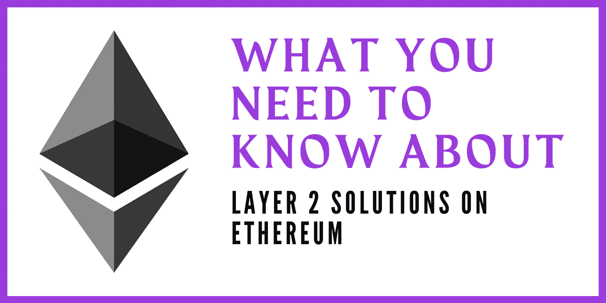
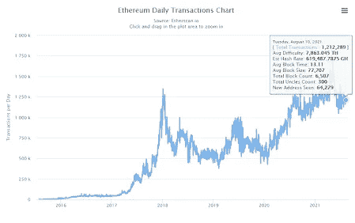
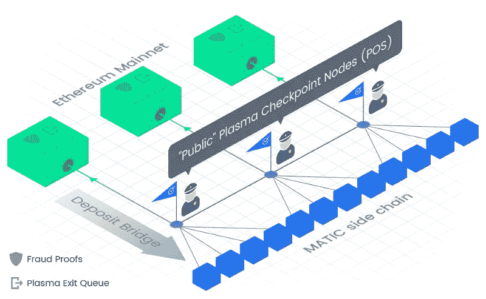

# 关于以太坊的第 2 层解决方案，你需要知道什么

> 原文：<https://medium.com/coinmonks/what-you-need-to-know-about-layer-2-solutions-on-ethereum-8105f366a8d0?source=collection_archive---------6----------------------->

## 以太坊可扩展性

## 以太坊第 2 层的简要介绍

Image by Author

4 月的一天，你在 CoinGecko 和 CoinMarketCap 上对一些代币进行了研究，你偶然发现了一个代币，你认为它将是你投资组合的下一个 1000 倍的机会。您知道*‘下一个 1000 倍令牌’*可在 UniSwap 上交换。于是你上了 UniSwap，登录了你的 MetaMask 钱包，上了以太坊主网，用价值 50 美元的 USDC 兑换了*‘下一个 1000 倍代币’。*

## 但是等等…

在你确认你的交易之前。你意识到“平均”交易费是 30 美元，然后…你停滞了。你接着开始查 [*“为什么今天以太坊煤气费贵？”*](https://www.cryptopolitan.com/why-is-ethereum-gas-price-so-high/) 上*‘谷歌大叔’。你的研究告诉你，以太坊区块链正经历着大量的交易，反过来造成链上的拥挤。尽管汽油费高于正常水平，但你决定同意支付汽油费，并且只能购买价值 20 美元的新研发的*“下一个 1000 倍代币”。**

*在接下来的几个小时里，你回到你的桌面，打开你的 Twitter feed，阅读一堆“加密 Twitter”的恶作剧(就像我们许多人做的那样)。你偶然看到一条推特说“我刚刚用 Quickswap 上的 USDC 在 Polygon Network 上换了不到 1 美元”。你的眼睛睁得大大的，你想知道这怎么可能。所以你做你最擅长的——你自己做研究。*

*你的研究最终把你带到了这个你从未听说过的新术语，业内人士称之为“第二层”。在你的桌面上做了几个小时的研究后，你最终确信你应该尝试一下。你决定将你的资金从以太坊转移到名为[多边形网络](https://polygon.technology/)的第二层协议上。乍一看，你不知道这是如何工作的。于是你又在‘谷歌叔叔’上搜索了一下，[“如何把资金从以太坊转移到多边形”](/coinmonks/3-steps-to-move-funds-from-ethereum-to-polygon-3d694c620884)结果证明是救星，帮你节省了一些时间。*

*以太坊上有太多的第二层解决方案，每一个都互不相同。我们将进一步了解什么是第 2 层解决方案，以及这一想法是如何产生的。*

*但首先，让我们深入了解什么是第 1 层。*

# *让我们探索“什么是第 1 层”*

*第一层通常用来描述区块链的主要建筑。最常见的第一层区块链是比特币、以太坊、波尔卡多特和索拉纳(仅举几例)。每一个都有不同的功能和特点。今天，我们将围绕以太坊的第 1 层协议进行讨论，该协议充当网络上发生的所有交易的结算层。*

*扩展以太坊第 1 层最常用的解决方案之一是增加块大小，这反过来也将增加每个块可以验证的交易数量，称为[气体限制](https://ethereum.org/en/developers/docs/gas/#what-is-gas-limit)，当矿工达成共识增加限制时。虽然这可能对以太坊矿工有利，因为他们可以分享他们获得的回报——提高天然气限制可能有风险，因为更大的区块需要使用更多的能源才能从矿工那里最终确定，并且额外增加了[链分裂的可能性](https://decryptionary.com/dictionary/chain-split/#:~:text=A%20chain%20split%20is%20a,by%20computers%20running%20cryptocurrency%20technology.&text=However%2C%20if%20the%20network%20of,their%20own%20chain%20of%20recordings.)。*

*Image: [etherchain_org’s](https://twitter.com/etherchain_org) Tweet*

*随着越来越多的交易在以太坊区块链上发生，它将变得越来越拥挤，因此，用户将不得不承担更高的煤气费，更不用说，交易时间的延迟也会导致瓶颈，导致[用户寻找替代解决方案](/ngrave/layer-1-vs-layer-2-wheres-the-next-block-party-at-6f735de4b877)。*

# *转向第 2 层解决方案*

*以太坊的成功改变了世界金融体系，这是前所未有的，而且已经取得了很大的进展。尽管以太坊有着令人难以置信的壮举，但它的规模能力一直受到挑战——它经常拥堵的网络将天然气价格推至图表之外。为了应对这一挑战，多个开发人员和以太坊社区中的人们提出了第 2 层解决方案。一个著名的第二层解决方案聚合器是 [Polygon Network](https://polygon.technology/technology/) ，目前提供[等离子](https://ethereum.org/en/developers/docs/scaling/plasma/#:~:text=A%20plasma%20chain%20is%20a,copies%20of%20the%20Ethereum%20Mainnet.)和 [PoS 链](https://finematics.com/polygon-commit-chain-explained/)，一系列其他解决方案即将推出(稍后将详细介绍)。Vitalik Buterin 和 Joseph Poon 过去曾提出过[第 2 层解决方案，如](https://ethresear.ch/t/cross-rollup-dex-with-smart-contracts-only-on-the-destination-side/8778)[等离子体技术](https://plasma.io/plasma.pdf)在以太坊网络上实施，以增强以太坊的可扩展性。*

*社区中的许多人也希望以太坊 2.0 早点到来。但是，Eth 2.0 的全面发布不会是近期的事情。随着以太坊的日交易量达到超过 100 万笔的峰值，许多人开始意识到需要另一种方式。*

*这就是第 2 层解决方案的用途。*

**

**Image:* [*Etherescan*](https://etherscan.io/) *— Ethereum Daily Transaction**

# *乘着 L2 的浪潮*

*第二层(L2 的)建造在第一层区块链的上面，在这里是以太坊。构建它们是为了[提高主区块链的可伸缩性](/monolith/understanding-defi-layer-2-explained-6981ef6c8990)并将一些事务从主链转移到彼此并行运行的“侧链”上。*

*回顾过去，看看以太坊面临的高油价和交易速度延迟的挑战，第 2 层解决方案提供了一种提高交易速度和降低油价的方法，同时受益于以太坊主链的安全性。在许多情况下，L2 的每秒处理交易的能力超过了以太坊。目前，以太坊每秒只能处理 15 到 30 个事务(TPS)T1，而第二层解决方案，如 T2 多边形网络，声称在他们的测试网上的压力测试中可以处理 7000 个 TPS T3。然而，目前它处理超过 80 个 TPS。*

*这是多边形网络上混合等离子体和 PoS 链之间相互作用的图像。*

**

*Illustration: Polygon Network on [Matic Blog](https://blog.matic.network/what-is-matic-network/)*

*那么，多边形网络是如何让以太坊更具扩展性和安全性的呢？*

*对于等离子技术，每 256 块它将得到 [Merkle Root](/@dongha.sohn/bitcoin-5-pool-merkle-root-272a9c83dec7) (警官字符)，这仅仅意味着该块中交易的加密过程；并将其定向到以太坊区块链(绿色方块)上的“检查点”。这增强了交易的安全性和证明。*

*这种混合伙伴关系的 PoS 部分在高性能和安全性之间提供了一个中间点。作为利益证明(PoS)链，需要有 2/3 的验证者(蓝色块)来签署多边形链上发生的交易。其中最有趣的一点是，当一项交易被提交到以太坊区块链作为证据时，它也可能受到以太坊连锁店的质疑。*

*如果证明被发现是错误的，签署证明的验证者可能会失去他们的股份，也可能被禁止进入网络。这是多边形的第二层发挥作用的高安全性的一部分。*

*然而，除了等离子体，还有更多第 2 层缩放解决方案。我们将不得不在另一个时间深入那些。同时，这是我用来了解第 2 层解决方案的两个最佳资源:*

*   *[伊万上科技学院](https://academy.ivanontech.com/blog/layer-2-explained-what-are-layer-2-solutions)*
*   *[以太坊开发者文档](https://ethereum.org/en/developers/docs/scaling/layer-2-rollups/#:~:text=Layer%202%20is%20a%20collective,decentralized%20security%20model%20of%20Mainnet.&text=This%20can%20make%20using%20Ethereum%20very%20expensive.)*

**感谢收听，任何意见表达(如有变更，恕不另行通知)都是我(作者)个人的，我(作者)不保证所提供的任何信息或分析的准确性或完整性。**

***在推特上关注我:** [@0x_idkcrypto](https://twitter.com/0x_idkcrypto)*

> *加入 [Coinmonks 电报频道](https://t.me/coincodecap)，了解加密交易和投资*

## *另外，阅读*

* [## 最佳加密交易所| 2021 年十大加密货币交易所

### 加密货币交易所的加密交易需要了解市场，这可以帮助你获得利润…

blog.coincodecap.com](https://blog.coincodecap.com/crypto-exchange)  [## 2021 年 9 大最佳加密借贷平台

### 当谈到加密货币贷款时，大量因素等同于良好的收入状况。此外，借款的一部分…

blog.coincodecap.com](https://blog.coincodecap.com/crypto-lending)  [## 2021 年最佳加密交易机器人(免费和付费)

### 2021 年币安、比特币基地、库币和其他密码交易所的最佳密码交易机器人。四进制，位间隙…

medium.com](/coinmonks/crypto-trading-bot-c2ffce8acb2a)  [## 最佳 4 个加密交易信号电报通道

### 这是乏味的找到正确的加密交易信号提供商。因此，在本文中，我们将讨论最好的…

medium.com](/coinmonks/best-crypto-signals-telegram-5785cdbc4b2b)  [## BlockFi 评论 2021:利弊和利率

### 今天，我们提出了一个全面的 BlockFi 评论，这是一个成立于 2017 年的加密贷款平台，拥有其…

blog.coincodecap.com](https://blog.coincodecap.com/blockfi-review)  [## 如何在印度购买比特币？2021 年购买比特币的 7 款最佳应用[手机版]

### 如何使用移动应用程序购买比特币印度

medium.com](/coinmonks/buy-bitcoin-in-india-feb50ddfef94)  [## 加密税务软件——五大最佳比特币税务计算器[2021]

### 不管你是刚接触加密还是已经在这个领域呆了一段时间，你都需要交税。

medium.com](/coinmonks/best-crypto-tax-tool-for-my-money-72d4b430816b)  [## Pionex 评论 2021 |免费加密交易机器人和交换

### Pionex 是为交易自动化提供工具的后起之秀。Pionex 上提供了 9 个加密交易机器人…

medium.com](/coinmonks/pionex-review-exchange-with-crypto-trading-bot-1e459d0191ea)  [## 存储比特币的最佳加密硬件钱包[2021]

### 保管您的数字资产很容易，但找到正确的存储方式却是一项繁琐的任务。在线钱包有一个风险…

blog.coincodecap.com](https://blog.coincodecap.com/best-hardware-wallet-bitcoin)*