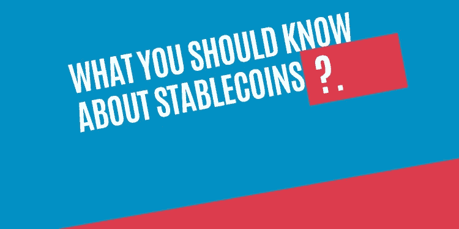
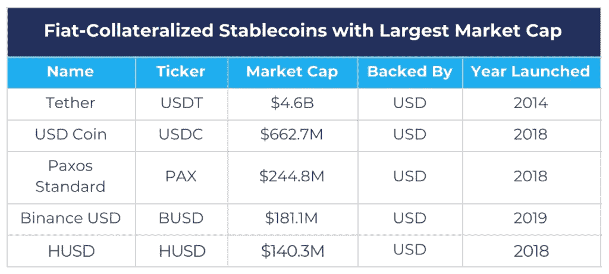
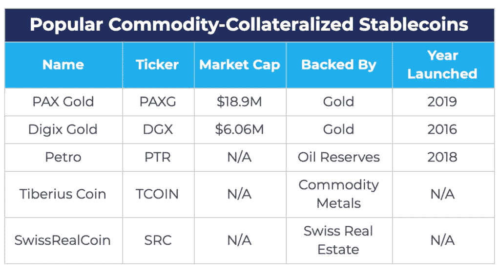
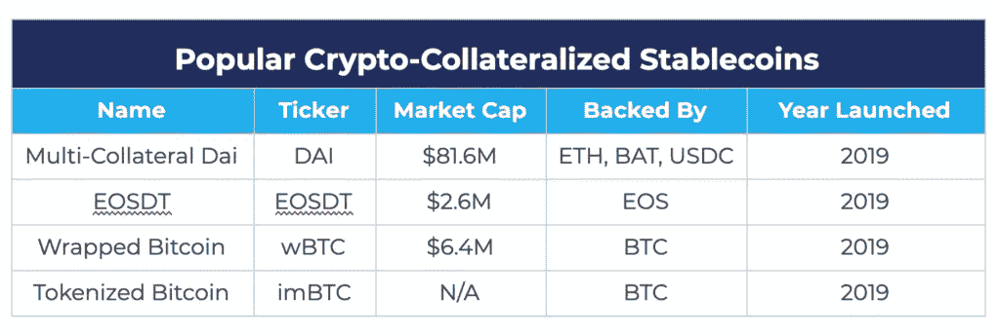
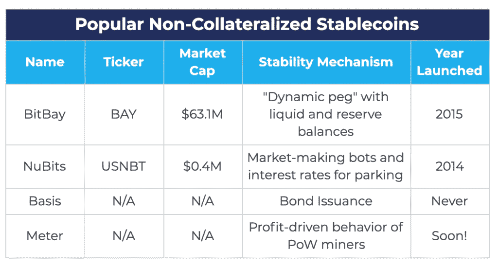

# 关于 StableCoins 你应该知道什么？

> 原文：<https://medium.com/coinmonks/what-you-should-know-about-stablecoins-cf2a00ac610b?source=collection_archive---------2----------------------->

## 一种波动性降低的硬币，称为稳定硬币，适合日常使用，但仍然有许多关于稳定硬币的事情你不知道。

在比特币之后，如此多的加密货币推出，如果你检查 coinmarketcap，你可以找到数千种加密货币列在那里。大多数硬币波动性很大，这使它们适合投资，但对于日常使用，稳定的硬币开始发挥作用。

在这篇文章中，我们将读到一些关于稳定收入的重要事情，并了解其对经济的影响。

# 什么是稳定币？

基本上，稳定硬币是这些价值与某种资产挂钩的硬币，这种资产可以是纸币、黄金或石油。Stablecoins 的创建是为了给你一种法定货币的体验，它可以方便地用于日常使用，如购买冰淇淋、比萨饼等。

如果你比较稳定的硬币和其他硬币，那么如果其他硬币是过山车，那么稳定的硬币就是玩具火车。

一些稳定的硬币是由抵押品创造的，也就是说，当一些稳定的硬币进入流通时，同样数量的硬币会被存入银行。

Stablecoins 只不过是区块链技术创造的数字菲亚特，所以让我们深入了解 stablecoins { [参考](https://en.wikipedia.org/wiki/Stablecoin) }。

# 马厩的历史

如果你认为稳定数字货币的概念是新的，那你就错了，因为稳定数字货币的概念实际上已经非常古老了。

1996 年，Gold & Silver Reserve Inc .推出了 E-gold，用户账户以黄金克数计价，因此一个用户可以轻松地向其他用户转移价值，但一段时间后，由于法律问题，它停止了工作{ [参考](https://en.wikipedia.org/wiki/E-gold) }。

2006 年，哥斯达黎加又开始了一项名为“自由储备”的稳定硬币服务。用户只需一个名字、电子邮件地址和出生日期就可以创建一个账户并进行转账。Liberty Reserve USD 和 Liberty Reserve euro 分别与美元和欧元挂钩，但在洗钱案中，该公司于 2013 年被美国政府关闭。

我们没有数据显示过去有多少稳定币发行和关闭，但是今天稳定币的情况要好得多。

# Stablecoins 可以用来做什么？

Stablecoins 有一个个人和机构用例，我在下面描述了一些全面的用例。

## 1.日常购物和支付

由于稳定的硬币是法定货币的合适替代品，所以它可以很容易地取代美元，欧元或您的当地货币，所以不需要携带现金和卡。您可以使用 stable coin 支付员工的工资，因此 stable coin 有能力改变您使用金钱的方式。

## 2.跨境转移

2018 年，研究发现，6.89 亿美元的资金跨境转移，主要是由移民工人进行的，他们使用的支付网关速度慢，费用高，所以稳定的硬币开始发挥作用，因为现在使用稳定的硬币，你可以通过小额费用立即向任何边境汇款{ [参考](https://www.worldbank.org/en/news/press-release/2019/04/08/record-high-remittances-sent-globally-in-2018) }。

## **3。稳定的交易资产**

通过使用 stablecoins 零售和机构交易者，获得很多好处，因为你知道密码市场是非常不稳定的，如果你试图将你的密码转换成菲亚特需要很长时间，但 stablecoins 会保护你免受市场波动的影响，以最大限度地提高你的利润。

Stablecoins 为您提供了进入和退出加密市场的灵活性，而无需将您的加密转换为收费高昂的菲亚特。

## 4.防止通货膨胀

你可能不知道，像委内瑞拉这样的许多国家正面临着法定通货膨胀问题，因为法定货币依赖于许多因素来增加或减少其价值，但是稳定的货币通货膨胀规则不起作用，所以我们可以使用稳定的货币来保护我们的货币免受通货膨胀的影响。

Brutal inflation in Venezuela. Graph courtesy of Statista/IMF

# 稳定曲线的类型

基本上，稳定币有三种类型，让我们简单地讨论每一种。

## 1.资产抵押债券

资产抵押债券由其他资产支持，有助于维持其价格，你可以随时赎回你的资产。

基本上，资产抵押债券由三种类型的资产支持:1。法定货币，2。商品，3。加密货币，所以我们来了解一下。

1.  **法定抵押债券**

每一个数量的法定抵押新稳定硬币印刷，这意味着如果 100 万美元的稳定硬币在流通，那么应该有 100 万美元的法定储备在某个地方，当你兑现你的稳定硬币时，你兑现的数量从储备中得到支付，稳定硬币被销毁。

按照市值计算，Tether 是 coinmarketcap 中排名第三的稳定货币，但 Tether 背后的 Bitfinex 公司去年透露，只有 74%的 Tether 由现金和证券支持。这是菲亚特支持的 stablecoins 的关注点，即信任一个中央实体。

使用菲亚特支持的 stablecoins 的最大优点是理解和使用非常简单，因为人们非常熟悉菲亚特系统，但菲亚特支持的 stablecoins 的最大缺点是，因为它们是在集中式系统之上创建的，这意味着单点故障，信任问题会出现，因为你不知道他们是否正确保留菲亚特，监管监督和效率低下。

2.**商品抵押债券**

商品抵押债券由黄金、房地产和石油等商品支持。

它让你可以零头购买商品，因为在现实中，你不能零头购买黄金或石油，你也不需要考虑你储存的黄金的安全性，因为它是数字化的形式，所以你可以长期储存它们，商品支持的稳定币比法定支持的稳定币更能抵御通货膨胀。

但是商品支持的稳定币的缺点类似于菲亚特支持的稳定币{ [参考](https://www.cbinsights.com/research/report/what-are-stablecoins/) }。

3.**加密抵押的稳定存款**

加密担保的稳定硬币的概念更有趣，因为它给你一个无许可的分散生态系统，因为这些稳定硬币由加密货币支持。

一切都建立在区块链的基础上，所以不会出现信任问题，你永远不会面临菲亚特和商品支持的 stablecoins 所面临的不利条件。但是加密货币的价格可能会波动，为了吸收这些价格波动并减轻您可能面临的抵押问题的风险，这意味着您可能会强制存入 150 美元的加密货币以获得 100 美元的稳定货币。

4.**无抵押稳定贷款**

这就是稳定货币不使用任何抵押品来支持它们，无抵押稳定货币的概念来自于法定货币体系，因为你知道法定货币不是由任何有形资产支持的，而是由人们的信仰支持的。

非抵押稳定存款的主要类别是算法稳定存款。也被称为“铸币税供应”模型，其算法和智能合同平衡供需意味着当硬币需求增加时，更多的硬币产生，当需求减少时，它购买这些流通中的硬币。

上述模型失败了，算法稳定的公司包括 Nubits、BitBay 等，其中大多数要么没有获得牵引力，要么已经关闭。

现在，Meter 正在创造一种稳定的硬币，称为“基于经济一致性”的稳定硬币，它使用工作证明矿工的逐利行为，而不是算法稳定硬币的许多缺点。

这些是迄今为止最分散的稳定资本，因为区块链上创建的大多数基础设施不需要抵押品，但它也有一些缺点，即算法稳定资本依赖于持续的未来需求才能成功。

5.**杂交牛**

这些类型的 stablecoins 是多个前述模型的组合，这意味着它将票据抵押、商品抵押、加密抵押和算法抵押组合成一个单一的令牌。

这些硬币结合了多种硬币的特征，可以吸引用户和投资者，但对一些人来说可能很难理解，如果它们涉及任何类似证券的方面，也会受到监管机构的审查。

# 结论

稳定硬币对于我们的日常生活和交易是必不可少的，但如果你看到有抵押资产的稳定硬币有更多的缺点，而混合稳定硬币是这些模型的组合，因此混合模型也有同样的问题，但稳定硬币非抵押稳定硬币使用风险很小，而“基于经济一致性”的稳定硬币，如米，使稳定硬币更适合在日常生活中使用。

## 另外，阅读

*   最好的[密码交易机器人](/coinmonks/crypto-trading-bot-c2ffce8acb2a)
*   [加密复制交易平台](/coinmonks/top-10-crypto-copy-trading-platforms-for-beginners-d0c37c7d698c)
*   最好的[加密税务软件](/coinmonks/best-crypto-tax-tool-for-my-money-72d4b430816b)
*   [最佳加密交易平台](/coinmonks/the-best-crypto-trading-platforms-in-2020-the-definitive-guide-updated-c72f8b874555)
*   最佳[加密贷款平台](/coinmonks/top-5-crypto-lending-platforms-in-2020-that-you-need-to-know-a1b675cec3fa)
*   [最佳区块链分析工具](https://bitquery.io/blog/best-blockchain-analysis-tools-and-software)
*   [加密套利](/coinmonks/crypto-arbitrage-guide-how-to-make-money-as-a-beginner-62bfe5c868f6)指南:新手如何赚钱
*   最佳[加密制图工具](/coinmonks/what-are-the-best-charting-platforms-for-cryptocurrency-trading-85aade584d80)
*   [莱杰 vs 特雷佐](/coinmonks/ledger-vs-trezor-best-hardware-wallet-to-secure-cryptocurrency-22c7a3fd391e)
*   了解比特币的[最佳书籍有哪些？](/coinmonks/what-are-the-best-books-to-learn-bitcoin-409aeb9aff4b)
*   [3 商业评论](/coinmonks/3commas-review-an-excellent-crypto-trading-bot-2020-1313a58bec92)
*   [AAX 交易所评论](/coinmonks/aax-exchange-review-2021-67c5ea09330c) |推荐代码、交易费用、利弊
*   [Deribit 审查](/coinmonks/deribit-review-options-fees-apis-and-testnet-2ca16c4bbdb2) |选项、费用、API 和 Testnet
*   [FTX 密码交易所评论](/coinmonks/ftx-crypto-exchange-review-53664ac1198f)
*   [n 零审核](/coinmonks/ngrave-zero-review-c465cf8307fc)
*   [比特交换评论](/coinmonks/bybit-exchange-review-dbd570019b71)
*   [3Commas vs Cryptohopper](/coinmonks/cryptohopper-vs-3commas-vs-shrimpy-a2c16095b8fe)
*   最好的比特币[硬件钱包](/coinmonks/the-best-cryptocurrency-hardware-wallets-of-2020-e28b1c124069?source=friends_link&sk=324dd9ff8556ab578d71e7ad7658ad7c)
*   最佳 [monero 钱包](https://blog.coincodecap.com/best-monero-wallets)
*   [莱杰纳米 s vs x](https://blog.coincodecap.com/ledger-nano-s-vs-x)
*   [bits gap vs 3 commas vs quad ency](https://blog.coincodecap.com/bitsgap-3commas-quadency)
*   [莱杰纳米 S vs 特雷佐 one vs 特雷佐 T vs 莱杰纳米 X](https://blog.coincodecap.com/ledger-nano-s-vs-trezor-one-ledger-nano-x-trezor-t)
*   [block fi vs Celsius](/coinmonks/blockfi-vs-celsius-vs-hodlnaut-8a1cc8c26630)vs Hodlnaut
*   Bitsgap 评论——一个轻松赚钱的加密交易机器人
*   为专业人士设计的加密交易机器人
*   [PrimeXBT 审查](/coinmonks/primexbt-review-88e0815be858) |杠杆交易、费用和交易
*   [埃利帕尔泰坦评论](/coinmonks/ellipal-titan-review-85e9071dd029)
*   [SecuX Stone 点评](https://blog.coincodecap.com/secux-stone-hardware-wallet-review)
*   [BlockFi 评论](/coinmonks/blockfi-review-53096053c097) |从您的密码中赚取高达 8.6%的利息