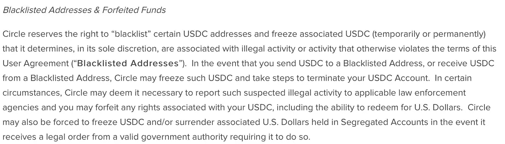

# 关于 Stablecoins 的大肆宣传是怎么回事？

> 原文：<https://medium.com/coinmonks/whats-all-the-hype-about-stablecoins-cbdfa12ee6c4?source=collection_archive---------2----------------------->

What are “stablecoins”?

加密空间的变化是如此之快，以至于有时几个月后事情变得面目全非。令人难以置信的是，仅仅一年前，人们还在以太坊上向随机 ico 扔 5000 多万美元的疯狂资金，承诺“以分散的方式存储你的文件”或“在区块链上建立供应链”，或者仅仅一年前，甚至没有人听说过币安。

在撰写本文时(2018 年 10 月)，crypto 的最新炒作是安全令牌产品(sto)和 stablecoins。为了这篇文章的目的，我将谈谈我对稳定的意见。

稳定硬币的概念已经存在一段时间了。基本上，稳定币是一种加密货币，与美元(法定货币)1:1 挂钩。换句话说，对于每一个稳定的货币单位，发行公司/组织/个人必须在某处持有 1 美元的储备。这样，如果这种稳定币的所有用户突然决定撤回法币，发行者可以毫不费力地偿还所有用户的美元。事实上，这正是传统银行最初应该如何将数字余额转换为实际现金，但我们甚至还没有开始。

稳定币的全部目的是绕过比特币/法币转换的难题。随着代表美元的稳定货币的出现，比特币交易者在买卖加密货币时不再需要不断在加密和平面之间转换。与美元挂钩的稳定硬币允许交易者留在系统中，避免在加密和法定货币之间越来越繁琐和限制性的转换过程。银行从一开始就不太喜欢加密，而且它们肯定让交易员在两个世界之间转移资金变得越来越困难。

加密领域第一个已知的稳定币是 Tether ( [USDT](https://coinmarketcap.com/currencies/tether/) )，自 2015 年初开始流通。USDT 是由在英属维尔京群岛注册的有限公司 Tether Limited 发行的，可能与世界上最大的交易所之一 Bitfinex 有关。USDT 本身是一种加密货币，因为它是根据另一种区块链协议(Omni、以太坊等)发行的数字令牌。)，但其发行和挂钩由系绳公司控制。

从效用和美学的角度来看，人们可能会认为，促进加密货币的采用和交易非常需要稳定的货币。我认为，USDT 允许资金留在加密世界而不是进入/离开法定世界的能力是 2017-2018 年加密货币交易所和替代硬币交易对激增的驱动因素之一。同样，能够用美元来表示密码的价格，而不是用 BTC 或瑞士法郎来表示，这对于新的密码交易者来说要方便得多。

当然，就像任何与加密货币相关的事情一样，USDT 的发展道路是动荡的，也不是没有审查。在其历史上的多个场合，USDT 已经与其假定的 1.00 美元的价格脱钩，严重到 2018 年 10 月 15 日跌至 0.88 美元。USDT 价值的这些剧烈波动是由于对 Tether 及其背后的运营商缺乏/失去信任造成的。USDT 似乎总是被 FUD(恐惧、不确定、怀疑)跟随，这可以归因于其母公司缺乏审计和透明度，以及愿意与泰瑟合作的银行持续的音乐椅游戏。

随着系绳被笼罩在最新的 FUD 中，其他 stablecoin 竞争者趁机进入市场。一个月前，Gemini 和 Paxos 几乎同时宣布了各自的 stablecoins，Gemini Dollar ( [GUSD](https://coinmarketcap.com/currencies/gemini-dollar/) )和 Paxos Standard ( [PAX](https://coinmarketcap.com/currencies/paxos-standard-token/) )。然后，这个星期，比特币基地宣布他们将把美元硬币([【USDC】](https://coinmarketcap.com/currencies/usd-coin/))圈出来。所有这些新的稳定债券的共同主题和主要卖点是，它们是由声誉好、受监管和受审计的(美国)公司发行的，或者它们是这么宣称的。

理论上，这似乎是一件好事。毕竟，你的钱实际上是由美国司法系统支持的，而不是一些离岸公司股东的良心，这让你更加安心。然而，与此同时，对于那些重视去中心化和抵制审查的人来说，这似乎是政府和监管机构进一步控制生态系统及其现任者的举措。

正如 Eric Conner 在 Twitter 上指出的,《USDC 服务条款》中有一条规定，公司有权将任何地址列入黑名单并冻结。在我看来，这是一个重要的细节，因为它使得比特币基地/Circle/使用 USDC 与使用传统银行并通过 SWIFT 网络发送菲亚特没有什么不同。现在的问题更多的是，掌权者是否会坚持“证明有罪前无罪”的哲学，或者“证明无罪前有罪”的哲学，这种哲学在当今世界各地的机构中屡见不鲜。

另一件要记住的事情是，通过发行这些稳定债券，发行公司在某种程度上成为了中央银行，至少在他们各自的稳定债券流通的市场中是如此。这些公司能够从交易商那里获得大量的法币，这些法币既可以作为法币，也可以作为相应的稳定币。这些公司可能会用这些资金做什么还有待讨论，但最有可能的是，你得到的比他们得到的要少。更不用说，他们有权根据你的 KYC 或你的活动来怀疑你，并在任何时候冻结你的资金。

随着比特币现在成为我们全球金融格局的一部分，更多的监管、审计和华尔街的参与将不可避免地进入这个领域。这种大肆宣传的 stablecoins 运动可能确实有利于更多机构资金进入这个领域，因为机构资金根本不会碰不受监管的东西。然而，长期效果仍有待观察。然而，就目前而言，我建议任何相信比特币代表着什么的人，都要谨慎对待这些稳定的硬币。为了方便和增加流动性，它们目前代表了比特币以外的一切。

*原载于 2018 年 10 月 24 日*[*【hopefreiheit.com】*](https://hopefreiheit.com/2018/10/24/whats-all-the-hype-about-stablecoins/)*。*

如果你在这篇文章中发现了一些价值，请给我一些掌声让我知道。；-)

> [直接在您的收件箱中获得最佳软件交易](https://coincodecap.com/?utm_source=coinmonks)

