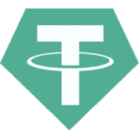
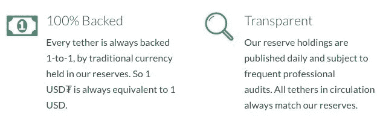
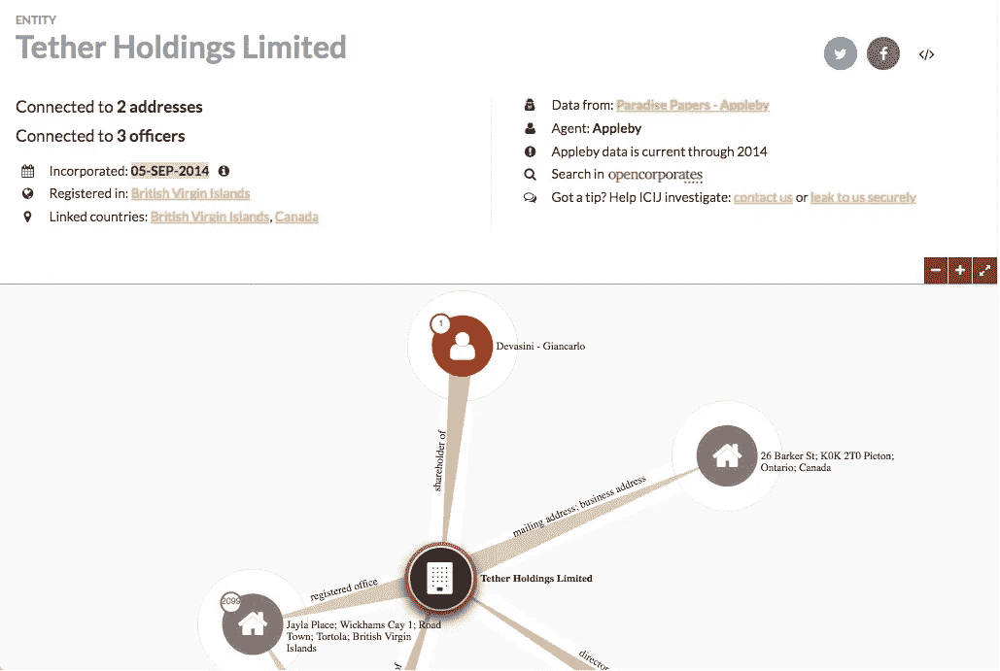
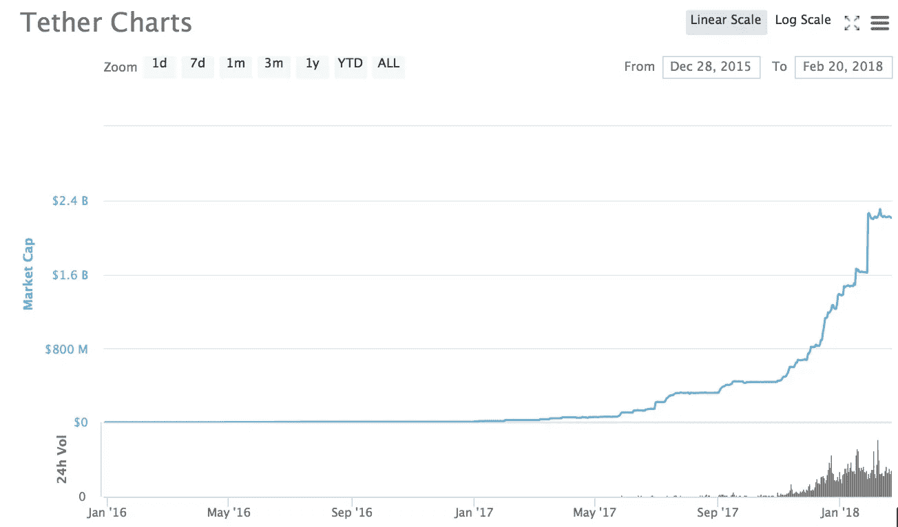
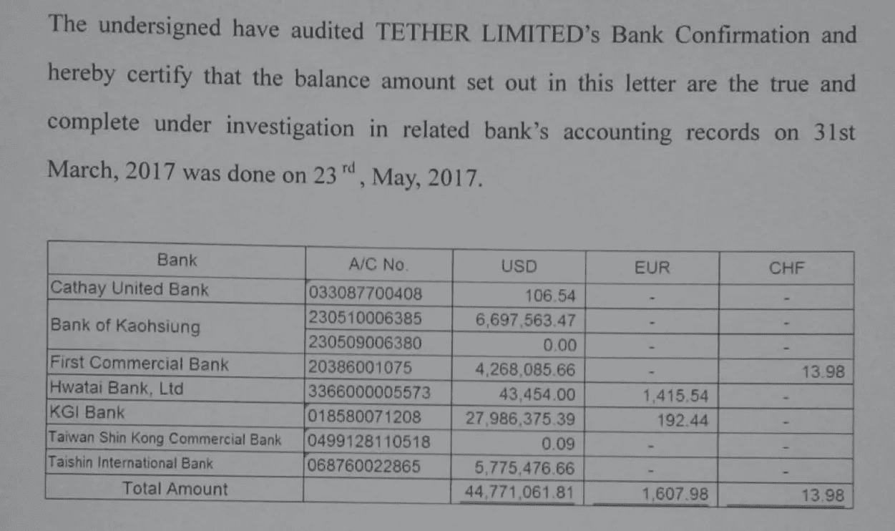
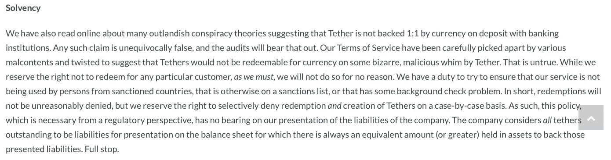
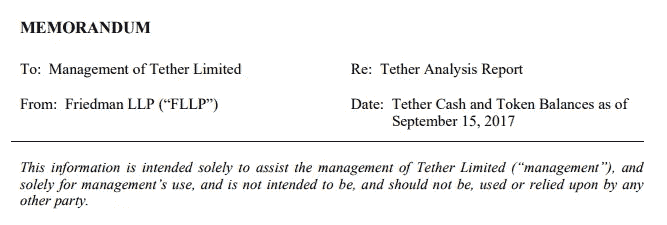

# 系绳后面是什么？

> 原文：<https://medium.com/coinmonks/whats-behind-tether-cfde9e2199c8?source=collection_archive---------0----------------------->

## 有限制的承诺是不兑现的承诺

当 Tether (RealCoin)在 2014 年成立时，它有一个很容易理解的明确目标:对于流通中的每一个 Tether，都会有一个全额准备金银行账户中的一美元来支持它——并且该账户会被频繁审计。忽略一个事实，那就是没有全额储备的银行账户。忽略一个事实，到今天为止，还没有一个 GAAP 审计在一个稳定的硬币上执行。忽略一切，专注于承诺。

用不了多久，泰瑟就食言了。最初由布洛克·皮尔斯、里夫·科林斯和克雷格·塞拉斯创建，总部设在圣莫尼卡，接受一家台湾公司不太理想的“审计”([顺便说一下，这些所谓的审计更像是认证，而不是审计](https://tether.to/wp-content/uploads/2017/09/Tether-Ltd-20170331.pdf?__cf_chl_jschl_tk__=c16cde3593b894b2c24fdea22d3f865d589a154d-1587228191-0-AZxNS6mO2SuRM3ASXQef22_Yaceg-vchADAhQrNfIpAko8OTFddmX4gF45p9wXRzXbpDZsIEXx2kvC4KGnDE2p_RVCMnELUIuXodVFd9Niil0NfQoMYBFjAG513tmUHi4PylE4xaon2UyEEWSAnuIlCzJRonwNFEepo48Q1_SjMznQdmFxzMsiqGEvk1NdZoSxOfVlVCtHrKe6Omg522kF5SXhS3dHpIQ5mNAgdZSHEjBwZw_Zsze6U9Jzp6Wk6MFLUGJHDkCgt2MKD7ngSu8T-9ZFgM_kR2u2XI43nHrwtiNhYjq8U6dmOAy-Yu9ZRNNazkDVQi7EXoJmOwpolehW0))，在三个多月的时间里，Tether 的概念和基础设施悄悄地通过空壳公司卖给了 Bitfinex 的所有者和运营商。[直到两年后，才有人公开证实这笔交易](https://www.youtube.com/watch?v=BA8iO_Umt6Q)，即便如此，声明也是含糊不清的。

The formation of Tether Holdings Limited was on September 5th, 2014 in the British Virgin Islands — there are obvious connections with Bitfinex considering the executives, directors, and Ontario business address.

在出售时，Tether 几乎没有投入运营，直到 2015 年 3 月才出现在 CoinMarketCap 上。事实上，在 2016 年之前，Tether 的市值不会突破 100 万，届时赌徒们将开始寻求一种简单、在线和灰色市场的输钱解决方案。在这之后，系绳的市值将连续两年呈指数增长，到 2018 年 2 月稳定在 22 亿美元。

那么，与泰瑟的承诺相比，这两年的增长发生了什么？承诺被打破，信任模式失败。

泰瑟公开讨论的最后一次“审计”是通过他们过去使用的小型台湾公司进行的，发生在 2017 年 3 月 23 日。同样，它更多的是一种证明，并没有说钱是从哪里来的或者是如何获得的:

[在六个月没有证实或真正澄清之后，泰瑟就他们的银行问题和他们与 LLP 弗里德曼的新约定发表了一份声明](https://tether.to/tether-update/)。他们还非常清楚地表明，他们是完全有偿付能力的，伙计——句号:

尽管之前可能已经有过这样的声明，但重要的是要注意，Tether 不再声明负债将与“传统货币”匹配，而是明确切换到术语“资产”。1 对 1 的后盾变成了什么？

不久之后，泰瑟表示，他们将与弗里德曼 LLP 合作，尽管他们后来澄清说，弗里德曼不会进行审计，甚至也不会进行认证。“这些咨询服务不构成[原文如此]审计或证明业务，审计或证明业务将包括范围显著扩大的程序，并且需要更多的时间来完成。”

9 月底/10 月初，泰瑟公司发布了一份来自弗里德曼·LLP 的备忘录，声明这份备忘录证明了泰瑟公司/Finex 公司的偿付能力和无恶意行为。对 Tether 来说不幸的是，备忘录还特别声明它不可靠:

两个月后，系绳被黑了。约 3100 万股刚刚上涨并离开财政部，交易员和 Finex 之间的恐惧是显而易见的。到底是怎么回事？没有审计，Finex 和 Tether 在一年之内被黑，很多不确定性。

正如谚语所说，“当下雨时，它是倾盆大雨。”

2018 年 1 月， [r/Buttcoin](https://www.reddit.com/r/Buttcoin/) 的一名成员发布了关于弗里德曼 LLP 如何从其网站上移除系绳的帖子。Tether 被迫确认 Tether 和公司之间的关系已经解除——尽管没有人知道这是否意味着他们因为做了过多的尽职调查而被解雇，或者他们是因为 Tether 没有提供足够的可理解的数据而辞职。

自 2017 年以来，泰瑟甚至没有试图聘请审计公司来扫描账簿，而是提供了三种令人难以置信的半吊子尝试，以减轻交易者和铸币者的担忧:

1.  他们聘请了一家律师事务所(FSS-弗里、斯波金和沙利文律师事务所)为他们的账目做担保。律师将是第一批承认自己不是审计师或会计师的人。失败。
2.  他们雇用了新的、知名的合规官，这些人没有与社区交流或接触过。尽管他们可能正在进行内部改革，但没有人能证实这一点，公众也没有理由相信。失败。
3.  一系列新产品(从 Tether Gold 到 Tether Yuan，再到 Tether on)和“慈善努力”——这意味着他们的现金如此充裕，可以花在大量的 R&D 上，支持慈善机构，推动通过基础支持收养区块链，等等。没有理由相信这些资产是安全的保证。失败。

我在这里要说的唯一一点是，如果一个人试图相信泰丝的话——如果一个人把泰丝当作一个做出承诺以获得你信任的人——他很快就会意识到他们是骗子，不应该被认为是合理或安全的。这不仅仅是他们对客户撒的一个谎，更是泰瑟公司在对自己撒的一个谎:如果我们改变措辞，插入没完没了的法律术语，直到它毫无意义，也许我们就能摆脱困境。

他们还没有达到他们为自己设定的一个目标，而不是承认尽可能多或修复情况，他们已经混淆了他们的方式到这个怪物…

The new Tether statement

保持怀疑，朋友们。