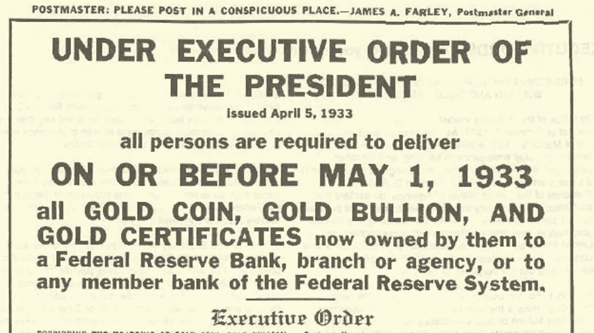
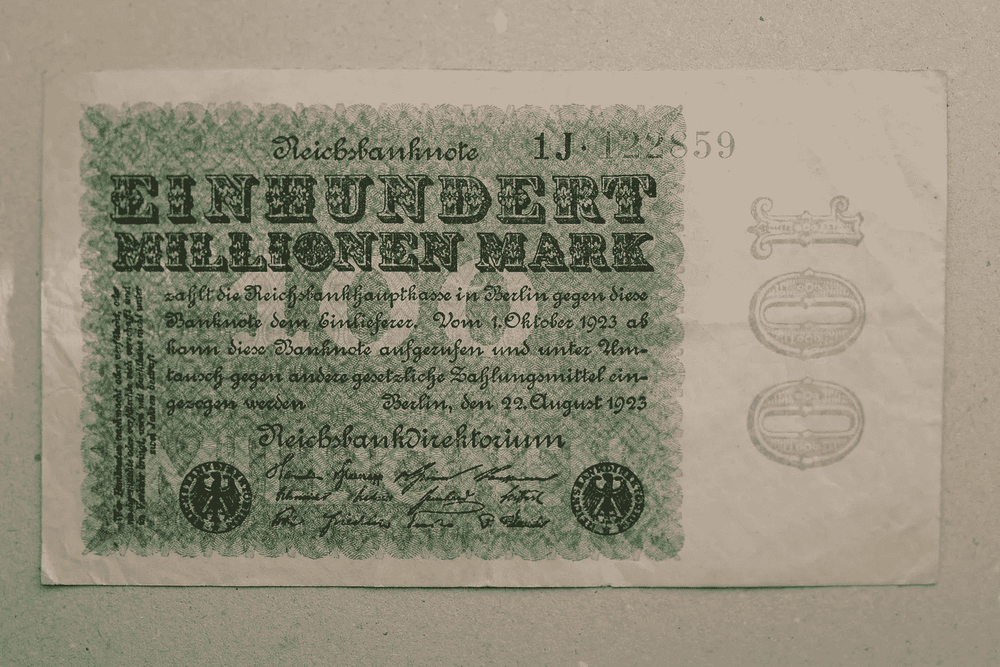

# 比特币的内在价值是什么？

> 原文：<https://medium.com/coinmonks/whats-bitcoin-s-intrinsic-value-bffb71561928?source=collection_archive---------13----------------------->

unsplash.com

在讨论比特币之前，我们先来谈谈钱。金钱到底是什么？从根本上说，货币是价值的表现。纵观历史，价值有许多不同的形式，人类用各种各样的东西来象征货币，如商品、牲畜，当然还有黄金。我们还认识到，为了让任何东西象征价值，人们必须相信它是有价值的，并且它将在足够长的时间内保持价值，以便他们在未来赎回它。我们过去常常依赖一些有形的“东西”来象征金钱，但现在不再是这样了，我们已经将信任范式从信任一些“东西”转变为信任一些“人”

## **脱离金本位**

过去人们不随身携带金条或其他有价值的东西，因此纸币被发明出来了。银行或政府会提出接管你的金条，以换取收据证明，我们称之为票据。如果你需要取回你的黄金，只需将纸币归还给银行，并兑换成你的金条。

Source: [U.S. Government Printing Office](https://en.wikipedia.org/wiki/U.S._Government_Printing_Office) — [http://www.goldline.com/images/conf-order.pdf](http://www.goldline.com/images/conf-order.pdf)

然而，1933 年金本位制的废除破坏了纸质收据和它所代表的黄金之间的联系。总而言之，政府向其公民保证，政府将对纸币的价值负责。说白了，忘记黄金，转而交易纸。从那以后，人们继续用完全由政府担保的票据进行交易。

那么，为什么这种方法继续有效呢？因为信仰。尽管没有基础商品来支持纸币，人们还是信任政府，于是法定货币就诞生了。美元、欧元、英镑和其他货币现在有了价值，因为政府这么说。毫无疑问，今天货币的价值是由中央权威提供的法律地位的结果。

法定货币存在问题。它是中央集权的，有一个中央权力机构控制和发行货币，而且在数量上不受限制。

## **菲亚特的问题**

欺诈和剥削。当银行被授权创造货币或价值时，它们就控制了价值在世界上的流动，这赋予了它们几乎无限的权力。例如，富国银行的员工利用欺诈手段来实现雄心勃勃的销售目标，包括在未经客户授权的情况下建立数百万个账户。

失控。我们赋予政府货币主权，这是一种价值储存手段。政府，尤其是专制政府，可以随时决定冻结你的账户，阻止你动用你的资金。

source: unsplash.com

恶性通货膨胀。拥有无限印钞权的问题在于，它侵蚀了公民货币的价值，导致了恶性通货膨胀。想想 20 世纪 90 年代的委内瑞拉、津巴布韦或俄罗斯。

## **为什么是比特币？**

比特币是一种替代的、非政治化的价值储存手段，其货币政策存在于传统的国家货币驱动型经济之外。这是一种可行的对冲手段，另一种选择，就像黄金在模拟世界中的历史作用一样。在这个充满不确定性、无与伦比的货币刺激以及遍布全球的过多地缘政治危险的时期，认为这在本质上是一种数字黄金的观点很有吸引力。

## 是什么让它如此特别？

比特币消除了对中央集权的要求，从而消除了“双重支出问题”。比特币本质上是一个透明的账本，没有中央权威。比特币的价值基于其技术和网络效应，通常被称为梅特卡夫定律。例如，脸书就有价值，因为它有巨大的网络影响力，每天有数百万用户，大多数社交媒体网站也是如此。

我们来对比一下比特币和一个央行。因为现在大多数货币都是数字化的，所以银行保留了自己的余额和交易记录。然而，这样的分类账是不透明的，并且保存在中央服务器上。你不能调查它，只有银行对它有全权。比特币账本是完全公开的。任何人都可以随时查看它，以了解正在发生的交易和余额。你唯一无法确定的是谁拥有这些资金，谁在进行这些活动。是伪匿名。

比特币是分散的。系统中的每台计算机都保留了一份账本，也就是我们所知的区块链。从来没有人能够破解比特币。另一方面，银行被黑客攻击的金额高达数十亿美元。例如，阿尔法银行、比雷埃夫斯银行、欧洲银行和希腊国家银行在一个旅游服务门户网站遭到黑客攻击后，不得不注销了 15，000 张信用卡和借记卡。

比特币是数字化的。当你持有一枚比特币时，你在账本中拥有一个特定的地址记录。它使全球近 20 亿无法使用金融系统的个人能够进行数字贸易。当你使用比特币时，你对你的钱有最终的控制权。任何政府或银行都无权冻结或扣押你的资产。

比特币，说到底是数字黄金还是黄金 2.0。终极持有人的资产，非常安全，不会被黑客攻击、控制、窃取、丢失、错误处理、损坏或停止。这就是价值所在，数百万人相信它，信任带来价值，这是我们都知道的。

*免责声明:本文包含的信息仅用于教育目的，不构成 Wheatstones 的任何形式的建议或推荐，也不打算供用户在做出(或避免做出)任何投资决定时依赖。*

> 加入 Coinmonks [电报频道](https://t.me/coincodecap)和 [Youtube 频道](https://www.youtube.com/c/coinmonks/videos)了解加密交易和投资

## 另外，阅读

*   [Bookmap 点评](https://blog.coincodecap.com/bookmap-review-2021-best-trading-software) | [美国 5 大最佳加密交易所](https://blog.coincodecap.com/crypto-exchange-usa)
*   [如何在 FTX 交易所交易期货](https://blog.coincodecap.com/ftx-futures-trading) | [OKEx vs 币安](https://blog.coincodecap.com/okex-vs-binance)
*   [如何在势不可挡的域名上购买域名？](https://blog.coincodecap.com/buy-domain-on-unstoppable-domains)
*   [印度的加密税](https://blog.coincodecap.com/crypto-tax-india) | [altFINS 审查](https://blog.coincodecap.com/altfins-review) | [Prokey 审查](/coinmonks/prokey-review-26611173c13c)
*   [布洛克菲 vs 比特币基地](https://blog.coincodecap.com/blockfi-vs-coinbase) | [比特坎评论](https://blog.coincodecap.com/bitkan-review) | [币安评论](/coinmonks/binance-review-ee10d3bf3b6e)
*   [Coldcard 评论](https://blog.coincodecap.com/coldcard-review) | [BOXtradEX 评论](https://blog.coincodecap.com/boxtradex-review)|[uni swap 指南](https://blog.coincodecap.com/uniswap)
*   [阿联酋 5 大最佳加密交易所](https://blog.coincodecap.com/best-crypto-exchanges-in-uae) | [SimpleSwap 评论](https://blog.coincodecap.com/simpleswap-review)
*   购买 Dogecoin 的 7 种最佳方式
*   [iTop VPN 审查](https://blog.coincodecap.com/itop-vpn-review) | [曼陀罗交易所审查](https://blog.coincodecap.com/mandala-exchange-review)
*   [比特币基地 vs 瓦济克斯](https://blog.coincodecap.com/coinbase-vs-wazirx) | [比特鲁点评](https://blog.coincodecap.com/bitrue-review) | [波洛涅克斯 vs 比特鲁](https://blog.coincodecap.com/poloniex-vs-bittrex)
*   [美国最佳加密交易机器人](https://blog.coincodecap.com/crypto-trading-bots-in-the-us) | [经常性回顾](https://blog.coincodecap.com/changelly-review)
*   [A-Ads 审查](https://blog.coincodecap.com/a-ads-review) | [Bingbon 审查](https://blog.coincodecap.com/bingbon-review) | [Mudrex 投资](https://blog.coincodecap.com/mudrex-invest-review-the-best-way-to-invest-in-crypto)
*   [最好的卡达诺钱包](https://blog.coincodecap.com/best-cardano-wallets) | [Bingbon 副本交易](https://blog.coincodecap.com/bingbon-copy-trading)
*   [印度最佳 P2P 加密交易所](https://blog.coincodecap.com/p2p-crypto-exchanges-in-india) | [柴犬钱包](https://blog.coincodecap.com/baby-shiba-inu-wallets)