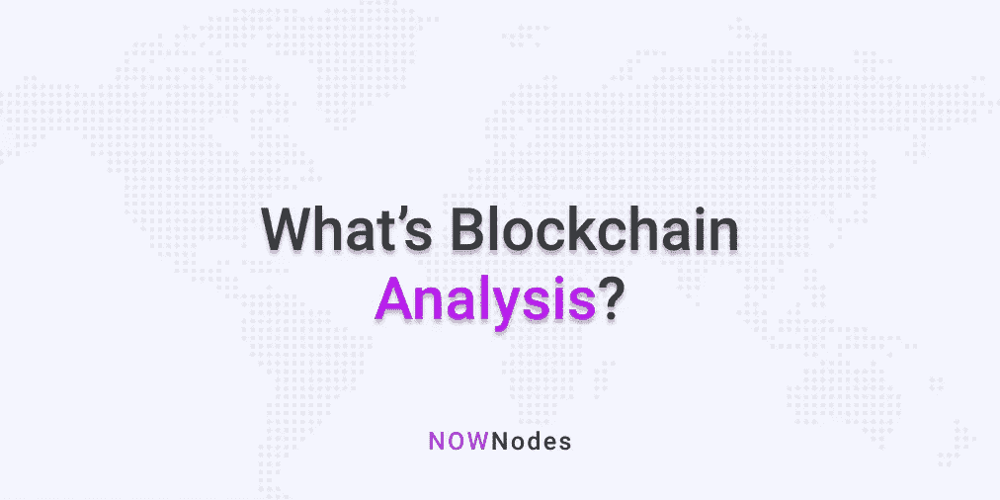

# 什么是区块链分析？—描述性指南

> 原文：<https://medium.com/coinmonks/whats-blockchain-analysis-a-descriptive-guide-5d7e3476991d?source=collection_archive---------0----------------------->

最初发表于 [NOWNodes 博客](https://nownodes.io/blog/whats-blockchain-analysis-a-descriptive-guide)。

在过去几年中，区块链分析已经成为一项大业务。据报道，美国政府花费[600 万美元](https://news.bitcoin.com/a-forensic-analysis-of-blockchain-surveillance-companies/)开展区块链分析活动。提供区块链分析活动的公司如今也很受欢迎。到目前为止，私人区块链分析公司已经筹集了总额为[8000 万美元](https://news.bitcoin.com/a-forensic-analysis-of-blockchain-surveillance-companies/)的资金。要理解这种资本流入的驱动因素，我们必须理解什么是区块链分析。

全球大多数人都知道区块链是加密货币交易背后的技术。它的目的是创建一个分布式分类帐，其中包含各种协议的所有在线交易的详细信息。除了记录保存之外，区块链技术公司还对在线交易进行验证。它还有助于用户在没有集中管理机构的情况下验证交易。

区块链技术处理加密货币交易。因此，它很容易受到欺诈活动的影响，就像任何其他形式的货币兑换系统一样。对区块链的分析有助于识别此类欺诈和可疑活动。分析区块链，人们可以实时发现区块链活动中发生的变化。如果任何变化看起来可疑，区块链分析也有助于立即采取行动。

加密交易所并不强制部署区块链分析师。然而，他们中的大多数都遵循了要求。

允许区块链分析公司检查交易所的数据有几个好处。它保护交易所免受洗钱和欺诈的潜在威胁。它有助于准备客户情报报告，估计收入，并创造新的服务。这些公司也被称为区块链法医公司。是的，听起来挺有意思的！

# 区块链分析的历史

区块链分析的历史源于区块链欺诈和攻击的历史。第一个重大的比特币欺诈案例要追溯到 2011 年。这是一位比特币用户因黑客而损失 50 万美元的一年。同年，一个名为 MyBitcoins 的钱包服务实体从网上消失了。这些事件仍在继续，2012 年有几家交易所遭到黑客攻击并被关闭。

2015 年，另一家名为 BitStamp 的交易所遭到黑客攻击。2016 年，黑客从 Bitfinex 交易所窃取了高达 7700 万美元的资金。由于这种情况的增多，区块链分析公司或区块链取证公司相继成立。越来越多的黑客攻击清楚地表明了这种服务是有需求的。2013 年至 2017 年间，成立了几家区块链分析或区块链法医事务所。他们中的许多人都是当今的顶级公司。

# 为什么需要区块链分析？

区块链技术、加密货币交易所、加密钱包以及交易所的交易都容易受到黑客攻击。这样一个容易发生风险的环境需要安全措施。这就是区块链分析和区块链取证发挥关键作用的地方。让我们试着更详细地理解这个角色。

区块链分析的基本功能包括交易分析和资金追踪。这些分析或取证公司持续分析任何区块链协议的每项交易。他们还定期对交易地址进行分类和分组。选定的地址或地址组也经常被监控。通过这些地址发生的任何可疑活动都会收到警报通知。

在更深层次上，区块链分析也使资金的流动变得透明。了解秘密资金的流入和流出是一项困难的任务。当交易与成千上万的地址联系在一起时尤其如此。区块链分析有助于减少杂乱，提取最重要的信息。分析交易还有助于对交易行为进行分类。任何可疑行为都会被立即追踪。这有助于弄清任何非法行为的真相。

区块链分析公司也代表客户验证信息。他们对其客户的潜在合伙人的要求进行必要的检查。区块链分析证明有助于准备选定地址的交易概况。

最后，这些区块链分析公司也派上了用场，以监测稳定的硬币。他们跟踪二级市场交易，记录审计线索和决策路径。

区块链分析有助于可视化区块链交易的整个场景和资金的流动，具有透明度和可追溯性

# 链式分析—快速介绍

chain analysis 是区块链最著名的分析公司之一。该公司成立于 2014 年，迄今为止已经筹集了超过 4500 万美元的资金。它作为客户服务于许多政府机构。名单包括国税局，联邦调查局，缉毒署等。它还与币安等加密交易所合作。

2015 年遭到黑客攻击的 exchange Bitstamp 也部署了 Chainalysis。该公司支持超过 87 种领先的加密货币。迄今为止，已有超过 350 家公司在 45 个国家部署了该系统。

然后让我们试着通过链分析的棱镜来看看区块链分析在现实世界中是如何工作的。

Chainalysis 最受欢迎的产品是“了解你的交易”(KYT)。它也被称为 KYT 链分析。加密领域的欺诈活动遵循一定的模式。这些包括与暗网、异常交易等相关的欺诈。Chainalysis 检测所有有风险的活动。然而，仅仅跟踪和识别潜在的欺诈是不够的。这就是为什么 Chainalysis 为客户做得更多。

Chainalysis 提供提醒，使其客户意识到。这些警报是实时发送的，并且符合大多数公司的反洗钱政策。来自区块链分析公司的这种警告有很多好处。它们可以在需要时用于冻结存款。它们可以用来阻止向欺诈性地址取款。它们还可以用来挫败勒索软件的威胁。

chain analysis 的另一个成功产品是 chain analysis 反应器。Chainalysis Reactor 是一个软件，它有助于识别加密货币的所有者及其地址。Chainalysis Reactor 还为用户提供了从社交媒体收集和编辑的情报。它还创建了易于理解的视觉效果来显示资金流向。此外，它有助于在欺诈的情况下用注释和图表呈现案例。

Chainalysis 还有一个叫做 Kryptos 的产品。它提供了所有加密货币业务的档案组合。氪星上有超过 1800 个这样的简介。这些档案包含的信息包括这些企业的 KYC 政策的细节，这些公司的最新消息，他们的位置等。除了充当信息库之外，这种产品还有助于根据行业标准对一个企业的服务进行基准测试。

# 区块链分析面临的挑战

有经验的密码持有者经常试图智胜区块链分析公司或区块链取证公司。这些公司采用了一些技巧和策略。最常见的技巧之一是使用混音器。这些混合器组合多个发送者的输入，并隐藏它们的唯一地址。混合输入从单个地址传送，使得所有其他地址不可追踪。

另一种用于避免可追踪性的匿名技术是创建多个钱包。创建多个钱包和其间的多次交易使地址最难追溯。

人们经常使用不符合 KYC 法规的交易所。他们还借助非托管钱币兑换商来绕过区块链分析。与非合规交易所类似，人们也经常使用注重隐私的钱包来躲避区块链的取证。

# 摘要

加密交易通常不受监管，风险很大。使用无法追踪的地址洗钱是一种常见的威胁。故意不遵守 KYC 要求经常会将利益相关者置于风险之中。因此，应监控所有交易和相关地址。应定期对其进行监控，并在需要时发送警报。

除了交易之外，还应该仔细研究企业及其利益相关者。行业数据有助于评估企业概况。它还有助于判断特定地址或企业的活动模式与其他地址或企业的活动模式。

因此，区块链分析或区块链取证是一个必要的工具。交易所保护自己免受黑客攻击的工具。企业选择合适的合作伙伴类型并与之合作的工具[https://blog . coincodecap . com/A-candy-explain-of-bit coin](https://blog.coincodecap.com/a-candid-explanation-of-bitcoin)s .预先检测欺诈的工具。

区块链分析的另一个优势是它不会停留在检测阶段。它提供了保护措施。区块链分析还提供了跟踪和追溯的措施。它通过收集情报并将其存档来改善整个环境。随着区块链技术的进步和加密交易的扩大，区块链分析学院只会越来越大。

## 另外，阅读

*   最好的[密码交易机器人](/coinmonks/crypto-trading-bot-c2ffce8acb2a)
*   [密码本交易平台](/coinmonks/top-10-crypto-copy-trading-platforms-for-beginners-d0c37c7d698c)
*   最好的[加密税务软件](/coinmonks/best-crypto-tax-tool-for-my-money-72d4b430816b)
*   [最佳加密交易平台](/coinmonks/the-best-crypto-trading-platforms-in-2020-the-definitive-guide-updated-c72f8b874555)
*   最佳[加密借贷平台](/coinmonks/top-5-crypto-lending-platforms-in-2020-that-you-need-to-know-a1b675cec3fa)
*   [最佳区块链分析工具](https://bitquery.io/blog/best-blockchain-analysis-tools-and-software)
*   [加密套利](/coinmonks/crypto-arbitrage-guide-how-to-make-money-as-a-beginner-62bfe5c868f6)指南:新手如何赚钱
*   最佳[加密制图工具](/coinmonks/what-are-the-best-charting-platforms-for-cryptocurrency-trading-85aade584d80)
*   [莱杰 vs 特雷佐](/coinmonks/ledger-vs-trezor-best-hardware-wallet-to-secure-cryptocurrency-22c7a3fd391e)
*   了解比特币的[最佳书籍有哪些？](/coinmonks/what-are-the-best-books-to-learn-bitcoin-409aeb9aff4b)
*   [3 商业评论](/coinmonks/3commas-review-an-excellent-crypto-trading-bot-2020-1313a58bec92)
*   [AAX 交易所评论](/coinmonks/aax-exchange-review-2021-67c5ea09330c) |推荐代码、交易费用、利弊
*   [Deribit 审查](/coinmonks/deribit-review-options-fees-apis-and-testnet-2ca16c4bbdb2) |选项、费用、API 和 Testnet
*   [FTX 密码交易所评论](/coinmonks/ftx-crypto-exchange-review-53664ac1198f)
*   [n 零审核](/coinmonks/ngrave-zero-review-c465cf8307fc)
*   [Bybit 交换审查](/coinmonks/bybit-exchange-review-dbd570019b71)
*   [3Commas vs Cryptohopper](/coinmonks/cryptohopper-vs-3commas-vs-shrimpy-a2c16095b8fe)
*   最好的比特币[硬件钱包](/coinmonks/the-best-cryptocurrency-hardware-wallets-of-2020-e28b1c124069?source=friends_link&sk=324dd9ff8556ab578d71e7ad7658ad7c)
*   最佳 [monero 钱包](https://blog.coincodecap.com/best-monero-wallets)
*   [莱杰纳诺 s vs x](https://blog.coincodecap.com/ledger-nano-s-vs-x)
*   [bits gap vs 3 commas vs quad ency](https://blog.coincodecap.com/bitsgap-3commas-quadency)
*   [莱杰纳米 S vs 特雷佐 one vs 特雷佐 T vs 莱杰纳米 X](https://blog.coincodecap.com/ledger-nano-s-vs-trezor-one-ledger-nano-x-trezor-t)
*   [block fi vs Celsius](/coinmonks/blockfi-vs-celsius-vs-hodlnaut-8a1cc8c26630)vs Hodlnaut
*   Bitsgap 评论——一个轻松赚钱的加密交易机器人
*   为专业人士设计的加密交易机器人
*   [PrimeXBT 审查](/coinmonks/primexbt-review-88e0815be858) |杠杆交易、费用和交易
*   [埃利帕尔泰坦评论](/coinmonks/ellipal-titan-review-85e9071dd029)
*   [赛克斯·斯通评论](https://blog.coincodecap.com/secux-stone-hardware-wallet-review)
*   [BlockFi 评论](/coinmonks/blockfi-review-53096053c097) |从您的密码中赚取高达 8.6%的利息