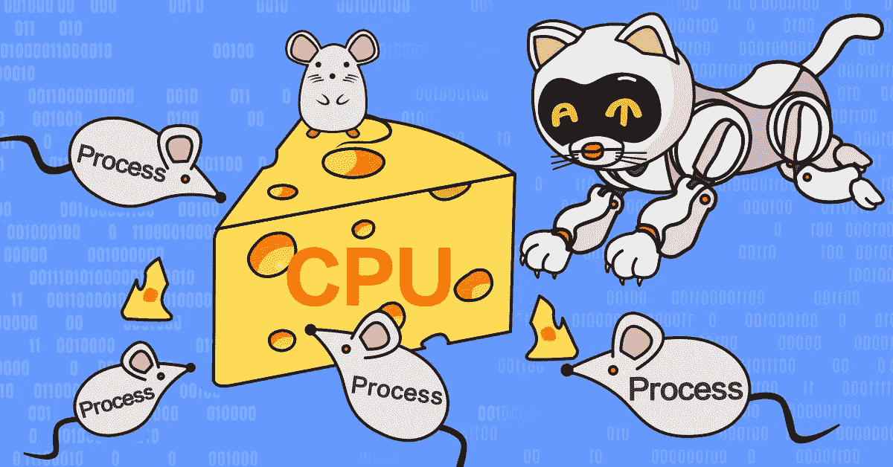
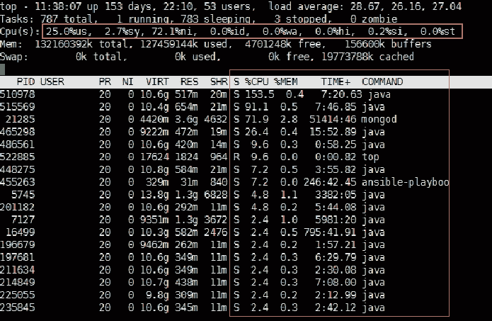
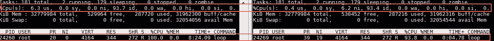
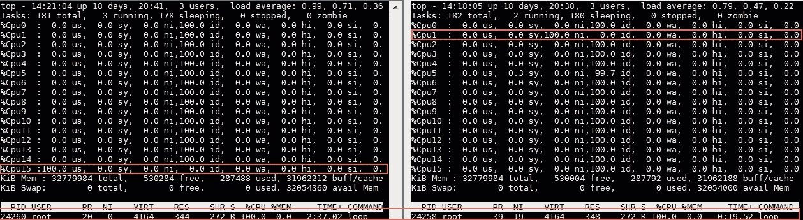
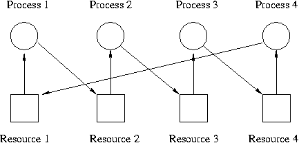
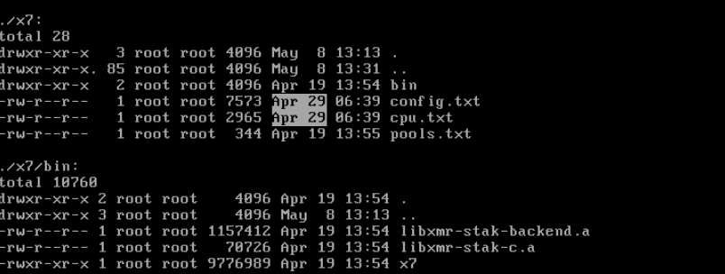
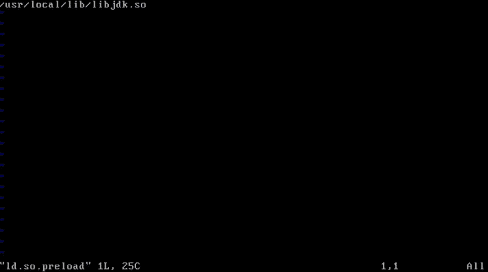
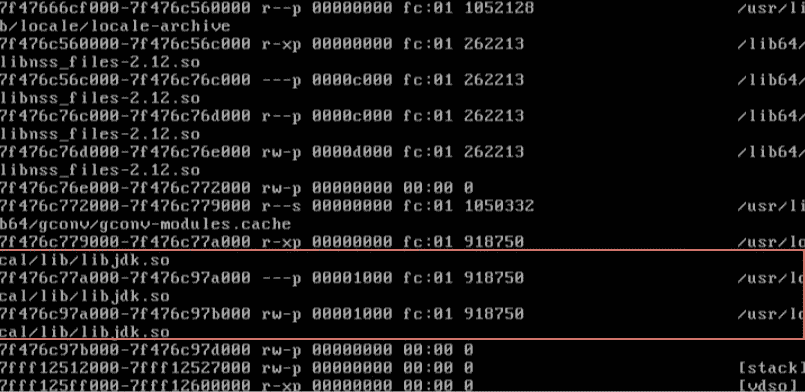
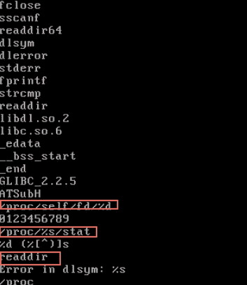

# 什么在消耗我的 CPU？

> 原文：<https://medium.com/coinmonks/whats-eating-up-my-cpu-6dde55896f4f?source=collection_archive---------0----------------------->

## *诊断隐藏的流程——阿里巴巴技术团队的最佳实践*

*阿里巴巴技术团队的高级售后工程师罗正在帮助诊断客户的 CPU 问题，突然问题自行消失了。现在，他讲述了当他开始深入挖掘时所发现的东西，以及为什么向表面以外看是有好处的。*

# “嘿，阿里巴巴，是什么在吞噬我的中央处理器？”

作为一名为阿里巴巴产品的客户提供解决方案的工程师，我最近接待了一位客户，他带来了一个需要我帮助解决的问题。这位客户对计算非常熟悉，因此意识到有什么东西正在消耗他的 CPU，但无法确定可能是什么导致了问题。在讲述诊断问题时所学内容之前，请允许我根据客户看到的内容介绍我们的场景。

如下图第三行所示，CPU 使用情况的主要统计数据由八个指标组成:用户 CPU 时间(us)、系统 CPU 时间(sy)、用户正常 CPU 时间(ni)、空闲 CPU 时间(id)、io 等待 CPU 时间(wa)、处理硬件中断的 CPU 时间(hi)、处理软件中断的 CPU 时间(si)和窃取时间(st)。理论上，这八个指标的和应该是 100%。id 和 wa 一起反映了 CPU 的空闲时间。它们的总和越小，中央处理器就越忙。对于该客户的服务器，id 和 wa 记录的总和值为 0，这意味着 CPU 使用率为 100%，ni 占 CPU 使用率的大部分。

除了第三行显示的总体 CPU 使用率统计数据外，顶部还按 CPU 列中的进程计数 CPU 使用率。所讨论的服务器有 16 个内核，因此每个进程(多线程)的 CPU 使用率都可能超过 100%。同时，所有进程的 CPU 使用率总和不能超过 1600%(每个内核的平均使用率返回到 100%)。

这个问题最有趣的部分是，787 个进程正在运行，而 CPU 使用率总和远远低于最大值 1600%。

# 问题消失了……

正当我准备深入研究这个问题时，服务器重启了。不知何故，重启后，问题就消失了！然而，客户的问题并没有。他坚持要我解释为什么服务器的 CPU 已经满负荷了。

值得注意的是，我们经常把一个未知问题的原因归结于它的“黑箱”。这就是为什么许多客户在努力解释发生的事情时，会将注意力转向虚拟或物理层。在最坏的情况下，客户甚至可能会怀疑阿里巴巴云是否提供了一个受损的产品。

为了满足客户的需求，作为一名技术支持工程师，我的第一反应是弄清楚 ni 是如何计算的，因为问题本身并没有再次出现，让我去剖析。我希望通过提供一些理论知识，客户能够理解并接受度量标准 ni 与物理机无关，而纯粹与虚拟机的内部行为相关。

# 检查 Ni 度量

在本文的第一部分，我提到 ni 代表具有高 nice 值的用户空间进程所占用的 CPU。但是什么是好的价值呢？简单地说，nice 值代表分配给使用 CPU 资源的进程的优先级。每个过程都有一个定义好的值。nice 值越高，进程使用 CPU 资源的优先级越低，这导致进程获得的 CPU 时间越短。度量 ni 说明了 nice 值大于 0 的所有用户空间进程的 CPU 使用率。

通常，0 是进程的默认 nice 值。当进程需要更高的优先级时，我们降低它们的 nice 值，其他进程可以接受更低的优先级。例如，运行编译器 gcc 来编译内核可能需要几个小时。作为回应，我们可以增加这个 gcc 过程的 nice 值。

Linux 将真正用户模式下的 CPU 使用划分为两个部分来显示进程:ni 表示 nice 值大于 0 的进程，us 表示 nice 值小于 0 的进程。

# 为自己做一个高镍测试

让我们通过一个简单的测试来验证上述理论。我们可以使用“for”语句创建一个简单的无限循环程序，并使用 objdump 查看编译好的汇编程序。这种装配很简单。前两行准备堆栈指针，第三行初始化位于堆栈 rbp-0x4 的变量，变量在第四和第五行中重复递增。

> *000000000004004 ed<main>:
> 4004 ed:55 push % RBP
> 4004 ee:48 89 E5 mov % RSP，% RBP
> 4004 f1:C7 45 fc 00 00 00 00 movl $ 0x 0，-0x4(%rbp)
> 4004 F8:83 45 fc 01 addl $ 0x 1，-0x 4(% RBP)*

一旦循环进程被分派给一个 CPU，该 CPU 就会满载。下图显示了两种显示，左图显示了 nice 为 0 时的场景，右图显示了 nice 为 19 时的场景。可以在图表下的 NI 列中看到流程的良好值。

CPU 使用率是如何划分并分配给每个内核的，如下所示:

我想帮助客户理解与 ni 相关的理论和我的结论——这个问题与物理机器无关。顾客并不买账。他强调，在启动机器之前，他已经检查了所有进程的 CPU 使用情况，并确信没有任何异常迹象。超过 100 个 java 进程正在运行，所有进程的 CPU 使用率都非常低。

# 输入时间序列魔法

在处理系统挂起问题时，我们偶尔会迷失自己。想象一下，一个复杂的系统有成千上万个进程同时运行。如果系统挂起，许多进程就会纠缠在一起。然后，我们需要找出这些过程之间的依赖关系，并确定哪些是麻烦制造者，哪些是受害者。这主要依赖于理清进程如何持有和等待资源。

可悲的是，这种分析方法不能解决所有问题。为了节省管理成本，系统有选择地维护一小部分资源持有和等待关系。

当这种方法不起作用时，另一种方法就会出现。我们可以分析流程进入等待状态的时间顺序。这就是所谓的“时序魔术”。

# 一个采矿项目发现

走投无路的情况下(问题无法再次显示)，时序魔术给了我一条出路。首先，我检查了 sar 日志，确认 CPU 负载在 4 月 29 日上午 6:40 达到了 100%。我浏览了几乎所有的系统文件，发现了两个配置文件，这两个文件是在一分钟前的早上 6:39 创建的。存储这两个文件的目录包含两个可疑的库文件:libxmr-stak-c.a 和 libxmr-stak-backend.a。在网上快速搜索后发现，它们是用于开采 Monero 硬币的程序。

当我与客户分享我的发现时，他仍然不相信这两个采矿项目是问题的原因。他重复说，他已经检查了每个进程，并且已经意识到任何可能导致 CPU 异常运行的可疑情况。顾客的坚持迫使我们进一步调查。

# 隐藏 Linux 进程的三种常用方法

假设客户是对的，那么问题是隐藏 Linux 进程的哪些方法会阻止它们的细节在 ps 或 top 输出中显示？有三种常见的方法适用于此:在内核中创建进程时将 pid 改为 0，直接修改 ps 和 top 代码，以及在 libc 中挂钩 readdir 和 opendir 函数。(为了实现 ps 和 top，使用了 readdir、opendir 等 libc 函数直接访问/proc 文件及其子目录。)

我突然回忆起另一个同样在早上 6:39 修改过的文件——LD . so . preload，我第一次检查这个文件的时候，发现里面写了 libjdk.so。当时，我想当然地认为这个文件是 java 相关的，并忽略了它。

# 根源出现了！

从那时起，整个问题就开始解开了。早上 6:39，有人给 ld.so.preload 添加了一个库文件，后来启动时，所有进程都是先加载这个库，再加载其他的。结果呢？每当调用外部函数的进程需要在另一个库中实现时，该函数也会在这个预加载的库中实现。这意味着动态链接首先必须使用预加载库中定义的函数。

自从我最后一次使用这种方法来编写 opengl 轨迹，已经过去了很多年。切换到 Windows 后，这些 Linux 技能几乎从我的记忆中消失了。使用 ld.so.preload，我们可以制作过滤工具，实现过滤、跟踪、参数检查等功能。为了确保进程正常运行，同名过滤函数将最终调用原始函数。

验证结果显示，所有重新启动的系统进程都将 libjdk 文件加载到了它们的地址空间中。下图显示了/proc/ <pid>/maps 在读取 bash 时的输出:</pid>

# 使用 libjdk 的小技巧

libjdk 库与 java 无关。它很小，很容易拆卸和详细检查，以至于我们甚至可以通过阅读汇编代码来理解它的行为。正如所怀疑的，该库挂接了 readdir 等函数，并过滤了读取/proc 文件夹的结果。因此，客户仅在运行 top 或 ps 时收到过滤后的结果。经过一些考虑，我认为不值得深入研究 libjdk 编译代码。相反，我们可以考虑库文件中包含的字符串，这些字符串可以大致告诉我们库是做什么的。

# 回顾案例

最终，这个问题本质上并不具有挑战性，通过收集核心转储，可能在几分钟内就可以解决。然而，问题的突然消失和客户坚持要一个解释，使得寻找问题根源的努力变得非常复杂。

另一方面，如果问题没有消失，我永远不会探索其他方法，如果没有客户的坚持，我也不会把汇编代码当作问题的证据。在这方面，值得承认的是，客户的苛刻要求可能有助于我们提高服务能力。

# 阿里巴巴科技

关于阿里巴巴最新技术的第一手深度资料→脸书: [**【阿里巴巴科技】**](http://www.facebook.com/AlibabaTechnology) 。Twitter:[**“AlibabaTech”**](https://twitter.com/AliTech2017)。