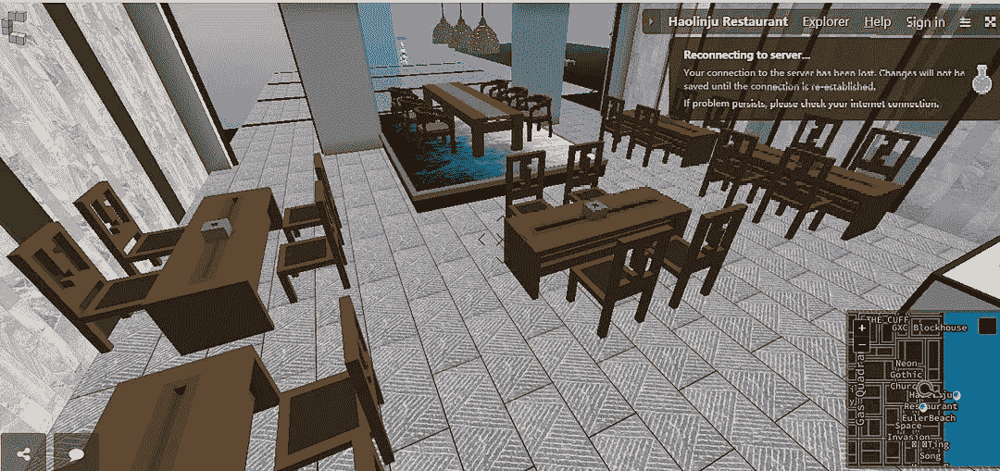

# 隐体素元宇宙的每个人都在做什么？

> 原文：<https://medium.com/coinmonks/whats-everyone-doing-in-the-cryptovoxels-metaverse-3007b63e5fdf?source=collection_archive---------3----------------------->

作者:DawnXue( [@dawnx666](https://twitter.com/dawnx666) )

翻译:秦九月([@秦九月](https://twitter.com/C_Chyn))

# 序

我之前的两篇文章讨论了 CV 分析，但没有提供任何关于 CV 的背景信息，我意识到这对那些对 CV 知之甚少的人来说可能相当不友好。这就是我写这篇文章的原因。

本文将从三个方面介绍 CV:

-什么是 CV？

-包裹所有者在 CV 中可以做什么？

-玩家或者访客在 CV 里可以做什么？

# CV 是什么？

Cryptovoxels，通常缩写为 CV，由总部位于新西兰惠灵顿的诺兰咨询公司于 2018 年 4 月创立。该团队由 Ben Nolan 创建(图 1)。

《三体》*的作者刘曾说:“人文学科面前有两条路:一条向外通向星辰大海，另一条向内通向虚拟现实。”简历就是这样的虚拟现实之一。截至目前，在 20 个岛屿上有超过 5000 块土地(地图见图 2)。90%以上的包裹已经售出。*

CV 基于以太坊链。每笔交易和每笔所有权都有公开且不可更改的记录，由每个用户链接到每个钱包地址(相当于银行账号)。这就是为什么任何人都可以在没有官方许可的情况下从该链下载交易和所有权数据。此外，查看任何钱包地址的交易记录(包括交易对手、时间和内容)和属性(包括 CV 之外的 NFT)不需要账户持有人的许可。只要您知道地块 ID，也可以访问地块的所有历史数据。CV 是在区块链基础上的一个了不起的创造，区块链本身就是一个伟大的发明。

Figure 1:Ben Nolan

Figure 2 map

> 订阅 [**Coinmonks Youtube 频道**](https://www.youtube.com/c/coinmonks/videos) 获取每日加密新闻。

# 包裹所有者在 CV 中可以做什么？

# 投资

就像在现实生活中一样，土地和不动产总是与虚拟世界中的投资联系在一起。CV 也不例外。购买的包裹可以在二级市场上转售，创造了活跃的交易量。2021 年 8 月包裹销售的平均价格约为 2.2 埃特，或 7，100 美元，CNY 45，800(使用 2021 年 8 月 31 日的汇率)。以下是我们对包裹销售的一些有趣发现。

截至 2021 年 8 月，我们已经发现了 622 个购买了一个包裹然后又卖掉了那个包裹的钱包地址。这 622 个地址的总利润(售价减去买价)加起来是 389 万美元。然而，并不是每个人都赚了钱。下面是回报率最高的 10 个钱包地址(图 3)，损失率最高的 10 个钱包地址(图 4)，以及回报率最高和最低的包裹(图 5)。

Figure 3 :the top 10 wallet addresses in rate of return(From left to right：The serial number；The number sold；Purchase price；The Selling price；profits；Rate of return）

Figure 4：the top 10 wallet addresses in rate of loss

Figure 5：the best and worst parcels in terms of rate of return

令人惊讶的是，收益率前 10 名都在 14900%以上，前 1 名为 130192%。回报率最高的钱包地址只买卖过一个包裹——主岛南海岸的 2302 号。该地块于 2018 年以 0.11ETH 买入，于 2021 年 8 月 31 日以 10ETH 卖出，以 ETH 计上涨 90 倍，结合以美元计的 EHS 上涨 14 倍，导致美元上涨 1391 倍。

一个损失很大的包裹是 1205 号。2020 年 9 月以 3.49ETH 买入，第二个月仅以 0.4ETH 卖出，价格明显低于当月均价。为什么卖这么低的价格？只有主人知道。

(注:在收集数据时，我们发现一些钱包地址只有出售数据，这意味着包裹是从另一个人那里转移到钱包的，这个人可能有也可能没有同一个最终所有者。因为我们无法知道这种情况的所有权或可能的交易价格，所以这些不包括在统计中。)

# 建筑

与真实世界相比，CV 中的构造不那么麻烦，不那么耗时，不那么费力，也不那么昂贵，同时为创造力提供了更多的自由。CV 中有三种主要类型的特征(或材料):体素(三维像素)、图像和音频——后两种可以直接上传。

体素有两种类型:CV 自带的和必须从其他地方上传的。前者(附带 CV)包含了大部分不同颜色的砖块，直接点击即可使用。后者(从别处上传)必须由专用软件创建，比如 MagicaVoxels。虽然它对新用户友好，但要构造精炼的对象需要一些练习。一旦你掌握了神奇的体素，你就可以建造任何你想要的东西。这里有几个有趣的例子。

第一次用 MagicaVoxels 的时候，瞬间就被吸引住了。在尝试了一堆函数之后，我制作了我的第一个体素，一个上面有笑脸的红色桌子，我把它带到了 CV 上的一个婚礼上。

Figure 6：a red table with a smiling face

但是与令人印象深刻的架构相比，这算不了什么，比如下面的。

[https://www.cryptovoxels.com/play?coords=N@645W,182N,-0.5U](https://www.cryptovoxels.com/play?coords=N@645W,182N,-0.5U)

一个海边游乐园(图 7)有红色城堡，浪漫的烟火，精致的酒馆，帆船，旋转木马，喷泉，雨带…链接:[https://www.cryptovoxels.com/play?coords=N@645W,182N,-0.5U](https://www.cryptovoxels.com/play?coords=N@645W,182N,-0.5U)

Figure 7：A seaside amusement park

一个熊猫公园(图 8)，离海边游乐园不远，一只巨大的熊猫坐在海边，周围有几只较小的熊猫、草地和竹子。链接:【https://www.cryptovoxels.com/play?coords=N@586W,236N 

Figure 8：A panda park

Real Vision 的 CV 总部(图 9)看起来就像一个欧洲小镇。链接:【https://www.cryptovoxels.com/play?coords=N@352W,51S,3.5U 

Figure 9：The CV headquarter of Real Vision

一家精心装修的海边餐厅，名为好邻居(图 10)。一楼有大理石墙，长桌子，方凳子。二楼有一个单独的餐厅，里面有一张可供八人用餐的圆桌。三楼是烧烤空间，有啤酒和折叠桌。链接:[https://www.cryptovoxels.com/play?coords=W@562W,280N,5F](https://www.cryptovoxels.com/play?coords=W@562W,280N,5F)

Figure 10：A carefully-decorated seaside restaurant called haolinju

优雅的鲸鱼花园(图 11 ),一只巨大的鲸鱼漂浮在中式花园的上方，清晰可见的细节如中式窗户。链接:[https://www.cryptovoxels.com/play?coords=N@414W,339S](https://www.cryptovoxels.com/play?coords=N@414W,339S)

Figure 11：Whale Garden

这五个只是许多迷人建筑的例子。施工不需要购买材料，也不需要工程队。不用几个月或几年。不需要电脑编程。只要你有想象力，并且你愿意学习使用这个软件，你就能做出这样的东西。如果你想从创作中感受到成就感，你需要做的就是把心思放在设计和建造上。

# 操作

CV 里的建筑，从名字上看，除了游乐园、餐厅等其他类型，大多是画廊、总部、塔楼、花园、住宅、商店、俱乐部、博物馆、MVB。

大多数建筑的内部与其外部相匹配，但有些建筑除了其特色外观之外并没有实际运作，如餐馆、游乐园和住宅。少数人除了外表还有其他功能。比如大理石塔是塔，但是用来展览的。

因此，我们根据实际运营情况将建筑分为四类:展览、商店、活动和总部品牌。

**展览**。艺术家或收藏家在可能更新的场所展示他们的作品。策展人有时会根据建筑的情况举办展览(图 12)。对于 crypto art，在 CV 的虚拟现实中显示是很自然的。对于财产的所有者来说，建筑和策展构成了一个量身定制的虚拟展览。

链接到 mnotArt 社区画廊:【https://www.cryptovoxels.com/play?coords=SE@711W,561S 

链接地平线:【https://www.cryptovoxels.com/play?coords=E@6533W,72N 

Figure 12：**Exhibition**

**店铺**与外界联系最紧密。访问者可以点击商品并跳转到外部链接进行购买。例如，在 Vox Walk 中，物品被放置在标准化的单元格中，营造出一种购物的感觉。待售商品传达了虚拟现实的氛围:各种各样的体素，如衣服、鞋子和头饰。另一家名为 CryptoPunk.shop 的商店专营朋克，不同收藏者的物品在这里展示出售。

链接到 Vox Walk:[https://www.cryptovoxels.com/play?coords=N@6488W,121S](https://www.cryptovoxels.com/play?coords=N@6488W,121S)

链接到 crypto punk . shop:[https://www.cryptovoxels.com/play?coords=NE@40E,27N](https://www.cryptovoxels.com/play?coords=NE@40E,27N)

Figure 13：shop

活动通常在 CV 之外组织。邀请客人，选择场地，最后活动在 CV 举行，就像在其他任何在线或现场场地一样。一个例子是最近两个 NFT 虚拟人的婚礼，一个巨大的成功建立在吸引游客到虚拟世界。链接:[https://www.cryptovoxels.com/play?coords=N@802W,233N](https://www.cryptovoxels.com/play?coords=N@802W,233N)

Figure 14:Events

**总部品牌**。有些总部确实名副其实。实景有一栋精致的红砖别墅。Mintbase 的大厅里有一个装饰精美的前台，上面有醒目的标志。稀有披萨在他们的前台旁边放了一张披萨的照片。我认为这个品牌是有效的，因为我有足够的兴趣去研究真实视觉做什么，稀有披萨在哪里卖披萨。

Figure 15: HQ

截至目前，CV 上的互动活动仍然很少，许多活动越来越相似。互动活动中最常见的是展览，其次是购物。对于他们两个来说，最重要的考虑就是流量。幸运的是，与一年前相比，CV 的流量有了显著的增长(图 16)。自 2021 年 3 月以来，月流量一直保持在百万以上。CV 日益繁荣。

Figure 16: traffic in CV

# 玩家(访客)可以做什么？

简历很容易获得。作为一个访问者，你需要的只是一台电脑和互联网连接。进入 CV 在 https://www.cryptovoxels.com/的官方网站或者上面的任何一个链接，然后你就进入了虚拟世界。

可以在 CV 里自由飞翔。按 f 就行了。

Figure 17: fly

在 CV 里，你可以去看展览，去购物，参加虚拟活动，体验建造东西的快乐。CV 本身就像一个展览，其中的建筑就像 3D 艺术品。使用飞行功能，你可以看到它的每个角度。

在建筑内部，可能有密码朋克的收藏，艺术品的展览和许多其他的可能性。在虚拟事件中，甚至有更多的可能性:聚会，摄影，网络俱乐部，甚至网上婚礼。即使你从未购买过任何土地，你也可以通过 im token:【https://www.cryptovoxels.com/account/spaces登录，创建自己的地块来享受建筑

# 结束语

在过去的三年里，CV 团队不断开发虚拟世界，在这里，包裹所有者用他们的想象力和技术建造，吸引了越来越多的游客。但是如何才能在这条通往虚拟现实的道路上走得更远呢？我相信更多的可能性在于场馆运营的多样化和与现实世界更强的联系，这样在最初的蜜月期后，CV 对每个人来说都变得更具可玩性。

> 加入 Coinmonks [电报频道](https://t.me/coincodecap)和 [Youtube 频道](https://www.youtube.com/c/coinmonks/videos)了解加密交易和投资

## 另外，阅读

*   [尤霍德勒 vs 科恩洛 vs 霍德诺特](/coinmonks/youhodler-vs-coinloan-vs-hodlnaut-b1050acde55a) | [Cryptohopper vs 哈斯博特](https://blog.coincodecap.com/cryptohopper-vs-haasbot)
*   [如何匿名购买比特币](https://blog.coincodecap.com/buy-bitcoin-anonymously) | [比特币现金钱包](https://blog.coincodecap.com/bitcoin-cash-wallets)
*   [币安 vs FTX](https://blog.coincodecap.com/binance-vs-ftx) | [最佳(SOL)索拉纳钱包](https://blog.coincodecap.com/solana-wallets)
*   如何在 Uniswap 上交换加密？
*   [币安 vs 北海巨妖](https://blog.coincodecap.com/binance-vs-kraken) | [美元成本平均交易机器人](https://blog.coincodecap.com/pionex-dca-bot)
*   [新加坡十大最佳密码交易所](https://blog.coincodecap.com/crypto-exchange-in-singapore) | [收购 AXS](https://blog.coincodecap.com/buy-axs-token)
*   [投资印度的最佳加密软件](https://blog.coincodecap.com/best-crypto-to-invest-in-india-in-2021) | [HitBTC 评论](/coinmonks/hitbtc-review-c5143c5d53c2)
*   [加拿大最佳加密交易机器人](https://blog.coincodecap.com/5-best-crypto-trading-bots-in-canada) | [赌注加密](https://blog.coincodecap.com/staking-crypto)
*   [如何在印度购买比特币？](/coinmonks/buy-bitcoin-in-india-feb50ddfef94) | [瓦济克斯审查](/coinmonks/wazirx-review-5c811b074f5b)
*   [比特币主根](https://blog.coincodecap.com/bitcoin-taproot) | [Bitso 评论](https://blog.coincodecap.com/bitso-review) | [排名前 6 的比特币信用卡](/coinmonks/bitcoin-credit-card-bc8ab6f377c6)
*   [最佳免费加密信号](https://blog.coincodecap.com/free-crypto-signals) | [YoBit 评论](/coinmonks/yobit-review-175464162c62) | [Bitbns 评论](/coinmonks/bitbns-review-38256a07e161)
*   [huo bi 的加密交易信号](https://blog.coincodecap.com/huobi-crypto-trading-signals) | [BitMEX 评论](https://blog.coincodecap.com/bitmex-review)
*   [7 个最佳零费用加密交换平台](https://blog.coincodecap.com/zero-fee-crypto-exchanges) | [硬件钱包](/coinmonks/hardware-wallets-dfa1211730c6)
*   [去中心化交易所](https://blog.coincodecap.com/what-are-decentralized-exchanges) | [比特恩斯 FIP](https://blog.coincodecap.com/bitbns-fip) | [Pionex 评论](https://blog.coincodecap.com/pionex-review-exchange-with-crypto-trading-bot)
*   [用信用卡购买密码的 10 个最佳地点](https://blog.coincodecap.com/buy-crypto-with-credit-card)
*   [OKEx 回顾](/coinmonks/okex-review-6b369304110f) | [Kucoin 交易机器人](/coinmonks/kucoin-trading-bot-automate-your-trades-8cf0ca2138e0) | [期货交易机器人](/coinmonks/futures-trading-bots-5a282ccee3f5)
*   [AscendEx Staking](https://blog.coincodecap.com/ascendex-staking)|[Bot Ocean Review](https://blog.coincodecap.com/bot-ocean-review)|[最佳比特币钱包](https://blog.coincodecap.com/bitcoin-wallets-india)
*   [霍比评论](https://blog.coincodecap.com/huobi-review) | [OKEx 保证金交易](https://blog.coincodecap.com/okex-margin-trading) | [期货交易](https://blog.coincodecap.com/futures-trading)
*   [Godex.io 审核](/coinmonks/godex-io-review-7366086519fb) | [邀请审核](/coinmonks/invity-review-70f3030c0502) | [BitForex 审核](https://blog.coincodecap.com/bitforex-review)
*   [Crypto.com 费用](/coinmonks/binance-fees-8588ec17965) | [僵尸加密审查](/coinmonks/botcrypto-review-2021-build-your-own-trading-bot-coincodecap-6b8332d736c7) | [替代品](https://blog.coincodecap.com/crypto-com-alternatives)
*   [有哪些交易信号？](https://blog.coincodecap.com/trading-signal) | [Bitstamp vs 比特币基地](https://blog.coincodecap.com/bitstamp-coinbase) | [买索拉纳](https://blog.coincodecap.com/buy-solana)
*   [ProfitFarmers 回顾](https://blog.coincodecap.com/profitfarmers-review) | [如何使用 Cornix 交易机器人](https://blog.coincodecap.com/cornix-trading-bot)
*   [MXC 交易所评论](/coinmonks/mxc-exchange-review-3af0ec1cba8c) | [Pionex vs 币安](https://blog.coincodecap.com/pionex-vs-binance) | [Pionex 套利机器人](https://blog.coincodecap.com/pionex-arbitrage-bot)
*   [我的加密副本交易经历](/coinmonks/my-experience-with-crypto-copy-trading-d6feb2ce3ac5) | [比特币基地评论](/coinmonks/coinbase-review-6ef4e0f56064)
*   [CoinFLEX 评论](https://blog.coincodecap.com/coinflex-review) | [AEX 交易所评论](https://blog.coincodecap.com/aex-exchange-review) | [UPbit 评论](https://blog.coincodecap.com/upbit-review)
*   [AscendEx 保证金交易](https://blog.coincodecap.com/ascendex-margin-trading) | [Bitfinex 赌注](https://blog.coincodecap.com/bitfinex-staking) | [bitFlyer 点评](https://blog.coincodecap.com/bitflyer-review)
*   [麻雀交换评论](https://blog.coincodecap.com/sparrow-exchange-review) | [纳什交换评论](https://blog.coincodecap.com/nash-exchange-review)
*   [维护卡审核](https://blog.coincodecap.com/uphold-card-review) | [信任钱包 vs 元掩码](https://blog.coincodecap.com/trust-wallet-vs-metamask)
*   [Exness 评测](https://blog.coincodecap.com/exness-review)|[moon xbt Vs bit get Vs Bingbon](https://blog.coincodecap.com/bingbon-vs-bitget-vs-moonxbt)
*   [如何开始通过加密贷款赚取被动收入](https://blog.coincodecap.com/passive-income-crypto-lending)
*   [加密货币储蓄账户](/coinmonks/cryptocurrency-savings-accounts-be3bc0feffbf) | [加密交易机器人](https://blog.coincodecap.com/best-crypto-trading-bots)
*   [BigONE 交易所评论](/coinmonks/bigone-exchange-review-64705d85a1d4) | [CEX。IO 审查](https://blog.coincodecap.com/cex-io-review) | [交换区审查](/coinmonks/swapzone-review-crypto-exchange-data-aggregator-e0ad78e55ed7)
*   [最佳比特币保证金交易](/coinmonks/bitcoin-margin-trading-exchange-bcbfcbf7b8e3) | [比特币保证金交易](https://blog.coincodecap.com/bityard-margin-trading)
*   [加密保证金交易交易所](/coinmonks/crypto-margin-trading-exchanges-428b1f7ad108) | [赚取比特币](/coinmonks/earn-bitcoin-6e8bd3c592d9) | [Mudrex 投资](https://blog.coincodecap.com/mudrex-invest-review-the-best-way-to-invest-in-crypto)
*   [WazirX vs coin dcx vs bit bns](/coinmonks/wazirx-vs-coindcx-vs-bitbns-149f4f19a2f1)|[block fi vs coin loan vs Nexo](/coinmonks/blockfi-vs-coinloan-vs-nexo-cb624635230d)