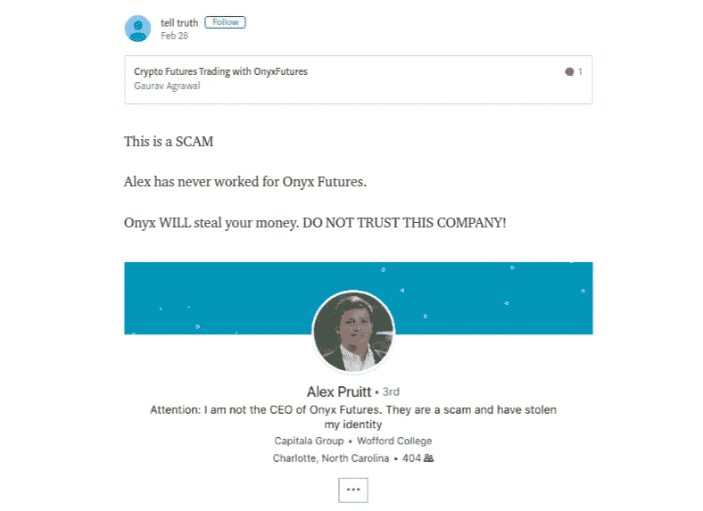
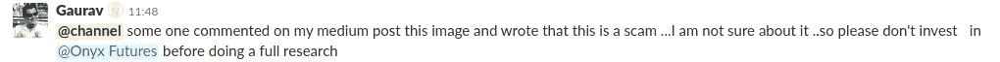

# OnyxFutures 发生了什么——另一个 ICO 骗局？

> 原文：<https://medium.com/coinmonks/whats-happening-with-onyxfutures-another-ico-scam-2cc03b398863?source=collection_archive---------2----------------------->

我们运营一个 [Crypto slack 社区](https://goo.gl/3Ex81z)，在那里我们采访 ico。几天前，我们在 slack 频道采访了 [**OnyxFutures**](https://onyxfutures.io/) 。我们采访了他们，我们还在我们的出版物[**【coin monks**](https://medium.com/coinmonks)**上发布了**采访**，正如 Onyx 告诉我们的，我们当时正在采访 Alex。**

****

**alex and my meeting schedule (from onyx mail)**

**我们最近在帖子上收到了一条评论(由 [tell truth](https://medium.com/u/6440c0f7cb46?source=post_page-----2cc03b398863--------------------------------) )说 Oynx 是一个骗局，他们窃取了 [**Alex Pruitt**](https://www.linkedin.com/in/alex-pruitt-027377b0/) 的身份(Alex 在 OnyxFutures 网站上显示为 CEO)。**

****

**[tell truth](https://medium.com/u/6440c0f7cb46?source=post_page-----2cc03b398863--------------------------------) response on our Blog Post**

**所以在得到这个评论后，我们决定告诉大家我们的社区。我们在我们的 slack 上发布了评论。**

> **[直接在您的收件箱中获得最佳软件交易](https://coincodecap.com/?utm_source=coinmonks)**

********

**Slack Post on our community**

**我们从缟玛瑙那里得到了一封关于传播 FUD 教的邮件。所以我们决定对抗他们。这是我们和 Onyx 之间的邮件对话。**

********************************

**我们也联系了 Alex Pruitt 确认此事。他的回应也不支持 OnyxFutures(我们有 Alex 的回应，但由于他没有同意，所以没有直接使用它)。**

**我们已经将 Alex 的回复发送给 OnyxFutures，我们收到了他们的以下回复。**

********

****我们还联系了 DigitexFutures 团队，讨论 OnyxFutures 声称 Alex 正在与 Digitex 合作的问题，以下是他们的回应。****

****

> **这个故事的寓意是，投资 ico 时要小心。不是每个 ICO 都想骗你，但很多都是。所以在做 ico 投资之前要关注和研究。**

****

**Do your research**

**我们 **相信健康的密码社区，我们在这里分享知识，解决问题，支持那些想改变世界让每个人更好的人。****

> **我们有一个活跃的社区，来这里加入我们吧。订阅我们的时事通讯，我们在这里分享采访，交易想法，市场见解[这里](https://www.getrevue.co/profile/CoinMonks)。**

*****如果你是投资者、交易者、开发者或加密爱好者，或者对 heck crypto 如何工作有很多疑问，请加入我们的*** [***slack 社区***](https://goo.gl/3Ex81z) 。我们的 crypto 论坛 CoinMonks，也可以查看我们的网站，该网站根据开发进度对 Crypto 进行排名[**CoinCodeCap**](http://www.coincodecap.com)**。****

# **❤️喜欢，分享，留下你的评论**

**如果你喜欢这篇文章，不要忘记喜欢，与你的朋友和同事分享，并在下面留下你对这篇文章的评论。
还有……**

****

**Follow me**