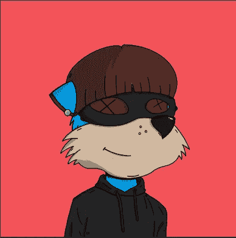

# 钉住价格:为你的 NFTs 定价以获得最大利润的指南

> 原文：<https://medium.com/coinmonks/whats-it-worth-the-nft-version-416c07c77e8?source=collection_archive---------13----------------------->

## 无论你是 NFTs 新手还是经验丰富的收藏家，本指南将帮助你驾驭复杂的定价世界

最近，我成了一名艺术品交易商，或者……也许……一名 jpeg 交易员，如果你愿意这么称呼的话。我说的是，我最近铸造了我的第一个 NFT。我能说什么呢，我瞬间就上瘾了！

现在，当你是 NFTs 的新手时，你可能会问自己一个合理的问题:“为什么有人会为一个 jpeg 图像支付数千甚至数百万美元？”

《虎胆龙威》jpeg 信徒的一个常见回答是“为什么有人会花数百万美元买一张上面有油的画布？”就我而言，这也是一个合理的问题。

更一般地说，这使得评估一幅 NFT 的价值类似于评估一幅画或一件艺术品的价值。关于艺术品的估价，几年前我读了一本有趣的书，叫做*[*它值多少钱？*](https://amzn.to/3lwcoeo)*由一个叫 *Lucien Papouchado* 的家伙。在这篇文章中，我想向你介绍帕普查多对艺术品估价的标准，并把他的标准应用到非艺术珍品中。**

****价值的四个维度****

**艺术品的价值有四个维度:*内在*、*内在*、*属性*、*投资。***

> **一件物品的内在价值是它的材料价值。**

**这正是婴儿潮一代被冒犯的地方。**

**NFT 的内在价值基本为零。它没有物质形态。这是纯粹的信息。**

**但这种情况在较低程度上也适用于昂贵的画作。其画布的价值和所用的颜色与这些画的实际价格极不相称。**

**在更小的程度上，这也适用于雕塑，例如，其材料可能有很大的价值，但仍然与物品的整体价格不相称。**

**最具内在价值的是复杂的珠宝或著名的法贝热彩蛋。**

> **一件物品的内在价值是由构成原材料的艺术家的工艺所创造的价值。**

**对于大多数近期的 NFT 项目来说，这一数值相对较低。**

**但另一方面，当我们的祖先在 17000 年前在法国的墙上绘制动物形象时，NFT 空间是传统艺术空间。那些画并不特别复杂。**

**我肯定有人愿意出高价买那些画。**

> **一件物品的属性价值是通过对其所有者有意义而增加到该物品上的价值。**

**这是最难理解的方面。因为它有些模糊。对一个人有意义的东西可能对另一个人没有意义。但是我们都需要生活中有意义的事情来支撑我们的精神。**

**有些人可能最看重一位知名艺术家的作品，因为这给了他们在别人眼中的地位。**

**有些人可能会因为物品的历史、国家或宗教重要性而关注它们。这给他们一种社区归属感。**

****

**My recently minted Meerkat, part of the [Meerkat Millionaire Country Club Collection](https://mmccsolana.com/)**

**其他人可能想拥有一件同类中的第一件东西。这是主人公旅程的物理或数字表现。有人尝试了一些新的东西，尽管他们的胜算很大。这是真的，因为尝试新事物几乎总是会失败。但是他们克服重重困难，成功了。他们冒险进入未知领域，并取得了胜利。谁不想分一杯羹呢？**

> **一个对象的投资价值是投资者和投机者对该对象增加的价值，预期该对象的价值在未来会增加。**

**这是更大的傻瓜理论。人们购买某些物品是因为预期有人会出更高的价格，试图在这个过程中获利。**

**这是迄今为止大多数 NFT 项目价格的最大组成部分。**

**总会有更大的傻瓜出现，直到没有为止。然后价格暴跌。**

**许多人说，大多数 NFT 项目最终将化为乌有。这很可能是真的。我很期待接下来会发生什么。**

***(本文包含附属链接。)***

> **交易新手？在[最佳加密交易](/coinmonks/crypto-exchange-dd2f9d6f3769)上尝试[加密交易机器人](/coinmonks/crypto-trading-bot-c2ffce8acb2a)或[复制交易](/coinmonks/top-10-crypto-copy-trading-platforms-for-beginners-d0c37c7d698c)**