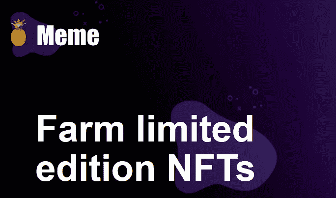
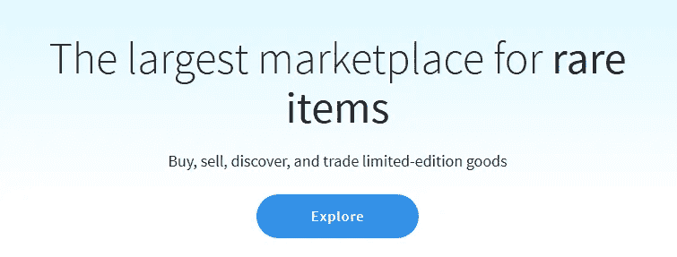

# 什么是迷因，它是如何工作的

> 原文：<https://medium.com/coinmonks/whats-meme-and-how-does-it-work-55d517b28156?source=collection_archive---------0----------------------->

## 让我们来发现 MemeCoin，这是 NFT 领域一个非常有趣的项目。

Meme’s homepage

在密码世界的最新时期，一个被低估或被认为是骗局但具有巨大潜力的项目正在发展。它叫做 **MemeCoin，是在** [**产量农业**](/coinmonks/yield-farming-what-is-it-and-how-does-it-work-452c7ce2c467) 爆炸中诞生的一个项目，由 ConsenSys 的一个开发者开发。他的 token，$Meme，在爆炸后成功让人们谈论自己，24 小时内达到 100%。除了名字，就连 Meme token 营销用的广告语也肯定是有讲究的:**[***不要买 MEME***](https://dontbuymeme.com/) **”或者*不要种地***。简而言之，这是一个独特的项目，可能会在密码世界掀起一股非常有趣的潮流。**

## **Meme:农场限量版 NFT**

**Meme 是一个非常年轻而有趣的项目，因为它的协议中包含了 *DeFi* 和[***Crypto collectives***](https://101blockchains.com/non-fungible-tokens-nft/)的一些**最重要的特性。上面指定的平台令牌被称为$MEME，是一个 **ERC-20 可替换令牌，总供应量为 28000** (在概念上非常类似于 [yearn.finance](/coinmonks/yearn-finance-what-is-it-and-how-does-it-works-ec05504a2713) 的 YFI 令牌)。在如此有限的供应下，在很短的时间内，加上公众的适度兴趣，MEME token 每个价值 1750 美元。事实上，一些获得该平台第一个隔空投送的用户现在已经有 60 万美元的利润了！该协议的操作相对简单，但需要了解诸如**产量农业和**NFT 等概念。通过下注$MEME token，您将获得奖励积分。这些点数是每天赚取的，并根据下注的代币数量进行计算。当用户有足够的奖励点数时，他可以申请一个不可替代的 **ERC-721 代币(NFT ),代表一种数字艺术品。******

****

**Meme’s logo**

## **NFT 和 OpenSea:买卖不可替代的代币**

**NFT 是以太坊网络中的特殊类型的令牌，用于创建稀缺和可验证的数字项目。由于稀缺，它们具有内在价值，代表着它们的拥有和专属所有权。关于这种令牌最有趣的领域是目前的**密码艺术和游戏**，但是将来肯定会有可能将它们应用到许多其他领域。虽然 MEME token 是 ERC-20，但创建的 NFT 是 ERC-721，可以在专门构建的市场上出售和购买，最著名的是 **OpenSea。**这个平台是专门为**稀缺数码物品的点对点交易**而打造的。事实上，自 2018 年 1 月以来，可以购买、出售和拍卖 1200 万笔数字资产，交易量接近 90，000 ETH。**

****

**OpenSea’s homepage**

****Meme 的 NFT 一般分为稀有和收藏**，会随着时间的推移进行更新和添加。至于我们所拥有的稀有性:遗迹、普通、稀有和传奇。对于各种稀有的每个代币，你需要积分(称为菠萝)，目前通过两种方式获得:
-直接下注 MEME，
-为 ETH / MEME 池提供流动性，以及下注 Uniswap 提供的 LP 代币。
有趣的是**没有自动铸造 NFT**。当用户收集了足够的菠萝，他们必须返回到网站，选择你的 NFT，并进行赎回交易。**

****

**Meme’s NFT inside OpenSea**

**不管项目的名称和使用的营销手段如何，MEME 项目肯定是一个**有趣的想法，随着时间的推移，crypto 投资者将会探索这个想法**。不可替代代币的世界，相对于 2017 年的 DeFi 和 ICOs，只是权力上的趋势。时间还不成熟，但是非功能性数字技术和绝对数字稀缺的潜力是无限的。**

**你对 MemeCoin 有什么看法？请在评论中告诉我！**

**关注我在加密和区块链领域的其他文章！**

## **另外，阅读**

*   **最好的[密码交易机器人](/coinmonks/crypto-trading-bot-c2ffce8acb2a)**
*   **[密码本交易平台](/coinmonks/top-10-crypto-copy-trading-platforms-for-beginners-d0c37c7d698c)**
*   **最好的[加密税务软件](/coinmonks/best-crypto-tax-tool-for-my-money-72d4b430816b)**
*   **[最佳加密交易平台](/coinmonks/the-best-crypto-trading-platforms-in-2020-the-definitive-guide-updated-c72f8b874555)**
*   **最佳[加密贷款平台](/coinmonks/top-5-crypto-lending-platforms-in-2020-that-you-need-to-know-a1b675cec3fa)**
*   **[最佳区块链分析工具](https://bitquery.io/blog/best-blockchain-analysis-tools-and-software)**
*   **[加密套利](/coinmonks/crypto-arbitrage-guide-how-to-make-money-as-a-beginner-62bfe5c868f6)指南:新手如何赚钱**
*   **最佳[加密制图工具](/coinmonks/what-are-the-best-charting-platforms-for-cryptocurrency-trading-85aade584d80)**
*   **[莱杰 vs 特雷佐](/coinmonks/ledger-vs-trezor-best-hardware-wallet-to-secure-cryptocurrency-22c7a3fd391e)**
*   **了解比特币的[最佳书籍有哪些？](/coinmonks/what-are-the-best-books-to-learn-bitcoin-409aeb9aff4b)**
*   **[3 商业评论](/coinmonks/3commas-review-an-excellent-crypto-trading-bot-2020-1313a58bec92)**
*   **[AAX 交易所评论](/coinmonks/aax-exchange-review-2021-67c5ea09330c) |推荐代码、交易费用、利弊**
*   **[Deribit 审查](/coinmonks/deribit-review-options-fees-apis-and-testnet-2ca16c4bbdb2) |选项、费用、API 和 Testnet**
*   **[FTX 密码交易所评论](/coinmonks/ftx-crypto-exchange-review-53664ac1198f)**
*   **[n 零审核](/coinmonks/ngrave-zero-review-c465cf8307fc)**
*   **[比特交换评论](/coinmonks/bybit-exchange-review-dbd570019b71)**
*   **[3Commas vs Cryptohopper](/coinmonks/cryptohopper-vs-3commas-vs-shrimpy-a2c16095b8fe)**
*   **最好的比特币[硬件钱包](/coinmonks/the-best-cryptocurrency-hardware-wallets-of-2020-e28b1c124069?source=friends_link&sk=324dd9ff8556ab578d71e7ad7658ad7c)**
*   **最佳 [monero 钱包](https://blog.coincodecap.com/best-monero-wallets)**
*   **[莱杰纳米 s vs x](https://blog.coincodecap.com/ledger-nano-s-vs-x)**
*   **[bits gap vs 3 commas vs quad ency](https://blog.coincodecap.com/bitsgap-3commas-quadency)**
*   **[莱杰纳米 S vs 特雷佐 one vs 特雷佐 T vs 莱杰纳米 X](https://blog.coincodecap.com/ledger-nano-s-vs-trezor-one-ledger-nano-x-trezor-t)**
*   **[block fi vs Celsius](/coinmonks/blockfi-vs-celsius-vs-hodlnaut-8a1cc8c26630)vs Hodlnaut**
*   **Bitsgap 评论——一个轻松赚钱的加密交易机器人**
*   **为专业人士设计的加密交易机器人**
*   **[PrimeXBT 审查](/coinmonks/primexbt-review-88e0815be858) |杠杆交易、费用和交易**
*   **[埃利帕尔泰坦评论](/coinmonks/ellipal-titan-review-85e9071dd029)**
*   **[SecuX Stone 点评](https://blog.coincodecap.com/secux-stone-hardware-wallet-review)**
*   **[BlockFi 评论](/coinmonks/blockfi-review-53096053c097) |从您的密码中赚取高达 8.6%的利息**