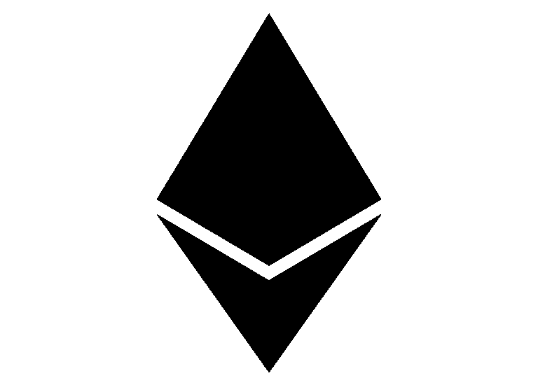

# Solidity 0.6 的新特性

> 原文：<https://medium.com/coinmonks/whats-new-in-solidity-0-6-56fa76198ec7?source=collection_archive---------0----------------------->

## 坚固性最新改进的快速入门



最近发布了 Solidity 0.6 ，带来了一些语法变化和非向后兼容的变化。

我们将讨论 Solidity 的一些主要变化，包括:

*   功能覆盖
*   抽象合同
*   尝试/抓住
*   接收以太网/回退功能分离
*   数组大小调整
*   状态变量阴影

# 功能覆盖

在以前的 Solidity 版本中，没有明确的方法知道继承契约应该覆盖哪些函数。Solidity 0.6 带来了一个改进，它清楚地表明了继承契约可以覆盖哪些函数。

只有当它们被标记为**虚拟**时，继承契约才能覆盖其基础契约函数行为。然后，覆盖函数必须在函数头中使用`**override**`关键字，如下所示。

```
**pragma solidity** ^0.6.0;**contract** Base
{
    **function** foo() **virtual** **public** {}
}**contract** Middle **is** Base {}**contract** Inherited **is** Middle
{
    **function** foo() **public** **override** {}
}
```

有了这个改进，就不用再检查 OpenZeppelin 文档中哪些函数可以被覆盖，因为 Solidity 编译器本身可以让你知道继承契约何时覆盖了一个非“虚拟”函数。

# 抽象合同

Solidity 0.6 中引入了一个新的关键字`abstract`。它用于标记未实现其所有功能的合同。

当合同中至少有一个功能没有实现时，合同将被标记为`abstract`。没有在接口外实现的函数必须标记为 ***虚拟的。*** 即使所有的功能都实现了，契约也可以标记为抽象的。

```
**abstract** **contract** Feline {
    **function** utterance() **public** virtual **returns** (bytes32);
}**contract** Cat **is** Feline, Token {
    **function** utterance() **public** override **returns** (bytes32) {
        **return** "miaow"; 
     }
}
```

# 尝试/抓住

Solidity 0.6 引入了一个`try/catch`语句，用于处理失败的契约调用错误。它允许您对失败的外部呼叫做出反应。

使用 try/catch 语句可以捕获外部约定调用中的失败，如下所示:

```
**pragma solidity** ^0.6.0;**interface** DataFeed { 
      **function** getData(address token) **external** **returns** (uint value); 
}**contract** FeedConsumer {
    DataFeed feed;
    uint errorCount;
    **function** rate(address token) **public** **returns** (uint value, bool success) {
        *// Permanently disable the mechanism if there are*
        *// more than 10 errors.*
        require(errorCount < 10);
        try feed.getData(token) **returns** (uint v) {
            **return** (v, **true**);
        } catch Error(string **memory** */*reason*/*) {
            *// This is executed in case*
            *// revert was called inside getData*
            *// and a reason string was provided.*
            errorCount++;
            **return** (0, **false**);
        } catch (bytes **memory** */*lowLevelData*/*) {
            *// This is executed in case revert() was used*
            *// or there was a failing assertion, division*
            *// by zero, etc. inside getData.*
            errorCount++;
            **return** (0, **false**);
        }
    }
}
```

根据错误的类型，Solidity 支持不同种类的 catch 块。如果错误是由`revert("reasonString")`或`require(false, "reasonString")`(或导致这种异常的内部错误)引起的，那么`catch Error(string memory reason)`类型的 catch 子句将被执行。

# 接收以太网/回退功能分离

## 接受乙醚

要使合同能够接收以太，它必须实现`**receive()**` 功能。一个契约最多可以有一个`receive`函数，使用`receive() external payable { ... }`(没有`function`关键字)声明，如下例所示:

```
**pragma solidity** ^0.6.0;*// This contract keeps all Ether sent to it with no way*
*// to get it back.*
**contract** Sink {
    **event** Received(address, uint);
    **receive**() **external** **payable** {
        **emit** Received(msg.sender, msg.value);
    }
}
```

## 后退功能

一个契约最多可以有一个`fallback`函数，使用`fallback () external [payable]`(没有`function`关键字)声明。这个函数不能有参数，不能返回任何东西，并且必须有`external`可见性。如果其他函数都不匹配给定的函数签名，或者如果根本没有提供数据，并且没有[接收以太函数](https://solidity.readthedocs.io/en/v0.6.2/contracts.html#receive-ether-function)，则在调用契约时执行。回退功能总是接收数据，但为了也接收数据，必须将其标记为`payable`。

```
**pragma solidity** >0.6.1 <0.7.0;**contract** Test {
    *// This function is called for all messages sent to*
    *// this contract (there is no other function).*
    *// Sending Ether to this contract will cause an exception,*
    *// because the fallback function does not have the `payable`*
    *// modifier.*
    **fallback**() **external** { x = 1; }
    uint x;
}**contract** TestPayable {
    *// This function is called for all messages sent to*
    *// this contract, except plain Ether transfers*
    *// (there is no other function except the receive function).*
    *// Any call with non-empty calldata to this contract will execute*
    *// the fallback function (even if Ether is sent along with the call).*
    **fallback**() **external** **payable** { x = 1; y = msg.value; }*// This function is called for plain Ether transfers, i.e.*
    *// for every call with empty calldata.*
    **receive**() **external** **payable** { x = 2; y = msg.value; }
    uint x;
    uint y;
}
```

# 数组大小调整

现在，对阵列`length`的访问始终是只读的，即使对于存储阵列也是如此。不再可能通过为存储阵列的长度指定新值来调整其大小。用`push()`、`push(value)`或`pop()`代替，或者分配一个全数组，

*   将`uint length = array.push(value)`改为`array.push(value);`。可以通过`array.length`访问新长度。
*   将`array.length++`改为`array.push()`增加，使用`pop()`减少存储阵列的长度。

```
**contract** Test {
  **string**[] **public** names_A_to_F;**function** test() **public** {
    // invalid syntaxuint length = names_A_to_F.push("Alice"); // invalid
    names_A_to_F.length++; // invalid as length is now read only// correct syntax 
    names_A_to_F.push(); // increase array length
    names_A_to_F.push("Alice"); // add item to array
    names_A_to_F.pop(); // reduce array length by removing item
    uint length = names_A_to_F.length; // access array length}}
```

# 现在不允许状态变量隐藏

状态变量阴影被认为是一个错误。派生契约只能声明一个状态变量`**x**`，如果在其任何基中没有同名的可见状态变量。

下面显示了一个示例:

```
**contract** Test {
    **address** x **payable**;
}**contract** TestOverride **is** Test {// This declaration would throw an error because its shadowing a                    // state variable already in its base inherited contract Test
    **address** x **payable**;}
```

这是一个明确的要求，有助于阅读和理解 Solidity 代码库。

# 结论

Solidity 0.6 带来了急需的改进和明确性要求，使得阅读和理解 Solidity 代码库更加容易。

# 进一步阅读

 [## Solidity v0.6.0 重大变更— Solidity 0.6.2 文档

### 函数现在只能在用关键字标记或在接口中定义时被重写。功能…

solidity.readthedocs.io](https://solidity.readthedocs.io/en/v0.6.2/060-breaking-changes.html) [](https://blog.ethereum.org/2020/01/29/solidity-0.6-try-catch/) [## Solidity 0.6.x 特性:try/catch 语句

### 0.6.0 中引入的 try/catch 语法可以说是可靠性中错误处理能力的最大飞跃，因为…

blog.ethereum.org](https://blog.ethereum.org/2020/01/29/solidity-0.6-try-catch/) 

> [在您的收件箱中直接获得最佳软件交易](https://coincodecap.com/?utm_source=coinmonks)

[](https://coincodecap.com/?utm_source=coinmonks)