# 最好的以太坊街区探索者是什么？以太扫描的 10 种替代方案

> 原文：<https://medium.com/coinmonks/whats-the-best-ethereum-block-explorer-10-alternatives-to-etherscan-8eb5f2be263d?source=collection_archive---------0----------------------->

如果你想知道以太坊网络内部发生了什么，那么你需要熟悉 block explorers。他们是非常有用的工具，检查网络状态，个人转让，合同电话等。许多网站还提供了有关令牌的详细信息。

这些服务都是免费使用的，考虑到维护和开发所花费的[时间和费用，这一点不应该被低估。在过去的几个月里，](https://hackernoon.com/what-does-it-take-to-make-your-own-blockchain-explorer-47ea1f64b41e)[以太坊上每天有 50 万+的交易](https://etherscan.io/chart)。这些都由块浏览器记录，并以(相对)易于理解的格式反馈给您。

但是你应该使用哪一个呢？让我们探索一下选择。

> 结账多重[区块链探索者 Bitquery](https://explorer.bitquery.io/)

[**以太扫描**](https://etherscan.io/)

以太坊的原创和整体最佳方块浏览器。你可以检查几乎任何东西，深入挖掘区块，交易和地址。它有很多其他很酷的工具，比如 checkers for gas、nodes 和 dex，还有一些有趣的图表和统计数据。

很容易看到进出一个地址的东西，并且对于每笔交易，你可以检查状态(实时)，街区高度，气体统计，tx 成本等。

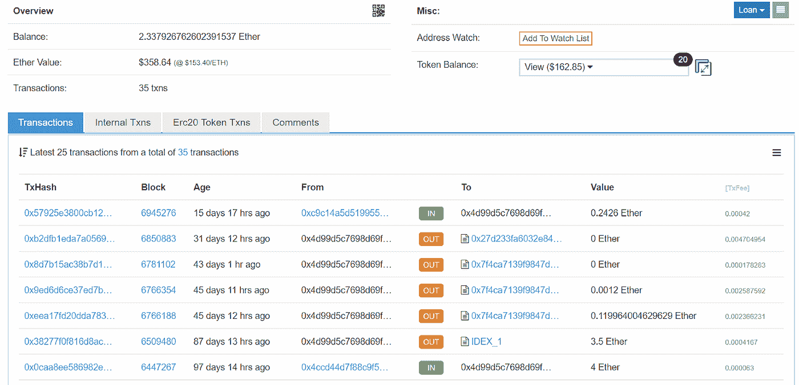

他们还有一个全面的令牌列表(涵盖 ERC-20 和 ERC-721)，在这里您可以看到以太坊上推出的各种资产，并深入了解顶级持有者、价格历史、数量、流通供应量、ICO 信息、交易所等细节。

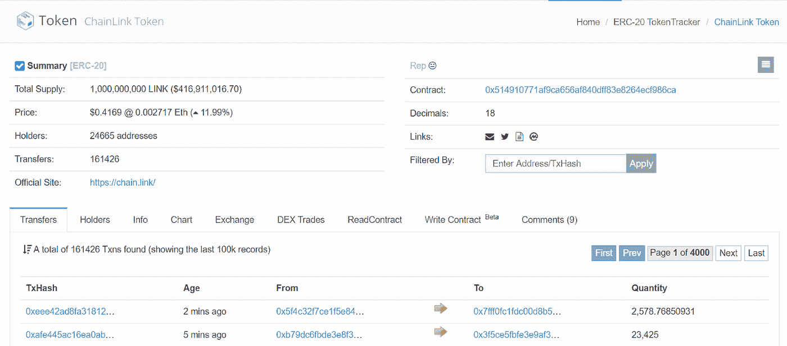

虽然 Etherscan 很棒，而且对许多人来说将是首选工具，但最好有一些替代工具来做一些不同的事情，或者以不同或简化的方式呈现信息。排名不分先后，以下是我喜欢的另外 10 个网站。

__________________________________________________________

## 老手

一些探险家几乎和以太扫描一样早就存在了

[**以太探测器**](https://ethplorer.io/)

由 Everex 团队建造，他们似乎参与了一些项目。他们也有一个钱包(现在谁没有了…)，而且似乎还在摆弄区块链的资金转移。

Ethplorer 的一个很好的特性是一个图表，可以跟踪你的地址余额的价格，还可以显示交易量。

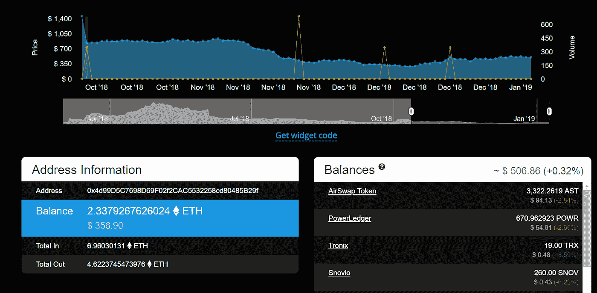

Ethplorer 也非常关注令牌，您可以找到大多数关键信息(尽管它们缺少描述和链接)。很容易一眼就看出你地址中的代币余额，以及价格波动。

每个代币都有一个配置文件，您可以在其中检查“脉搏”，它可以显示价格以及在线“操作”(交易计数)。

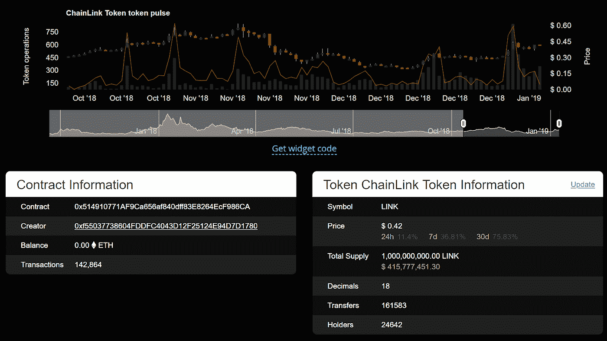

[**以太链**](https://www.etherchain.org)

非常类似于 Etherscan，界面更吸引人。它有很多类似的图表和工具(我注意到的一个独特的东西是[单位转换器](https://www.etherchain.org/tools/unitConverter)，如果你想知道阿伟、萨博或芬尼之间的区别，这很有用)

“地址概览”简洁明了，为您提供了所有必需的信息，并且很容易看到您一段时间以来发送和接收的内容(也可以通过单击“历史记录”选项卡以图表形式显示)。

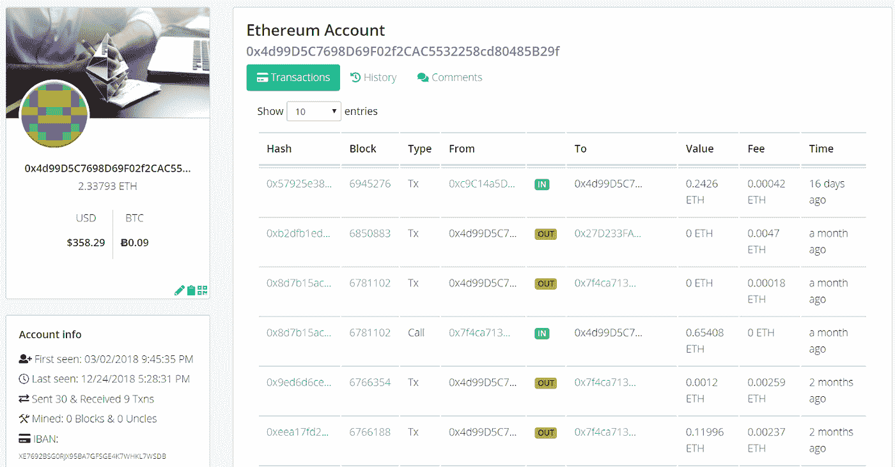

缺少的一个主要特性是令牌浏览器。输入一个令牌地址，你将得不到任何有用的东西。

___________________________________________________________

## 新来的孩子。

这些项目在最近几个月突然出现了

[block scout](https://blockscout.com/eth/mainnet/)

由 POA 网络团队构建，他们看到了对开源块浏览器的需求。一个非常酷的基础设施，可以从他们的 [GitHub](https://github.com/poanetwork/blockscout) 中检查和利用。他们的最终目标是覆盖以太坊上的一切，从交易和区块信息、代币价值到侧链和私有链。

address 接口拥有您期望看到的一切，并且清楚地识别事务、令牌传输、契约调用等等，这非常有用，是大多数其他资源管理器所缺乏的。

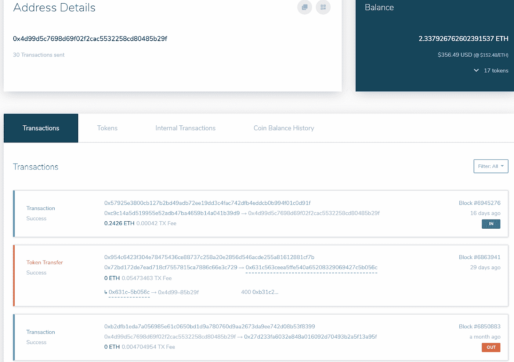

然而，令牌资源管理器非常有限，不能处理最近的传输，但是正如一个注释所指出的，这个链仍在被索引，所以我希望这个方面会随着时间的推移得到改进。

[**EnjinX**](https://enjinx.io/)

EnjinCoin 团队在 2018 年 12 月才发布的一款非常快速且外观漂亮的浏览器。它不仅支持以太坊(以及 ERC-20，721 & 1155 代币)，还支持比特币和莱特币。

地址接口将大量内容压缩成表格格式，这对某些人来说可能有点拥挤。但是，密钥信息会清楚地显示出来，令牌转移会单独显示在它自己的选项卡中。

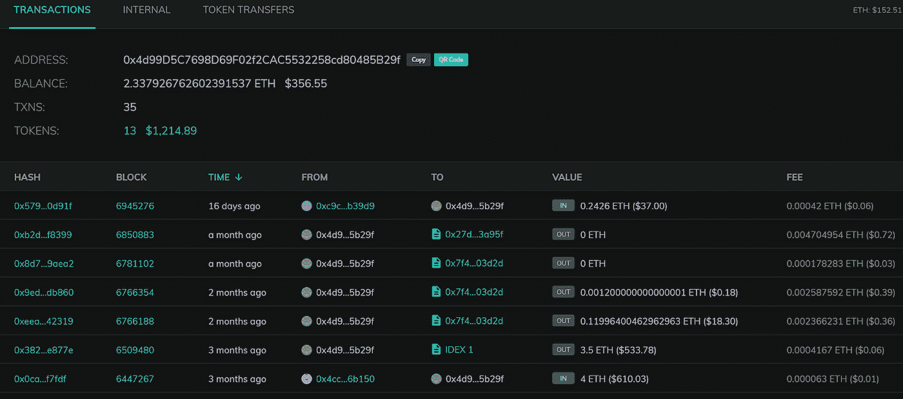

代币浏览器涵盖基本细节、持有者和转移。

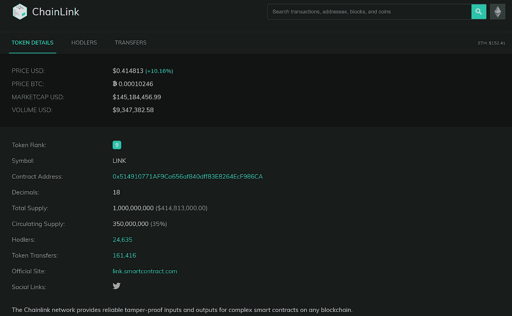

在我看来，EnjinX 可以拥有超过 1000 个 ERC 20 代币的市值排名。然而，遗憾的是，它不允许你根据在线活动或持有人数进行排名。

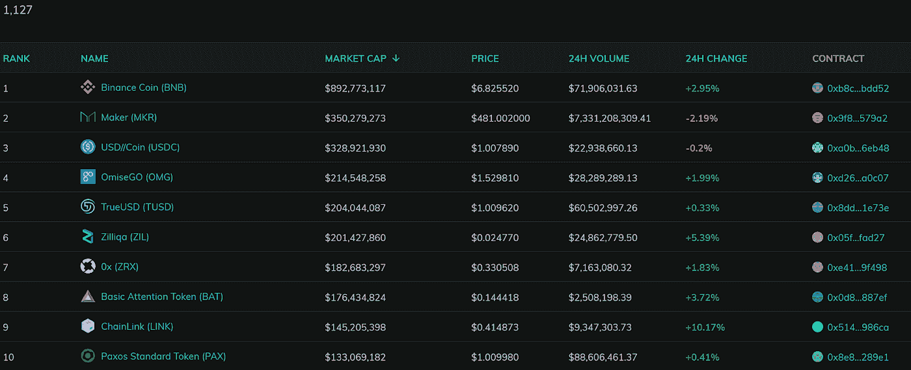

_______________________________________________________________

## 多链探险家。

这些服务最初是作为比特币的区块探索者而建立的，现在已经多样化，包括以太坊。

[**Blockchain.com**](https://www.blockchain.com/explorer?currency=ETH)

**相当基本，显示了什么已经发送和接收，所以很好的快速检查。**

**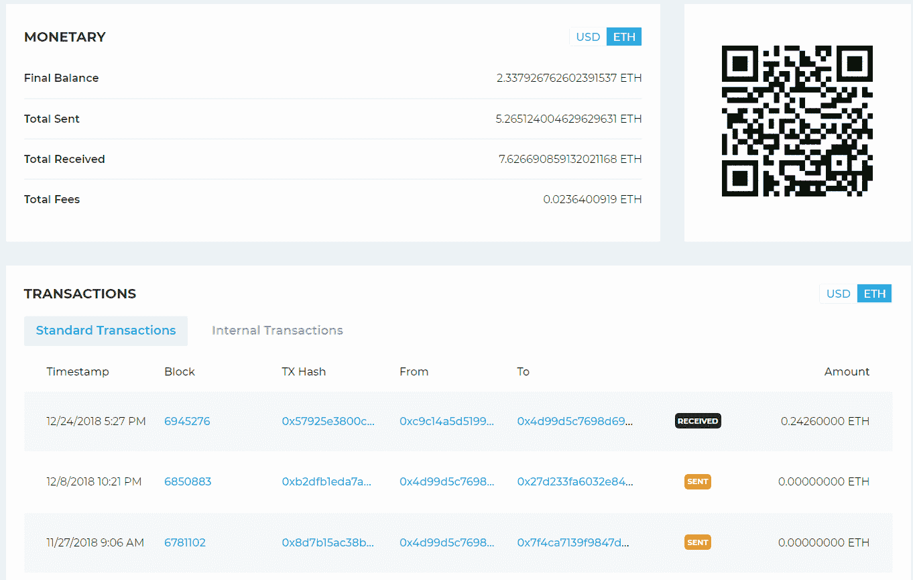**

**【BTC.com】T5[T6](https://eth.btc.com/#/)**

**再次，涵盖了基本的内外，但没有太多的挖掘。漂亮的令牌持有的彩色表示，并有一个功能令牌浏览器。**

**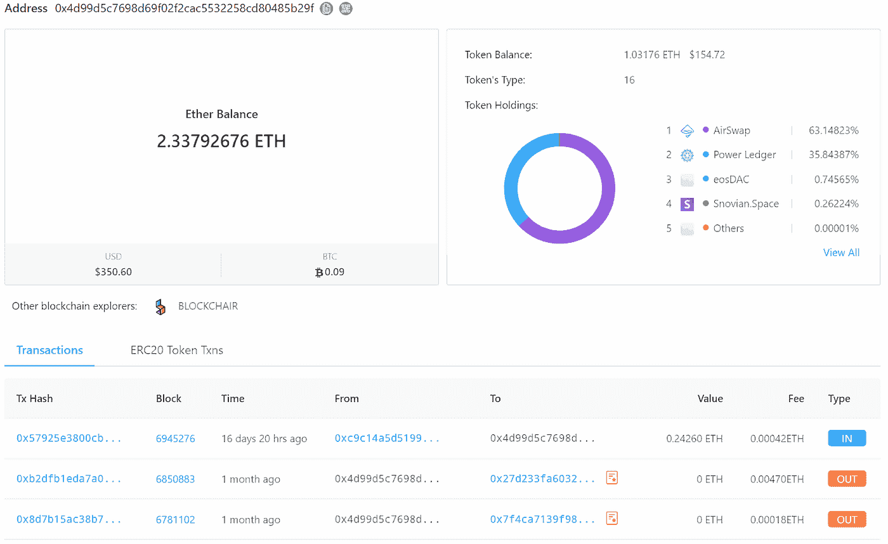**

**______________________________________________________________**

## **在兔子洞里。**

**这些服务提供了一些稍微不同的东西。**

**[**Bloxy**](https://bloxy.info/)**

**这是一件很重要的装备。如果它发生在以太坊，Bloxy 会让你知道的。对于简单地检查事务来说，这有点矫枉过正，而且当您第一次启动它时会很困惑。然而，如果你想看到你的地址内发生的一切，这是你需要去的地方。**

**一些功能:**

*   **发送+接收**
*   **按月列出的活动图表**
*   **智能合约调用**
*   **与其他地址的关系**
*   **投资组合分析**
*   **通知**

**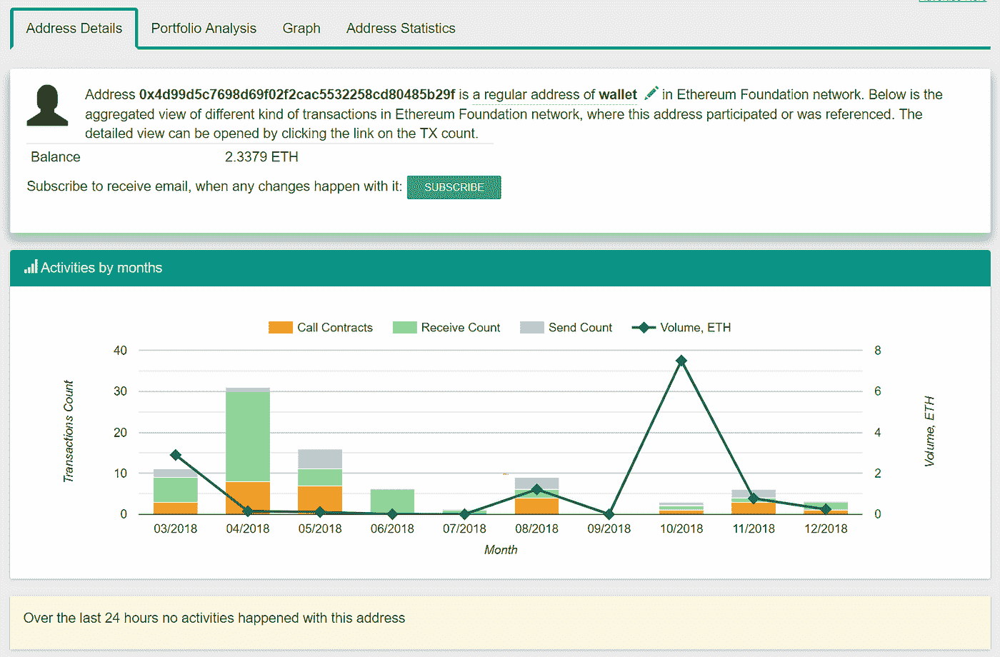**

**Bloxy 还为您介绍了令牌的全面分析。我可以再写一篇长文，介绍您可以找到的关于单个令牌和分组令牌的所有信息，但只是作为功能概述:**

*   **线上活动(每日+每月图表)**
*   **转移**
*   **合同电话**
*   **持有者(分布、历史增长、所有者与其他令牌的交集)**
*   **DEX 交易**

**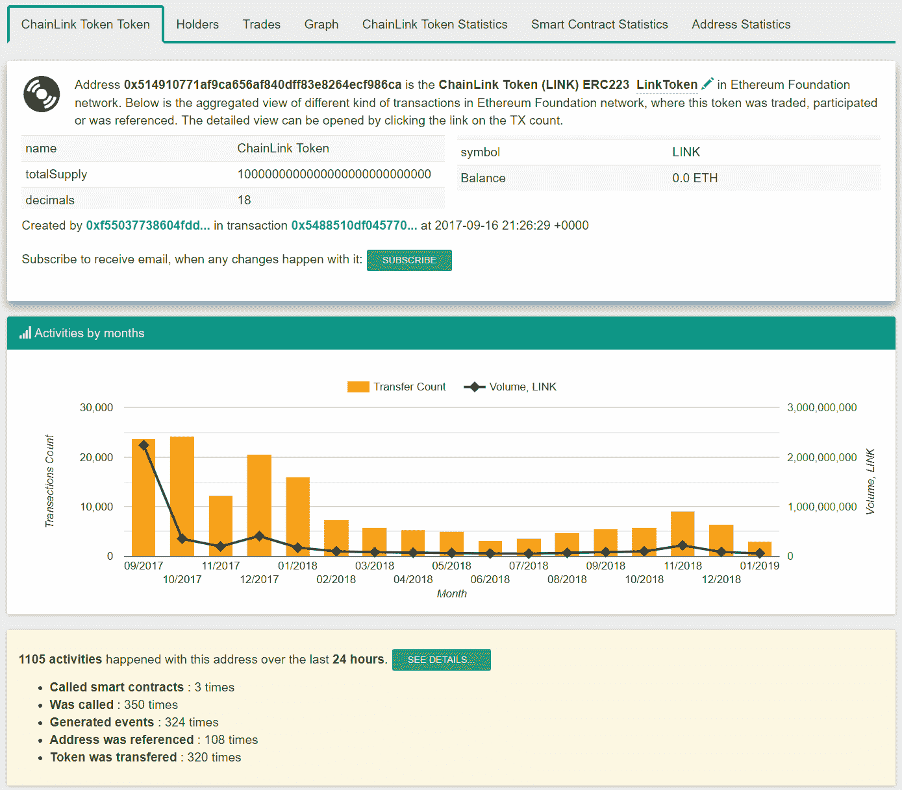**

**Bloxy 覆盖 ERC-20，721，223 + 827。虽然你一眼就能看到转移最多的代币，但我觉得这并不特别有用，因为大多数都是我从未听说过的狗屎硬币。我更希望看到按 marketcap 或独特发件人排列的列表，因为(在我看来)这能更好地显示有趣的项目。**

**还有几件事。伟大的 API，非常酷的[分析报告](https://bloxy.info/analytics)。**

**[**琥珀数据**](https://amberdata.io/home)**

**与 Bloxy 非常相似，您可以访问一些关于交易和令牌的有趣数据。它还以吸引人的视觉方式列出了 ERC-721 的收藏品，让我想起了一些我已经忘记的东西。**

**然而，整体琥珀数据感觉有点有限，界面混乱。例如，虽然很容易看到发送和接收了什么，但您只能查看 30 天的帐户历史图表，并且按地址列出的传入量的'*No Addresses found*'。**

**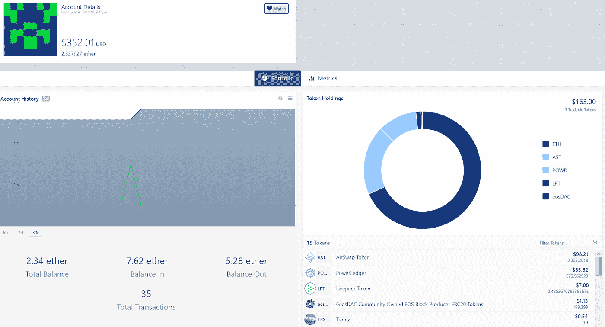**

**令牌视图有一些漂亮的图表(特别是按地址划分的传入量)，但同样仅限于 30 天。合同活动和采用&使用图表我并不觉得特别有用，因为这些术语定义混乱(如 EOA 到合同交易或唯一地址交互)。**

**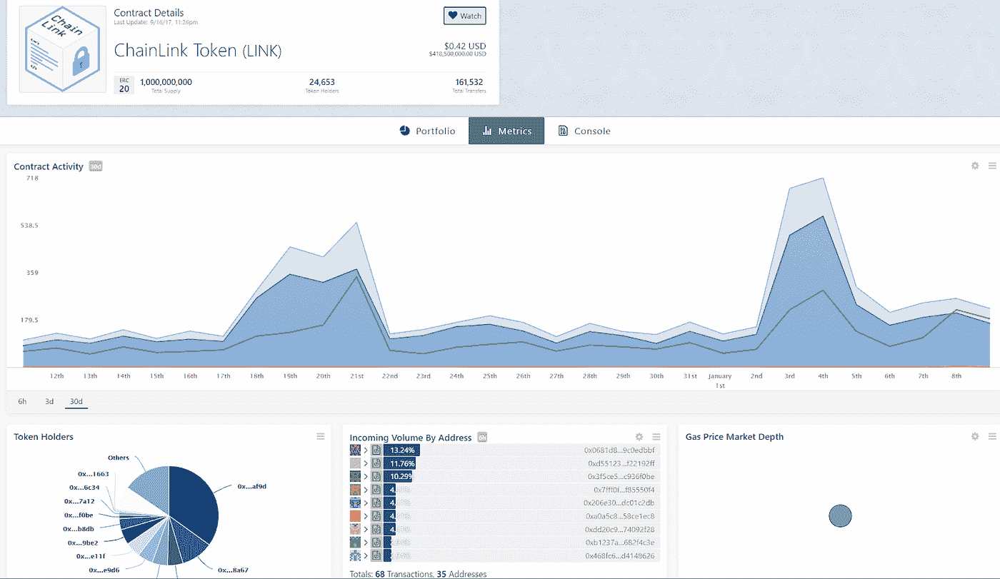**

**最后，[令牌列表](https://amberdata.io/dashboards/applications)似乎非常不准确，尤其是在考虑 marketcap 的时候。根据这份报告，VERI 和一些我从未听说过的叫做 XCEL 的地方比 BNB 和 MKR 有更高的市场上限——这里出问题了！**

**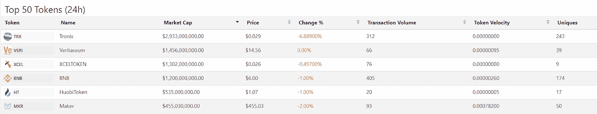**

**[et hective](https://ethtective.com/)**

**这是一个非常有趣的可视化以太网的方式，使得探索传送变得更加互动。**

**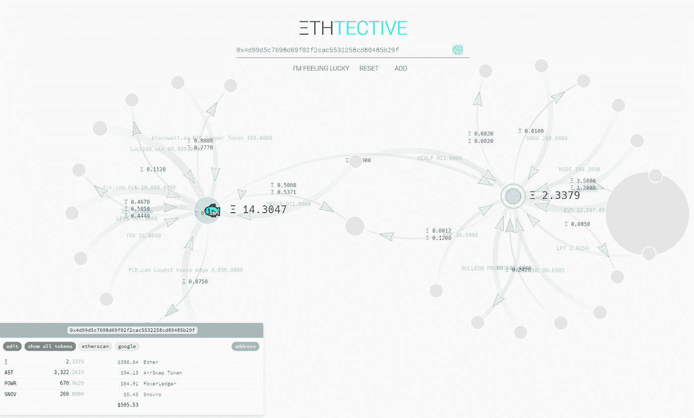**

**很容易迷失在转账和连接的迷宫中，但尽管如此，这仍然是一个很酷的工具，可以查看一个地址有多活跃，以及较大的交易往来于何处。**

**一个很好的接触是地址的分类，所以你可以很容易地识别鲸鱼，小鱼，交流，诈骗等。**

**[**ETHStats**](https://ethstats.io/)**

**从 Alethio 数据工作室(这是 Consensys 的主要项目之一)中涌现出来的这个浏览器需要一些时间来适应，但是一旦你习惯了，它看起来真的很酷而且非常漂亮。**

**地址界面向您显示您的投资组合的价值，以及 ETH 和代币的分布，绘制随时间的涨跌图。**

**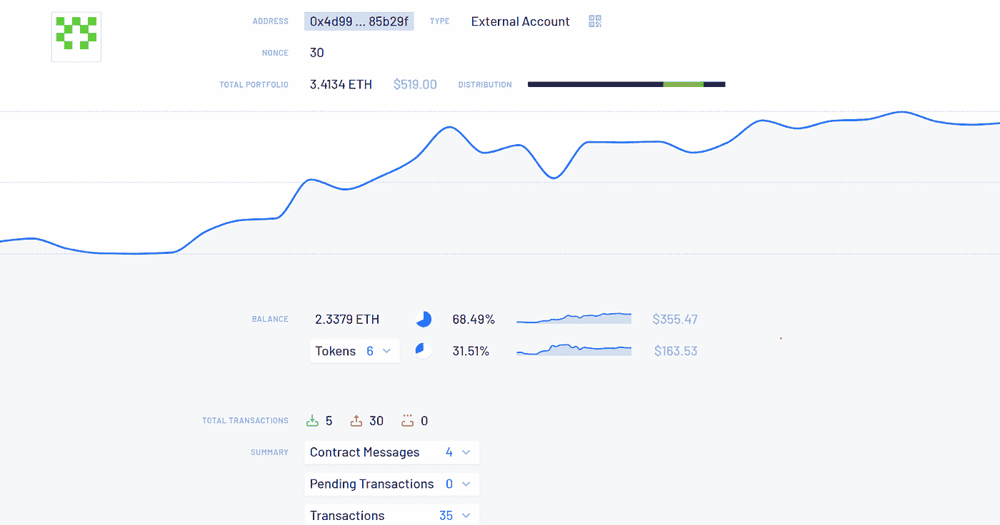**

**当然，您可以更深入地研究事务，它甚至可以可视化您的事务在块中的位置。**

**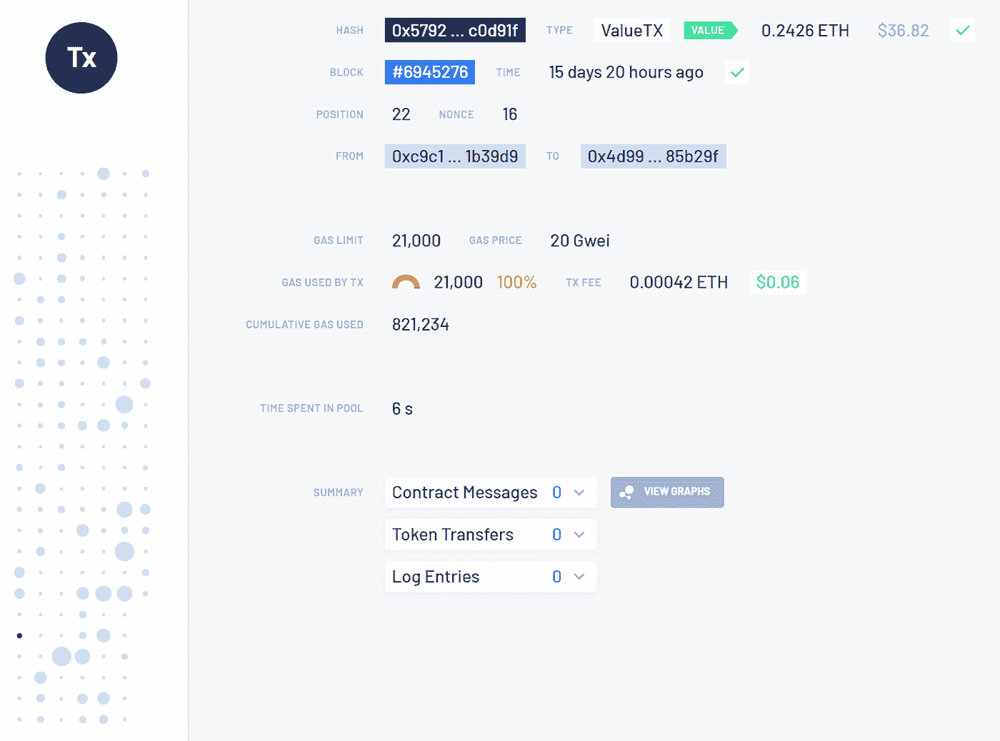**

**虽然您可以搜索令牌地址，并获得活动的概述，但本质上并没有专用的令牌浏览器。但是我不认为 Alethio 会满足于他们的荣誉，所以我希望在不久的将来看到一个象征性的探险家。**

**____________________________________________________________**

## **所以你有它。以太扫描的一些替代方案。让我知道你的偏好是什么？**

**此外，如果代币探索是你的事情，我一直在做[琐碎的](https://trivial.co/tokens#c:Highest%20Market%20Cap)，试图提供以太坊上 ERC-20 代币的信息和见解。**

**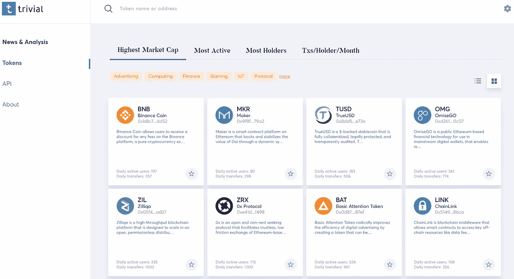**

> **加入 Coinmonks [电报频道](https://t.me/coincodecap)和 [Youtube 频道](https://www.youtube.com/c/coinmonks/videos)获取每日[加密新闻](http://coincodecap.com/)**

## **另外，阅读**

*   **[复制交易](/coinmonks/top-10-crypto-copy-trading-platforms-for-beginners-d0c37c7d698c) | [加密税务软件](/coinmonks/crypto-tax-software-ed4b4810e338)**
*   **[网格交易](https://coincodecap.com/grid-trading) | [加密硬件钱包](/coinmonks/the-best-cryptocurrency-hardware-wallets-of-2020-e28b1c124069)**
*   **[密码电报信号](http://Top 4 Telegram Channels for Crypto Traders) | [密码交易机器人](/coinmonks/crypto-trading-bot-c2ffce8acb2a)**
*   **[最佳加密交易所](/coinmonks/crypto-exchange-dd2f9d6f3769) | [印度最佳加密交易所](/coinmonks/bitcoin-exchange-in-india-7f1fe79715c9)**
*   **开发人员的最佳加密 API**
*   **最佳[密码借贷平台](/coinmonks/top-5-crypto-lending-platforms-in-2020-that-you-need-to-know-a1b675cec3fa)**
*   **杠杆代币的终极指南**
*   **[7 个最佳零费用加密交易平台](https://coincodecap.com/zero-fee-crypto-exchanges)**
*   **[最佳网上赌场](https://coincodecap.com/best-online-casinos) | [期货交易机器人](/coinmonks/futures-trading-bots-5a282ccee3f5)**
*   **[分散交易所](https://coincodecap.com/what-are-decentralized-exchanges) | [比特 FIP](https://coincodecap.com/bitbns-fip)**
*   **[用信用卡购买密码的 10 个最佳地点](https://coincodecap.com/buy-crypto-with-credit-card)**
*   **[加拿大最佳加密交易机器人](https://coincodecap.com/5-best-crypto-trading-bots-in-canada) | [Bybit vs 币安](https://coincodecap.com/bybit-binance-moonxbt)**