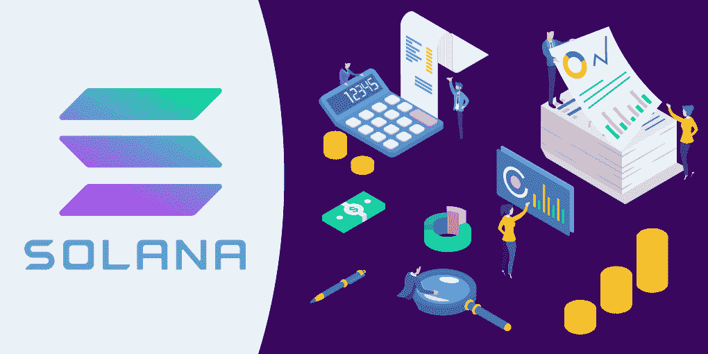
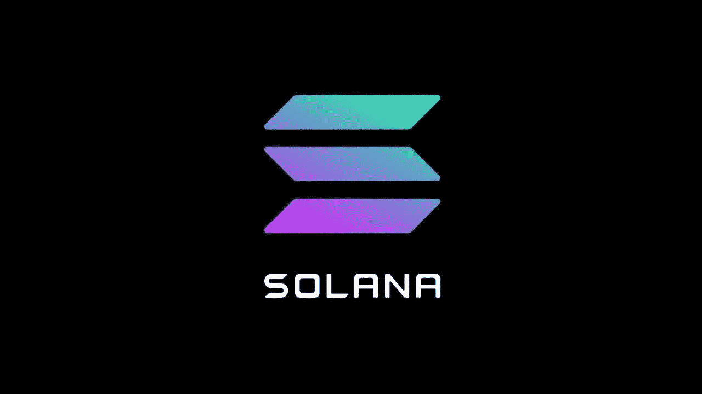
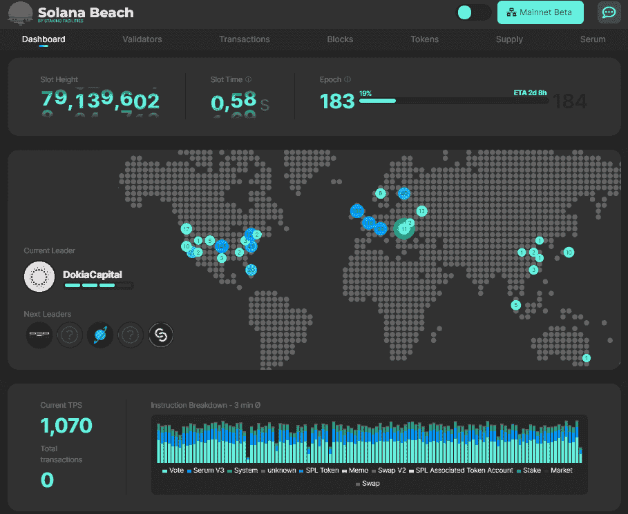
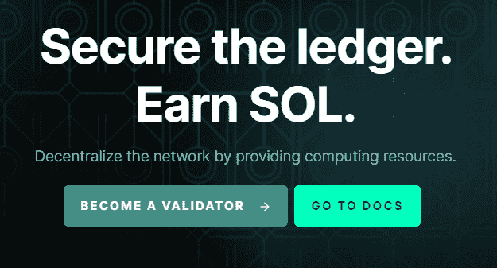
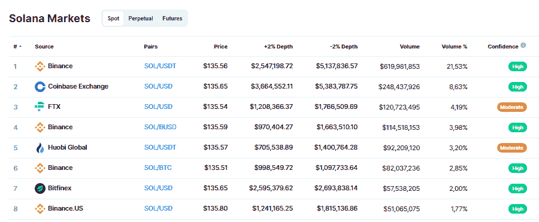

# 索拉娜怎么了？飞速发展的加密货币指南

> 原文：<https://medium.com/coinmonks/whats-the-deal-with-solana-a-guide-into-the-skyrocketing-cryptocurrency-5f5dbaf68d94?source=collection_archive---------3----------------------->

许多新的加密货币声称，他们拥有在速度、可扩展性和费用方面胜过其他数字资产的解决方案。今天有一大堆被称为“以太坊杀手”的项目。然而，其中有一个非常突出——这就是 Solana，它提供了独特的健壮的可伸缩性解决方案。这枚硬币令人难以置信的价格动态证明了密码社区在其中看到的价值。我们来调查一下索拉纳现象。

# 索拉纳是什么？

Solana 是一个开源的区块链，它通过优先考虑三个基本要素来关注成本效益:可伸缩性、安全性和去中心化。

该项目以索拉纳命名，索拉纳是一个位于加州圣地亚哥附近的沿海小镇。科技巨头高通的总部位于圣地亚哥，索拉纳创始人兼首席执行官阿纳托利·亚科文科在这里做了 13 年的软件工程师。

Anatoly 在加密方面的第一次经历是比特币挖矿——然而，他参与的时间并不长。Yakovneko 很快明白，通过分散时钟引入带时间戳的事务，可以将区块链技术带到一个新的高度。将所有网络参与者同步到这个时钟可以增加可扩展性(比特币和其他主要密码的主要缺点)，而不会损害去中心化。

索拉纳就是这样被怀上的。2017 年，Anatoly 和他的同事向公众介绍了[官方 Solana 白皮书](https://solana.com/solana-whitepaper.pdf)。索拉纳的完全可操作的 mainnet 于 2020 年 3 月上线。目前，我们预计它将退出测试。

# 索拉纳背后的团队是什么？

Solana 有一个非常敬业的团队，其成员拥有在高通、英特尔、微软、谷歌、Twitter、Dropbox 等科技巨头工作的经验。然而，经验远不是 Solana 团队的唯一优势——其成员强烈致力于该项目的理念，即欢呼一个可扩展的区块链，用户可以控制他们的数据流。

索拉纳首席执行官阿纳托利·亚科文科(右)着迷于“公共账簿将成为互联网隐私的催化剂。”他将 Solana 描述为“高性能、无权限、密码安全的操作系统”，并指出还没有人做到这一点。

Stephen Akridge(图片中亚科文科的左边)强调 Solana 的团队正在挑战当前硬件和网络基础设施的极限。Solana Patrick Fitzgerald(再往左)[的首席技术官概述了](/solana-labs/meet-solanas-kick-ass-team-of-blockchain-junkies-c1604ba279d0)该平台的两大好处:它允许“开发者不受交易费和智能合同天然气价格的约束”，Solana 的用户将自己决定与应用程序共享哪些数据。

# 索拉纳是如何工作的？

Solana 是一个开源的区块链，它利用了利益相关共识算法的证明。与以太坊一样，Solana 是为构建分散式应用程序而设计的，并配备了智能合约功能。两个主要特征使它不同于现有的公共区块链解决方案:BFT 塔(拜占庭容错共识)和历史证明。

PoH 并不像听起来那样是一个共识算法。相反，它是一个密码时钟，允许索拉纳节点网络在事件顺序上相互一致，而不必相互交谈。与 BFT 塔一起，它允许索拉纳对所有交易进行时间标记，并减少了验证交易所需的散列能力。

这是 Solana 的关键可扩展性解决方案。它允许网络每秒最多处理 60，000 个事务，随着计算能力的进步，这一数字甚至有望增加到 700，000 TPS。索拉纳夫妇的平均阻塞时间只有 400 毫秒，费用也极低:平均 SOL 网络费用仅为 [0.000005 SOL](https://decrypt.co/resources/what-is-solana-a-scalable-decentralized-network-for-dapps) ，这是一美分的零头。有了这样的吞吐量，网络不需要像以太坊那样需要任何第三方扩展解决方案。

正如我们已经提到的，Solana 运行的是利益一致算法的证明。成为一名认证者的要求非常低:甚至没有固定的最低金额。投入的硬币越多，被选为验证者的机会就越高。

被选中的人被称为领导者。他们验证 4 个块(大约需要 1.5 秒)，然后选择下一个领导者—轮换旨在防止恶意验证者攻击网络。那些试图作弊的人会损失 50-100%的股份。

# 索拉纳的路线图是什么？

首个 Solana testnet 于 2018 年初推出。从那时起，已经进行了几次测试，证明了该平台的吞吐量不断增加。即使有额外的验证器，网络也不会变慢。到 2019 年，Solana 每秒可以处理高达 5 万笔交易(相比之下，以太坊的 15 笔，比特币的 7 笔)。

目前，Solana 正计划从 beta 版中发布 mainnet。它于 2020 年 3 月推出，目前已完全投入使用——然而，正如开发人员所解释的那样，他们希望在 Solana mainnet 最终发布之前，100%确保一切正常。

2021 年 6 月 9 日，Solana Labs 宣布与 Andreessen Horowitz 和 Polychain Capital 进行私人代币销售，筹集了超过 3.14 亿美元。新的资金将允许团队雇用新的开发人员和支持人员，以促进生态系统的快速增长。

这笔钱也将有助于部署面向市场的应用程序，旨在将下一个十亿用户带入加密领域。 Solana 的首席运营官表示，他们将致力于 DeFi、NFT、娱乐、游戏、许可和其他用例。首席执行官阿纳托利·亚科文科说:“索拉纳今天已经准备就绪。

# 索拉纳立桩

# 如何入股索拉纳？

在 Solana，[授权者和验证者](https://docs.solana.com/staking)负责保持网络的功能和安全。在系统中获得奖励最简单的方法是将你的一部分 SOL 委托给一个验证者，拥有最大资金池的人被选为领导者并获得奖励。为了支付验证者的费用，用户从他们的赌注奖励中支付一笔费用。

要开始下注，请选择支持此功能的钱包。索拉纳推荐 SolFlare.com 的网络钱包与账本硬件钱包相结合的 T4。你可以用 [Solana 命令行工具](https://docs.solana.com/cli/delegate-stake)来锁定 SOL。把索拉纳押在[原子钱包](http://atomicwallet.io)里也是可能的。

一旦你选择了一个地方来下注你的 SOL，创建一个赌注帐户，并选择一个你想委托你的硬币的验证者。要在候选项之间进行选择，请参见[索拉纳验证器列表](https://solanabeach.io/validators)。

# 如何成为一名索拉纳验证师？

成为 Solana validator 的要求相当低:你需要在你的钱包里至少有 0.02685864 SOL，一台至少有 2.8 GHz CPU 和 12 个内核的 PC，128GB 的 RAM 和 500GB 的可用硬盘空间。然而，需要一些技术技能来验证索拉纳。见官方 SOL 验证指南[这里](https://docs.solana.com/running-validator/validator-start)。

# 索拉纳价格预测 2021 年和 2022 年

索拉纳在 2021 年夏天展示了一个炽热的价格动态:硬币从 28 美元上涨到 180 美元，涨幅超过 6 倍。Longforecast 价格预测平台在 2021 年底前给索拉纳提供 425 美元，而今年 5 月仅为 150-190 美元。预计到 2022 年底，SOL 将达到 1000 美元。另一家预测服务公司[预计](https://coinpedia.org/price-prediction/solana-sol-price-prediction/#h-solana-price-prediction-2022)索拉纳到 2021 年底将赚 200-250 美元，到 2022 年将赚 250-500 美元。

# 怎样才能买到 Solana？

# 最佳索拉纳钱包

在你买索拉纳之前，确保你有一个好的钱包，可以安全方便地存放硬币。以下是最佳选择:

*   **五金钱包。**这些被认为是最安全的，因为它们将私钥存储在与互联网断开的设备上。Trezor One 是个不错的选择，它有一个针对 Solana 的原生应用。Ledger Nano wallet 没有，但它仍然是一个很棒的钱包，你可以使用 SolFlare 钱包将索拉纳存储在那里，sol flare 钱包是由索拉纳社区开发和支持的应用程序。
*   **软件钱包。这些设备不如硬件设备安全，因为它们将密钥存储在连接到互联网的设备(PC 或手机)上，然而，它们仍然受到多层安全保护。此外，这种钱包提供了很好的用户体验，因为它们不需要实体钱包设备来操作。[原子](http://atomicwallet.io)和 [Guarda](http://guarda.com) 钱包适合存放索拉纳；在 Atomic，你可以以 7%的 APY 入股。**
*   **网络钱包。**三种非托管解决方案适用于存储 SOL，无需下载任何软件:SolFlare、Phantom 和 Sollet。你也可以使用 math wallet——一个保存和发送 SOL 的浏览器扩展。

# 索拉纳交易所

币安是交易索拉纳最常用的平台:它占整个 SOL 交易量的三分之一。该资产还在比特币基地、FTX 等其他主要集中交易所上市。

然而，所有的 CEXes 都有一个主要问题——它们是存储你的硬币的保管服务，因此你不能真正控制你的密码。如果交易所的服务器受到攻击或进行维护，你可能无法在意想不到的时刻提取硬币。

如果你想真正拥有索拉纳，你需要把它存放在上面列出的硬件或软件钱包中。如果你使用它们，你可以通过 [ChangeNOW](https://changenow.io/?from=btc&to=sol) 购买 SOL，这是一种即时加密交换服务，购买 SOL 时不会要求你进行注册和身份验证。我们提供有竞争力的价格和超过 250+加密资产购买索拉纳。

# 摘要

Solana 官方仍处于测试阶段——然而，区块链已经表现出非常强劲的性能，SOL 价格动态和投资者的兴趣证明了这一点。历史证明和塔 BFT 共识等革命性的解决方案使 Solana 同时成为最快和可扩展的加密货币之一。Solana 的交易也非常便宜，这吸引了 dApp 开发者，并可能使 Solana 成为 DeFi 或其他快速增长的加密货币领域的新平台。所有这些因素使索拉纳成为一笔非常有前途的资产。

***免责声明:*** *ChangeNOW 不给出投资建议，对任何交易者的决定和行为不承担任何责任。我们鼓励您自己进行研究，并提醒您投资加密货币存在高风险。*

> 加入 Coinmonks [电报频道](https://t.me/coincodecap)和 [Youtube 频道](https://www.youtube.com/channel/UCbyDhTbOiKh2iUMKBi4-4Zg)了解加密交易和投资

## 另外，阅读

*   [如何购买 Monero](https://blog.coincodecap.com/buy-monero) | [IDEX 评论](https://blog.coincodecap.com/idex-review) | [BitKan 交易机器人](https://blog.coincodecap.com/bitkan-trading-bot)
*   [币安 vs Bitstamp](https://blog.coincodecap.com/binance-vs-bitstamp)|[bit panda vs 比特币基地 vs Coinsbit](https://blog.coincodecap.com/bitpanda-coinbase-coinsbit)
*   [如何购买 Ripple (XRP)](https://blog.coincodecap.com/buy-ripple-india) | [非洲最好的加密交易所](https://blog.coincodecap.com/crypto-exchange-africa)
*   [非洲最佳密码交易所](https://blog.coincodecap.com/crypto-exchange-africa) | [晤交易所评论](https://blog.coincodecap.com/hoo-exchange-review)
*   [eToro vs robin hood](https://blog.coincodecap.com/etoro-robinhood)|[MoonXBT vs Bybit vs Bityard](https://blog.coincodecap.com/bybit-bityard-moonxbt)
*   [Stormgain 回顾](https://blog.coincodecap.com/stormgain-review) | [Bexplus 回顾](https://blog.coincodecap.com/bexplus-review) | [币安 vs Bittrex](https://blog.coincodecap.com/binance-vs-bittrex)
*   [Bookmap 评论](https://blog.coincodecap.com/bookmap-review-2021-best-trading-software) | [美国 5 大最佳加密交易所](https://blog.coincodecap.com/crypto-exchange-usa)
*   [如何在 FTX 交易所交易期货](https://blog.coincodecap.com/ftx-futures-trading) | [OKEx vs 币安](https://blog.coincodecap.com/okex-vs-binance)
*   [如何在势不可挡的域名上购买域名？](https://blog.coincodecap.com/buy-domain-on-unstoppable-domains)
*   [印度的秘密税](https://blog.coincodecap.com/crypto-tax-india) | [altFINS 审查](https://blog.coincodecap.com/altfins-review) | [Prokey 审查](/coinmonks/prokey-review-26611173c13c)
*   [布洛克菲 vs 比特币基地](https://blog.coincodecap.com/blockfi-vs-coinbase) | [比特坎评论](https://blog.coincodecap.com/bitkan-review) | [币安评论](/coinmonks/binance-review-ee10d3bf3b6e)
*   [Coldcard 评论](https://blog.coincodecap.com/coldcard-review) | [BOXtradEX 评论](https://blog.coincodecap.com/boxtradex-review)|[unis WAP 指南](https://blog.coincodecap.com/uniswap)
*   [阿联酋 5 大最佳加密交易所](https://blog.coincodecap.com/best-crypto-exchanges-in-uae) | [SimpleSwap 评论](https://blog.coincodecap.com/simpleswap-review)
*   [7 种购买 Dogecoin 的最佳方式](https://blog.coincodecap.com/ways-to-buy-dogecoin) | [ZebPay 评论](https://blog.coincodecap.com/zebpay-review)|[matrix export 评论](https://blog.coincodecap.com/matrixport-review)
*   [最佳期货交易信号](https://blog.coincodecap.com/futures-trading-signals) | [流动性交易所评论](https://blog.coincodecap.com/liquid-exchange-review)