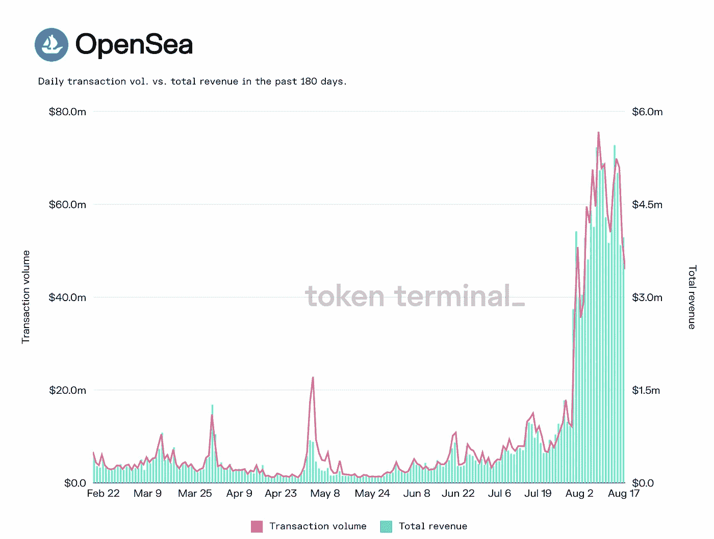
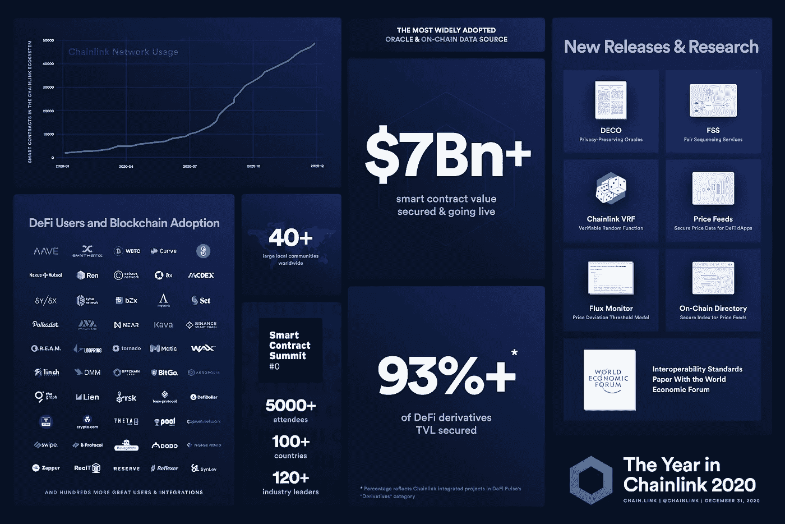

# NFTs 之后的下一个赚钱机器是什么？

> 原文：<https://medium.com/coinmonks/whats-the-next-money-maker-after-nfts-56124db6c366?source=collection_archive---------3----------------------->

## **元宇宙的崛起**

人们收藏毕加索、莫奈甚至班克斯等人的作品。有些人收集棒球卡和实物饰品。稀有收藏品现在已经成为一种身份的象征，有时甚至变得荒谬。在区块链上输入不可替换的令牌(NFT)、独一无二的数字艺术品。这些 NFT 因为使用了智能合约，只能属于一个人。截至 2021 年 8 月，NFT 市场 OpenSea 和 NFT 游戏 Axie Infinity 的收入约为**4 亿美元**。仅 OpenSea 的交易额就超过 6780 万美元，收入超过 500 万美元(见图 1)。

***Figure 1: Token Terminal OpenSea Transaction And Revenue Data***

根据婴儿潮一代的说法，这种兴趣的激增和随之而来的收入是因为年轻一代对[元宇宙](https://en.wikipedia.org/wiki/Metaverse)表现出越来越大的兴趣，并且与实物收藏品相比，对数字收藏品的所有权赋予了巨大的价值。有些人甚至认为，对元宇宙的兴趣可能会超过对太空探索的兴趣。这个观点激起了人们对 2011 年科幻小说《预备玩家一号》以及美国作家欧内斯特·克莱恩的处女作《T7》的回忆。

> 订阅 [**Coinmonks Youtube 频道**](https://www.youtube.com/c/coinmonks/videos) 获取每日加密新闻。

## **Defi Summer 的男生**

当前的 NFT 繁荣与 2020 年夏天分散金融(Defi)的情况有相似之处，当时 Defi 景观独立于比特币爆发。NFT 空间的投机泡沫最终会溢出到加密空间，尤其是 Defi。不管最近的黑客攻击(见 [Bondly Finance Hack:逃跑的机会或信号](https://kelechiudeala.medium.com/bondly-finance-hack-an-opportunity-or-a-signal-to-run-for-the-hills-f294fe853f51) ), Defi 仍将存在，并且空间呈指数级增长(见图 2)。就像皮肤坚韧的硬茧或疫苗一样，这些黑客可以通过突出攻击载体和易受攻击的代码来改善 Defi 智能合同。如果 Defi 继续增长，如何利用这种增长并进行战略性投资，以获得中长期的丰厚回报？

***Figure 2: Chainlink Ecosystem Growth***

## **Defi 保险是必须的**

随着 Defi 领域自成立以来黑客攻击的激增，加密货币保险项目变得日益突出。这些保险项目针对可能导致投资者资金损失的智能合同漏洞提供保险。

以上介绍了我们的“Crypto Spotlight”系列，在该系列中，我们讨论了未来可能会被大量采用的 Crypto 和 Defi 趋势。虽然不是财务建议，但“Crypto Spotlight”系列旨在讨论如果预期趋势出现，可能获得 10 倍至 100 倍回报的项目。

点击这里阅读该系列[的第一部分。](https://cbresearch.substack.com/p/crypto-spotlights-defi-insurance?justPublished=true)

我们的 Substack 简讯完全免费**。请前往 cbresearch.substack.com[的子页面，阅读更多关于我们将要报道的项目，包括 Armor Finance、Tidal Finance 等等。](https://cbresearch.substack.com/)**

> **加入 Coinmonks [电报频道](https://t.me/coincodecap)和 [Youtube 频道](https://www.youtube.com/c/coinmonks/videos)了解加密交易和投资**

## **另外，阅读**

*   **[印度的加密交易所](/coinmonks/bitcoin-exchange-in-india-7f1fe79715c9) | [比特币储蓄账户](/coinmonks/bitcoin-savings-account-e65b13f92451)**
*   **[OKEx vs KuCoin](https://blog.coincodecap.com/okex-kucoin) | [摄氏替代品](https://blog.coincodecap.com/celsius-alternatives) | [如何购买 VeChain](https://blog.coincodecap.com/buy-vechain)**
*   **[币安期货交易](https://blog.coincodecap.com/binance-futures-trading)|[3 comas vs Mudrex vs eToro](https://blog.coincodecap.com/mudrex-3commas-etoro)**
*   **[如何购买 Monero](https://blog.coincodecap.com/buy-monero) | [IDEX 评论](https://blog.coincodecap.com/idex-review) | [BitKan 交易机器人](https://blog.coincodecap.com/bitkan-trading-bot)**
*   **[CoinDCX 评论](/coinmonks/coindcx-review-8444db3621a2) | [加密保证金交易交易所](https://blog.coincodecap.com/crypto-margin-trading-exchanges)**
*   **[CoinFLEX 评论](https://blog.coincodecap.com/coinflex-review) | [AEX 交易所评论](https://blog.coincodecap.com/aex-exchange-review) | [UPbit 评论](https://blog.coincodecap.com/upbit-review)**
*   **[AscendEx 保证金交易](https://blog.coincodecap.com/ascendex-margin-trading) | [Bitfinex 赌注](https://blog.coincodecap.com/bitfinex-staking) | [bitFlyer 评论](https://blog.coincodecap.com/bitflyer-review)**
*   **[AscendEx Staking](https://blog.coincodecap.com/ascendex-staking)|[Bot Ocean Review](https://blog.coincodecap.com/bot-ocean-review)|[最佳比特币钱包](https://blog.coincodecap.com/bitcoin-wallets-india)**
*   **[Bitget 回顾](https://blog.coincodecap.com/bitget-review) | [双子星 vs BlockFi](https://blog.coincodecap.com/gemini-vs-blockfi) | [OKEx 期货交易](https://blog.coincodecap.com/okex-futures-trading)**
*   **[美国最佳加密交易机器人](https://blog.coincodecap.com/crypto-trading-bots-in-the-us) | [经常性回顾](https://blog.coincodecap.com/changelly-review)**
*   **[在印度利用加密套利赚取被动收入](https://blog.coincodecap.com/crypto-arbitrage-in-india)**
*   **[比特币基地僵尸程序](/coinmonks/coinbase-bots-ac6359e897f3) | [AscendEX 审查](/coinmonks/ascendex-review-53e829cf75fa) | [OKEx 交易僵尸程序](/coinmonks/okex-trading-bots-234920f61e60)**
*   **[如何在印度购买比特币？](/coinmonks/buy-bitcoin-in-india-feb50ddfef94) | [瓦济克斯审查](/coinmonks/wazirx-review-5c811b074f5b)**
*   **[隐翅虫替代品](/coinmonks/cryptohopper-alternatives-d67287b16d27) | [HitBTC 审查](/coinmonks/hitbtc-review-c5143c5d53c2)**
*   **[折叠 App 审核](https://blog.coincodecap.com/fold-app-review) | [Kucoin 交易机器人](/coinmonks/kucoin-trading-bot-automate-your-trades-8cf0ca2138e0) | [Probit 审核](https://blog.coincodecap.com/probit-review)**
*   **[如何匿名购买比特币](https://blog.coincodecap.com/buy-bitcoin-anonymously) | [比特币现金钱包](https://blog.coincodecap.com/bitcoin-cash-wallets)**