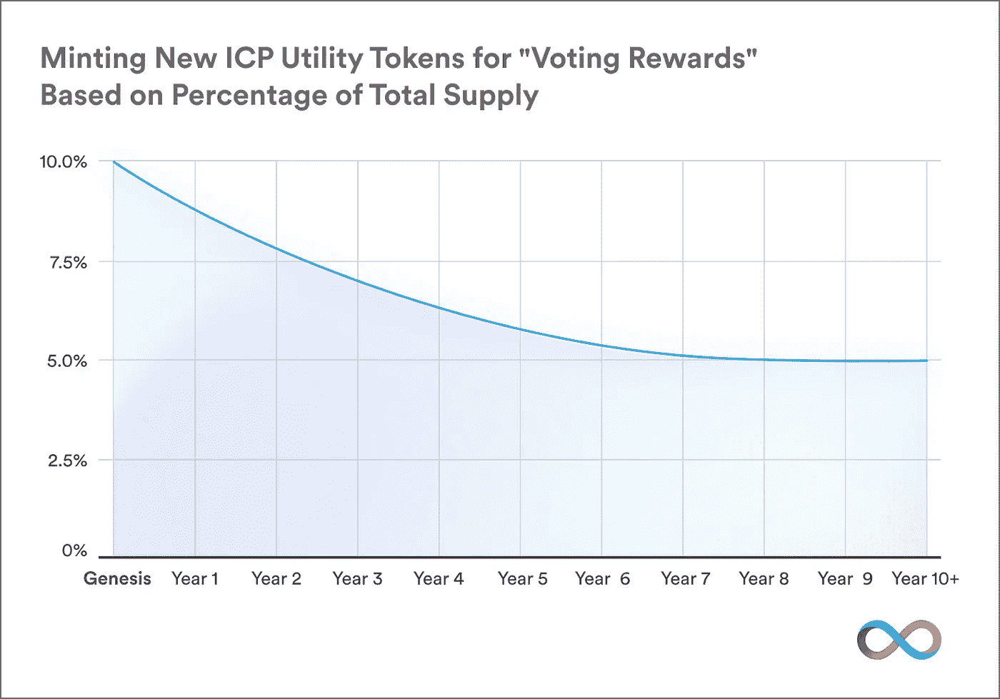

# 互联网计算机(IC)的价值是什么？

> 原文：<https://medium.com/coinmonks/whats-the-value-of-the-internet-computer-ic-33a6713a3371?source=collection_archive---------2----------------------->

## ICP 的基本分析，为 IC 提供动力的标志

Source: [Dfinity](/dfinity/the-internet-computers-token-economics-an-overview-29e238bd1d83), Creators of the IC

*【****免责声明*** *:作者在撰写本文时已在 ICP 持有股份。以下内容都不应被视为财务建议。作者不是 Dfinity 基金会的代表。]*

***最后更新:****2021 年 7 月 11 日，纳入最新的 IC 成本数据。*

如果你还没听说过的话，互联网计算机(IC)是发行自己的加密货币的最令人兴奋的新去中心化平台之一。它的创造者将 IC 称为“最后一个原始的第 1 层区块链项目…为智能合同提供无限的环境，以网络速度运行，服务于网络，扩展并减少一百万倍或更多的计算成本。”从根本上说，IC 可以被认为是一个去中心化的、基于区块链的网络服务器，使开发者能够在不依赖大型技术的情况下推出网络服务，并具有以太坊等其他智能合约平台所体现的去中心化的所有好处。

虽然许多人深入介绍了国际比较方案及其承诺的好处，但很少有人分享他们如何量化国际比较方案的基本价值，这是国际比较方案的动力。这就是这件作品的作用。

## ICP 表征组学概述

国际比较方案的象征经济学对确定其基本价值大有帮助。

国际比较方案目前的总供应量约为 4.7 亿英镑。ICP 被*烧掉*来支付 IC web 服务(通过一个叫做“cycles”的中介令牌，下面会详细讨论)。ICP 是*创造*来支付那些管理 IC 和/或提供支持它的基础设施的人。“网络神经系统”(NNS)，IC 的大脑，控制着这些燃烧和产生 ICP 的机制。

重要的是，这些象征经济学意味着国际比较方案的总供给不是固定的。如果产生的 ICP 多于消耗的 ICP，则 ICP 的总供应量增加，如果产生的 ICP 少于消耗的 ICP，则 ICP 的总供应量下降。

因此，国际比较方案的基本价值主要取决于国际比较方案创造和消耗的平衡。消耗的 ICP 越多——使用的 IC 越多——ICP 的潜在供应量就越小，因此价格就越高。

## 导出国际比较方案的“基本值”表达式

为了得出一个表示国际比较方案基本价值的表达式，我们可以从这样一个假设开始，即国际比较方案的价格将稳定在创造的国际比较方案的数量等于消耗的国际比较方案的数量，这样国际比较方案的供应实际上是不变的:

> **(1) ICP 创建= ICP 烧毁**

但是等等——我们刚才不是说 ICP 的供货会**不会**固定吗？让我解释一下。

这里的选择是国际比较方案供应增加(通货膨胀)或减少(通货紧缩)。国际比较方案通货膨胀是可能的，但正如我们将展示的那样，从定价的角度来看，它显得不那么保守，因此暂且放在一边，偏于保守。另一方面，国际比较方案紧缩，最终达到 0 国际比较方案供应，可能性要小得多。国际比较方案市场参与者在逻辑上不会容忍国际比较方案的通货紧缩为 0:像这样的通货紧缩将意味着用户正在燃烧大量的国际比较方案来使用国际比较方案，这意味着以当前的国际比较方案价格购买和燃烧大量的国际比较方案是相当有利可图的。如果是这种情况，ICP 的价格将会上升，因为 ICP 买家将会竞相出价以获得稀缺的 ICP，这代表了在 IC 上获取利润的机会。所以可以肯定的是，可能会有 ICP 处于通缩的时期；但最终，国际比较方案的价格将会上升，直到国际比较方案在实质上不再是通货紧缩，而是通过国际比较方案供应的稳定性得到更好的估计。

现在，如果我们接受上面的等式(1)，那么我们将很快看到等式(1)的右侧(RHS)可以根据国际比较方案的价格进行重新转换，这使得能够将国际比较方案价格表示为等式的其他组成部分的函数。

但是首先，从等式(1)的左手边(LHS)开始。如 IC 的创建者所传达的，NNS 每年创建的 ICP 的量([d infinity](https://dfinity.org/))从未完成供应量的 10%开始，在 8 年中每年下降，并在第 8 年后稳定在每年 5%:

ICP Supply Inflation (Source: [Dfinity](/dfinity/understanding-the-internet-computers-network-nervous-system-neurons-and-icp-utility-tokens-730dab65cae8), Creators of the IC)

确定性材料还表明，将向 IC 节点提供商支付一定的相对固定金额的基本固定支出(在 ICP 中汇出)；但是，鉴于现有 IC 资金的显著固定价值，似乎可以合理地安全地假设，节点提供商的支出最多只占现有 IC 资金的一小部分，因此不太可能随着时间的推移有意义地扩大 ICP 供应。(这是一个轻微的简化，但考虑到争议中的美元价值，这可能是一个合理的简化，在这里[有更详细的概述](https://support.internetcomputer.org/hc/en-us/articles/4402238313748-What-are-the-Node-Rewards-for-providing-computing-power-to-the-IC-How-often-are-the-rewards-distributed-)。)

所以一般来说，在一个给定的时期内创造的国际比较方案的数量可以被认为等于通货膨胀率和突出的总供应量的乘积:

> **(2)创造的国际比较方案=国际比较方案通货膨胀率 x 国际比较方案供应量**

这给了我们平等的 LHS①。

现在，平等的生殖健康研究(1)——国际比较方案被烧毁——涉及的内容稍微多一点。但是在我们继续之前，我们应该稍微深入一点，更详细地理解 ICP 是如何被 IC web 服务消耗的。

从技术上讲，IC web 服务使用所谓的“周期”来支付 IC 处理能力和存储。使用 ICP 购买周期。重要的是，IC 的设计使得 1 万亿个周期(计算/网络和存储的单位)的成本总是以固定美元计的*常数*，技术上设定为 1 [特别提款权](https://www.imf.org/external/np/fin/data/rms_sdrv.aspx)(代表国际货币基金组织持有的一篮子世界货币的价值，今天相当于约 1.44 美元)。

当评估开发者和用户对 IC 的可能*采用*时，这些机制是相关的；但是，碰巧的是，它们在国际比较方案的基本价值中没有发挥作用。

这是因为，再次拉远，理解等式(1)的 RHS(ICP 被烧毁)的关键是真正弄清 *ICP 仅在使用 IC web 服务时被烧毁*。如果我们可以估计 web 开发人员作为一个群体在 ICP 上运行 IC web 服务所花费的固定价值(如美元),那么消耗的 ICP 就是总固定金额除以 ICP 的价格:

> **(3)消耗的 ICP =(开发人员运行 IC 服务所花费的美元)/(ICP 价格美元)**

例如，如果开发人员花费 6 美元来运行 IC 服务，以每个 ICP 2 美元的价格计算，那么 3 个 ICP 就会被烧掉。

现在，术语“开发人员为运行 IC 服务而花费的资金”有很多，或者更简洁地称之为“IC 花费”，我们一会儿将分解这个术语。但是首先，等式(1)-(3)足以根据其他确定的外生变量来计算国际比较方案的价格。结合并重新排列等式(1)到(3)，我们得到:

> **(4) $国际比较价格=(国际比较花费)/(国际比较通货膨胀率 x 国际比较供给)**

这个表述很直观:用户在 IC web 服务上花费越多，ICP 的价格就越高。国际比较方案供应的通货膨胀越大，国际比较方案的价格就越低。这一比例关系到 ICP 的价格。

我们还可以注意到，等式(4)从上面的数学恒等式(2)和(3)中逻辑地得出，仅依赖于等式(1)所代表的一个假设*:ICP 在稳定状态下不会通货紧缩。事实上，如果我们允许 ICP 可以是*膨胀的*(放松等式(1)以使其改为读作“ICP 创建了 **≥** ICP 燃烧了】，，并遵循此后所有相同的逻辑，我们实际上得到一个更放松的关系:*

> **(5) $国际比较方案价格≥(国际比较方案支出)/(国际比较方案通货膨胀率 x 国际比较方案供应量)**

事实上，这种不平等可能更准确，因为随着时间的推移，交换单位往往会略有通货膨胀，以适应市场参与者随着时间的推移往往会要求更大的储备(例如，国际比较方案的储备)。

## 量化国际比较方案的价值

我们现在能够开始估计量化值，分配给国际比较方案基本价值的确定投入，以获得国际比较方案的美元价格。

要做到这一点，我们需要充实不平等(5)的内容，用分子“$ IC Spend:”开发人员运行 IC 服务所花费的法定美元来表示。这个价值将由创建 IC 服务的 web 开发者和使用这些服务的 T2 用户共同驱动。观察每一组利益相关者将有助于估算“IC 支出”的价值

从 IC web 用户开始。ic 确实以网页速度运行(为了让你自己尝一尝，看看这些经典游戏中的一些——T4 2048 和霸王龙游戏已经移植到 IC 上)；IC 应用程序的性能与基于传统 web 2.0 堆栈的性能几乎没有区别。事实上，由于*用户*不需要为使用 IC 服务付费(这些服务是由开发者资助的)，用户甚至不需要知道他们正在使用 IC 服务(不像例如以太坊，用户需要为使用以太坊服务付费)。事实上，相对于其他网络堆栈，IC 有一些非常方便的用户优势，包括[互联网身份](/dfinity/internet-identity-the-end-of-usernames-and-passwords-ff45e4861bf7)——一种通过任何 IC 服务进行身份验证的无密码方式。因此，从用户的角度来看，如果有什么不同的话，IC 比运行在另一个堆栈上的服务更令人愉快。

因此，IC 使用的限制因素可能是开发人员采用和部署引人注目的 IC web 服务。在这里，我们必须从 web 开发人员的角度，更深入地思考 IC 最有可能在可用的 web 堆栈备选方案中脱颖而出的细分市场。

总的来说，当涉及到开发人员采用时，web 开发人员可能会选择购买并烧毁 ICP 来运行 IC web 服务，因为与可用的 web 堆栈替代方案相比，IC 使用起来更容易、更有利可图或风险更低。开发者社区已经拥有丰富的资源和潜在的资金来开发 IC。因此，节省时间/精力/金钱、降低风险或部署以前不可能的服务的机会将吸引 web 开发人员来构建和运行 IC 服务。在这些方面，IC 似乎已经代表了 web 2.0 堆栈(例如 AWS 和 GCM)和 web 3.0 服务(例如以太坊)的一个令人信服的替代方案。

**比较 IC 和 web 2.0 堆栈**

与 web 2.0 栈相比，对于作者(一个开发新手)来说，今天的 IC 似乎更容易使用和维护。虽然 IC 的专用语言“Motoko”仍在与新兴的 IC 开发人员社区合作进行快速开发，但有经验的开发人员仍可以选择使用任何可以很好地编译到 WebAssembly 的语言(如 Rust)。而且，编写工作代码并将其部署到 IC 上已经非常简单了。没有 Postgres 数据库，没有单独的服务器，没有挑剔的 AWS 配置，没有备份基础设施——只需编写您的代码并直接部署到 IC(或者，如果您愿意，可以通过第三方基于 IC 的提供商，如 fleek.co)。

除了易于使用之外，IC 还被设计为通过允许开发人员创建和集成具有“不可撤销 API”的服务(以后不能撤销或减少的第三方服务)来实际消除平台风险。(在传统的 web 2.0 堆栈中，当第三方更新他们的代码库或服务条款时，开发人员随时都有可能看到他们与第三方服务的集成中断。Zynga 公司依赖脸书来托管著名的在线游戏“Farmville ”,这代表了最近[平台风险](https://www.businessinsider.com/farmville-leaving-facebook-by-end-of-2020-zynga-2020-9)的警示故事。)此外，IC 支持(分散的)服务，这在 web 2.0 堆栈上是不可能的。例如，见证以太坊上分散金融(“DeFi”)的戏剧性崛起:这种服务只有在以太坊或 ic 这样的分散平台上才有可能。

现在可以肯定的是，当比较 IC 和 web 2.0 堆栈时，成本更加模糊。 [icp.guide](https://icp.guide/costs-on-the-internet-computer/) 提供了关键成本比较的详细分类，我们将在下面详细探讨。

从绝对值来看，IC 存储成本相当便宜(每年每千兆字节约 5 美元)，但仍然是 AWS RDS 等存储成本的 3.62 倍，尽管默认情况下 IC 数据至少复制 7 倍，而 web 2.0 存储不是这样。

即使不考虑数据复制，数据更新/数据读取成本与 web 2.0 服务相当。例如，虽然在 AWS 上加载数据是免费的，但在 AWS 上读取数据的成本却要高出 256 倍。在最简单的情况下，您只需要加载一次数据，然后它会被多次读取。一个简单的盈亏平衡分析表明，如果每节省一个 GB(IC 的成本为 9.56 美元，AWS 为 0 美元)，节省的 GB 被读取约 137 次(AWS 每次读取的成本为 0.07 美元，IC 为 0.0002733 美元)，IC 实际上比 AWS 便宜*。总体而言，这似乎是一个现实的保存-读取比率——如果不是非常保守的话。*

*最后，后端传输成本——将数据从一个后端服务传输到另一个后端服务——在 IC 上看起来更高(在考虑复制因素的差异后大约高 10 倍),因此依赖于其他自有(或第三方)代码的数字服务在 IC 上可能会更昂贵。不过话说回来，支持 API 的 IC 服务(根据定义，它们依赖于第三方代码)可以做一些在 web 2.0 服务上做不到的事情(例如，使用不可变的第三方智能合约，也就是所谓的“罐子”)。因此，如果这就是这些 IC 服务所提供的，用户可能会愿意支付更多的费用来获得这些 IC 独有服务的好处，从而抵消 IC 上更高的后端数据传输成本。*

*综上所述，在比较 IC 和 web 2.0 堆栈的最终分析中，虽然 IC 平台的直接成本可能会随着时间的推移而下降，而且尽管 IC 相对易于使用，并且在昂贵的堆栈维护和系统软件/基础设施的许多方面可能会显著降低成本，但目前看来，IC 可能会对那些希望创建新服务的开发人员最具吸引力，这些新服务只能在分散式平台上实现，或通过分散式平台得到极大增强。或许稍后 IC 会对那些有平台风险意识的开发者更有吸引力，他们会在早期采用者的服务之上构建服务——之后 IC 会被更广泛地采用。*

***比较 IC 和 web 3.0 堆栈***

*因此，考虑到 IC 很可能在今天对专门寻求构建分散式应用程序(“dapps”)的开发人员最有吸引力，IC 如何适应分散式平台呢？回答:非常好。*

*在现有的智能合约平台中，以太坊站在最前面，现在拥有最强大的 web 3.0 开发者社区和 dapp 生态系统——特别是在 DeFi 方面。但是在 DeFi 之外，在 web 3.0 的替代方案中，IC 提供了独特的技术优势——即网络速度，更低和更可预测的计算成本，以及完全独立于大型技术栈——因为即使是*以太坊* dapp 前端目前也大多基于 AWS、谷歌云或类似平台。(事实上，IC 为以太坊和其他 web 3.0 提供商提供了一个机会，通过在 IC 上托管他们的前端，为用户提供完整的端到端去中心化。)*

*因此，最直接吸引 dapps 的市场可能是 IC 目前最有吸引力的机会。在集成电路的早期，估计这些市场的规模可能是估算“集成电路支出”的一个很好的起点。*

***IC 初始市场机会和隐含估值***

*DeFi 之外的一些最大的 dapp 市场机会包括社交媒体、新闻和其他点对点服务(例如聊天)；多人游戏；身份管理和数据所有权；多种协调服务(如供应链管理、卫生信息交流等。);除此之外还有许多其他服务。许多这样的服务——尤其是社交服务——已经在测试版发布后的前 3 周发布(例如 [DSCVR](https://h5aet-waaaa-aaaab-qaamq-cai.raw.ic0.app/) 、 [OpenChat](https://7e6iv-biaaa-aaaaf-aaada-cai.ic0.app/) )，或者是为随时部署而构建的(例如 [CanCan](https://github.com/dfinity/cancan) 、 [LinkedUp](https://github.com/dfinity/linkedup) )。*

*为了了解初始目标细分市场所代表的市场规模，了解一下当今主要云提供商的用户，并直观地了解这些细分市场所代表的份额是很有帮助的。例如，以下是亚马逊网络服务(AWS)的前 10 大用户(超过 100 万用户)，包括每月支出:*

1.  *网飞:1900 万美元*
2.  *twitch:1500 万美元*
3.  *LinkedIn:1300 万美元*
4.  *脸书:1100 万美元*
5.  *特纳广播:1000 万美元*
6.  *BBC:900 万美元*
7.  *百度:900 万美元*
8.  *ESPN:八百万美元*
9.  *adobe:800 万美元*
10.  *推特:700 万美元*

*不用说，这个列表几乎完全由社交、新闻和点对点服务组成，在许多情况下，列出的服务代表了每个用户总存储/网络/计算支出的一小部分(例如，脸书运行自己的大部分服务器和网络运营)。平心而论，云服务的顶级用户可能并不能完全代表所有用户的使用情况；因此，综合考虑这几点，我们可能会认为这是一个保守的立场，我们可能会估计 50%的全球云市场由上述 dapp 目标细分市场代表。(不过，可以肯定的是，这一估计可能需要改进，因为这里的初始基本面估值对这个数字很敏感。)*

*现在，全球云计算市场估计在 4500 亿美元左右，每年增长 18%。代表存储、计算、网络和系统软件支出。IC 代表所有这些服务的替代品。因此，如果我们根据上面的估计假设初始目标垂直市场占该市场的 50%，那么今天的目标市场规模为 2250 亿美元(并且还在快速增长)。*

*(这里值得注意的是，这个数字明显没有考虑到 IC 作为所有分散服务(以太坊、波尔卡多特等)前端的潜力。).它没有考虑从内部堆栈(与云堆栈相反)到 IC 的潜在全新迁移。它可能没有考虑到这样一种可能性，即相对简单易用的 IC 实际上扩大了可寻址云市场本身的规模，使更多的开发人员能够部署以前极其复杂和耗时的服务。它没有考虑这些因素，因为这是一个更保守的观点。)*

*基于这些数字，如果 IC 在 5 年内从这些初始目标垂直市场剥离 5%的云计算用户，这将相当于开发者每年在 IC 服务上花费 156.6 亿美元。(相比之下，AWS 作为当今市场上唯一的闭源云提供商(远小于 5 年后的预期)，其云销售额约为 500 亿美元。)根据上面的不等式(5)，这将意味着至少约 773 美元的价格:(156.6 亿美元)/(约 4.7 亿 x 约 6%)。8 年后，随着云市场的增长和 ICP 通胀降至 5%的稳定水平，基准价格将升至约 1，291 美元。*

## *外卖食品*

*考虑到 IC 的潜在潜在市场、其开发背后的专家团队、为培育协议而涌现的开发人员生态系统，以及其相对于现有 web 2.0 和 web 3.0 堆栈的相对优势和互补性，ICP 看起来在单独用作实用工具令牌的基础上具有相当大的上升潜力。*

*还值得注意的是，上述内容没有考虑到 ICP 在某个时候可能会被视为价值储存手段的可能性，这将使其具有额外的法定价值(就像比特币被视为黄金一样的储备资产)。它也没有说明国际比较方案有可能被赋予额外的法定价值，因为它提供了管理国际比较方案本身的权利，而这些权利本身就是有价值的。此外，对于 ICP 持有者而言，在为 IC 治理做出贡献时，它还排除了考虑为可观的年度回报而对 ICP 进行投资的能力。*

*长期潜在收益必须始终进行风险调整，以考虑项目的相对危险性、技术新颖性、竞争对手进入的可能性、通常与加密市场相关的监管风险，以及特定于项目的团队、生态系统和治理相关的风险。所有最近启动的区块链项目本质上都是有风险的。但是，即使在对这些风险进行调整后，人们仍然可以合理地得出结论，国际比较方案很可能会有一个美好的未来。*

* [## 最佳免费加密交易机器人——前 16 名比特币交易机器人[2021]

### 2021 年币安、比特币基地、库币和其他密码交易所的最佳密码交易机器人。四进制，位间隙…

medium.com](/coinmonks/crypto-trading-bot-c2ffce8acb2a)  [## 最佳 6 个加密交易信号电报通道

### 这是乏味的找到正确的加密交易信号提供商。因此，在本文中，我们将讨论最好的…

medium.com](/coinmonks/best-crypto-signals-telegram-5785cdbc4b2b)  [## BlockFi 评论 2021 —通过您的加密获得 8.6%的利率

### 让你的密码发挥作用，获得比特币和其他加密货币的最佳利率

medium.com](/coinmonks/blockfi-review-53096053c097)  [## 加密税务软件——五大最佳比特币税务计算器[2021]

### 不管你是刚接触加密还是已经在这个领域呆了一段时间，你都需要交税。

medium.com](/coinmonks/best-crypto-tax-tool-for-my-money-72d4b430816b) 

> 加入 [Coinmonks 电报频道](https://t.me/coincodecap)，了解加密交易和投资

## 另外，阅读

*   [电网交易机器人](https://blog.coincodecap.com/grid-trading) | [Cryptohopper 审查](/coinmonks/cryptohopper-review-a388ff5bae88)
*   [加密复制交易平台](/coinmonks/top-10-crypto-copy-trading-platforms-for-beginners-d0c37c7d698c) | [如何在 WazirX 上购买比特币](/coinmonks/buy-bitcoin-on-wazirx-2d12b7989af1)
*   【Crypto.com 评论】|[|](/coinmonks/crypto-com-review-f143dca1f74c)|[信用交易](/coinmonks/huobi-margin-trading-b3b06cdc1519)
*   [尤霍德勒 vs 科恩洛 vs 霍德诺特](/coinmonks/youhodler-vs-coinloan-vs-hodlnaut-b1050acde55a) | [Cryptohopper vs 哈斯博特](https://blog.coincodecap.com/cryptohopper-vs-haasbot)
*   [顶级付费加密货币和区块链课程](https://blog.coincodecap.com/blockchain-courses) | [币安评论](/coinmonks/binance-review-ee10d3bf3b6e)
*   [MXC 交易所评论](/coinmonks/mxc-exchange-review-3af0ec1cba8c) | [Pionex vs 币安](https://blog.coincodecap.com/pionex-vs-binance) | [Pionex 套利机器人](https://blog.coincodecap.com/pionex-arbitrage-bot)
*   [如何在印度购买比特币？](/coinmonks/buy-bitcoin-in-india-feb50ddfef94) | [WazirX 评论](/coinmonks/wazirx-review-5c811b074f5b) | [BitMEX 评论](https://blog.coincodecap.com/bitmex-review)
*   [印度加密交易所](/coinmonks/bitcoin-exchange-in-india-7f1fe79715c9) | [比特币储蓄账户](/coinmonks/bitcoin-savings-account-e65b13f92451) | [HitBTC 审查](/coinmonks/hitbtc-review-c5143c5d53c2)
*   [币安收费](/coinmonks/binance-fees-8588ec17965) | [Botcrypto 审查](/coinmonks/botcrypto-review-2021-build-your-own-trading-bot-coincodecap-6b8332d736c7) | [Hotbit 审查](/coinmonks/hotbit-review-cd5bec41dafb) | [KuCoin 审查](https://blog.coincodecap.com/kucoin-review)
*   [我的密码交易经验](/coinmonks/my-experience-with-crypto-copy-trading-d6feb2ce3ac5) | [AAX 交易所评论](/coinmonks/aax-exchange-review-2021-67c5ea09330c)
*   [Bybit 融资融券交易](/coinmonks/bybit-margin-trading-e5071676244e) | [币安融资融券交易](/coinmonks/binance-margin-trading-c9eb5e9d2116) | [Overbit 审核](/coinmonks/overbit-review-9446ed4f2188)
*   [加密货币储蓄账户](/coinmonks/cryptocurrency-savings-accounts-be3bc0feffbf) | [YoBit 审查](/coinmonks/yobit-review-175464162c62) | [Bitbns 审查](/coinmonks/bitbns-review-38256a07e161)
*   [Botsfolio vs nap bots vs Mudrex](/coinmonks/botsfolio-vs-napbots-vs-mudrex-c81344970c02)|[gate . io 交流回顾](/coinmonks/gate-io-exchange-review-61bf87b7078f)
*   [CoinFLEX 评论](https://blog.coincodecap.com/coinflex-review) | [AEX 交易所评论](https://blog.coincodecap.com/aex-exchange-review) | [UPbit 评论](https://blog.coincodecap.com/upbit-review)
*   [AscendEx 保证金交易](https://blog.coincodecap.com/ascendex-margin-trading) | [Bitfinex 赌注](https://blog.coincodecap.com/bitfinex-staking)
*   [麻雀交换评论](https://blog.coincodecap.com/sparrow-exchange-review) | [纳什交换评论](https://blog.coincodecap.com/nash-exchange-review)*