# 加密货币供应商的波动性管理

> 原文：<https://medium.com/coinmonks/whats-vol-got-to-do-with-it-886b57c2d762?source=collection_archive---------6----------------------->

我认为研究一种众所周知的技术会很有趣，这种技术被称为波动目标或管理，看看它是否能为加密货币的长期配置增加价值。

## **什么是波动目标？**

波动率目标或“Vol Targeting”是一种试图将投资或投资组合的波动率保持在接近预定目标的技术。当资产的波动性高于目标时，我们会减少风险敞口，并将收益投资于现金或无风险资产。当波动性低于目标时，我们撤出现金资产，更多地投资于目标资产(顺便提一下，这些策略经常使用杠杆)。

## **举例时间**

举个简单的例子，我们可能希望将我们投资比特币的波动性限制在 25%(年化)。

为此，我们需要几样东西:

*   波动目标——这通常表示为每日或每年的数字
*   波动性度量——我们需要估计资产的实际波动性
*   重新平衡时间表——我们需要决定多久更新一次我们的估计，重新平衡到目标重量
*   “现金”资产——这可以是在经纪账户中持有的现金，或者固定收益 ETF，或者稳定的货币

下面我们看到了一个图表和统计数据，使用的是从 2015 年 1 月 2 日到 2021 年 8 月 16 日的日收益率。波动率的长期估计值(使用年化标准差)为 77%。如果我们希望将 BTC 投资的年化波动率保持在 25%左右，这意味着我们在大部分时间里对 BTC 的配置将低于全额，其余为现金。

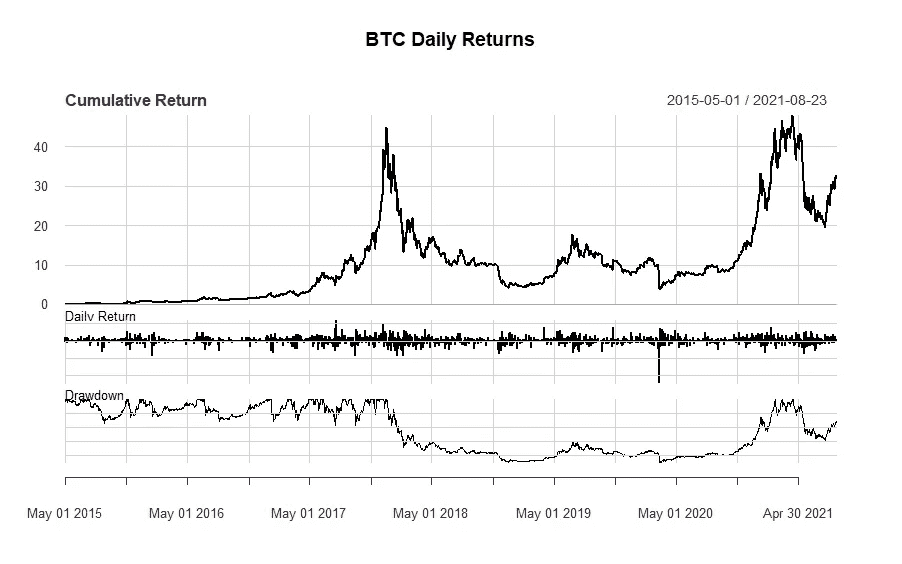

Chart 1: BTC Cumulative Returns

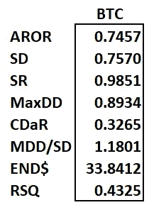

Table 1: Statistics for BTC

波动率目标的诀窍是估计我所说的“波动率倍数”，即应该投资于该资产的资金总额的比例。要做到这一点，我们只需将目标波动率除以波动率的估计值，就可以得到波动率的倍数。

如果我们想使用标准差的全样本估计，我们将 0.25 除以 0.76 得到 0.3289，这表明我们将有大约 1/3 的分配在 BTC 和 2/3 的现金。一个完全不切实际的回溯测试是将 0.33 乘以 BTC 回报率，以得出我们的配置会做什么的估计(这也是不切实际的，但只是一个例子)——我们新配置的波动性是正确的约 25%，并且“乘坐”更加平稳。

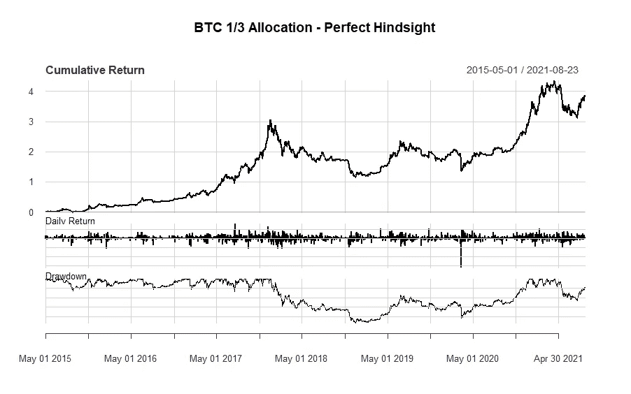

Chart 2: BTC at 1/3 exposure (beginning 5/1/2015 to match vol target example)

**回到生活，回到现实**

显然我今天有心情引用歌曲。为了让这种方法更现实一点，我们需要使用短期的波动性滚动估计，并更频繁地在目标资产和现金资产之间重新平衡我们的配置。在这里，我们将使用 90 天的波动性滚动估计，并每月重新平衡。为了重新平衡，我们将把一个月的最后一个卷倍数用于整个后续月份。

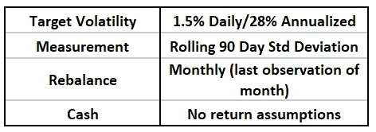

Parameters for simple rolling volatility target test

这种方法仍然增加了简单的买入并持有方法的价值，但波动性高于目标值，这是意料之中的，因为我们使用的是简单的波动性滚动估计。有趣的是，令人鼓舞的是，我们基于 90 天波动性滚动估计每月进行再平衡的简单模型确实与 1/3 BTC、2/3 现金的“完美后见之明”方法保持得相当好。

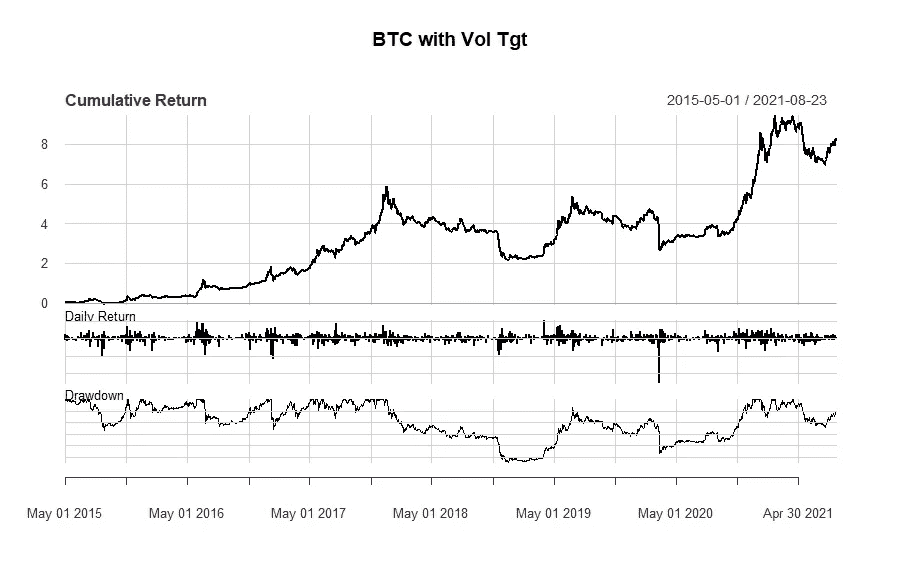

Chart 3: BTC with Rolling Vol Tgt based on 90 day Standard Deviation

## **“那在街上永远行不通”**

我们看到，某种波动性管理会给购买并持有比特币的投资增加一些价值，但这或许只是侥幸？许多投资者正在超越比特币，在其投资组合中持有多种加密货币。虽然我们不能回到过去，但我们可以看到如果我们控制硬币选择——也就是说——运行模拟，波动率目标策略会有什么效果！

这将是一个简单的实验:我们将随机选择 5 个硬币，对每个硬币本身应用简单的波动目标策略，每个季度重新平衡这 5 个硬币的等重投资组合。虽然 stablecoins 可能会提供一点收益，但我们不会将其包括在我们的模拟结果中。我们将使用波动率目标方法来观察 500 个模拟投资组合的结果分布，以及 500 个购买并持有 5 个随机选择的硬币的等权重投资组合的模拟投资组合。

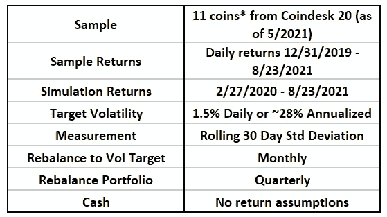

Simulation Parameters

**陷阱:**请注意，就资产和价格数据而言，样本很小。也就是说，我确实认为波动性管理的投资组合和同等权重的投资组合之间的*差异*很有趣，而且可能具有指导意义。我们也不考虑交易成本，但是调整 vol 目标敞口的月度交易和重新平衡相等权重的季度交易不应特别繁重。在现实中，人们可能会抑制再平衡，这样在进行交易之前，风险敞口必须偏离合理的阈值。

## **模拟结果**

平均而言，我们的波动性管理投资组合的夏普比率是简单等权重投资组合的 3 倍以上，提款是其 1/3。虽然我们倾向于将此归因于这样一个事实，即波动性管理的投资组合的波动性约为同等权重投资组合的 1/4，但这被两个投资组合几乎完全相同的 30%年化平均回报率这一事实所混淆。

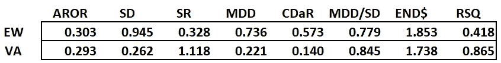

Table 4: Mean stats for simulated portfolios

在表 5 中，我们可以看到这两种投资组合的关键统计分布的完整摘要，并发现波动性管理的投资组合通过在不降低回报的情况下显著降低风险而表现出色。由于加密货币目前波动很大，波动目标的选择在很大程度上是任意的，不太可能要求大多数投资者进行杠杆操作。

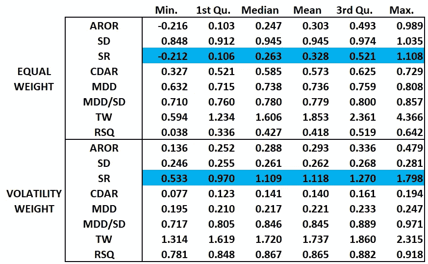

Table 5: Summary statistics for simulated portfolios

对一些关键指标密度的可视化分析也很有说服力。波动性管理投资组合的夏普比率分布几乎支配着同等权重投资组合的夏普比率分布:

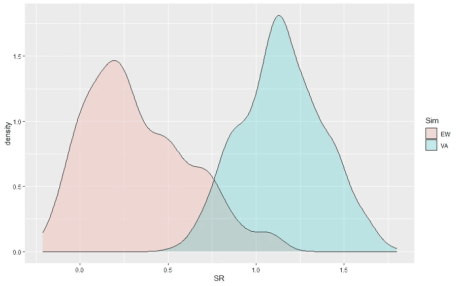

Chart 4: Sharpe Ratios of Equal Weight and Vol Adjusted Simulation Portfolios

相对于同等权重的投资组合，波动性管理的投资组合的最终财富非常有限(且在正范围内):

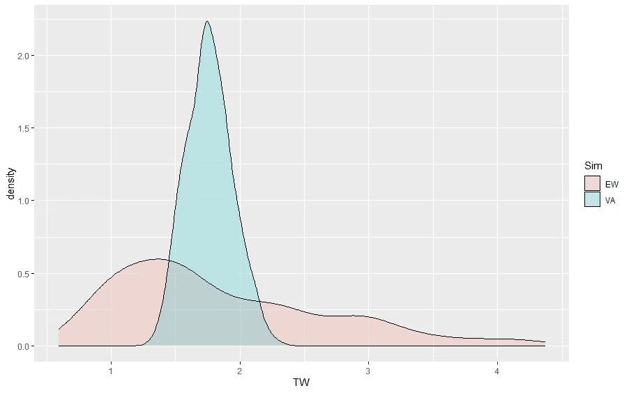

Chart 5: Terminal Wealth (Ending value of $1) for Equal Weight and Vol Adjusted Simulation Portfolios

## **结论**

加密货币波动性很大，虽然这是兴奋的一部分，但许多投资者可能会因此而回避。解决这个问题的一个方法是使用波动率目标策略，至少在这个公认有限的样本中，该策略可以在不牺牲回报的情况下大幅降低波动率。我想许多投资者会更喜欢这种方式来管理加密货币的配置。我当然愿意。

感谢您的阅读。

## **附加插图**

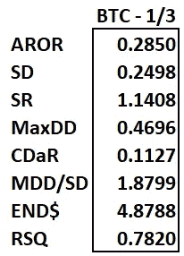

Table 2: BTC 1/3 Exposure

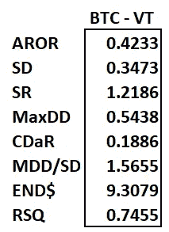

Table 3: Stats for BTC with Rolling Vol Tgt

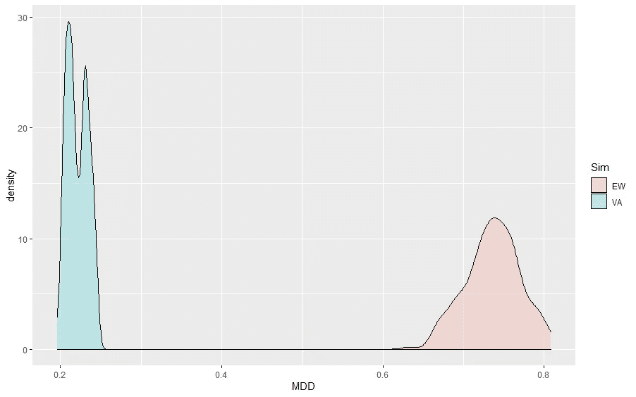

Chart 6: Maximum Drawdowns of Equal Weight and Vol Adjusted Simulation Portfolios

## **注意事项**

*不包括稳定的硬币和一些价格历史太少的硬币

## **引用&资源**

*   示例 R 代码:[https://github . com/rufusrankin/WhatsVolGotToDoWithIt/blob/main/Code](https://github.com/rufusrankin/WhatsVolGotToDoWithIt/blob/main/Code)
*   Moreira，Alan 和 Muir，Tyler，《波动性管理的投资组合》(2016 年 10 月 25 日)。《金融杂志》，即将出版，可在 https://ssrn.com/abstract=2659431 SSRN[或 http://dx.doi.org/10.2139/ssrn.2659431](https://ssrn.com/abstract=2659431)[获得](https://dx.doi.org/10.2139/ssrn.2659431)

## **数据**

*   来自 riingo/tiingo 的加密货币价格数据
*   根据 a .截至 2021 年 5 月的 Coindesk 20 指数和 b . 2019 年 12 月 30 日开始的价格数据选择货币

## **免责声明**

***本文仅供参考，不构成投资建议。任何观点都是作者的观点，不代表 Ampersand、Drexel University 或其任何附属机构的观点。***

> 加入 [Coinmonks 电报频道](https://t.me/coincodecap)，了解加密交易和投资

## 另外，阅读

*   [比特币基地跑马圈地](https://blog.coincodecap.com/coinbase-staking) | [Hotbit 评论](/coinmonks/hotbit-review-cd5bec41dafb) | [KuCoin 评论](https://blog.coincodecap.com/kucoin-review)
*   [最佳加密交易信号电报](/coinmonks/best-crypto-signals-telegram-5785cdbc4b2b) | [MoonXBT 评论](/coinmonks/moonxbt-review-6e4ab26d037)
*   [Coinswitch 俱吠罗评论](/coinmonks/coinswitch-kuber-review-1a8dc5c7a739) | [电网交易机器人](https://blog.coincodecap.com/grid-trading) | [比特币基地收费](/coinmonks/coinbase-fees-831e77d4f2c5)
*   [Bitget 回顾](https://blog.coincodecap.com/bitget-review)|[Gemini vs block fi](https://blog.coincodecap.com/gemini-vs-blockfi)|[OKEx 期货交易](https://blog.coincodecap.com/okex-futures-trading)
*   [OKEx vs KuCoin](https://blog.coincodecap.com/okex-kucoin) | [摄氏替代品](https://blog.coincodecap.com/celsius-alternatives) | [如何购买 VeChain](https://blog.coincodecap.com/buy-vechain)
*   [币安期货交易](https://blog.coincodecap.com/binance-futures-trading)|[3 comas vs Mudrex vs eToro](https://blog.coincodecap.com/mudrex-3commas-etoro)
*   [如何购买 Monero](https://blog.coincodecap.com/buy-monero) | [IDEX 评论](https://blog.coincodecap.com/idex-review) | [BitKan 交易机器人](https://blog.coincodecap.com/bitkan-trading-bot)
*   [币安 vs 比特邮票](https://blog.coincodecap.com/binance-vs-bitstamp) | [比特熊猫 vs 比特币基地 vs Coinsbit](https://blog.coincodecap.com/bitpanda-coinbase-coinsbit)
*   [如何购买 Ripple (XRP)](https://blog.coincodecap.com/buy-ripple-india) | [非洲最好的加密交易所](https://blog.coincodecap.com/crypto-exchange-africa)
*   [非洲最佳加密交易所](https://blog.coincodecap.com/crypto-exchange-africa) | [胡交易所评论](https://blog.coincodecap.com/hoo-exchange-review)
*   [eToro vs robin hood](https://blog.coincodecap.com/etoro-robinhood)|[MoonXBT vs Bybit vs Bityard](https://blog.coincodecap.com/bybit-bityard-moonxbt)
*   [Stormgain 回顾](https://blog.coincodecap.com/stormgain-review) | [Bexplus 回顾](https://blog.coincodecap.com/bexplus-review) | [币安 vs Bittrex](https://blog.coincodecap.com/binance-vs-bittrex)
*   [Bookmap 评论](https://blog.coincodecap.com/bookmap-review-2021-best-trading-software) | [美国 5 大最佳加密交易所](https://blog.coincodecap.com/crypto-exchange-usa)
*   [如何在 FTX 交易所交易期货](https://blog.coincodecap.com/ftx-futures-trading) | [OKEx vs 币安](https://blog.coincodecap.com/okex-vs-binance)