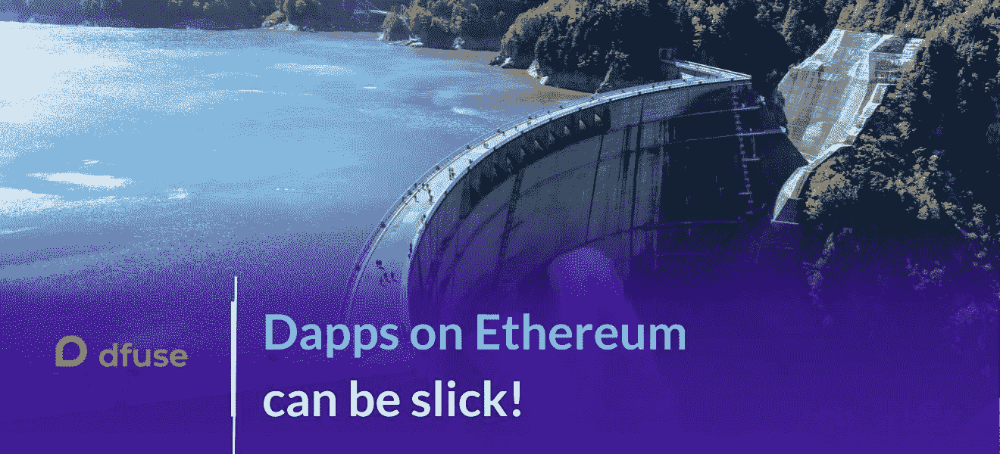

# 以太坊上的 Dapps 可以很滑头！

> 原文：<https://medium.com/coinmonks/whats-wrong-with-dapps-on-ethereum-68d666645848?source=collection_archive---------1----------------------->

分散式应用程序(Dapps)将颠覆性创新带到从银行(DeFi)到游戏等许多领域的潜力得到了广泛认可。然而，如果不能满足消费者的期望，即使是最具创新性的解决方案也很难被接受。

消费者期望流畅和复杂的用户体验，以太坊上 Dapps 的开发者发现这是一个重大挑战。

在本文中，我将概述经典的 Dapp 架构，并指出当今标准以太坊堆栈中的几个固有限制，这些限制使得开发人员难以创建引人注目的用户体验。

然后，我将描述以太坊基础设施中的一些新创新，这些创新可以帮助开发人员克服这些挑战，例如 dfuse。在 dfuse，我们很高兴能够实现更好的开发者体验，以加速以太坊应用的主流采用。

# 经典的以太坊 Dapp 架构

(有经验的以太坊开发者:可以随意跳到下一节！)

以太坊上的 Dapp 传统上由三个主要组件组成:

*   一个智能合同，通常用 Solidity 编写，通常使用 Truffle Suite 之类的框架构建，并部署在以太坊区块链上。
*   前端代码，用 Javascript 写的。
*   后端—传统上，是标准以太坊区块链节点。前端使用节点提供的 JSON-RPC 或 GraphQL API 与后端通信。

有各种库可用于促进前端与 Eth 节点的通信，最流行的是`web3.js`和`ethers.js`。还有许多其他语言(Java、Python、Rust……)的 web3 库。

## 私有后端节点

以太坊早期，开发者出于开发目的，需要操作自己的以太坊节点。当他们发布 Dapps 时，他们还必须操作生产质量的节点(或节点集群)。操作区块链节点是一项巨大的工作，降低了开发人员的生产力。

## 节点即服务

这些挑战导致了一些公司的“节点即服务”平台的兴起，如 Infura，以及最近的 Nodesmith、Quiknode、Blockdaemon、Ethernode、Chainstack、Alchemy、CloudFlare 等。

这些平台为开发人员提供基于云的以太坊节点，节省开发人员操作节点的工作量。解决方案既可用于开发，也可用于生产。这些平台允许开发人员卸载系统管理任务，如底层操作系统和节点软件本身的补丁和更新。

# 以太坊节点的固有限制

然而，即使他们成功地将开发人员从系统管理员的职责中解脱出来，节点即服务也不能帮助开发人员构建具有更好用户体验的更好 Dapps。这是因为这些挑战源于节点即服务架构以及以太坊节点支持的 JSON-RPC 和 GraphQL 接口的固有限制。

主要限制包括以下几点:

## 国家观点不一致

为了扩展到超过单个节点的容量，并提供更高的可靠性，节点即服务平台通过负载平衡器提供对节点池的访问。

由于这些节点中的每一个都作为以太坊网络中的对等体自主地操作，因此当信息在给定时刻通过网络传播时，不同的节点可能处于不同的块高度，或者甚至在不同的分支上。这意味着 Dapp 可以接收关于区块链状态的不一致的信息，因为它的请求由负载均衡器后面的不同节点提供服务。

节点即服务平台通常试图通过负载均衡器上的会话粘性来解决这个问题，负载均衡器努力总是将给定前端的查询发送到相同的后端节点，但这种方法在多种情况下失败:

*   当前端生成的请求多于单个后端节点能够处理的请求时；
*   当网络问题导致前端与后端断开连接，并且必须重新连接时；
*   并且因为许多节点即服务平台将不同类型的前端请求(例如，发送事务与搜索链历史)路由到针对该查询类型优化的不同后端节点组。

由于前端经常访问几个后端节点，这些节点可能没有彼此一致的区块链状态视图，因此 Dapps 很难处理链重组。当向后跟踪该链时，Dapp 可能会突然发现它所期望的父块并不存在(因为它现在正在与不同分支上的不同节点进行对话)。那么 Dapp 开发人员就有责任编写代码来处理这个问题(通常是通过重复重新连接，直到在右边的分支上找到一个节点)。这给 Dapp 增加了不必要的复杂性，并且可能导致呈现给用户的信息不一致。

## 搜索区块链既慢又有限

Dapps 在搜索交易或链上其他过去事件的能力方面受到限制，因为标准以太坊节点不太适合支持精确搜索，或执行实时数据流的特定搜索。以高性能的方式这样做需要数百万个块和事务的丰富索引，但是:

*   以太坊节点只索引事务执行发出的日志中的某些字段(要索引的字段必须由开发人员在部署契约时确定)
*   以太坊节点根本不索引内部事务(当智能契约调用另一个契约上的方法时发生)数据
*   开发人员不愿意添加额外的索引字段，因为索引会增加合同用户的额外费用——每个索引字段的交易成本都会增加
*   以太坊节点使用布隆过滤器执行搜索，因此搜索总是模糊的，并且可能产生假阳性匹配。精确匹配需要前端进行额外的工作，前端必须检索包含模糊匹配的整个块或事务，并对精确匹配进行双重检查。这不仅需要开发人员的努力，而且会浪费前端和节点之间的带宽
*   可用的搜索语法非常有限——它只支持基本选择和简单替换。
*   获取搜索结果的速度很慢——搜索大范围的数据块可能需要几个小时。
*   JSON-RPC 非常浪费带宽——它返回的数据比您需要的多得多。GraphQL 接口使用较少的带宽，但不提供流(您的前端必须轮询更新)

## 缺乏原子性

在大多数现代环境中，事务被认为是原子操作，比如关系数据库，但在以太坊(或其他区块链)中不是原子的。每个事务都要经历一系列的状态转换，并且可能以多种方式停滞或失败。Dapps 必须进行许多 API 调用，查询许多不同的数据源(块、内存池、网络条件)，以便跟踪事务的生命周期直到完成。

同样，负担落在前端代码上，反复轮询并找出发生了什么，Dapp 的用户在 Dapp 执行所有这些额外工作时会经历延迟和刷新。

## 节点是被动的

以太坊节点是被动的，从某种意义上说，它们不能生成事件或回调，也不能调用 webhooks。所有动作必须由前端发起，前端必须轮询节点以获得更新的信息。以太坊节点的事件流能力过于有限，无法满足大多数 dapps 的需求，而且只在 JSON-RPC 接口中可用，在使用 GraphQL 时不可用(见[此处](https://github.com/ethereum/go-ethereum/wiki/RPC-PUB-SUB))

# 使用 dfuse 重新思考 Dapp 基础架构

[dfuse](http://www.dfuse.io) 是一个提供更高级区块链 API 的平台，比区块链节点提供的原生 API 做得更多更省力。dfuse 的设计初衷是为 Dapp 开发人员提供构建现代区块链应用所需的能力，这些应用具有快速、流畅的界面，可提供卓越的用户体验。

dfuse 旨在通过解决上述所有限制来克服传统以太坊节点的局限性。

## 单一一致的观点

dfuse 是一个集成的超大规模数据平台，而不是集群在负载平衡器后面的以太坊节点的集合。dfuse 平台提供了所有连接和所有时间点的链状态的单一一致视图。dfuse 平台要么看到一个块(然后总是能够为您自动导航链重组)，要么根本不报告它(在块被快速重组并且没有传播很远的情况下)。

Dapps 永远不会面临链状态的不一致视图，并且可以专注于他们的主要功能，而不是区块链记账的细节。

## 快速、精细的搜索

dfuse 使 Dapp 开发人员能够通过 GraphQL、gRPC 和 websocket 接口，以极高的粒度、非凡的速度和效率以及流式实时结果来搜索链的历史。

*   dfuse 完全索引所有日志字段—每个事务在日志中发出的所有数据都可自动用于高粒度搜索。
*   dfuse 完全索引所有内部事务(发送方、接收方、值、方法、输入参数)，支持在整个调用树中完整跟踪您的契约操作
*   索引不会让您的用户花费任何额外的成本——dfuse 的索引是 dfuse 平台的一个集成功能，不会增加合同执行的资源成本
*   搜索产生精确的匹配，而不是模糊的结果。不需要编写额外的前端代码来双重检查搜索结果，也不需要通过大量数据检索来浪费带宽来支持这种检查
*   dfuse 提供了一种结构化的查询语言，类似于 Kibana 或 GitHub 的语言，具有完整的布尔运算，并且能够聚焦于您想要查看的确切事务或调用
*   dfuse 提供了卓越的性能——您可以在不到一秒钟的时间内搜索整个链历史，以获得由您的搜索表达式指定的一组精确匹配
*   dfuse 支持这两个世界的最佳部分，GraphQL 提供简洁的响应，但不牺牲流功能——我们的 GraphQL 接口提供完整的流搜索，能够为您的用户提供高效的动态更新
*   无论以太网上的流量水平如何，dfuse 的性能都是恒定的

## 交易状态

dfuse 提供了一个单一的流端点，它理解事务可能进入的所有复杂状态，并在满足终结标准时通知您。不需要通过重复轮询来费力地跟踪事务的状态或检查多个数据源，您只需推送一个事务并保持连接以接收流更新，使您能够向用户提供实时的事务状态显示。

## 活动后端

dfuse 平台为您提供了一个可以启动事件的活动后端。例如，dfuse 可以根据您指定的精确标准调用您选择的 lambda 函数(或云函数)(具有上述所有搜索功能)。这实现了 Dapp 架构的异步风格，其中更新可以通过多个通信渠道流畅地实时发布给用户。

# 尖端 Dapps 的现代平台

dfuse 为您的 Dapps 提供了一个现代化的基础设施层，即:

*   快，
*   可扩展，
*   为您提供对区块链活动的高度细化的流式访问，
*   支持主动的 webhook 风格的回调，
*   所有这些都具有业界最高的可靠性。

今天就试试 [dfuse](http://www.dfuse.io) 。如有任何问题/建议，或谈论您的以太坊 dapp 建筑体验，请通过 twitter 或电子邮件联系我们——我们很想知道您是否对这项服务感到满意。

> [在您的收件箱中直接获得最佳软件交易](https://coincodecap.com/?utm_source=coinmonks)

