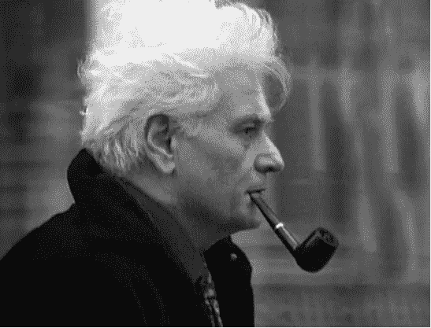
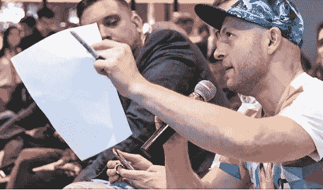
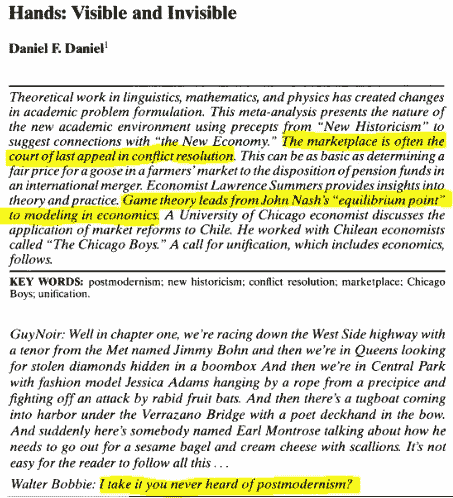

# 当德罗斯遇见德里达时

> 原文：<https://medium.com/coinmonks/when-derose-met-derrida-3b4b79bfa7ae?source=collection_archive---------6----------------------->

> “我们醒来发现所有的旧神都死了”

这篇文章是关于[后现代主义](https://en.wikipedia.org/wiki/Postmodernism)及其与比特币的关系，灵感来自于[最近的一篇博客](/@rextar4444/an-open-letter-to-derose-d3d9a4a03193)，报道了[克里斯·德罗斯](https://www.chrisderose.com/)和[比特币核心](https://bitcoin.org/en/bitcoin-core/)(比特币发展的监管者——或看门人)之间的交流。

事件的概要是，克里斯向比特币核心提出了一个没有内容的提议，原因无非是凸显了一个理应去中心化的治理结构中存在的隐藏层级的矛盾。

我被迫做了一个翻译，因为它让我想起了大约 20 年前在一家二手书店闲逛时第一次遇到的东西:*后现代主义*和一个相关的思想流派， [*解构主义*](https://en.wikipedia.org/wiki/Deconstruction) 。

# 德里达

Jacques Derrida

[雅克·德里达](https://en.wikipedia.org/wiki/Jacques_Derrida)介绍了*解构*的大部分思想，这是[符号学](https://en.wikipedia.org/wiki/Semiotics)(或符号过程)的一种形式。

众所周知，他的作品很难理解，但可以根据克里斯最近与 Core 的插曲进行翻译。

值得注意的是(下面与克里斯的播客有关)，德里达最著名的话是“没有断章取义”( *il n'y a pas de hors-texte)* ，【德里达】直接受到尼采的影响，并在*中指出，在现代历史的末期；现代思想家懂得太多，不会被理性的幻觉所欺骗。*

**解构*表明没有语言可以让一个“特权概念”构建一个准确的世界观——而在这样一个世界观(或 *idea-logo* )存在的地方，它可以被解构。*

*这就是为什么德里达经常断言西方哲学允许“逻各斯中心主义”不加批判地为支配其语言和意识概念的模型创造隐喻深度。*

# *德罗斯*

**

*DeRose*

*比特币核心向我们展示了这种性质的一些东西，克里斯熟练地提出了这一点。*

*这就是 F·斯科特·菲茨杰拉德在《醒来发现所有旧神都死了》中提到的东西:金钱正在被重构(或解构)——旧的对金钱的态度很难放弃。*

*然而，德罗斯所做的——这也是我发现克里斯和德里达之间的衔接之处——是为了表明比特币正在重构我们对金钱的看法；比特币核心延续了旧的方式——我们可以在这里找到德里达的见解，以进一步阐明德罗斯的诡计。*

# *起源*

> *德里达问了这样一个问题:结构一定不能有一个起源，而起源的起点，一定不能是*已经*结构化了，才能成为某物的起源*？……与此同时，为了有运动或潜力，起源不能是某种纯粹的统一或简单，而必须是已经被阐明的——复杂的——以便从中可以出现一个“历时的”过程。”[维基百科](https://en.wikipedia.org/wiki/Jacques_Derrida)**

*在下面链接的播客中(大约 2.50 分钟)，克里斯提出了比特币的“无原罪概念”。*

*嘉宾[皮埃尔·罗查德](https://twitter.com/pierre_rochard?lang=en)——他与比特币核心站在一起——持相反的观点:比特币诞生于一个完全中央化的状态[和罪恶]，并且自那以后一直在为此忏悔。*

# *看不见的手*

*我之前曾推测比特币的发明者中本聪可能受到了现代法国哲学的影响，或者至少，他的作品与后现代主义的驱动者是平行的。*

*为了寻找证据，我找到了这本出版物《手:可见和不可见》。这篇文章可以免费全文阅读(需要付费订阅)，但头版给人一种很好的感觉:*

**

*Postmodernism in economics*

*这篇论文讨论了后现代思维和解构如何影响了所有学科，但具体展示了[在《经济学的本质》中]博弈论如何重新定位亚当·斯密的[看不见的手](https://en.wikipedia.org/wiki/Invisible_hand)。在最后一段，它说*“在市场的形成过程中，冲突的解决是从忘记时间开始的”*。*

# *比特币核心及其历时性*

*在上面的播客中，在回答克里斯关于比特币可能是什么的问题时——是否可以理解为我们的父辈和他们的父辈可能已经理解了其他技术——皮埃尔(c . 27 分钟)回答说，单词不能从一个上下文转移到另一个上下文……Linux 是比特币的不同上下文。*

*我认为克里斯一直在寻找的答案是，比特币关乎*信任*(在所有形式和所有层面上)。因此，我们可以开始将比特币视为所有知识形式的整合——而不仅仅是货币或经济。*

*我相信 Core 已经被比特币是什么或者*可能是*的这种叙述和构建的观点所包裹，他们并没有真正理解它的起源——德里达应该会看到这一点。*

*不存在断章取义。*