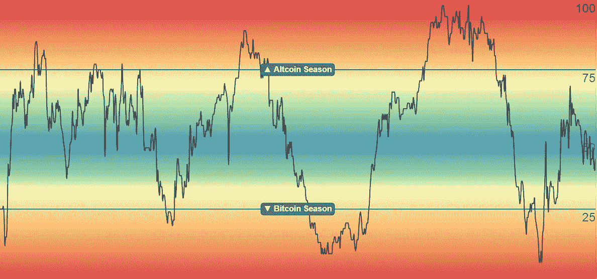

# 什么时候期待替代硬币的增长？

> 原文：<https://medium.com/coinmonks/when-to-expect-growth-in-altcoins-11c332187bfd?source=collection_archive---------9----------------------->

## 随着比特币的历史新高，一些替代硬币的价格上涨。在这种情况下，代币会继续上涨。

Image Credit: [BlockchainCenter.net](https://www.blockchaincenter.net/altcoin-season-index/)

在 BTC 达到 67K 美元以上的新 ATH 后，一些替代硬币大幅上涨。比如 ETH 的价格有史以来第一次超过 4.37K 美元。在过去的几年里，它增长了 11%