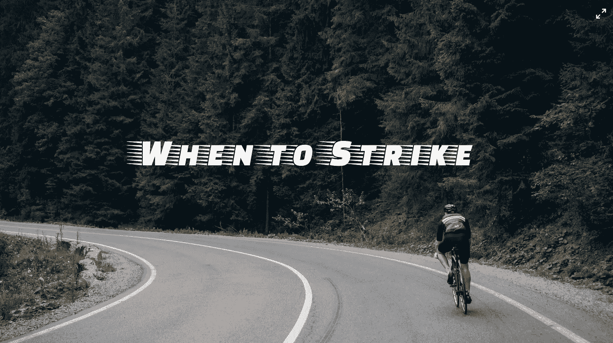
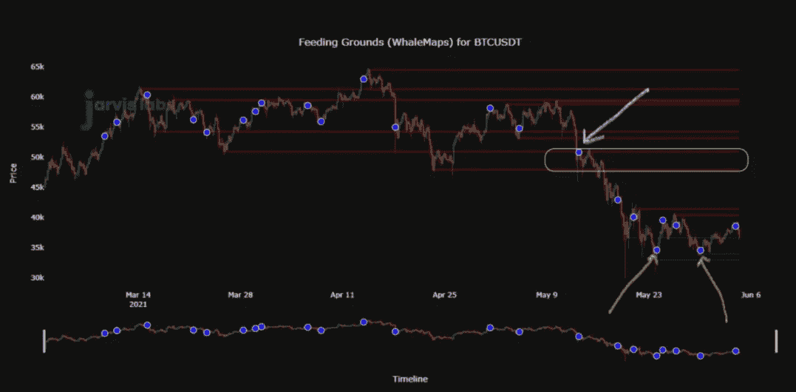
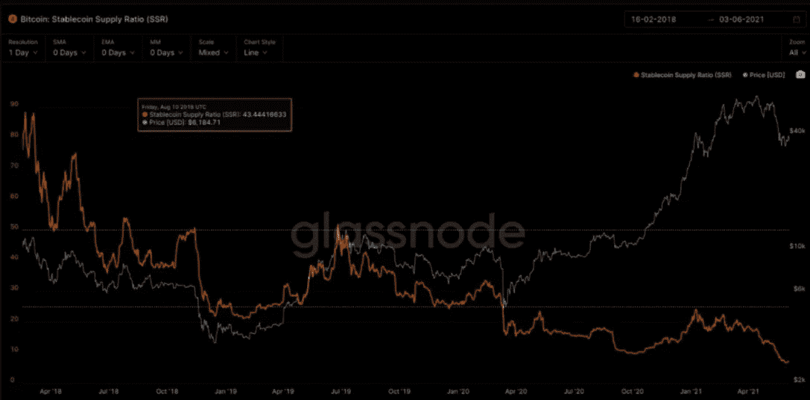
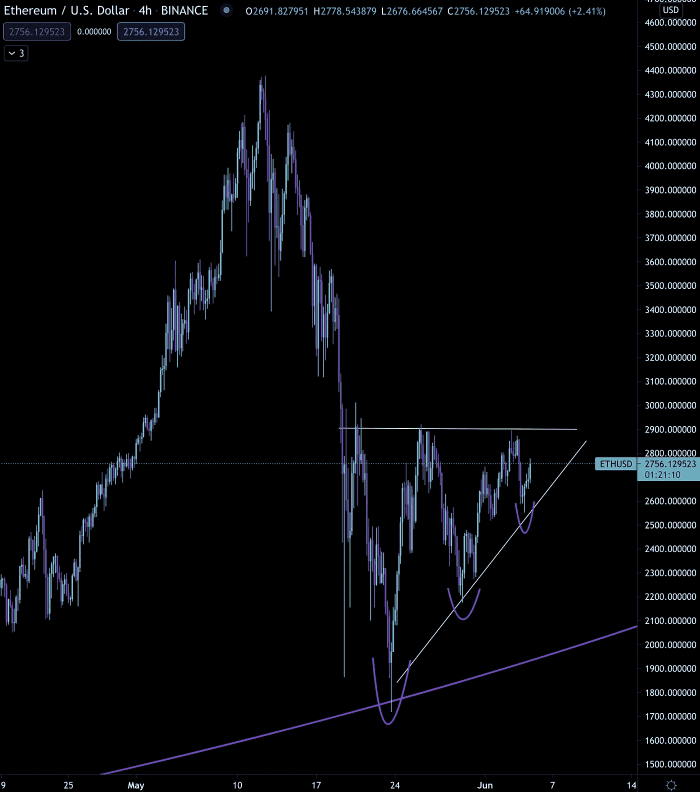

# 何时出击

> 原文：<https://medium.com/coinmonks/when-to-strike-771b440e884d?source=collection_archive---------5----------------------->

这两个大人物正在决斗。

今天的比赛是攀登阿尔卑斯山 2800 米高的山峰的一系列艰苦的比赛。

没有心脏衰弱的人。三周比赛的领导者认为今天是生存的阶段。

全力以赴意味着竭尽全力。让接下来的一周像骑自行车炼狱一样，你强迫铅球腿活塞通过一周的日常 160 公里骑行。

但是这两个人在这里。沿着山坡向上移动。

获胜者将为自己赢得名声，并被加冕为山中之王。

这使得每一次扮鬼脸都是值得的。

当他们逼近纵横交错的柏油马路时，你知道他们的坦克是空的。

如果说有什么不同的话，那就是最终的结果是谁能越过他们碳纤维精密工程仪器上的标记，谁就是胜利者。

他们年轻…饥饿…然而，没有经验。

他们显然缺乏智慧。决斗中浪费的精力才导致了接下来发生的事情。

一名 34 岁的资深赛车手冲到了年轻的纯种马的外侧…

当他站在两人旁边时，他站在自行车上，猛踩脚踏板。他在加油的选手前面加速…当他瞥向终点线时，他那短粗的脸上闪过一丝微笑，还有 100 米。

耐心和智慧在那天获得了桂冠。

老兵的策略很简单。坐下来，看着急切的赛车手们看不到大局。

当我们看到本周市场的波动时，这是我们可以依靠的一个提示。

多头、空头、看涨期权和看跌期权的买家……这是对价格行为的决斗，让任何不耐烦的交易者筋疲力尽。以及他们的资本。

这就是我们在 5 月 24 日说市场正在进入无人区时所警告的。那是十天前。信不信由你，从那以后我们就没有得到多少确定性。

这也是为什么我们看待市场的很多方式就是那位耐心的自行车手看待比赛的方式。这意味着它更多的是关于跟踪价格和知道要注意什么，以便知道什么时候出手。

现在，我们特别关注两个地区。你可以在下面比特币的链上支持/抵抗喂养场 Whalemaps 图表中看到它们。

白色区域接近 50k 美元，我们在两周前的抛售中看到了一些大规模的抛售。

在绿箭区，我们见证了大量的购买，但是没有之前卖的多。这个区域接近 35k 美元。

这意味着，如果我们继续横向跟踪，另一个 35000 美元的扫描是可能的。这是因为，如果我们重新进入 50，000 美元以上的区间，你所期待的活动还没有发生。

我们所指的活动实际上是围绕鲸鱼和一些市场动态展开的。

就市场走势而言，我们的 onchain 信号已经几天没有显示任何看涨或看跌的警报了。完全沉默。

总的来说，BTC 的流入和流出也是无声的。这告诉我们，没有主要的参与者想要决定方向或产生动力。又一个迹象表明，市场推动者正在耐心地观望，等待出击。

就市场动态而言…

流入交易所的美元流动性正在枯竭。与 600 亿英镑的系绳市场相比，交易所中可用的系绳不到 20 亿英镑，这有点令人担忧。

事实上，我们甚至看到在链交换后的几天内，Tether 烧掉了大约 20 亿美元。这凸显了市场需求的不足。这是我们六个月来第一次看到这种情况。这显然不是一个乐观的迹象。

它可能会与你过去几天在网上读到的内容相抵触…

一个例子是暗示稳定的股票看涨的指标。如果你读到有人吹捧一种叫做稳定硬币供应比率(SSR)的指标，他们就会成为近期偏差的受害者。

让我解释一下…

稳定硬币供应比率(SSR)是比特币供应量与稳定硬币供应量之间的比率。

当 SSR 较低时，当前稳定的货币供应有更多的“购买力”来购买 BTC。

这是它现在的样子…

这里的主要问题是在 2017 年和 2018 年上半年，BTC、ETH 和 LTC 之外的任何硬币都被认为是一件大事。

这意味着 stablecoins 在 2018 年下半年之前并不活跃。

但从那以后，稳定硬币配对在 crypto 中几乎无处不在。这是稳定的股市市值上涨如此之多的部分原因。

但这不是唯一的因素。

DeFi 在 2020 年中期的繁荣以及对稳定债券收益率的渴望变得越来越受欢迎。这创造了对这些硬币更大的需求。

一旦你考虑到这两个细微差别，这个比率就没有任何信号作用了。

但是继续谈论市场动态…并从我的演讲台上走下来…

隐含波动率(IV)仍在下降。高波动性时期之后总是低波动性时期，而低波动性时期之后是高波动性时期。我们目前正在从高到低过渡，这将需要更长的时间来下降(我承认，它的下降速度比我历史上看到的更快)。

那么这一切意味着什么呢？

好吧，当缺乏动力和缺乏市场推动者的时候，交易的一方超过另一方，我们就没有人的土地了。

对我们来说，缺乏清晰度意味着任何 35000 美元范围的扫描都需要保持。如果不行，我们就走低点。

我知道，我知道，你可能在对自己说，真的吗？如果什么东西撑不住，它就会掉下来？

但我在这里要说的是，价格区域是沙子上的线，类似于最后一道防线。

另一方面，如果我们突破了当前的上涨区间，就需要随之而来的连锁反应。否则，我们将得到比特币接近 50k 美元价格区间的拒绝。

后一种情况似乎是市场目前最感兴趣的。事实上，这在下面的 ETH 图表中看得最清楚。这是一个干净的系列更高的低点对接 2900-3000 美元的阻力。

这是目前在许多替代硬币中看到的模式。对于更高的价格来说，这是一个有希望的模式。

我们很可能得到它。如果我们这样做，我们再次希望看到链上流动如何对更接近更高的先前范围作出反应。否则这种突破将缺乏力量。

对于比特币来说，2900 美元至 3000 美元的比较价格是之前在 50000 美元附近看到的喂食点图表中的白色方框。

50k 美元和 35k 美元区域是我们正在关注的两个区域，以确定是否是时候出击了。在那之前，我们将耐心地进行任何有规模的行动。

与此同时，我希望这里能有所突破。也许这足以吸引一些市场参与者回到游戏中来。

因为老实说，社交媒体上的活动，我们的聊天室，用户问题，以及围绕 crypto 的其他一切都突然停止了。

价格往往会改变这种情况。

所以，享受周末，保持像盐和胡椒胡子骑手散发的耐心，让我们期待未来几天的一些牛市。

直到下一次…

你的脉搏在加密，

本·莉莉

> 加入 [Coinmonks Telegram group](https://t.me/joinchat/Trz8jaxd6xEsBI4p) 并了解加密交易和投资

## 另外，阅读

*   [什么是保证金交易](https://blog.coincodecap.com/margin-trading) | [美元成本平均法](https://blog.coincodecap.com/dca)
*   [3 商业评论](/coinmonks/3commas-review-an-excellent-crypto-trading-bot-2020-1313a58bec92) | [Pionex 评论](/coinmonks/pionex-review-exchange-with-crypto-trading-bot-1e459d0191ea) | [Coinrule 评论](/coinmonks/coinrule-review-2021-a-beginner-friendly-crypto-trading-bot-daf0504848ba)
*   [莱杰 vs n rave](/coinmonks/ledger-vs-ngrave-zero-7e40f0c1d694)|[莱杰 nano s vs x](/coinmonks/ledger-nano-s-vs-x-battery-hardware-price-storage-59a6663fe3b0) | [币安评论](/coinmonks/binance-review-ee10d3bf3b6e)